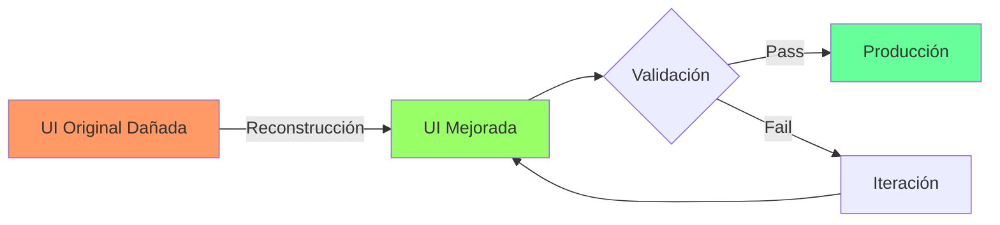

# 🚀 VThink UI - Mejoras Implementadas y Roadmap General

## 📅 Fecha: 2025-08-03
## 🎯 Estado: Reconstrucción con Mejoras Significativas
## 🏆 Meta: Superar la Implementación Original

---

## 🌟 MEJORAS IMPLEMENTADAS (Más Allá del Original)

### 1. **Sidebar Mejorado** ✨
**Original shadcnuikit.com:**
- Sidebar básico con colapso simple
- Sin feedback visual en el botón
- Submenús ocultos completamente en modo colapsado

**Nuestra Versión Mejorada:**
- ✅ **Botón con rotación animada** - Feedback visual claro (180° rotation)
- ✅ **Submenús accesibles en modo colapsado** - Click expande inline con solo iconos
- ✅ **Tooltips inteligentes** - Aparecen solo cuando están colapsados
- ✅ **Ancho optimizado** - 4rem en lugar de 3rem para mejor visibilidad de carets
- ✅ **Mobile-first** - Click en lugar de hover para mejor UX móvil
- ✅ **Ancho fijo consistente** - No cambia al expandir submenús

### 2. **Sistema de Importaciones Corregido** 🔧
- ✅ **Path aliases consistentes** - Todo usa `@/shared/components/`
- ✅ **Bundui Premium desacoplado** - Componentes reimplementados, no copiados
- ✅ **Estructura modular clara** - Separación entre UI base y layouts

### 3. **Header Responsivo Mejorado** 📱
- ✅ **Sincronización perfecta** con estado del sidebar
- ✅ **Transiciones suaves** al cambiar entre estados
- ✅ **Adaptación móvil inteligente** - Layout diferente para mobile/tablet

### 4. **Theme System Mejorado** 🎨
- ✅ **HSL enforced** - No más problemas con OKLCH
- ✅ **Variables CSS consistentes** - `hsl(var(--variable))` pattern
- ✅ **Compatibilidad shadcn/ui garantizada** - Future-proof

---

## 📋 PENDIENTES GENERALES DEL SISTEMA UI

### 1. **Completar Reconstrucción de Dashboards** 🔴
```markdown
Estado Actual:
- ✅ AI Chat - Completado con mejoras
- 🚧 E-commerce Dashboard - Por reconstruir
- 🚧 CRM Dashboard - Por reconstruir
- 🚧 Finance Dashboard - Por reconstruir
- 🚧 Crypto Dashboard - Por reconstruir
- 🚧 Website Analytics - Por reconstruir
- 🚧 Project Management - Por reconstruir
- 🚧 Sales Dashboard - Por reconstruir
- 🚧 File Manager - Por reconstruir
- 🚧 Calendar - Por reconstruir
- 🚧 Kanban - Por reconstruir
- 🚧 Mail - Por reconstruir
- 🚧 Notes - Por reconstruir
- 🚧 Tasks - Por reconstruir
- 🚧 POS System - Por reconstruir
```

### 2. **Sistema de Componentes Compartidos** 🟡
```typescript
// TODO: Crear catálogo centralizado
src/shared/components/
├── ui/                    # Componentes base (shadcn/ui compatible)
├── layouts/               # Layouts reutilizables
├── charts/                # Componentes de gráficos
├── tables/                # Tablas y grids avanzados
├── forms/                 # Formularios y validaciones
└── patterns/              # Patrones de UI recurrentes
```

### 3. **Sistema de Documentación Viva** 🟡
- [ ] Storybook para componentes compartidos
- [ ] Documentación automática desde comentarios TSDoc
- [ ] Guías de uso para cada patrón
- [ ] Ejemplos interactivos

### 4. **Testing Visual Automatizado** 🟢
```javascript
// TODO: Implementar con Playwright
- [ ] Screenshots de referencia para cada dashboard
- [ ] Tests de regresión visual
- [ ] Tests de responsividad
- [ ] Tests de accesibilidad (a11y)
```

### 5. **Performance Optimization** 🟢
- [ ] Code splitting por dashboard
- [ ] Lazy loading de componentes pesados
- [ ] Optimización de bundle size
- [ ] Métricas de Core Web Vitals

### 6. **Accesibilidad (a11y)** 🟡
- [ ] Navegación completa por teclado
- [ ] Screen reader support mejorado
- [ ] Contraste WCAG AAA
- [ ] Focus indicators claros
- [ ] Skip links

### 7. **Internacionalización (i18n)** 🟢
- [ ] Sistema de traducciones
- [ ] Soporte RTL
- [ ] Formatos de fecha/moneda localizados
- [ ] Pluralización correcta

---

## 🏗️ ARQUITECTURA DE COMPONENTES MEJORADA

### Principios de Diseño
1. **Composability First** - Componentes pequeños y combinables
2. **Accessibility by Default** - a11y no es opcional
3. **Performance Conscious** - Medir antes de optimizar
4. **Developer Experience** - APIs claras y predecibles

### Estructura Propuesta
```typescript
// Componente Base (ejemplo)
interface ComponentProps {
  // Props explícitas y tipadas
  variant?: 'default' | 'primary' | 'secondary'
  size?: 'sm' | 'md' | 'lg'
  // Extensibilidad
  className?: string
  children?: React.ReactNode
  // a11y
  'aria-label'?: string
}

// Composición sobre herencia
<Card>
  <CardHeader>
    <CardTitle />
    <CardDescription />
  </CardHeader>
  <CardContent />
  <CardFooter />
</Card>
```

---

## 📊 MÉTRICAS DE CALIDAD UI

### Objetivos a Cumplir
- **Performance Score:** > 90/100 (Lighthouse)
- **Accessibility Score:** > 95/100
- **Best Practices:** 100/100
- **SEO:** > 90/100
- **Bundle Size:** < 200KB initial load

### Herramientas de Validación
```bash
# Scripts a implementar
npm run audit:performance      # Lighthouse CI
npm run audit:accessibility    # axe-core
npm run audit:bundle-size      # webpack-bundle-analyzer
npm run audit:typescript       # strict mode gradual
npm run audit:security         # npm audit + custom checks
```

---

## 🎯 ROADMAP DE IMPLEMENTACIÓN

### Fase 1: Reconstrucción (Actual) 🔄
1. ✅ AI Chat Dashboard
2. 🚧 Dashboards principales (en progreso)
3. 🚧 Componentes compartidos base

### Fase 2: Mejoras y Optimización 📈
1. Sistema de testing visual
2. Documentación interactiva
3. Performance optimization
4. Accesibilidad completa

### Fase 3: Features Avanzados 🚀
1. Tema dark mode perfeccionado
2. Animaciones y micro-interacciones
3. PWA capabilities
4. Offline support

### Fase 4: Scale & Polish ✨
1. Design system completo
2. Component marketplace interno
3. Automated visual regression
4. Multi-idioma completo

---

## 📝 LECCIONES APRENDIDAS

### ✅ Lo Que Funciona
1. **Separación clara** entre lógica y presentación
2. **Path aliases** desde el inicio
3. **Mobile-first** approach
4. **Composición** sobre configuración
5. **TypeScript** even without strict mode

### ❌ Lo Que Evitar
1. **No copiar código externo** directamente
2. **No usar OKLCH** - solo HSL
3. **No ignorar a11y** desde el inicio
4. **No optimizar prematuramente**
5. **No olvidar documentar decisiones**

---

## 🔗 REFERENCIAS TÉCNICAS

### Documentación Interna
- [CLAUDE.md](CLAUDE.md) - Guía principal
- [UI_COMPLIANCE_CHECKLIST.md](UI_COMPLIANCE_CHECKLIST.md)
- [BUNDUI_DECOUPLING_GUIDE.md](docs/development/BUNDUI_DECOUPLING_GUIDE.md)
- [COMPONENT_EVALUATION_GUIDELINES.md](docs/development/COMPONENT_EVALUATION_GUIDELINES.md)

### Inspiración y Referencias
- [shadcn/ui](https://ui.shadcn.com) - Component patterns
- [Radix UI](https://radix-ui.com) - Accessibility patterns
- [Tailwind UI](https://tailwindui.com) - Design patterns
- [Vercel Design](https://vercel.com/design) - Modern UI/UX

---

## 🚦 ESTADO ACTUAL DEL PROYECTO



---

## ⚡ QUICK WINS PENDIENTES

1. **Crear template base** para nuevos dashboards
2. **Script generador** de componentes
3. **Snippets VSCode** para patrones comunes
4. **Pre-commit hooks** para validación
5. **GitHub Actions** para visual regression

---

## 💡 INNOVACIONES PROPUESTAS

1. **AI-Assisted Development**
   - Generación automática de componentes desde specs
   - Sugerencias de mejoras de accesibilidad
   - Optimización automática de performance

2. **Smart Theming**
   - Temas que se adaptan al contenido
   - Personalización por usuario sin código
   - Export/import de temas

3. **Component Analytics**
   - Tracking de uso de componentes
   - Identificación de patrones comunes
   - Sugerencias de refactoring

---

**Última actualización:** 2025-08-03
**Próxima revisión:** Semanal durante fase de reconstrucción

---

> "No estamos solo arreglando lo que se rompió, estamos construyendo algo mejor" - VThink Team 🚀