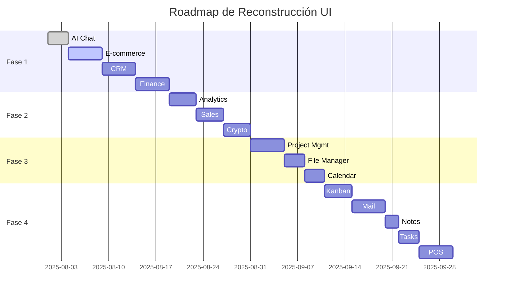

# 📊 UI Reconstruction Progress Tracker

## 🗓️ Última Actualización: 2025-08-03
## 🎯 Objetivo: Reconstruir y Mejorar TODOS los Dashboards

---

## 📈 PROGRESO GENERAL: 7% (1/15 Dashboards)

### 🟢 COMPLETADOS (1)
| Dashboard | Estado | Mejoras | Fecha | Notas |
|-----------|--------|---------|-------|-------|
| AI Chat | ✅ 100% | • Sidebar mejorado<br>• Tooltips en submenús<br>• Mobile-first approach<br>• Animaciones suaves | 2025-08-03 | Layout genérico implementado |

### 🟡 EN PROGRESO (0)
| Dashboard | Estado | Tareas Pendientes | Asignado |
|-----------|--------|-------------------|----------|
| - | - | - | - |

### 🔴 PENDIENTES (14)
| Dashboard | Prioridad | Complejidad | Dependencias |
|-----------|-----------|-------------|--------------|
| E-commerce Dashboard | Alta | Media | Charts, Tables |
| CRM Dashboard | Alta | Alta | Charts, Forms, Tables |
| Finance Dashboard | Alta | Alta | Advanced Charts |
| Website Analytics | Media | Media | Charts, Maps |
| Sales Dashboard | Media | Media | Charts, KPIs |
| Crypto Dashboard | Media | Alta | Real-time data |
| Project Management | Media | Alta | Kanban, Calendar |
| File Manager | Baja | Media | Tree view, Upload |
| Calendar | Baja | Media | Date system |
| Kanban | Baja | Alta | Drag & Drop |
| Mail | Baja | Alta | Editor, Threading |
| Notes | Baja | Baja | Editor |
| Tasks | Baja | Media | Lists, Filters |
| POS System | Baja | Alta | Complex UI |

---

## 🛠️ COMPONENTES COMPARTIDOS STATUS

### ✅ Listos para Usar
- [x] Sidebar con colapso mejorado
- [x] Header responsivo
- [x] Theme customizer
- [x] Tooltips system
- [x] Button variants
- [x] Card components
- [x] Dropdown menus

### 🚧 En Desarrollo
- [ ] Chart components (Recharts wrapper)
- [ ] Table with sorting/filtering
- [ ] Form components suite
- [ ] Date picker mejorado
- [ ] File upload component

### 📋 Planificados
- [ ] Dashboard widgets
- [ ] KPI cards
- [ ] Timeline component
- [ ] Activity feed
- [ ] Notification system
- [ ] Search with filters
- [ ] Data export tools

---

## 🎨 PATRONES DE DISEÑO ESTABLECIDOS

### 1. **Layout Pattern**
```typescript
<BunduiCompleteLayout>
  <div className="space-y-6 p-6 md:p-8">
    <DashboardHeader />
    <DashboardContent />
  </div>
</BunduiCompleteLayout>
```

### 2. **Color System**
```css
/* Siempre HSL, nunca OKLCH */
--chart-1: 12 76% 61%;
--chart-2: 173 58% 39%;
--primary: 222.2 47.4% 11.2%;
```

### 3. **Responsive Breakpoints**
```css
/* Mobile First */
sm: 640px
md: 768px  /* Tablet */
lg: 1024px /* Desktop */
xl: 1280px /* Wide */
```

### 4. **Spacing System**
```css
/* Consistente en todo el UI */
p-4 /* mobile */
p-6 md:p-8 /* desktop */
space-y-4 /* vertical rhythm */
gap-4 /* grid gaps */
```

---

## 📋 CHECKLIST POR DASHBOARD

### Para cada Dashboard implementar:
- [ ] Layout responsivo con `BunduiCompleteLayout`
- [ ] Header con título y acciones
- [ ] Filtros y controles
- [ ] Contenido principal (charts, tables, etc)
- [ ] Loading states
- [ ] Empty states
- [ ] Error boundaries
- [ ] Mobile optimization
- [ ] Dark mode support
- [ ] Accesibilidad básica
- [ ] Exportación de datos
- [ ] Real-time updates (donde aplique)

---

## 🐛 BUGS CONOCIDOS

| Bug | Severidad | Dashboard | Estado |
|-----|-----------|-----------|--------|
| - | - | - | Sin bugs reportados |

---

## 💡 MEJORAS PROPUESTAS POR LA COMUNIDAD

1. **Modo Zen** - Ocultar todo excepto contenido principal
2. **Shortcuts de teclado** - Navegación rápida
3. **Temas custom** - Crear y compartir temas
4. **Dashboard builder** - Drag & drop widgets
5. **Export to PDF** - Reportes profesionales

---

## 📅 TIMELINE ESTIMADO



---

## 🏆 CRITERIOS DE ÉXITO

Para considerar un dashboard COMPLETO:
1. ✅ Funciona en mobile/tablet/desktop
2. ✅ Sidebar y navegación operativos
3. ✅ Theme switching funcional
4. ✅ Sin errores en consola
5. ✅ Performance score > 80
6. ✅ Documentado en código
7. ✅ Usa componentes compartidos
8. ✅ Sigue patrones establecidos

---

**Actualizar este documento después de cada dashboard completado**