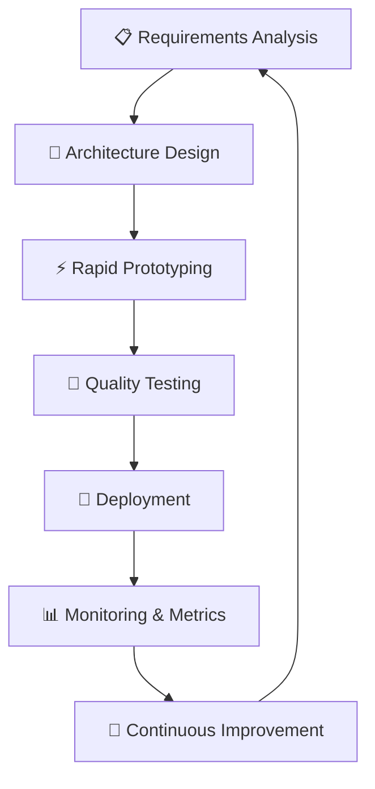

# 🎯 VibeThink Orchestrator vs VThink 1.0 - Diferencias Fundamentales

## 📋 **RESUMEN EJECUTIVO**

Es crucial entender la diferencia entre:
1. **🏢 VibeThink Orchestrator** - El SaaS Platform (producto comercial)
2. **📚 VThink 1.0** - La Metodología (framework de desarrollo)

---

## 🏢 **VIBETHINK ORCHESTRATOR (EL SAAS)**

### **¿Qué es?**
Una **plataforma SaaS multi-tenant** para orquestación de agentes IA con arquitectura empresarial.

### **Características del SaaS:**
- ✅ **Multi-tenancy**: Cada empresa tiene datos aislados (`company_id`)
- ✅ **Roles jerárquicos**: EMPLOYEE → MANAGER → ADMIN → OWNER → SUPER_ADMIN
- ✅ **Suscripciones**: Planes Free, Pro, Enterprise con límites diferenciados
- ✅ **APIs REST**: Endpoints para integración con sistemas externos
- ✅ **Security**: RLS policies, JWT authentication, datos encriptados
- ✅ **Escalabilidad**: Arquitectura cloud-native en Supabase
- ✅ **Monitoreo**: Analytics, métricas de uso, performance tracking

### **Stack Tecnológico del SaaS:**
```typescript
// Frontend SaaS
React + TypeScript + Tailwind CSS + Vite

// Backend SaaS  
Supabase (PostgreSQL + Auth + Storage + Edge Functions)

// Estado y UI
React Query + Zustand + Bundui Premium Components

// Integraciones SaaS
OpenAI API + Firecrawl + Knotie AI + PostHog + Mixpanel
```

### **Modelo de Negocio SaaS:**
- **💰 Suscripciones**: $9/mes Basic, $29/mes Pro, $99/mes Enterprise
- **👥 Por usuario**: Pricing escalable por seats
- **🚀 Freemium**: Plan gratuito con limitaciones
- **🎯 B2B Focus**: Dirigido a empresas que necesitan IA

---

## 📚 **VTHINK 1.0 (LA METODOLOGÍA)**

### **¿Qué es?**
Un **framework sistemático** para desarrollar software con estándares de calidad CMMI-ML3.

### **Pilares de la Metodología:**
- ✅ **CMMI-ML3 Compliance**: Nivel 3 de madurez en desarrollo
- ✅ **Quality Gates**: Revisiones obligatorias en cada etapa
- ✅ **Systematic Approach**: Procesos documentados y repetibles
- ✅ **Risk Management**: Identificación y mitigación proactiva
- ✅ **Continuous Improvement**: Métricas y optimización constante
- ✅ **Documentation**: Trazabilidad completa del desarrollo

### **Procesos de la Metodología:**


### **Estándares VThink 1.0:**
- **🎯 Task Management**: Niveles 1-5 de complejidad
- **🔒 Security Review**: Obligatorio para todas las features
- **🧪 Testing Coverage**: >90% para paths críticos
- **📖 Documentation**: 100% de compliance
- **♿ Accessibility**: WCAG 2.1 AA compliance
- **⚡ Performance**: <2s load time para features principales

---

## 🔄 **INTERACCIÓN ENTRE AMBAS DIMENSIONES**

### **Cómo se Complementan:**

**1. El SaaS IMPLEMENTA la Metodología:**
```typescript
// El SaaS sigue los estándares VThink 1.0
const feature = {
  level: 4, // Complejidad definida por metodología
  securityReview: true, // Obligatorio por metodología
  testingCoverage: 95, // Estándar metodológico
  documentation: 'complete', // Requirement metodológico
  vtkCompliance: true // Sello de la metodología
};
```

**2. La Metodología VALIDA el SaaS:**
```typescript
// Validaciones metodológicas en el SaaS
const qualityGate = {
  codeReview: 'passed',
  securityScan: 'clean',
  performanceTest: 'passed',
  accessibilityAudit: 'compliant',
  documentationReview: 'complete'
};
```

**3. El SaaS GENERA evidencia para la Metodología:**
```typescript
// Métricas que alimentan la metodología
const evidenceMetrics = {
  bugDensity: 0.02, // Bugs per KLOC
  timeToMarket: '2 weeks', // Sprint velocity
  customerSatisfaction: 4.8, // Rating /5
  systemAvailability: 99.9, // Uptime %
  securityIncidents: 0 // Security breaches
};
```

---

## 🎯 **DIFERENCIAS CLAVE**

| Aspecto | SaaS Platform | Metodología |
|---------|---------------|-------------|
| **Propósito** | Producto comercial | Framework de desarrollo |
| **Audiencia** | Clientes empresas | Equipos de desarrollo |
| **Monetización** | Suscripciones mensuales | Licenciamiento de proceso |
| **Evolución** | Features y mejoras | Refinamiento de procesos |
| **Métricas** | ARR, Churn, Usage | Quality, Velocity, Satisfaction |
| **Ciclo de vida** | Product roadmap | Process maturity |

---

## 🚀 **CASOS DE USO DIFERENCIADOS**

### **Para el SaaS:**
- ✅ Empresa necesita orquestar agentes IA
- ✅ Busca solución multi-tenant escalable  
- ✅ Requiere integración con APIs existentes
- ✅ Necesita dashboards y analytics

### **Para la Metodología:**
- ✅ Equipo quiere adoptar CMMI-ML3
- ✅ Busca framework sistemático de desarrollo
- ✅ Necesita procesos documentados y repetibles
- ✅ Quiere mejorar quality y time-to-market

---

## 💡 **EJEMPLO PRÁCTICO**

### **Escenario: Nueva Feature - "AI Chat Assistant"**

**🏢 Perspectiva SaaS:**
```typescript
const aiChatFeature = {
  // Características del SaaS
  multiTenant: true, // Cada empresa ve solo sus chats
  roleBased: true, // Permisos por rol de usuario  
  scalable: true, // Soporta miles de usuarios concurrentes
  monetizable: true, // Feature premium para plan Pro+
  integrable: true, // API para integrar con otras apps
  analytics: true // Tracking de uso y métricas
};
```

**📚 Perspectiva Metodología:**
```typescript
const aiChatDevelopment = {
  // Proceso metodológico
  level: 4, // Complejidad alta (IA + tiempo real)
  phases: [
    'requirements_analysis', // Qué necesita el usuario
    'architecture_design', // Cómo escalará y se integrará  
    'security_review', // Validación de vulnerabilidades
    'rapid_prototype', // MVP funcional en 1 semana
    'quality_testing', // Testing automatizado + manual
    'documentation', // Docs técnicas y de usuario
    'deployment', // Release controlado
    'monitoring' // Métricas post-release
  ],
  compliance: 'CMMI-ML3', // Estándar de calidad
  evidence: 'documented' // Trazabilidad completa
};
```

---

## 🎯 **CONCLUSIÓN**

**VThink 1.0 es AMBAS cosas simultáneamente:**

- **🏢 Como SaaS**: Un producto que los clientes usan y por el que pagan
- **📚 Como Metodología**: El framework con el que desarrollamos ese SaaS

**La magia está en la retroalimentación:** El SaaS es la **prueba viviente** de que la metodología funciona, y la metodología asegura que el SaaS mantenga **calidad enterprise** a medida que escala.

**Para el cliente final:** Solo ve el SaaS
**Para el equipo de desarrollo:** Usa la metodología para construir el SaaS
**Para el mercado:** VThink 1.0 se posiciona como ambos: producto Y proceso

Esta dualidad es lo que diferencia a VThink 1.0 de otros productos: **no solo vendemos software, vendemos una forma superior de hacer software**. 