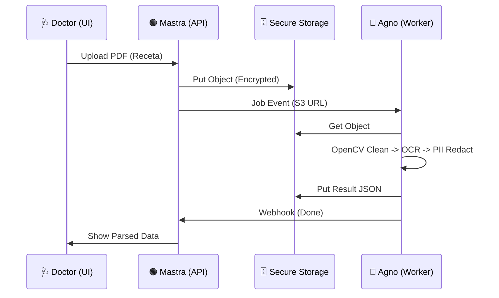

# 🏥 Estrategia Híbrida: Medical OCR (FIT-DOCUMENT-INTELLIGENCE)

> **Referencia:** `FIT-DOCUMENT-INTELLIGENCE-001`
> **Arquitectura:** [ADR-005 Hybrid Polyglot](../governance/ADR-005-HYBRID-POLYGLOT-ARCHITECTURE.md)

---

## 1. El Desafío Médico
El OCR médico no es solo "leer texto". Requiere:
1.  **Privacidad (HIPAA/GDPR):** Los datos no pueden volar a cualquier lado.
2.  **Caligrafía Caótica:** Recetas escritas a mano.
3.  **Sanitización (PII):** Detectar y borrar nombres de pacientes antes de guardar.
4.  **Formatos Pesados:** PDFs de 50 páginas, radiografías (DICOM).

## 2. Asignación de Planos (Mastra vs Agno)

Siguiendo el ADR-005, así dividimos el FIT:

### 🟢 Control Plane (Mastra / Node.js)
*   **Ingesta:** Recibe el PDF encriptado (API Gateway).
*   **Auth:** Valida API Keys y Permisos (Identity Context).
*   **Orquestación:**
    1.  Guarda el archivo en S3 (Bucket privado).
    2.  Pone un Job en la cola `ocr-processing-queue`.
    3.  Actualiza el estado a `PROCESSING`.
*   **UI de Revisión:** Muestra el resultado al doctor para validación humana.

### 🔵 Compute Plane (Agno / Python)
*   **Worker:** Escucha la cola `ocr-processing-queue`.
*   **Procesamiento Pesado:**
    1.  **Preprocessing (OpenCV):** Elimina ruido, endereza la imagen (Deskew).
    2.  **OCR (Tesseract/Google Vision):** Extrae texto crudo.
    3.  **PII Reduction (Presidio/Spacy):** **CRÍTICO.** Detecta nombres/teléfonos y los redacta localmente.
    4.  **Structured Extraction (LLM):** Convierte el texto desordenado en JSON (`{ medication: "Ibuprofeno", dosage: "400mg" }`).
*   **Salida:** Sube el JSON limpio a S3 y notifica a Mastra.

---

## 3. ¿Por qué Agno (Python) es indispensable aquí?

Intentar hacer esto en Node.js sería un error por:
1.  **Librerías de Visión:** `OpenCV` y `PyMuPDF` en Python son el estándar de oro. En Node son bindings inestables o lentos.
2.  **PII Detection:** `Microsoft Presidio` (el mejor redactor de privacidad) es nativo de Python.
3.  **LLM Structuring:** Agno tiene mejores herramientas para forzar JSON schemas complejos que las librerías de JS actuales.

---

## 4. Flujo de Datos Seguro

---

## 5. Conclusión
El FIT de "Document Intelligence" se beneficia masivamente de la arquitectura híbrida.
*   Logras **Velocidad de UI** (Mastra).
*   Logras **Potencia de Procesamiento** (Agno).
*   Mantienes **Compliance** procesando datos sensibles en un entorno Python controlado y aislado.

---
**Estado:** Estrategia Alineada con Canon.
