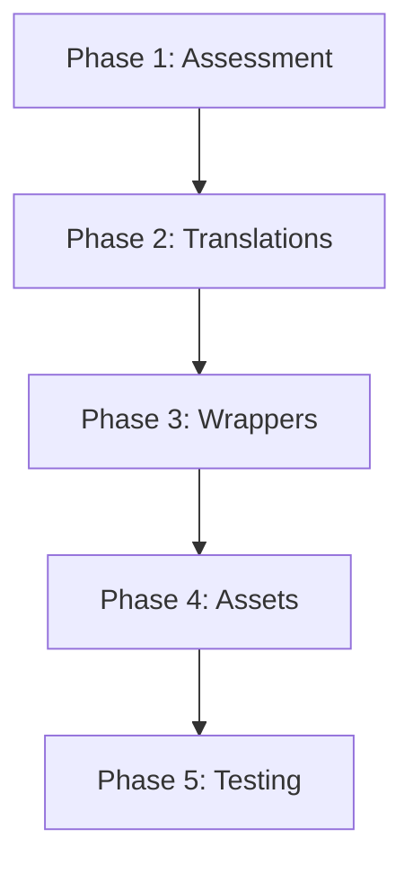

# 📦 Third-Party Asset Library - Quick Reference

**Full Policy:** `docs/architecture/THIRD_PARTY_ASSET_LIBRARY_POLICY.md`
**Last Updated:** 2025-12-27

---

## 🎯 Philosophy (30-second version)

```
Read-Only Assets → Adapt with i18n → Production
vibethink-asset-library/  →  vibethink-orchestrator-main/
    (NEVER TOUCH)           (MODIFY HERE)
```

**3 Golden Rules:**
1. ❌ NEVER modify `vibethink-asset-library/`
2. ✅ ALWAYS adapt to 9 languages (en, es mandatory)
3. ✅ ALWAYS use centralized assets (`/assets/`)

---

## 📁 Structure

```
C:\IA Marcelo Labs\
├── vibethink-orchestrator-main\  # Production (MODIFY HERE)
│   └── public/assets/              # Centralized assets
├── vibethink-asset-library\       # ALL Third-Party Sources (READ-ONLY)
│   ├── bundui/                   # Bundui repositories
│   │   ├── shadcn-ui-kit-dashboard/
│   │   ├── cosmic-main/
│   │   ├── neofolio-main/
│   │   └── soho-nextjs-main/
│   ├── shadcn-ui/                # Official Shadcn UI
│   │   ├── ui/
│   │   └── apps/v4/
│   ├── xyflow/                   # XYFlow official
│   │   └── xyflow/
│   ├── bundui-premium/           # Extracted Bundui Premium
│   ├── shadcn-ecosystem/        # Shadcn components/blocks/templates
│   ├── xyflow-reference/         # React Flow examples
│   └── [other libraries]/
└── _vibethink-dev-kit\          # Methodology
```

---

## ⚠️ DO vs. DON'T

### ❌ NEVER

```typescript
// ❌ Modify third-party source
vibethink-asset-library/bundui-premium/components/button.tsx

// ❌ Use without i18n
<ThirdPartyButton>Submit</ThirdPartyButton>

// ❌ Duplicate assets
apps/dashboard/public/image.png
bundui-premium/public/image.png

// ❌ Relative paths
src="../assets/image.png"

// ❌ Hardcode text
return <div>Loading...</div>;
```

### ✅ ALWAYS

```typescript
// ✅ Create wrapper in monorepo
apps/dashboard/src/shared/components/button-i18n.tsx

// ✅ Use i18n wrapper
<ButtonI18n labelKey="actions.submit" />

// ✅ Centralized assets
apps/dashboard/public/assets/images/button.png

// ✅ Absolute paths
src="/assets/images/button.png"

// ✅ Use translations
const { t } = useTranslation('common');
return <div>{t('loading')}</div>;
```

---

## 🔄 Adaptation Workflow (5 Steps)



### Phase 1: Assessment
- [ ] Identify hardcoded strings
- [ ] Check locale dependencies
- [ ] Assess RTL compatibility

### Phase 2: Translations
- [ ] Create files for all 9 languages
- [ ] English (en) 100% complete
- [ ] Spanish (es) 100% complete
- [ ] Others: Structure complete

### Phase 3: Wrappers
- [ ] Create i18n wrapper component
- [ ] Document source origin
- [ ] Export from shared components

### Phase 4: Assets
- [ ] Migrate to `/assets/`
- [ ] Use absolute paths
- [ ] Validate no duplicates

### Phase 5: Testing
- [ ] Test all 9 languages
- [ ] Test RTL (Arabic)
- [ ] Validate imports
- [ ] Run all scripts

---

## 🌐 9-Language Compliance

**Order:** `['en', 'es', 'fr', 'pt', 'de', 'it', 'ko', 'ar', 'zh']`

| Language | Status | Fallback |
|----------|--------|----------|
| 🇺🇸 English (en) | ✅ 100% OBLIGATORY | Master |
| 🇪🇸 Español (es) | ✅ 100% OBLIGATORY | - |
| 🇫🇷 Français (fr) | ✅ Structure complete | en |
| 🇵🇹 Português (pt) | ✅ Structure complete | en |
| 🇩🇪 Deutsch (de) | ✅ Structure complete | en |
| 🇮🇹 Italiano (it) | ✅ Structure complete | en |
| 🇰🇷 한국어 (ko) | ✅ Structure complete | en |
| 🇸🇦 العربية (ar) | ✅ Structure complete | en |
| 🇨🇳 中文 (zh) | ✅ Structure complete | en |

---

## 🔧 Essential Scripts

```bash
# Validation (RUN BEFORE COMMIT)
node scripts/validate-9-language-compliance.js --namespace [module-name]
node scripts/validate-concepts-coherence.js
node scripts/validate-assets-duplicates.js

# Migration
node scripts/migrate-assets-to-central.js
node scripts/complete-missing-translations.js

# Comparison
node scripts/compare-bundui-reference-vs-monorepo.js
```

---

## 📋 Pre-Commit Checklist

- [ ] Translation files in all 9 languages
- [ ] English (en) 100% complete
- [ ] Spanish (es) 100% complete
- [ ] No hardcoded text visible
- [ ] Assets in `/assets/` (not duplicated)
- [ ] Absolute paths used
- [ ] SYNC_STATUS.md updated
- [ ] Documentation created
- [ ] All validation scripts pass

---

## 📚 Key Documents

| Document | Purpose |
|----------|---------|
| `THIRD_PARTY_ASSET_LIBRARY_POLICY.md` | Full policy (read this first) |
| `THIRD_PARTY_COMPONENT_ADAPTATION.md` | 5-phase adaptation protocol |
| `ASSETS_REPOSITORY_POLICY.md` | Asset management rules |
| `REFERENCE_RULES.md` | General reference rules |
| `SCRIPTS_REFERENCE.md` | All validation scripts |

---

## 🚨 Common Mistakes

### 1. Modifying Third-Party Sources
❌ **Wrong:**
```typescript
// Editing vibethink-asset-library/bundui-premium/components/button.tsx
export function Button() {
  return <button>My Custom Text</button>;
}
```

✅ **Right:**
```typescript
// Creating apps/dashboard/src/shared/components/button-i18n.tsx
import { Button as BunduiButton } from '@/components/ui/button';
import { useTranslation } from '@/lib/i18n';

export function ButtonI18n({ labelKey, ...props }) {
  const { t } = useTranslation('common');
  return <BunduiButton {...props}>{t(labelKey)}</BunduiButton>;
}
```

### 2. Hardcoded Text
❌ **Wrong:**
```typescript
return <div>Loading data...</div>;
```

✅ **Right:**
```typescript
const { t } = useTranslation('common');
return <div>{t('loadingData')}</div>;
```

### 3. Asset Duplicates
❌ **Wrong:**
```
apps/dashboard/public/avatar.png
bundui-premium/public/avatar.png  (DUPLICATE!)
```

✅ **Right:**
```
apps/dashboard/public/assets/images/avatars/default.png  (UNIQUE!)
```

---

## 🎯 Quick Start Example

### Importing a Button from Bundui

**Step 1: Check if it's already adapted**
```bash
grep -r "Button" apps/dashboard/src/shared/components/
```

**Step 2: If not, create wrapper**
```typescript
// apps/dashboard/src/shared/components/bundui-button-i18n.tsx
'use client';

import { Button as BunduiButton } from '@/components/ui/button';
import { useTranslation } from '@/lib/i18n';

/**
 * Adapted from Bundui Premium v2.0
 * Source: vibethink-asset-library/bundui-premium/components/ui/button.tsx
 */
export function BunduiButtonI18n({ 
  labelKey, 
  children, 
  ...props 
}: ButtonProps & { labelKey?: string }) {
  const { t } = useTranslation('common');
  
  return (
    <BunduiButton {...props}>
      {labelKey ? t(labelKey) : children}
    </BunduiButton>
  );
}
```

**Step 3: Create translations**
```json
// translations/en/common.json
{
  "actions": {
    "submit": "Submit",
    "cancel": "Cancel"
  }
}

// translations/es/common.json
{
  "actions": {
    "submit": "Enviar",
    "cancel": "Cancelar"
  }
}

// [Repeat for fr, pt, de, it, ko, ar, zh]
```

**Step 4: Validate**
```bash
node scripts/validate-9-language-compliance.js --namespace common
```

**Step 5: Use in code**
```typescript
import { BunduiButtonI18n } from '@/shared/components/bundui-button-i18n';

<BunduiButtonI18n labelKey="actions.submit" />
```

---

## 🆘 Troubleshooting

| Problem | Solution |
|---------|----------|
| Component has hardcoded text | Create i18n wrapper |
| Missing translation keys | Run `complete-missing-translations.js` |
| Asset duplicates | Run `validate-assets-duplicates.js` |
| Import errors | Run `validate-import-boundaries.js` |
| RTL issues | Test in Arabic (`ar` locale) |

---

**Questions?** Read the full policy or ask CTO for exceptions.

