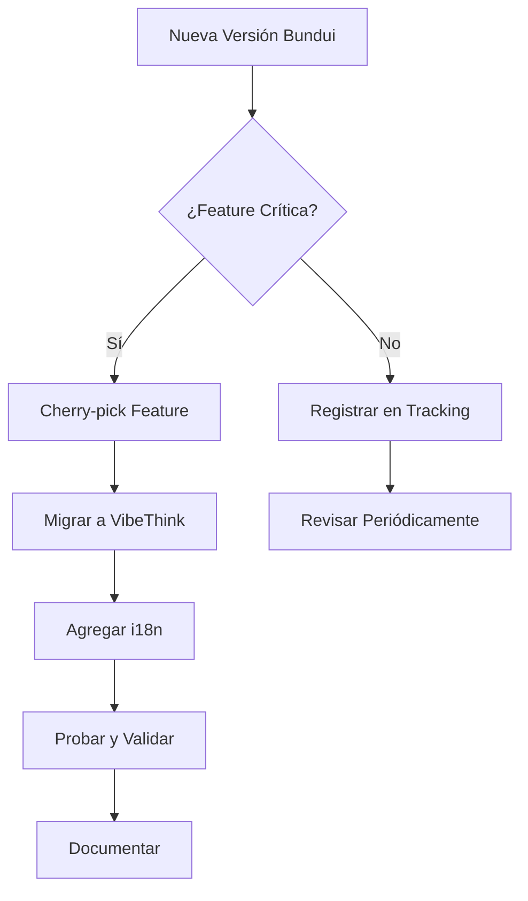

# Estrategia de Actualización: Bundui sin i18n

## 🎯 Problema Central

**Bundui y referencias externas:**
- Solo se actualizan cuando el proveedor lanza nuevas versiones
- **NUNCA incluirán localización (i18n)** - siempre en inglés
- Son referencias de terceros que no controlamos
- Necesitamos mantener VibeThink actualizado pero con i18n

**Desafío:** ¿Cómo mantener VibeThink actualizado con nuevas features de Bundui sin perder i18n?

---

## 📋 Opciones Estratégicas

### Opción 1: Freeze Strategy (Congelar Bundui) ⭐ **RECOMENDADA**

**Concepto:** Bundui se congela en una versión estable. Solo VibeThink se actualiza.

#### Proceso

```
1. Bundui se congela en versión actual
2. Todas las mejoras van directo a VibeThink
3. Bundui solo se actualiza manualmente si es crítico
4. VibeThink evoluciona independientemente
```

#### Ventajas

- ✅ **Simplicidad:** No hay que sincronizar nada
- ✅ **Control total:** VibeThink evoluciona a nuestro ritmo
- ✅ **i18n garantizado:** Todo nuevo código tiene i18n desde el inicio
- ✅ **Sin conflictos:** No hay riesgo de sobrescribir i18n
- ✅ **Bajo mantenimiento:** Bundui es solo referencia estática

#### Desventajas

- ❌ No recibimos automáticamente mejoras de Bundui
- ❌ Requiere implementar features manualmente
- ❌ Puede quedar desactualizado respecto al original

#### Cuándo Usar

- ✅ Cuando Bundui es principalmente referencia
- ✅ Cuando tenemos capacidad de desarrollo propia
- ✅ Cuando queremos control total sobre features

#### Implementación

```markdown
# Regla: Bundui Freeze
- Bundui versión actual: [FECHA/VERSIÓN]
- Estado: CONGELADO
- Actualización: Solo manual y crítico
- Nuevas features: Directo a VibeThink con i18n
```

---

### Opción 2: Manual Update Process (Proceso Manual) 🔄

**Concepto:** Actualizar Bundui manualmente cuando hay nueva versión, luego migrar cambios a VibeThink.

#### Proceso

```
1. Detectar nueva versión de Bundui
2. Evaluar cambios (¿vale la pena actualizar?)
3. Actualizar Bundui (backup primero)
4. Identificar cambios/mejoras
5. Migrar cambios a VibeThink con i18n
6. Probar y validar
7. Documentar actualización
```

#### Ventajas

- ✅ Recibimos mejoras del proveedor
- ✅ Control sobre qué actualizar
- ✅ Podemos evaluar antes de migrar
- ✅ Mantenemos referencia actualizada

#### Desventajas

- ❌ Proceso manual y laborioso
- ❌ Riesgo de perder i18n si no se migra correctamente
- ❌ Requiere tiempo de desarrollo
- ❌ Puede haber conflictos

#### Cuándo Usar

- ✅ Cuando hay actualizaciones importantes de Bundui
- ✅ Cuando queremos mantener referencia actualizada
- ✅ Cuando tenemos tiempo para migración cuidadosa

#### Checklist de Actualización

```markdown
## Checklist: Actualizar Bundui → VibeThink

### Pre-actualización
- [ ] Backup de Bundui actual
- [ ] Backup de VibeThink
- [ ] Documentar versión actual
- [ ] Revisar changelog de Bundui

### Actualización
- [ ] Actualizar Bundui (nueva versión)
- [ ] Identificar cambios (git diff)
- [ ] Listar nuevas features
- [ ] Listar mejoras existentes

### Migración
- [ ] Crear namespace i18n si hay nuevo módulo
- [ ] Extraer textos hardcoded
- [ ] Crear traducciones (en, es)
- [ ] Migrar código a VibeThink
- [ ] Reemplazar textos con t('key')
- [ ] Probar cambio de idioma

### Post-actualización
- [ ] Validar funcionalidad
- [ ] Documentar cambios
- [ ] Actualizar este documento
- [ ] Commit y tag de versión
```

---

### Opción 3: Cherry-Pick Strategy (Selección Selectiva) 🍒

**Concepto:** Solo migrar features específicas de Bundui que necesitamos, no todo.

#### Proceso

```
1. Nueva versión de Bundui disponible
2. Revisar changelog/features
3. Identificar features que necesitamos
4. Cherry-pick solo esas features
5. Migrar a VibeThink con i18n
6. Ignorar el resto
```

#### Ventajas

- ✅ Solo migramos lo que necesitamos
- ✅ Menos trabajo que actualización completa
- ✅ Control granular
- ✅ Mantenemos Bundui como referencia

#### Desventajas

- ❌ Requiere análisis de cada feature
- ❌ Puede ser complejo identificar dependencias
- ❌ Proceso manual

#### Cuándo Usar

- ✅ Cuando solo necesitamos features específicas
- ✅ Cuando la actualización completa no es necesaria
- ✅ Cuando queremos ser selectivos

#### Ejemplo

```markdown
## Ejemplo: Cherry-pick Feature

Bundui v2.1.0 → Nueva feature: "Advanced Filters"
1. Identificar: Solo necesitamos esta feature
2. Copiar: components/advanced-filters.tsx
3. Migrar: A VibeThink con i18n
4. Ignorar: Resto de cambios de v2.1.0
```

---

### Opción 4: Migration Scripts (Scripts Automatizados) 🤖

**Concepto:** Scripts que detectan cambios en Bundui y ayudan a migrarlos a VibeThink.

#### Proceso

```
1. Script detecta cambios en Bundui
2. Identifica textos hardcoded
3. Sugiere estructura de traducciones
4. Genera template de migración
5. Desarrollador completa migración manual
```

#### Ventajas

- ✅ Automatiza detección de cambios
- ✅ Reduce trabajo manual
- ✅ Consistencia en migración
- ✅ Documentación automática

#### Desventajas

- ❌ Requiere desarrollo de scripts
- ❌ No puede migrar automáticamente (necesita revisión)
- ❌ Mantenimiento de scripts

#### Cuándo Usar

- ✅ Cuando hay actualizaciones frecuentes
- ✅ Cuando queremos estandarizar proceso
- ✅ Cuando tenemos capacidad de desarrollo de herramientas

#### Scripts Propuestos

```javascript
// scripts/detect-bundui-changes.js
// Detecta cambios entre versiones de Bundui

// scripts/extract-hardcoded-texts.js
// Extrae textos hardcoded de componentes

// scripts/generate-i18n-template.js
// Genera template de traducciones

// scripts/migrate-to-vibethink.js
// Asiste en migración a VibeThink
```

---

### Opción 5: Version Tracking (Seguimiento de Versiones) 📊

**Concepto:** Mantener registro de versiones de Bundui y qué se ha migrado.

#### Proceso

```
1. Registrar versión actual de Bundui
2. Documentar qué features se han migrado
3. Mantener backlog de features pendientes
4. Priorizar migraciones según necesidad
```

#### Ventajas

- ✅ Visibilidad completa
- ✅ Planificación de migraciones
- ✅ Documentación clara
- ✅ Sin perder track de features

#### Desventajas

- ❌ Requiere mantenimiento manual
- ❌ No automatiza migración

#### Cuándo Usar

- ✅ Siempre (complementa otras estrategias)
- ✅ Para planificación a largo plazo
- ✅ Para documentación

#### Template de Tracking

```markdown
## Bundui Version Tracking

### Versión Actual
- **Bundui:** v2.0.0 (2025-01-15)
- **Estado:** Congelado
- **Última actualización:** 2025-01-15

### Features Migradas a VibeThink
| Feature | Versión Bundui | Fecha Migración | Estado i18n |
|---------|----------------|-----------------|-------------|
| Advanced Filters | v2.0.0 | 2025-01-20 | ✅ Completo |
| Dark Mode | v1.9.0 | 2025-01-10 | ✅ Completo |

### Features Pendientes
| Feature | Versión Bundui | Prioridad | Notas |
|---------|----------------|-----------|-------|
| New Chart Types | v2.1.0 | Baja | Evaluar necesidad |
| Enhanced Search | v2.1.0 | Media | Planificar Q2 |

### Features Ignoradas
| Feature | Versión Bundui | Razón |
|---------|----------------|-------|
| Hotel Module | v2.0.0 | No aplica a nuestro caso |
```

---

### Opción 6: Feature Detection (Detección Automática) 🔍

**Concepto:** Scripts que detectan automáticamente nuevas features en Bundui.

#### Proceso

```
1. Script compara Bundui actual vs referencia
2. Detecta nuevos archivos/módulos
3. Detecta cambios en componentes existentes
4. Genera reporte de cambios
5. Sugiere acciones (migrar/ignorar)
```

#### Ventajas

- ✅ Detección automática
- ✅ No se pierden features
- ✅ Reportes claros

#### Desventajas

- ❌ Requiere desarrollo
- ❌ Puede generar falsos positivos

#### Cuándo Usar

- ✅ Con actualizaciones frecuentes
- ✅ Para auditoría periódica

---

## 🎯 Recomendación: Estrategia Híbrida

### Combinación Óptima

**Estrategia Principal:** Freeze Strategy + Version Tracking + Cherry-Pick

```
1. Bundui se congela (Freeze)
2. Version Tracking para documentar
3. Cherry-pick solo features necesarias
4. Migration Scripts para asistencia
```

### Flujo Recomendado



---

## 📝 Proceso Documentado: Actualización Manual

### Paso 1: Preparación

```bash
# 1. Backup
git checkout -b backup-bundui-$(date +%Y%m%d)
git add apps/dashboard/app/dashboard-bundui
git commit -m "backup: Bundui antes de actualización"

# 2. Documentar versión actual
echo "Bundui v2.0.0 - $(date)" >> docs/architecture/BUNDUI_VERSIONS.md
```

### Paso 2: Actualizar Bundui

```bash
# 3. Actualizar desde fuente (si aplica)
# O copiar nueva versión manualmente

# 4. Verificar cambios
git diff apps/dashboard/app/dashboard-bundui
```

### Paso 3: Identificar Cambios

```bash
# 5. Listar archivos nuevos/modificados
git status apps/dashboard/app/dashboard-bundui

# 6. Analizar cambios
git log --oneline apps/dashboard/app/dashboard-bundui
```

### Paso 4: Migrar a VibeThink

```bash
# 7. Para cada feature nueva:
# - Crear namespace i18n
# - Extraer textos
# - Crear traducciones
# - Migrar código
# - Probar
```

### Paso 5: Documentar

```markdown
## Actualización: Bundui v2.0.0 → v2.1.0

**Fecha:** 2025-01-XX
**Features Migradas:**
- Advanced Filters → VibeThink CRM (con i18n)
- New Chart Types → VibeThink Analytics (con i18n)

**Features Ignoradas:**
- Hotel Module (no aplica)
```

---

## 🚨 Reglas Críticas

### Regla 1: NUNCA Sobrescribir i18n

```tsx
// ❌ INCORRECTO - Actualizar Bundui y perder i18n
// NO hacer esto

// ✅ CORRECTO - Migrar cambios preservando i18n
// 1. Actualizar Bundui (referencia)
// 2. Identificar cambios
// 3. Migrar a VibeThink con i18n
```

### Regla 2: Bundui Siempre en Inglés

```markdown
Bundui = Solo inglés (hardcoded)
VibeThink = Multidioma (i18n obligatorio)
```

### Regla 3: Versionado de Bundui

```markdown
Documentar siempre:
- Versión actual de Bundui
- Fecha de última actualización
- Features migradas
- Features pendientes
```

---

## 📊 Matriz de Decisión

| Escenario | Estrategia Recomendada |
|-----------|------------------------|
| **Actualización crítica** | Manual Update + Cherry-pick |
| **Actualización menor** | Cherry-pick selectivo |
| **Sin actualizaciones** | Freeze Strategy |
| **Múltiples actualizaciones** | Migration Scripts + Tracking |
| **Feature específica** | Cherry-pick |

---

## ✅ Checklist de Implementación

### Para Freeze Strategy

- [ ] Documentar versión actual de Bundui
- [ ] Marcar Bundui como "CONGELADO"
- [ ] Establecer regla: "Nuevas features → VibeThink"
- [ ] Actualizar documentación

### Para Manual Update

- [ ] Crear checklist de actualización
- [ ] Establecer proceso de backup
- [ ] Documentar proceso de migración
- [ ] Crear templates de documentación

### Para Version Tracking

- [ ] Crear archivo de tracking
- [ ] Documentar versión actual
- [ ] Establecer formato de registro
- [ ] Crear proceso de revisión periódica

---

## 📚 Referencias

- [Tandem Bundui-VibeThink](./BUNDUI_VIBETHINK_TANDEM.md)
- [Estrategia i18n](./I18N_STRATEGY.md)
- [Proceso de Sincronización](./REFERENCE_SYNC_PROCESS.md)

---

## 🎯 Resumen Ejecutivo

**Problema:** Bundui se actualiza sin i18n, necesitamos mantener VibeThink actualizado con i18n.

**Solución Recomendada:** 
- **Freeze Strategy** como base
- **Cherry-pick** para features críticas
- **Version Tracking** para documentación
- **Migration Scripts** para asistencia

**Regla de Oro:**
> Bundui = Referencia congelada (solo inglés)  
> VibeThink = Producción evolutiva (siempre con i18n)

---

**Última actualización:** 2025-01-XX  
**Versión:** 1.0.0  
**Mantenido por:** Equipo de Desarrollo VibeThink


