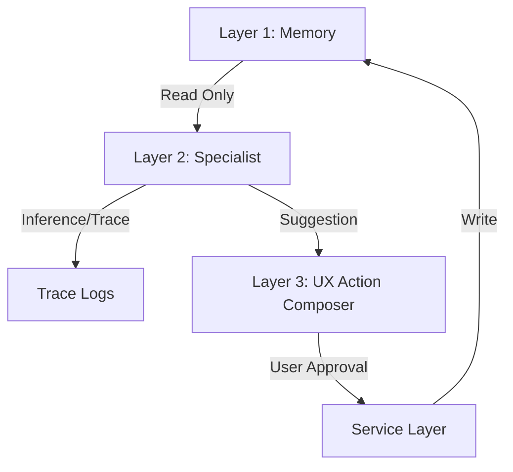

# Specialist Architecture Specification (Layer 2)

**Status**: CANON  
**Type**: ARCHITECTURAL_SPEC  
**Last Updated**: 2026-01-02  
**Parent Canon**: `02_AI_FIRST_3_LAYER_ARCHITECTURE.md`

---

## 1. Purpose

This document defines the **Reasoning Layer** (Layer 2) of ViTo.  
Specialists are the "brain cells" of the system. They consume **Memory** (Layer 1) and produce **Suggestions** for the **UX** (Layer 3).

**Critical Invariant**:
> Specialists **NEVER** write directly to Canonical Memory as "Truth".
> They produce **Inferences** (Suggestions/Predictions) which persist in `trace_logs`.
> `trace_logs` are NOT Canonical Memory. They are evidence of reasoning.
> Only explicit User Action or Canonical Workflows promote these inferences to Truth.

---

## 2. What is a Specialist?

A Specialist is a domain-aware agent responsible for a specific vertical logic (e.g., Sales, Ops, Finance).

### The Specialist Contract (`ISpecialist`)

Every specialist must implement this high-level behavior:

1.  **Analyze(Context)**:
    *   *Input*: Timeline Events + Entity Graph + Policy.
    *   *Process*: LLM reasoning / Deterministic rules.
    *   *Output*: Inferences (Probability, Sentiment, Risk).

2.  **Suggest(Goal)**:
    *   *Input*: Current state + User Goal.
    *   *Output*: A list of `ProposedActions` (e.g., "Send Invoice", "Restock Item").

3.  **ProposeExecution(Action)** (Only when triggered):
    *   *Input*: User Approval.
    *   *Output*: Call Service Layer (Standard API).

---

## 3. Data Flow & Constraints

1.  **Read-Only Input**: Specialists see the world through the `UniversalTimeline` and `EntityGraph`.
2.  **Trace Output**: Every decision is logged in `specialist_trace_logs` with:
    *   `input_snapshot_hash`
    *   `reasoning_chain`
    *   `confidence_score`
3.  **Action Handoff**: Specialists do not mutate state directly. They return a structured `ActionIntent` to the UX or Orchestrator.

---

## 4. Interaction Examples

### scenario: The "Late Shipment"

1.  **Memory**: `TimelineEvent` (Shipping) is status `IN_TRANSIT` but `expected_date` < `now`.
2.  **Ops Specialist**:
    *   *Analyzes*: Detects delay pattern.
    *   *Reasoning*: "Carrier X usually updates late, but delay > 48h suggests lost package."
    *   *Output*: Confidence 85% on "Delay".
3.  **UX**: Shows "Potential Delay detected".
4.  **Suggestion**: "Email Customer Support? [Yes/No]"
5.  **Action**: User clicks Yes -> `CommunicationService.sendEmail()`.

---

## 5. Anti-Patterns (WIT-005 Violations)

*   ❌ **Auto-Commit**: Specialist decides "Deal is Won" and updates DB status to `WON` without user/workflow gate.
*   ❌ **Hidden Logic**: Specialist uses private memory/state not in Layer 1.
*   ❌ **Hallucinated Entity**: Specialist invents a "RiskScore" entity instead of using `trace_logs` metadata.
