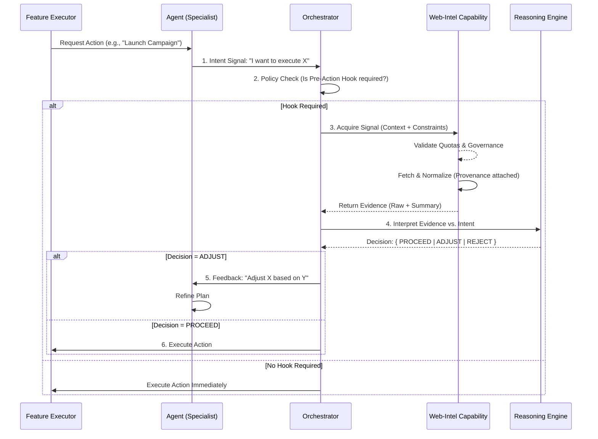

# Decision Support Pattern: Pre-Action Hook

**Status**: CANONICAL  
**Version**: 1.0.0  
**Type**: ARCHITECTURAL PATTERN  

---

## 1. Concept and Purpose

The **Decision Support Pattern (Pre-Action Hook)** acts as a mandatory validation and enrichment gate that occurs **before** an agent executes a significant action (e.g., publishing a campaign, sending a message, booking a venue).

This pattern solves the "Blind Execution" problem where agents act solely on internal memory without verifying current external reality. It enables the **Orchestrator** to pause proper execution to acquire fresh signals via the **Web-Intel Capability**, which are then interpreted by **Reasoning** to validate, adjust, or block the intended action.

### What it is NOT
*   ❌ **Browsing Libre**: It is not open-ended web surfing by agents.
*   ❌ **Scraping Ad-hoc**: It is not uncontrolled data fetching. All acquisition is governed, quota-limited, and provenanced.
*   ❌ **Auto-Decision**: Web-Intel never decides. It only provides evidence. The Orchestrator/Reasoning layer makes the decision.
*   ❌ **Auto-Promotion**: Acquired signals do not automatically become Canonical Entity Memory. Promotion requires a separate, explicit event.

---

## 2. End-to-End Flow



**Critical Separation**:
*   **Orchestrator**: Decides *WHEN* to check.
*   **Web-Intel**: executes *ACQUISITION*.
*   **Reasoning**: interprets *MEANING*.
*   **Feature/Agent**: executes *ACTION*.

---

## 3. Auditable Examples (Requests)

### Example A: Marketing (Campaign Validation)
**Goal**: Validate a "Summer Promo" tweet before publishing.
*   **Context**: Agent wants to post about "Ice Cold Lemonade".
*   **Request to Web-Intel**:
    *   `topic`: "Current weather & trending summer drinks in [Region]"
    *   `constraints`: `freshness_days: 1`, `max_sources: 3`
    *   `idempotency_key`: `camp_summ_001_chk`
*   **Outcome**: Web-Intel finds a "Freak Storm Warning". Reasoning advises: **ABORT/DELAY** to avoid tone-deafness.

### Example B: Sales (Pre-Meeting Enrichment)
**Goal**: Prepare for a sales call with "Acme Corp".
*   **Context**: Specialist scheduled a demo.
*   **Request to Web-Intel**:
    *   `target`: "Acme Corp latest press releases"
    *   `constraints`: `sources: ["news", "linkedin_company"]`
    *   `idempotency_key`: `meet_acme_2024_prep`
*   **Outcome**: Web-Intel finds "Acme Corp announces merger". Reasoning advises: **ADJUST PITCH** to focus on integration capabilities.

### Example C: Operations (Restaurant)
**Goal**: Plan next week's menu specials.
*   **Context**: Chef Agent drafting menu.
*   **Request to Web-Intel**:
    *   `location`: "Downtown District"
    *   `type`: "Local events over 10k attendees next week"
    *   `idempotency_key`: `ops_menu_wk42`
*   **Outcome**: Web-Intel identifies "Marathon Sunday". Reasoning advises: **RECOMMEND** "Carb-loading Pasta Special".

---

## 4. Interfaces & Contracts

### Request Payload (Orchestrator -> Web-Intel)
```json
{
  "request_id": "uuid",
  "intent": "VALIDATION" | "ENRICHMENT",
  "context": {
    "domain": "marketing",
    "topic": "string"
  },
  "constraints": {
    "max_cost_credits": 10,
    "freshness_hours": 24,
    "allowed_source_types": ["news", "official_blog"]
  },
  "governance": {
    "department_id": "dept_uuid",
    "user_id": "user_uuid"
  },
  "idempotency_key": "string_hash"
}
```

### Evidence Response (Web-Intel -> Orchestrator)
```json
{
  "request_id": "uuid",
  "status": "COMPLETED",
  "evidence": [
    {
      "content": "extracted_text...",
      "summary": "AI_generated_summary",
      "provenance": {
        "source_url": "https://...",
        "fetched_at": "2024-01-01T12:00:00Z",
        "method": "headless_browser",
        "source_type": "public_web",
        "license_check": "passed"
      }
    }
  ],
  "usage": {
    "credits_deducted": 2,
    "quota_remaining": 98
  }
}
```

---

## 5. Invariants (WITs)

1.  **Strict Separation**: Web-Intel **NEVER** executes the final business action. It only returns data.
2.  **Mandatory Provenance**: Every piece of valid evidence **MUST** have a `source_url` and `fetched_at` timestamp. Absence invalidates the signal.
3.  **Pre-Fetch Gating**: Policy checks (Access Control) and Quota deduction happen **BEFORE** any external call is made.
4.  **Idempotency**: Repeated requests with the same `idempotency_key` within a window return cached evidence to prevent credit drain.
5.  **Explicit Promotion**: Data lives in the **Intel Store** (ephemeral/referenced) until an explicit `ENTITY_EVENT` promotes it to the **Entity Graph** (Canonical Timeline/Memory).
