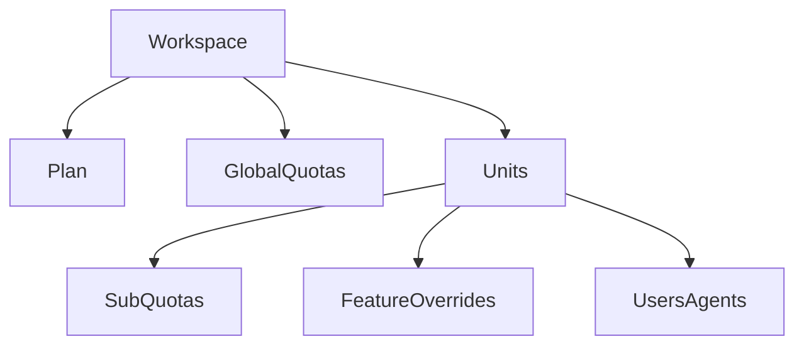

# PLANS_AND_QUOTAS_MODEL.md

Status: READY

## 1. Propósito

Definir el modelo canónico de planes, cuotas y feature gating para workspaces multi-tenant estilo Attio, garantizando:

*   **Enforcement real**: No solo en UI, sino en el backend.
*   **Alineación con Policy Layer**: El plan es un input para las políticas.
*   **Control explícito de costos AI**: Governance financiero integrado.
*   **Escalabilidad**: Worksapce -> Unidad/Departamento -> Usuario/Agente.

## 2. Principios Invariantes (WITs)

*   **WIT-P1**: Ningún plan modifica la verdad del sistema; solo habilita capacidades y límites.
*   **WIT-P2**: Todo límite debe ser **enforced server-side**.
*   **WIT-P3**: El plan no decide acceso directamente → Policy Layer decide usando el plan como input.
*   **WIT-P4**: Todo consumo relevante genera un **Usage Event** auditable.
*   **WIT-P5**: AI cost governance es parte del plan, no un add-on.

## 3. Jerarquía de Scope



1.  **Workspace**: Entidad raíz.
2.  **Plan**: Definición base de capacidades (basic/pro/advanced/enterprise).
3.  **Quotas Globales**: Límites agregados para todo el workspace.
4.  **Units / Departments**: Divisiones lógicas que heredan del plan.
    *   **Sub-quotas**: Límites específicos por unidad.
    *   **Feature overrides**: Activación/desactivación granular (si aplica).
5.  **Users / Agents**: Consumidores finales.

## 4. Modelo de Plan (Canónico)

```typescript
type PlanTier = "basic" | "pro" | "advanced" | "enterprise";
type AIModelTier = "cheap" | "standard" | "premium";

interface Plan {
  plan_id: string;
  name: PlanTier;

  limits: {
    users_max: number;
    units_max: number;

    tokens_monthly: number;
    ai_requests_monthly: number;

    transactions_monthly: number;
    scraping_jobs_monthly: number;
    integrations_active_max: number;
  };

  ai_governance: {
    max_model_tier: AIModelTier;
    embeddings_allowed: boolean;
    vector_storage_mb: number;
  };

  features: FeatureMatrix;
}
```

## 5. Feature Gating (Matriz Canónica)

| Feature | Basic | Pro | Advanced | Enterprise |
| :--- | :---: | :---: | :---: | :---: |
| Multi-unit | ❌ | ✅ | ✅ | ✅ |
| Custom agents | ❌ | ✅ | ✅ | ✅ |
| Vector retrieval | ❌ | Limited | Full | Full |
| External scraping | ❌ | ✅ | ✅ | ✅ |
| API access | ❌ | ❌ | ✅ | ✅ |
| Fine-grained policy | ❌ | ❌ | ✅ | ✅ |

**Regla**: La UI **nunca** es fuente de verdad para features. El backend consulta la `FeatureMatrix`.

## 6. Límites por Unidad / Departamento

Cada unidad hereda del plan pero puede tener sub-límites.

```typescript
interface UnitQuota {
  unit_id: string;
  overrides: {
    tokens_monthly?: number;
    ai_requests_monthly?: number;
    scraping_jobs_monthly?: number;
  };
}
```

**Invariante Unitario**: Una unidad **nunca** puede exceder el plan global del workspace.

## 7. Integración con Policy Layer

El plan **no autoriza**, solo contextualiza. La Policy Layer toma la decisión final.

```typescript
interface PolicyInput {
  actor: string;
  action: string;
  resource: string;
  context: {
    plan: Plan;
    quotas_remaining: {
        tokens: number;
        // ... otros contadores
    };
    unit_limits: UnitQuota;
  };
}
```

**Ejemplo**:
> "El agente puede usar GPT-4 solo si el plan lo permite (ai_governance.max_model_tier >= premium) y hay tokens disponibles (quotas_remaining.tokens > 0)."

## 8. AI Cost Governance (Conexión Directa)

Cada plan define explícitamente:

1.  **Tier máximo de modelo**: Evita uso accidental de modelos costosos en planes bajos.
2.  **Uso permitido de embeddings**: Control de costos de vectorización.
3.  **Cap de vector storage**: Límite físico de almacenamiento en base de datos vectorial.

El **Router de Modelos** valida contra el plan *antes* de ejecutar cualquier inferencia.

## 9. FIT – Enforcement de Planes y Cuotas

| FIT ID | Descripción | Resultado Esperado |
| :--- | :--- | :--- |
| **FIT-PLAN-001** | Intentar usar feature fuera del plan | `403 Forbidden` + reason code |
| **FIT-PLAN-002** | Intentar exceder cuota global | `429 Too Many Requests` + `quota_exceeded` |
| **FIT-PLAN-003** | Intentar exceder cuota de unidad | `429 Too Many Requests` + `unit_quota_exceeded` |
| **FIT-PLAN-004** | Manipulación de UI para habilitar feature | Backend rechaza acción (Server-side validation) |

## 10. Anti-Patterns (Explícitamente Prohibidos)

*   ❌ **Hardcoding de features en cliente**: "Si oculto el botón, no pueden usarlo".
*   ❌ **Límites blandos sin bloqueo**: Permitir excedentes sin autorización explícita ("soft limits").
*   ❌ **Billing mezclado**: Lógica de cobro (Stripe, etc.) dentro del código de dominio.
*   ❌ **Ignorar costos de embeddings**: Tratar embeddings como "gratuitos" o ilimitados.
