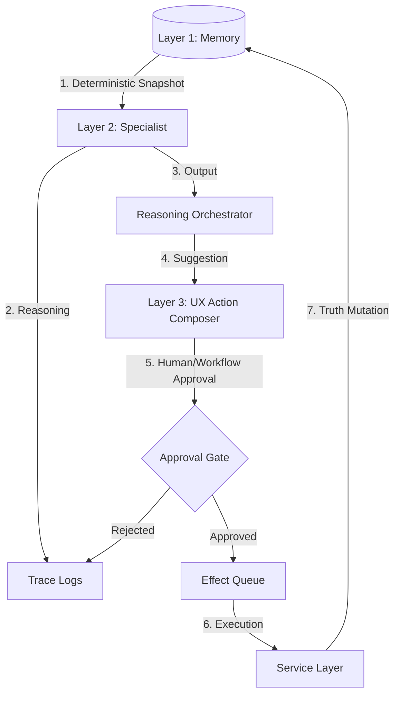

# Specialist & Reasoning Runtime Architecture Specification

**Status**: CANONICAL — SEALED  
**Type**: ARCHITECTURAL_SPEC  
**Last Updated**: 2026-01-09  
**Parent Canon**: `02_AI_FIRST_3_LAYER_ARCHITECTURE.md`  
**Related Canons**: `ONTOLOGY_SPEC.md`, `CANON-ORCH-STATE-001.md`, `CANON-TRACE-001.md`, `CANON-EVENTS-001.md`

---

## 1. Purpose

This specification defines the **Reasoning Runtime** (Layer 2) of ViTo. It establishes the design for **Specialists**, their execution lifecycle, and the boundaries between cognitive inference and canonical truth.

The goal is to provide a deterministic, auditable, and domain-aware "brain" that consumes **Memory** (Layer 1) and produces **Suggestions** for the **UX** (Layer 3) without bypassing governance or mutating truth without approval.

---

## 2. The Specialist Model (Layer 2)

A **Specialist** is a domain-aware logic unit responsible for analyzing specific vertical contexts (e.g., Sales, Ops, Finance) and proposing actions.

### 2.1 Specialist Definition
- **Scope**: Anchored to one or more **Departments** or **Capabilities**.
- **Nature**: Domain-specific heuristics + LLM-based reasoning.
- **Contract**: Specialists must statelesslly transform a **Memory Snapshot** into a list of **Inferences** and **Suggested Actions**.

### 2.2 Specialist Invariants
1.  **Read-Only Observer**: Specialists see the world through the `UniversalTimeline` and `EntityGraph`. They **NEVER** write directly to Canonical Memory.
2.  **Traceability**: Every cognitive step must be recorded in `TraceRecords` (CANON-TRACE-001) with its `input_snapshot_hash`.
3.  **Suggestion Primary**: Specialists output `ProposedActions`. They do not "execute"; they "intend". Execution is a runtime concern of the Orchestrator after Approval.

---

## 3. Reasoning Runtime State

The runtime state coordinates execution but is **not** canonical truth. It is ephemeral evidence of a process.

### 3.1 Runtime Entities (Non-Ontological)
These entities exist as per `CANON-ORCH-STATE-001` to manage the lifecycle of a request:

- **Signal**: The trigger (External/Internal event).
- **Run**: A single execution instance tied to a Signal.
- **Step**: An atomic reasoning unit within a Run (e.g., "Analyze Sales History").
- **ToolCall**: An LLM-driven invocation of a system capability (e.g., "Query CRM").
- **Effect**: A deferred external action awaiting execution (e.g., "Send Email").

### 3.2 State Lifecycle
1.  **Intake**: Signal is ingested and assigned a `correlation_id`.
2.  **Context Assembly**: A deterministic snapshot of relevant Memory (Entities + Events) is created.
3.  **Reasoning Loop**: 
    - The Orchestrator selects the appropriate **Specialist** based on Signal type and Policy.
    - The Specialist produces **Inferences** (Predictions, Risks, Sentiment) and **Suggestions**.
4.  **Trace Preservation**: All Specialist output (including raw reasoning chains) is saved to the Trace Log.

---

## 4. The Inference Flow (The "Thinking" Loop)

The following flow ensures that AI reasoning is rigorous and follows the **AI-First Laws**:

### 4.1 Inference vs. Truth
- **Inference**: "Acme Corp might be at risk" (Stored in Trace, visible in UX as a warning).
- **Truth**: "Acme Corp Status: AT_RISK" (Stored in Case Entity, only after Approval).

---

## 5. Runtime Boundaries

### 5.1 With Memory (Layer 1)
- **Specialists** have READ access only.
- **Orchestrator** has WRITE access only to `runtime_state` (Runs, Steps, Tools, Effects).
- **Truth Mutation** occurs only via **Effects** triggered by approved Suggestions.

### 5.2 With UX (Layer 3)
- **UX** projects the current `Run` status and any `SuggestedActions`.
- **UX** provides the interface for **Approval**. 
- **UX** never executes logic; it only routes user intent back to the `Approval Gate`.

---

## 6. Execution & Determinism

To ensure reliability, the Reasoning Runtime follows these rules:

1.  **Idempotency**: Reprocessing the same Signal with the same `source_id` MUST NOT create duplicate Effects.
2.  **Replayable**: Given an `input_snapshot_hash` and the same Specialist version, the output must be reconstructible.
3.  **Auditability**: Every `Effect` must point back to the `step_id` and `run_id` that generated it.

---

## 7. Anti-Patterns (WIT Violations)

*   ❌ **Direct Mutation**: A Specialist updating a `Case` status directly in the DB.
*   ❌ **Hidden Context**: A Specialist using shared memory outside of the Layer 1 Snapshot.
*   ❌ **Bypassing Approval**: Executing an `Effect` that modifies external state without an Approval/Workflow Gate.
*   ❌ **Ontology Expansion**: Creating new domain entities (e.g., `RiskScoreObject`) instead of using `TraceRecord` metadata.

### 5.4 Trace & Log Persistence
The `trace_logs` represent the cognitive evidence of the Reasoning Runtime.
- **Persistence Type**: Persistent Database Table (managed via migrations).
- **Retention Policy**: Defined by `TRACE_RETENTION_AND_AUDIT_POLICY.md`.
- **Primary Use**: Post-mortem audit, RLHF (Reinforcement Learning from Human Feedback), and regulatory compliance.

---

## 8. Summary of Components

| Component | Responsibility | Layer | Output |
| :--- | :--- | :--- | :--- |
| **Specialist** | Domain Reasoning | 2 | ActionIntents & Inferences |
| **Orchestrator** | Lifecycle Control | 2 | Runtime State Transitions |
| **Approval Gate** | Governance | 2 | Validated Execution Rights |
| **Effect Executor** | External Mutation | 2 | Changes to Layer 1 / External |

---

## 9. Approval Authority Matrix

### 9.1 Approval Gate Governance

| Effect Type | Impact Scope | Authority | Auto-Approval |
| :--- | :--- | :--- | :--- |
| **READ_ONLY_QUERY** | Meta-data / Analytics | Specialist (Self) | YES (Pre-defined) |
| **SIGNAL_EMIT** | Internal Event Bus | Orchestrator | YES |
| **TRUTH_MUTATION** | Single Tenant Entity | Workspace Admin | NO |
| **SYSTEM_CONFIG** | Global / Multi-tenant | Platform Owner | NO |
| **THIRD_PARTY_API** | External System | Account Owner | NO |

### 9.2 Workflow Approval Policies
- **Explicit Consent**: Any effect modifying financial or legal states requires MFA or explicit click-thru.
- **Trace Linkage**: No approval can be granted without a valid `trace_id` link.
- **M-of-N Approval**: Critical system changes may require 2-of-3 signatures from human principals.

### 9.3 Prohibited Auto-Approvals
- Mutation of `Case` or `Person` status.
- External fund transfers.
- Modification of Security Policies / RLS.
- Bulk data exports.

---

**End of Specialist & Reasoning Runtime Architecture Specification**
