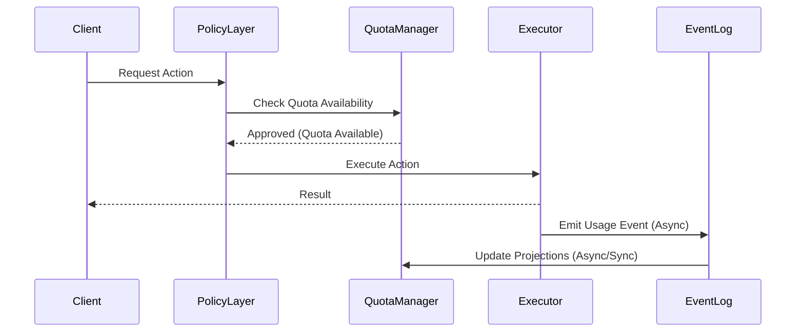

# USAGE_METERING_EVENTS.md

Status: READY

## 1. Propósito

Definir el sistema canónico de eventos de uso, fundamentales para:

*   **Metering**: Medición precisa del consumo.
*   **Quotas**: Deducción de saldos en tiempo real.
*   **Auditoría**: Trazabilidad completa de acciones.
*   **Facturación futura**: Base de datos inmutable para generar facturas.
*   **AI Cost Governance**: Tracking granular de tokens y costos.

## 2. Principios (WITs)

*   **WIT-M1**: Todo uso relevante **genera evento**.
*   **WIT-M2**: Los eventos son **append-only**.
*   **WIT-M3**: Metering ≠ source of truth (la verdad vive en los eventos de dominio).
*   **WIT-M4**: Los eventos son **reproducibles y agregables**.

## 3. Tipos de Usage Events

### 3.1 AI Usage (`ai.request.executed`)

```json
{
  "event_type": "ai.request.executed",
  "workspace_id": "ws_...",
  "unit_id": "unit_...",
  "actor_id": "user_or_agent_...",
  "model": "gpt-4",
  "provider": "openai",
  "tokens_input": 1200,
  "tokens_output": 800,
  "cost_estimated_usd": 0.04,
  "timestamp": "2023-10-27T10:00:00Z"
}
```

### 3.2 Transactions (`transaction.executed`)

Cubre operaciones de negocio con valor intrínseco.

*   CRM ops
*   Writes
*   Workflow runs

```json
{
  "event_type": "transaction.executed",
  "category": "crm_write",
  "resource_id": "rec_...",
  // ...
}
```

### 3.3 Scraping (`scraping.job.executed`)

```json
{
  "event_type": "scraping.job.executed",
  "source_url": "https://example.com",
  "pages_processed": 15,
  "depth": 2,
  "runtime_ms": 4500
}
```

### 3.4 Integrations (`integration.api.call`)

Llamadas a servicios externos monetizables.

## 4. Registro y Almacenamiento

1.  **Primary Store**: Tabla de `UsageEvents` (Inmutable, Append-Only).
2.  **Secondary Store**: Proyecciones agregadas (Cache / Read Models) para consulta rápida de cuotas.

**Retención**:
*   **Raw events**: 12–24 meses (Hot/Warm storage).
*   **Aggregates**: Indefinido (Cold storage).

## 5. Auditoría y Trazabilidad

Cada evento incluye metadatos de proveniencia (`provenance`):

```json
{
  "provenance": {
    "request_id": "req_...",
    "agent_id": "agent_...",
    "policy_decision_id": "pol_..."
  }
}
```

Esto permite:
*   Replay de eventos.
*   Resolución de disputas de facturación.
*   Auditoría de costos de AI por agente/usuario.

## 6. Flow de Chequeo de Cuotas (Runtime)



**Regla Crítica**: El evento se emite **solo** si la acción fue ejecutada exitosamente. Los intentos fallidos por cuota **no** consumen (pero pueden generar eventos de `quota.denied` para auditoría).

## 7. Integración con Cache Layer

*   Las proyecciones de consumo viven en caché (Redis/Memcached).
*   El caché **puede expirar**.
*   La verdad **siempre** es recomputable desde los `UsageEvents`.

## 8. FIT – Quotas Enforcement

| FIT ID | Descripción | Resultado Esperado |
| :--- | :--- | :--- |
| **FIT-METER-001** | Exceder tokens | Request bloqueada antes de ejecución |
| **FIT-METER-002** | Cache corrupto/vacío | Sistema recomputa automáticamente desde eventos |
| **FIT-METER-003** | Replay de eventos | Reproduce exactamente los contadores actuales |

## 9. Anti-Patterns (Explícitamente Prohibidos)

*   ❌ **Contar uso solo en frontend**: La UI miente, el backend no.
*   ❌ **"Soft limits" sin bloqueo real**: Si no hay quota, no pasa.
*   ❌ **No emitir eventos para ahorrar**: La data es el activo más valioso para billing.
*   ❌ **Mezclar billing con domain logic**: El metering cuenta "qué pasó", no "cuánto cuesta cobrar al usuario hoy".

## 10. Relación con Otros Canons

*   `POLICY_LAYER_AS_MEMORY_FILTER.md`
*   `EMBEDDING_COST_GOVERNANCE.md`
*   `CACHE_MEMORY_LAYER.md`
*   `ENTITY_MEMORY_SCHEMA_SPEC.md`
