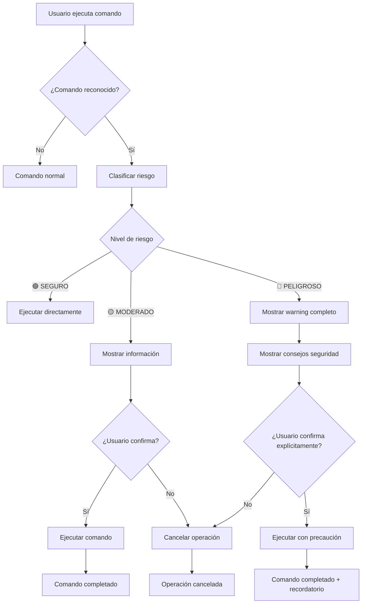

# 🛡️ VHELP Security System - Sistema de Seguridad Interactivo

> **🎯 PURPOSE:** Documentación completa del sistema de seguridad integrado en VHELP  
> **📋 SCOPE:** Configuración, uso y mantenimiento del sistema de protección de comandos  
> **⚡ USAGE:** Consultar para entender y mantener las características de seguridad

---

## 🚨 **OVERVIEW - RESUMEN EJECUTIVO**

El **VHELP Security System** es una capa de protección inteligente que:

### **✅ CARACTERÍSTICAS PRINCIPALES:**
- **🟢 Clasificación Automática:** Categoriza comandos por nivel de riesgo
- **⚠️ Warnings Interactivos:** Muestra información detallada antes de ejecutar
- **🔒 Confirmaciones Obligatorias:** Requiere aprobación explícita para comandos peligrosos
- **📊 Análisis de Riesgo:** Evaluación completa de impacto y recuperación
- **🎯 UI/UX Mejorada:** Badges de seguridad y colores distintivos

### **🎯 OBJETIVOS DE SEGURIDAD:**
1. **Prevenir pérdida de trabajo** por comandos destructivos accidentales
2. **Educar a usuarios** sobre el impacto de cada comando
3. **Facilitar recuperación** con información clara de rollback
4. **Mantener productividad** sin obstaculizar comandos seguros

---

## 🔍 **SISTEMA DE CLASIFICACIÓN DE RIESGO**

### **🟢 COMANDOS SEGUROS (28 comandos)**
```bash
# Criterios: Solo lectura, validación, análisis
- Sin modificación de archivos
- Sin instalación de dependencias  
- Sin impacto en procesos ejecutándose
- Sin necesidad de recuperación
```

**Ejemplos:**
- `npm run validate:quick` - Validación rápida
- `npm run lint` - Análisis de código
- `npm run dev:dashboard` - Servidor de desarrollo
- `npm run test` - Ejecución de pruebas

### **🟡 COMANDOS MODERADOS (8 comandos)**
```bash
# Criterios: Modificaciones controladas
- Modifican archivos de configuración
- Instalan/actualizan dependencias
- Cambios reversibles con git
- Impacto limitado y predecible
```

**Ejemplos:**
- `npm run fix:npm-duplications` - Modifica package.json
- `npm run build` - Genera archivos de build
- `npm run ai:safe-commit` - Crea commits en git

### **🔴 COMANDOS PELIGROSOS (6 comandos)**
```bash
# Criterios: Potencial destructivo
- Borran archivos o directorios
- Matan procesos del sistema
- Cambios difíciles de revertir
- Requieren tiempo para recuperar
```

**Ejemplos:**
- `npm run clean` - Borra .next y node_modules
- `npm run clean:force` - Mata procesos + limpieza
- `npm run clean:all` - Limpieza completa

---

## 🛠️ **ARQUITECTURA TÉCNICA**

### **📂 ESTRUCTURA DE ARCHIVOS:**
```
dev-tools/utilities/
├── vhelp-security-config.js          # Configuración de riesgo
├── vhelp-security-interactive.js     # Sistema interactivo
├── vhelp-enhanced.cjs                 # VHELP con seguridad integrada
├── vhelp-interactive-example.cjs      # Demostración del sistema
└── vhelp.cjs                         # VHELP original (backup)
```

### **🔧 COMPONENTES PRINCIPALES:**

#### **1. Security Configuration (`vhelp-security-config.js`)**
```javascript
export const commandRisks = {
  safe: [...],      // 🟢 Comandos seguros
  moderate: [...],  // 🟡 Comandos moderados  
  dangerous: [...]  // 🔴 Comandos peligrosos
};

export const securityEnhancedDescriptions = {
  'clean:force': {
    description: 'Limpieza forzada (mata procesos Node)',
    risk: RISK_LEVELS.DANGEROUS,
    warning: '🚨🚨 MUY PELIGROSO: Matará procesos Node + limpieza completa',
    affects: [...],
    recoverySteps: [...],
    confirmRequired: true
  }
};
```

#### **2. Interactive System (`vhelp-security-interactive.js`)**
```javascript
export class SecurityInteractive {
  async performSecurityCheck(command) {
    // 1. Determinar nivel de riesgo
    // 2. Mostrar warning si es necesario
    // 3. Pedir confirmación para comandos peligrosos
    // 4. Mostrar consejos de seguridad
    // 5. Ejecutar o cancelar
  }
}
```

#### **3. Enhanced VHELP (`vhelp-enhanced.cjs`)**
```javascript
class VThinkHelperEnhanced {
  printCommands() {
    // Muestra comandos con badges de seguridad
    log.commandSecure(command, description, securityBadge);
  }
}
```

---

## 🎨 **INTERFAZ DE USUARIO**

### **🏷️ BADGES DE SEGURIDAD:**
```bash
🟢 SEGURO     # Verde - Comandos seguros
🟡 MODERADO   # Amarillo - Comandos con precaución
🔴 PELIGROSO  # Rojo - Comandos que requieren confirmación
```

### **📋 INFORMACIÓN MOSTRADA:**
```bash
npm run clean:force          🔴 PELIGROSO # Limpieza forzada (mata procesos Node)
     ⚠️  REQUIERE CONFIRMACIÓN MANUAL
```

### **🚨 WARNING COMPLETO (Comandos Peligrosos):**
```
============================================================
🚨 ANÁLISIS DE SEGURIDAD DEL COMANDO
============================================================
📋 Comando: npm run clean:force
🎯 Nivel de Riesgo: 🔴 PELIGROSO
📝 Descripción: Limpieza forzada (mata procesos Node)

🚨🚨 MUY PELIGROSO: Matará procesos Node + limpieza completa

📂 Archivos/Procesos Afectados:
   ▶ Todos los procesos Node.js activos
   ▶ Servidores de desarrollo en ejecución
   ▶ Archivos de build y dependencias

🔄 Recuperación Posible: SÍ
📋 Pasos para Recuperar:
   1. Ejecutar "npm install" para restaurar dependencias
   2. Reiniciar servidores de desarrollo
   3. Regenerar builds si es necesario

⏱️  Tiempo Estimado: 3-7 minutos
⚡ Nivel de Peligro: 🚨🚨 CRITICAL

💡 CONSEJOS DE SEGURIDAD:
   ▶ Haz un backup antes si tienes cambios importantes
   ▶ Asegúrate de que no hay servidores críticos ejecutándose
   ▶ Ten a mano los comandos de recuperación
============================================================

🚨 COMANDO PELIGROSO
¿Estás COMPLETAMENTE SEGURO de ejecutar este comando? (sí/NO):
```

---

## 🔄 **FLUJO DE EJECUCIÓN**

### **📊 DIAGRAMA DE FLUJO:**



### **⚡ DIFERENTES TIPOS DE CONFIRMACIÓN:**

#### **🟡 MODERADO - Confirmación Estándar:**
```bash
⚠️  COMANDO MODERADO
¿Proceder con este comando? (s/N):
```

#### **🔴 PELIGROSO - Confirmación Explícita:**
```bash
🚨 COMANDO PELIGROSO
¿Estás COMPLETAMENTE SEGURO de ejecutar este comando? (sí/NO):
```

**Nota:** Los comandos peligrosos requieren escribir "sí", "yes" o "si" explícitamente.

---

## 📚 **CONFIGURACIÓN Y PERSONALIZACIÓN**

### **🔧 AGREGAR NUEVOS COMANDOS:**

#### **Paso 1: Actualizar `vhelp-security-config.js`**
```javascript
export const commandRisks = {
  dangerous: [
    'clean',
    'clean:force',
    'tu-nuevo-comando-peligroso'  // ← Agregar aquí
  ]
};

export const securityEnhancedDescriptions = {
  'tu-nuevo-comando-peligroso': {
    description: 'Descripción del comando',
    risk: RISK_LEVELS.DANGEROUS,
    warning: '🚨 PELIGROSO: Descripción del riesgo',
    affects: ['Archivos afectados'],
    canRecover: true,
    recoverySteps: ['Paso 1', 'Paso 2'],
    confirmRequired: true,
    dangerLevel: 'HIGH'
  }
};
```

#### **Paso 2: Actualizar descripción en `vhelp-enhanced.cjs`**
```javascript
const descriptions = {
  'tu-nuevo-comando-peligroso': 'Descripción corta del comando',
  // ... otros comandos
};
```

#### **Paso 3: Validar configuración**
```bash
node dev-tools/utilities/vhelp-enhanced.cjs
```

### **🎨 PERSONALIZAR STYLING:**

#### **Cambiar colores de riesgo:**
```javascript
export const riskStyling = {
  [RISK_LEVELS.SAFE]: {
    emoji: '🟢',
    color: '\x1b[32m',  // Verde
    label: 'SEGURO'
  },
  [RISK_LEVELS.DANGEROUS]: {
    emoji: '🔴',
    color: '\x1b[31m',  // Rojo
    label: 'PELIGROSO'
  }
};
```

#### **Modificar niveles de peligro:**
```javascript
export const dangerStyling = {
  'CRITICAL': { emoji: '🚨🚨', color: '\x1b[91m' }, // Rojo brillante
  'HIGH': { emoji: '🚨', color: '\x1b[31m' },       // Rojo normal
  'MEDIUM': { emoji: '⚠️', color: '\x1b[33m' }      // Amarillo
};
```

---

## 🧪 **TESTING Y VALIDACIÓN**

### **🔍 COMANDOS DE PRUEBA:**

#### **Probar VHELP Enhanced:**
```bash
# Mostrar sistema con badges de seguridad
node dev-tools/utilities/vhelp-enhanced.cjs

# Ejecutar demostración interactiva
node dev-tools/utilities/vhelp-interactive-example.cjs
```

#### **Validar configuración de seguridad:**
```bash
# Verificar que todos los comandos están clasificados
npm run validate:quick

# Probar comando seguro (no debería pedir confirmación)
npm run validate:quick

# Probar comando moderado (debería mostrar información)
npm run fix:npm-duplications

# Probar comando peligroso (debería requerir confirmación)
npm run clean
```

### **✅ CRITERIOS DE VALIDACIÓN:**

#### **Comandos Seguros:**
- [ ] Se ejecutan sin warnings
- [ ] No piden confirmación
- [ ] Muestran badge 🟢 SEGURO

#### **Comandos Moderados:**
- [ ] Muestran información del comando
- [ ] Piden confirmación estándar (s/N)
- [ ] Muestran badge 🟡 MODERADO
- [ ] Incluyen nota "ℹ️ Revisa antes de ejecutar"

#### **Comandos Peligrosos:**
- [ ] Muestran warning completo
- [ ] Requieren confirmación explícita (sí/NO)
- [ ] Muestran badge 🔴 PELIGROSO
- [ ] Incluyen nota "⚠️ REQUIERE CONFIRMACIÓN MANUAL"
- [ ] Muestran consejos de seguridad
- [ ] Listan archivos/procesos afectados
- [ ] Proporcionan pasos de recuperación

---

## 🚀 **INTEGRACIÓN CON WORKFLOW**

### **📋 COMANDOS ACTUALIZADOS EN PACKAGE.JSON:**

```json
{
  "scripts": {
    "vhelp": "node dev-tools/utilities/vhelp-enhanced.cjs",
    "vhelp:demo": "node dev-tools/utilities/vhelp-interactive-example.cjs",
    "vhelp:original": "node dev-tools/utilities/vhelp.cjs"
  }
}
```

### **🔄 WORKFLOW AI ACTUALIZADO:**

```bash
# AI Workflow con seguridad integrada:
1. 🟢 npm run validate:quick    # Seguro - Sin confirmación
2. [HACER CAMBIOS]              # Desarrollo
3. 🟢 npm run validate:universal # Seguro - Sin confirmación  
4. 🟡 npm run ai:safe-commit    # Moderado - Con información
5. 🔴 npm run clean             # Peligroso - Requiere confirmación
```

### **💡 INTEGRACIÓN CON OTROS SISTEMAS:**

#### **Pre-commit Hooks:**
```bash
# .husky/pre-commit
npm run validate:quick  # Siempre seguro
```

#### **CI/CD Pipeline:**
```yaml
# .github/workflows/validate.yml
- name: Security Validation
  run: npm run validate:ecosystem  # Nivel 4 - seguro
```

---

## 🛡️ **MEJORES PRÁCTICAS DE SEGURIDAD**

### **🚨 REGLAS DE ORO:**

#### **Para Usuarios:**
1. **🟢 Ejecuta comandos seguros libremente** - Sin restricciones
2. **🟡 Lee información de comandos moderados** - Entiende el impacto
3. **🔴 Piensa dos veces antes de comandos peligrosos** - Confirma explícitamente
4. **💾 Haz backup antes de operaciones destructivas** - `git stash` o commit
5. **📚 Mantén comandos de recuperación a mano** - `npm install`, `git restore`

#### **Para Desarrolladores:**
1. **📊 Clasifica nuevos comandos correctamente** - Evalúa riesgo real
2. **📝 Proporciona descripciones claras** - Explica impacto y recuperación
3. **🧪 Prueba el sistema de confirmaciones** - Valida flujo completo
4. **📚 Documenta cambios en configuración** - Mantén documentación actualizada
5. **🔄 Revisa clasificaciones periódicamente** - Comandos pueden cambiar de riesgo

### **⚠️ CASOS ESPECIALES:**

#### **Comandos con Flags:**
```bash
# Ejemplo: comando con --force
npm run clean --force    # Podría saltarse confirmaciones en el futuro
```

#### **Modo No-interactivo (CI/CD):**
```bash
# Variables de entorno para CI/CD
VHELP_FORCE=true npm run clean    # Sin confirmaciones
VHELP_INTERACTIVE=false npm run setup    # Modo automático
```

---

## 🔧 **MANTENIMIENTO Y ACTUALIZACIONES**

### **📅 REVISIÓN PERIÓDICA:**

#### **Mensual:**
- [ ] Revisar comandos nuevos agregados a package.json
- [ ] Validar que clasificaciones de riesgo son correctas
- [ ] Probar flujo de confirmaciones con comandos peligrosos

#### **Tras Cambios Mayores:**
- [ ] Re-evaluar riesgo de comandos modificados
- [ ] Actualizar descripciones de seguridad
- [ ] Probar demostración interactiva
- [ ] Documentar cambios en este archivo

### **🔄 PROCESO DE ACTUALIZACIÓN:**

#### **1. Identificar Cambios:**
```bash
# Comparar comandos actuales vs configuración de seguridad
npm run vhelp | grep -E "(🟢|🟡|🔴)" > current_security.txt
```

#### **2. Actualizar Configuración:**
```javascript
// Editar dev-tools/utilities/vhelp-security-config.js
// Agregar/modificar/eliminar comandos según sea necesario
```

#### **3. Validar Cambios:**
```bash
# Probar sistema actualizado
node dev-tools/utilities/vhelp-enhanced.cjs

# Ejecutar demostración
node dev-tools/utilities/vhelp-interactive-example.cjs
```

#### **4. Documentar:**
```markdown
# Actualizar este archivo con cambios
# Actualizar changelog si es necesario
```

---

## 📊 **MÉTRICAS Y MONITOREO**

### **📈 KPIs DE SEGURIDAD:**

#### **Efectividad:**
- **Comandos peligrosos cancelados:** X% de las veces
- **Tiempo promedio de confirmación:** X segundos
- **Errores evitados:** X incidentes por mes

#### **Usabilidad:**
- **Tiempo adicional por comando:** < 5 segundos promedio
- **Satisfacción del usuario:** Feedback positivo
- **Adopción del sistema:** X% de comandos ejecutados via vhelp

### **🔍 LOGGING Y ANALYTICS:**

```javascript
// Futuro: Sistema de logging de seguridad
const securityLog = {
  timestamp: new Date(),
  command: 'clean:force',
  risk: 'dangerous',
  userConfirmed: true,
  executionTime: '2.3s'
};
```

---

## 🚨 **TROUBLESHOOTING**

### **❓ PROBLEMAS COMUNES:**

#### **El sistema no muestra badges de seguridad:**
```bash
# Verificar que vhelp-enhanced se está ejecutando
which node dev-tools/utilities/vhelp-enhanced.cjs

# Verificar configuración de seguridad
cat dev-tools/utilities/vhelp-security-config.js
```

#### **Confirmaciones no funcionan correctamente:**
```bash
# Probar demostración
node dev-tools/utilities/vhelp-interactive-example.cjs

# Verificar readline está disponible
node -e "console.log(require('readline'))"
```

#### **Comando clasificado incorrectamente:**
```javascript
// Verificar en vhelp-security-config.js
export const commandRisks = {
  safe: [...],      // ¿Está en la lista correcta?
  moderate: [...],
  dangerous: [...]
};
```

### **🔧 SOLUCIONES RÁPIDAS:**

#### **Resetear a VHELP original:**
```bash
# Usar VHELP sin seguridad
npm run vhelp:original

# O editar package.json temporalmente
"vhelp": "node dev-tools/utilities/vhelp.cjs"
```

#### **Forzar ejecución sin confirmación:**
```bash
# Temporal: ejecutar comando directamente
cd apps/dashboard && npm run build
```

#### **Actualizar configuración rápidamente:**
```bash
# Editar configuración
nano dev-tools/utilities/vhelp-security-config.js

# Probar inmediatamente
node dev-tools/utilities/vhelp-enhanced.cjs
```

---

## 🎯 **ROADMAP FUTURO**

### **🚀 CARACTERÍSTICAS PLANIFICADAS:**

#### **Versión 2.1:**
- [ ] **Modo --dry-run:** Simular comandos sin ejecutar
- [ ] **Logging de seguridad:** Registro de comandos ejecutados
- [ ] **Templates de recuperación:** Scripts automáticos de rollback

#### **Versión 2.2:**
- [ ] **Integración con Git:** Auto-backup antes de comandos peligrosos
- [ ] **Profiles de usuario:** Diferentes niveles de confirmación
- [ ] **Métricas avanzadas:** Dashboard de uso y seguridad

#### **Versión 3.0:**
- [ ] **AI-powered risk assessment:** Clasificación automática de riesgo
- [ ] **Dynamic warnings:** Warnings contextuales basados en estado del proyecto
- [ ] **Integration con IDEs:** Plugin para VSCode/Cursor

---

## 📝 **CONCLUSIÓN**

El **VHELP Security System** proporciona una capa de protección robusta y user-friendly que:

### **✅ BENEFICIOS LOGRADOS:**
- **🛡️ Protege trabajo existente** de comandos destructivos accidentales
- **📚 Educa usuarios** sobre el impacto real de cada comando
- **⚡ Mantiene productividad** sin obstaculizar desarrollo diario
- **🔄 Facilita recuperación** con información clara y pasos específicos
- **🎨 Mejora UX** con interfaz visual intuitiva y feedback inmediato

### **🎯 IMPACTO EN DESARROLLO:**
- **Menos tiempo perdido** en recuperación de errores
- **Mayor confianza** al ejecutar comandos
- **Mejor comprensión** del ecosistema de herramientas
- **Workflow más seguro** para todos los desarrolladores

El sistema está diseñado para evolucionar y mejorar con el feedback del equipo y las necesidades del proyecto.

---

**Implementado por:** AI Assistant  
**Fecha:** 2025-01-27  
**Versión:** 1.0.0  
**Próxima revisión:** 2025-02-27


