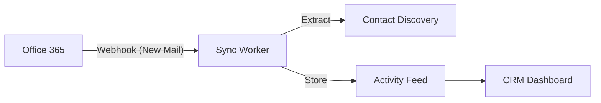

# FIT-CRM-CORE-TRANSVERSAL-001: The "Attio-Style" Core

> **Status:** EVOLVING (Phase 2)
> **Type:** VERTICAL_DEFINITION
> **Target:** `packages/crm-core`
> **Vision:** "The CRM builds itself." (Zero-input sync)

---

## 1. The Core Philosophy: "Connection First"

Just like modern CRMs (Attio, Twenty), this module is NOT a database of manual forms. It is a **Sync Engine**.

**The User Journey:**
1.  **Sign Up**.
2.  **Connect Account:** (Google Workspace / Office 365).
3.  **Magic Sync:** The CRM populates itself.
    *   Finds contacts from email history.
    *   Builds timeline from calendar events.
    *   Enriches profiles using Clearbit/Apollo (optional).

---

## 2. Architecture: The Sync Layer

### 2.1 Provider Abstraction (Nylas / Unified.to Pattern)
We do not write raw IMAP/SMTP code. We use a unified provider model or a specialized service.

*   **Primary Integration:** **Microsoft Graph API** & **Google Gmail API**.
*   **Auth Scope:** `Mail.Read`, `Calendars.Read`, `Contacts.Read`.
*   **Security:** OAuth Refresh Tokens stored in **ViTo `secret_vault` (Encrypted)**.

### 2.2 The Sync Engine (Background Workers)

The CRM is event-driven. It reacts to provider webhooks.

### 2.3 Data Model (The Graph)

*   **`Identity`**: The real person (email + phone).
*   **`Interaction`**: An edge between Identities (Email sent, Meeting held).
*   **`Record`**: The business object (Deal, Patient, Sponsor).

**Rule:** You don't "create" an Interaction. You "link" an existing Interaction (email) to a Record.

---

## 3. Onboarding Experience (The "Attio" Flow)

### Step 1: "Where do you work?"
*   User selects: Google Workspace / Microsoft 365.
*   **Action:** Triggers OAuth flow immediately.

### Step 2: "Who matters?" (Contact Filtering)
*   System scans last 30 days of emails.
*   Presents a list: *"We found 45 frequent contacts. Import them?"*
*   **Value:** Instant population. No "Empty State" anxiety.

### Step 3: "What are they?" (List Definition)
*   User tags contacts: "Sponsors", "Patients", "Leads".
*   This creates the initial **Lists** (Tables).

---

## 4. Technical Constraints & Guardrails

### 4.1 Privacy by Design (The "Private" Flag)
*   **Default:** Emails are PRIVATE to the user connected.
*   **Sharing:** Emails are only visible to the team if **Explicitly Shared** or if the Contact is **Public**.
*   **Sensitive Data:** Credit card patterns or "Confidentical" headers trigger auto-masking.

### 4.2 Rate Limits (Provider Compliance)
*   We must respect Graph API quotas.
*   **Architecture:** Queue-based throttling (BullMQ) separate from the HTTP web server.

### 4.3 Clean Architecture Re-Use
This module lives in `packages/crm-core` and is consumed by:
*   **FIT-CLINICAL:** To sync Doctor's schedule (Outlook) with Patient appointments.
*   **FIT-TWIN:** To sync Andrés Cantor's sponsor meetings (Gmail) with the Twin's context.

---

## 5. Implementation Roadmap

1.  **Phase 1 (Foundation):** Provider OAuth Handlers + Secret Vault Storage.
2.  **Phase 2 (Ingestion):** Webhook receiver + Activity Feed Table.
3.  **Phase 3 (Intelligence):** "Suggest Contact" logic based on frequency.
4.  **Phase 4 (UI):** Canvas-style List View (shadcn/ui data-table).

**Signed:** VibeThink Architecture Team
