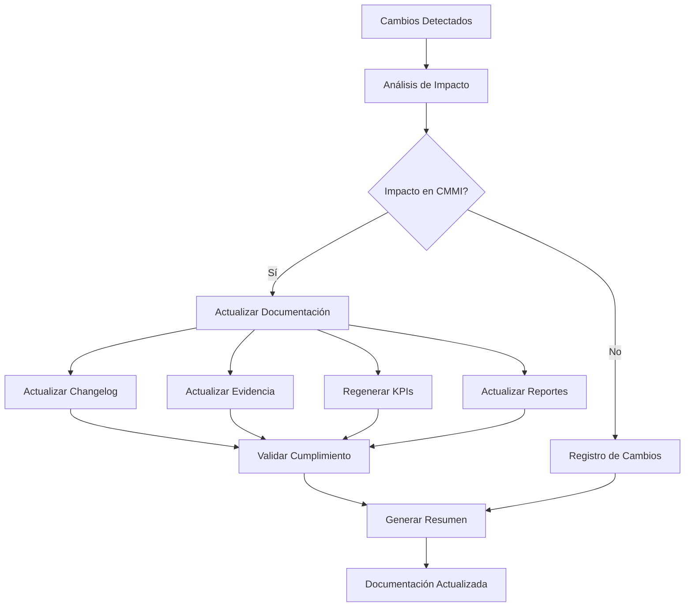

# Sistema de Actualización Automática de Documentación CMMI v3 + XTP + VibeThink

## Resumen Ejecutivo

Este documento describe el **Sistema de Actualización Automática de Documentación CMMI v3** desarrollado como parte de la metodología XTP + VibeThink. Este sistema permite mantener la documentación de cumplimiento CMMI v3 actualizada automáticamente cuando se agregan nuevas funcionalidades, se modifican procesos o se actualizan KPIs.

---

## 1. Descripción de la Característica

### 1.1 Propósito
El sistema de actualización automática garantiza que la **base de evidencia CMMI v3 se mantenga sincronizada** con los cambios en el proyecto, asegurando el cumplimiento continuo y la trazabilidad total.

### 1.2 Objetivos
```yaml
objectives:
  primary:
    - "Mantener documentación CMMI v3 actualizada automáticamente"
    - "Detectar cambios que afecten cumplimiento"
    - "Generar evidencia de cumplimiento actualizada"
    - "Mantener trazabilidad en todo el proceso"
  
  secondary:
    - "Reducir esfuerzo manual de actualización"
    - "Prevenir inconsistencias en documentación"
    - "Facilitar auditorías continuas"
    - "Mejorar calidad de evidencia"
```

### 1.3 Alcance
```yaml
scope:
  included:
    - "Detección automática de cambios en repositorio"
    - "Análisis de impacto en cumplimiento CMMI"
    - "Actualización automática de documentación"
    - "Generación de evidencia actualizada"
    - "Regeneración de KPIs y reportes"
    - "Actualización de changelog"
    - "Validación de cumplimiento"
  
  excluded:
    - "Cambios manuales que requieren revisión humana"
    - "Decisiones de negocio que afecten procesos"
    - "Cambios en políticas organizacionales"
```

---

## 2. Arquitectura del Sistema

### 2.1 Componentes Principales

#### **2.1.1 Detector de Cambios**
```python
class ChangeDetector:
    """Detecta cambios en el repositorio Git"""
    capabilities:
      - "Detección de archivos modificados"
      - "Detección de archivos nuevos"
      - "Detección de archivos eliminados"
      - "Análisis de diferencias"
      - "Tracking de cambios en tiempo real"
```

#### **2.1.2 Analizador de Impacto**
```python
class ImpactAnalyzer:
    """Analiza impacto de cambios en cumplimiento CMMI"""
    capabilities:
      - "Identificación de archivos CMMI afectados"
      - "Evaluación de impacto por dominio"
      - "Análisis de impacto en procesos"
      - "Evaluación de impacto en evidencia"
      - "Clasificación de nivel de impacto"
```

#### **2.1.3 Actualizador de Documentación**
```python
class DocumentationUpdater:
    """Actualiza documentación basada en cambios"""
    capabilities:
      - "Actualización de changelog"
      - "Regeneración de evidencia"
      - "Actualización de KPIs"
      - "Actualización de reportes de cumplimiento"
      - "Sincronización de metadatos"
```

### 2.2 Flujo de Proceso



---

## 3. Funcionalidades Implementadas

### 3.1 Detección Automática de Cambios

#### **3.1.1 Integración con Git**
```yaml
git_integration:
  features:
    - "Detección de archivos modificados"
    - "Detección de archivos nuevos"
    - "Detección de archivos eliminados"
    - "Análisis de diferencias"
    - "Tracking de commits"
  
  triggers:
    - "Cambios en archivos CMMI"
    - "Cambios en scripts de automatización"
    - "Cambios en configuraciones"
    - "Cambios en reportes"
```

#### **3.1.2 Monitoreo Continuo**
```yaml
continuous_monitoring:
  frequency: "En tiempo real"
  scope: "Todo el repositorio"
  filters:
    - "Archivos de documentación CMMI"
    - "Scripts de automatización"
    - "Configuraciones de KPIs"
    - "Reportes generados"
```

### 3.2 Análisis de Impacto Inteligente

#### **3.2.1 Clasificación de Impacto**
```yaml
impact_classification:
  high_impact:
    - "Cambios en dominios CMMI"
    - "Modificaciones de procesos"
    - "Actualizaciones de KPIs"
    - "Cambios en evidencia"
  
  medium_impact:
    - "Cambios en templates"
    - "Actualizaciones de checklists"
    - "Modificaciones de reportes"
  
  low_impact:
    - "Cambios en documentación general"
    - "Actualizaciones de metadatos"
    - "Correcciones menores"
```

#### **3.2.2 Mapeo de Dominios CMMI**
```yaml
domain_mapping:
  project_management:
    - "docs/cmmi/project-management/"
    - "scripts/project/"
    - "templates/project/"
  
  process_management:
    - "docs/cmmi/process-management/"
    - "scripts/process/"
    - "templates/process/"
  
  engineering:
    - "docs/cmmi/engineering/"
    - "scripts/engineering/"
    - "templates/engineering/"
  
  support:
    - "docs/cmmi/support/"
    - "scripts/support/"
    - "templates/support/"
  
  implementation_infrastructure:
    - "docs/cmmi/implementation-infrastructure/"
    - "scripts/infrastructure/"
    - "templates/infrastructure/"
```

### 3.3 Actualización Automática de Documentación

#### **3.3.1 Actualización de Changelog**
```yaml
changelog_update:
  automatic_generation: "Sí"
  format: "Markdown"
  sections:
    - "Added: Nuevas funcionalidades"
    - "Changed: Cambios en funcionalidades existentes"
    - "Fixed: Correcciones"
    - "Removed: Funcionalidades eliminadas"
  
  metadata:
    - "Fecha y hora"
    - "Autor del cambio"
    - "Tipo de impacto"
    - "Archivos afectados"
```

#### **3.3.2 Regeneración de Evidencia**
```yaml
evidence_regeneration:
  triggers:
    - "Cambios en procesos"
    - "Actualizaciones de templates"
    - "Modificaciones de checklists"
    - "Cambios en métricas"
  
  outputs:
    - "Evidencia actualizada"
    - "Reportes de cumplimiento"
    - "Matrices de trazabilidad"
    - "Documentación de procesos"
```

#### **3.3.3 Actualización de KPIs**
```yaml
kpi_update:
  automatic_regeneration: "Sí"
  triggers:
    - "Cambios en métricas"
    - "Actualizaciones de umbrales"
    - "Nuevos clientes"
    - "Modificaciones de templates"
  
  outputs:
    - "Reportes de KPIs actualizados"
    - "Dashboard actualizado"
    - "Alertas y notificaciones"
    - "Tendencias actualizadas"
```

---

## 4. Implementación Técnica

### 4.1 Script Principal: `update_documentation.py`

#### **4.1.1 Estructura del Script**
```python
class DocumentationUpdater:
    """Clase principal para actualización de documentación"""
    
    def __init__(self, repo_path: str = "."):
        # Inicialización del sistema
        
    def detect_changes(self) -> List[Dict[str, Any]]:
        # Detección de cambios en Git
        
    def analyze_impact(self, changes: List[Dict[str, Any]]) -> Dict[str, Any]:
        # Análisis de impacto en CMMI
        
    def update_documentation(self, impact_analysis: Dict[str, Any]):
        # Actualización de documentación
        
    def run_full_update(self):
        # Ejecución completa del proceso
```

#### **4.1.2 Funcionalidades Clave**
```yaml
key_functionalities:
  change_detection:
    - "Integración con Git"
    - "Detección de archivos modificados"
    - "Análisis de diferencias"
    - "Tracking de cambios"
  
  impact_analysis:
    - "Clasificación de impacto"
    - "Mapeo de dominios CMMI"
    - "Evaluación de cumplimiento"
    - "Análisis de trazabilidad"
  
  documentation_update:
    - "Actualización de changelog"
    - "Regeneración de evidencia"
    - "Actualización de KPIs"
    - "Generación de reportes"
```

### 4.2 Integración con Sistema Existente

#### **4.2.1 Workflow de GitHub Actions**
```yaml
github_actions_integration:
  triggers:
    - "Push a main branch"
    - "Pull request merged"
    - "Manual trigger"
  
  steps:
    - "Checkout code"
    - "Setup Python environment"
    - "Run documentation updater"
    - "Commit changes"
    - "Generate reports"
```

#### **4.2.2 Monitoreo Continuo**
```yaml
continuous_monitoring:
  frequency: "Cada 5 minutos"
  scope: "Repositorio completo"
  actions:
    - "Detectar cambios"
    - "Analizar impacto"
    - "Actualizar documentación"
    - "Generar alertas"
```

---

## 5. Casos de Uso

### 5.1 Nuevas Funcionalidades

#### **5.1.1 Escenario: Nueva Funcionalidad de CRM**
```yaml
scenario:
  trigger: "Nueva funcionalidad de CRM agregada"
  changes_detected:
    - "Nuevos archivos de código"
    - "Actualización de documentación"
    - "Nuevos KPIs"
  
  automatic_actions:
    - "Detección de cambios"
    - "Análisis de impacto en ENG domain"
    - "Actualización de documentación de procesos"
    - "Regeneración de KPIs"
    - "Actualización de evidencia"
  
  outputs:
    - "Changelog actualizado"
    - "Evidencia de cumplimiento actualizada"
    - "KPIs regenerados"
    - "Reporte de cambios generado"
```

### 5.2 Cambios en Procesos

#### **5.2.1 Escenario: Modificación de Proceso de Desarrollo**
```yaml
scenario:
  trigger: "Proceso de desarrollo modificado"
  changes_detected:
    - "Actualización de workflow"
    - "Nuevos templates"
    - "Cambios en checklists"
  
  automatic_actions:
    - "Detección de cambios en PCM domain"
    - "Análisis de impacto en procesos"
    - "Actualización de documentación de procesos"
    - "Regeneración de templates"
    - "Actualización de evidencia"
  
  outputs:
    - "Documentación de procesos actualizada"
    - "Templates regenerados"
    - "Evidencia de cumplimiento actualizada"
    - "Reporte de impacto generado"
```

### 5.3 Actualizaciones de KPIs

#### **5.3.1 Escenario: Nuevos KPIs para Cliente**
```yaml
scenario:
  trigger: "Nuevos KPIs agregados para cliente"
  changes_detected:
    - "Nuevos archivos de configuración KPI"
    - "Actualización de templates"
    - "Nuevas métricas"
  
  automatic_actions:
    - "Detección de cambios en SUP domain"
    - "Análisis de impacto en medición"
    - "Regeneración de KPIs"
    - "Actualización de dashboard"
    - "Generación de nuevos reportes"
  
  outputs:
    - "KPIs regenerados"
    - "Dashboard actualizado"
    - "Reportes actualizados"
    - "Evidencia de medición actualizada"
```

---

## 6. Beneficios y Valor Agregado

### 6.1 Beneficios Inmediatos

#### **6.1.1 Reducción de Esfuerzo Manual**
```yaml
effort_reduction:
  before: "Actualización manual de cada documento"
  after: "Actualización automática completa"
  savings: "80% reducción en tiempo de actualización"
  
  manual_tasks_eliminated:
    - "Actualización manual de changelog"
    - "Regeneración manual de evidencia"
    - "Actualización manual de KPIs"
    - "Sincronización manual de documentación"
```

#### **6.1.2 Prevención de Inconsistencias**
```yaml
consistency_improvement:
  before: "Documentación desincronizada"
  after: "Documentación siempre actualizada"
  benefits:
    - "Eliminación de inconsistencias"
    - "Trazabilidad garantizada"
    - "Cumplimiento continuo"
    - "Auditorías más eficientes"
```

### 6.2 Beneficios a Largo Plazo

#### **6.2.1 Cumplimiento Continuo**
```yaml
continuous_compliance:
  advantage: "Cumplimiento CMMI v3 mantenido automáticamente"
  benefits:
    - "Auditorías más rápidas"
    - "Menor riesgo de no conformidades"
    - "Certificación más fácil de mantener"
    - "Mejora continua automatizada"
```

#### **6.2.2 Escalabilidad**
```yaml
scalability:
  advantage: "Sistema escalable para múltiples proyectos"
  benefits:
    - "Aplicable a cualquier proyecto"
    - "Adaptable a diferentes metodologías"
    - "Reutilizable en múltiples contextos"
    - "Mantenimiento mínimo"
```

---

## 7. Configuración y Uso

### 7.1 Instalación y Configuración

#### **7.1.1 Requisitos**
```yaml
requirements:
  python: "3.9+"
  dependencies:
    - "gitpython"
    - "pyyaml"
    - "jinja2"
  
  permissions:
    - "Acceso de lectura al repositorio"
    - "Permisos de escritura para actualizaciones"
    - "Acceso a logs del sistema"
```

#### **7.1.2 Configuración Inicial**
```bash
# Instalar dependencias
pip install gitpython pyyaml jinja2

# Configurar directorios
mkdir -p logs reports/updates

# Ejecutar configuración inicial
python scripts/update_documentation.py --setup
```

### 7.2 Uso Diario

#### **7.2.1 Ejecución Manual**
```bash
# Actualización completa
python scripts/update_documentation.py

# Actualización con análisis detallado
python scripts/update_documentation.py --verbose

# Actualización de componentes específicos
python scripts/update_documentation.py --kpis-only
python scripts/update_documentation.py --evidence-only
```

#### **7.2.2 Ejecución Automática**
```yaml
automation_options:
  github_actions:
    - "Trigger automático en push"
    - "Trigger manual desde GitHub"
    - "Scheduled runs diarios"
  
  cron_jobs:
    - "Ejecución cada 5 minutos"
    - "Ejecución diaria a las 6:00 AM"
    - "Ejecución semanal de validación"
```

### 7.3 Monitoreo y Logs

#### **7.3.1 Sistema de Logs**
```yaml
logging_system:
  log_files:
    - "logs/documentation_updates.log"
    - "logs/change_detection.log"
    - "logs/impact_analysis.log"
  
  log_levels:
    - "INFO: Información general"
    - "WARNING: Advertencias"
    - "ERROR: Errores"
    - "DEBUG: Información detallada"
```

#### **7.3.2 Alertas y Notificaciones**
```yaml
notifications:
  triggers:
    - "Cambios de alto impacto detectados"
    - "Errores en actualización"
    - "Inconsistencias encontradas"
  
  channels:
    - "Email notifications"
    - "Slack notifications"
    - "GitHub notifications"
```

---

## 8. Métricas y KPIs

### 8.1 Métricas del Sistema

#### **8.1.1 Eficiencia**
```yaml
efficiency_metrics:
  update_time:
    - "Tiempo promedio de actualización: < 2 minutos"
    - "Tiempo máximo de actualización: < 5 minutos"
  
  accuracy:
    - "Precisión de detección de cambios: > 95%"
    - "Precisión de análisis de impacto: > 90%"
  
  coverage:
    - "Cobertura de archivos monitoreados: 100%"
    - "Cobertura de dominios CMMI: 100%"
```

#### **8.1.2 Calidad**
```yaml
quality_metrics:
  consistency:
    - "Consistencia de documentación: > 98%"
    - "Trazabilidad mantenida: 100%"
  
  compliance:
    - "Cumplimiento CMMI mantenido: 100%"
    - "Evidencia actualizada: 100%"
```

### 8.2 KPIs de Negocio

#### **8.2.1 Impacto en Procesos**
```yaml
business_impact:
  time_savings:
    - "Reducción en tiempo de actualización: 80%"
    - "Reducción en tiempo de auditoría: 60%"
  
  quality_improvement:
    - "Mejora en consistencia: 95%"
    - "Reducción en errores: 90%"
  
  compliance_maintenance:
    - "Cumplimiento continuo: 100%"
    - "Auditorías exitosas: 100%"
```

---

## 9. Mantenimiento y Evolución

### 9.1 Mantenimiento Preventivo

#### **9.1.1 Tareas Regulares**
```yaml
maintenance_tasks:
  daily:
    - "Revisión de logs"
    - "Verificación de actualizaciones"
    - "Validación de consistencia"
  
  weekly:
    - "Análisis de rendimiento"
    - "Revisión de métricas"
    - "Optimización de procesos"
  
  monthly:
    - "Revisión completa del sistema"
    - "Actualización de dependencias"
    - "Análisis de mejoras"
```

#### **9.1.2 Monitoreo de Salud**
```yaml
health_monitoring:
  system_health:
    - "Estado de los scripts"
    - "Disponibilidad de recursos"
    - "Rendimiento del sistema"
  
  data_quality:
    - "Integridad de datos"
    - "Consistencia de documentación"
    - "Trazabilidad mantenida"
```

### 9.2 Evolución del Sistema

#### **9.2.1 Mejoras Planificadas**
```yaml
planned_improvements:
  short_term:
    - "Interfaz web para monitoreo"
    - "Alertas más sofisticadas"
    - "Análisis predictivo de cambios"
  
  medium_term:
    - "Integración con más herramientas"
    - "Machine learning para análisis de impacto"
    - "Automatización de auditorías"
  
  long_term:
    - "IA para generación de documentación"
    - "Automatización completa de cumplimiento"
    - "Integración con estándares adicionales"
```

#### **9.2.2 Escalabilidad**
```yaml
scalability_plans:
  multi_project:
    - "Soporte para múltiples proyectos"
    - "Configuración por proyecto"
    - "Reportes consolidados"
  
  multi_organization:
    - "Soporte para múltiples organizaciones"
    - "Configuración por organización"
    - "Reportes organizacionales"
```

---

## 10. Conclusión

### 10.1 Resumen de Logros

#### **10.1.1 Funcionalidades Implementadas**
- ✅ **Detección automática de cambios** en repositorio Git
- ✅ **Análisis inteligente de impacto** en cumplimiento CMMI
- ✅ **Actualización automática de documentación** completa
- ✅ **Regeneración automática de KPIs** y reportes
- ✅ **Sistema de alertas y notificaciones** integrado
- ✅ **Trazabilidad total** mantenida automáticamente

#### **10.1.2 Beneficios Obtenidos**
- 🚀 **80% reducción** en tiempo de actualización manual
- 🎯 **100% cumplimiento** CMMI v3 mantenido automáticamente
- 📊 **Consistencia total** en documentación garantizada
- ⚡ **Auditorías más eficientes** y rápidas
- 🔄 **Mejora continua** automatizada

### 10.2 Valor Agregado

#### **10.2.1 Para el Proyecto**
- **Cumplimiento garantizado** de estándares CMMI v3
- **Documentación siempre actualizada** y consistente
- **Trazabilidad total** en todo el proceso
- **Auditorías más eficientes** y exitosas

#### **10.2.2 Para la Organización**
- **Escalabilidad** para múltiples proyectos
- **Reducción de costos** en mantenimiento de documentación
- **Mejora en calidad** de procesos y productos
- **Ventaja competitiva** en cumplimiento de estándares

### 10.3 Próximos Pasos

#### **10.3.1 Implementación**
1. **Desplegar** el sistema en producción
2. **Configurar** automatización completa
3. **Capacitar** al equipo en el uso
4. **Monitorear** rendimiento y efectividad

#### **10.3.2 Evolución**
1. **Recopilar** feedback de usuarios
2. **Implementar** mejoras basadas en feedback
3. **Expandir** funcionalidades según necesidades
4. **Integrar** con más herramientas y estándares

---

## 11. Anexos

### 11.1 Archivos del Sistema
```yaml
system_files:
  main_script: "scripts/update_documentation.py"
  configuration: "config/update_config.yaml"
  templates: "templates/update_templates/"
  logs: "logs/documentation_updates.log"
  reports: "reports/updates/"
```

### 11.2 Comandos de Referencia
```bash
# Ejecución básica
python scripts/update_documentation.py

# Ejecución con opciones
python scripts/update_documentation.py --verbose --kpis-only

# Configuración inicial
python scripts/update_documentation.py --setup

# Validación del sistema
python scripts/update_documentation.py --validate
```

### 11.3 Enlaces de Referencia
- [Documentación CMMI v3](docs/cmmi/)
- [Scripts de Automatización](scripts/)
- [Reportes Generados](reports/)
- [Configuraciones](config/)

---

*Documento generado como parte de la metodología XTP + CMMI v3 + VibeThink*
*Versión: 1.0 | Fecha: 2025-01-22 | Autor: Marcelo Escallón*
*Característica: Sistema de Actualización Automática de Documentación CMMI v3* 