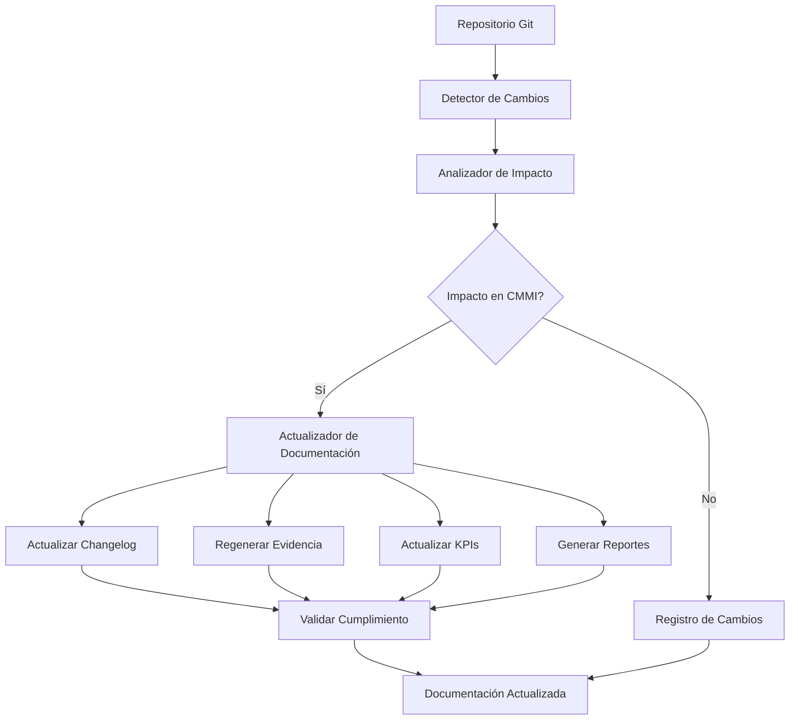

# Guía de Implementación - Sistema de Actualización Automática de Documentación CMMI v3 + XTP + VibeThink

## Resumen Ejecutivo

Esta guía proporciona instrucciones completas para implementar el **Sistema de Actualización Automática de Documentación CMMI v3** en cualquier organización, siguiendo la metodología XTP + VibeThink desarrollada por Marcelo Escallón.

---

## 1. Información del Proyecto

### 1.1 Contexto del Proyecto
```yaml
project_context:
  project_name: "AI-Pair Orchestrator Pro"
  methodology: "XTP + CMMI v3 + VibeThink"
  developer: "Marcelo Escallón"
  version: "1.0"
  date: "2025-01-22"
  
  project_scope:
    - "Sistema de gestión empresarial SaaS"
    - "Multi-tenant con aislamiento por empresa"
    - "5 niveles de roles (EMPLOYEE → SUPER_ADMIN)"
    - "Integración con IA (OpenAI, Firecrawl)"
    - "Gestión dinámica de planes y límites"
    - "Base de evidencia CMMI v3 automatizada"
```

### 1.2 Tecnologías del Stack
```yaml
technology_stack:
  frontend:
    - "React + TypeScript"
    - "shadcn/ui (componentes)"
    - "Tailwind CSS"
    - "React Query"
  
  backend:
    - "Supabase (PostgreSQL)"
    - "Edge Functions"
    - "Real-time subscriptions"
  
  ai_integration:
    - "OpenAI API"
    - "Firecrawl"
    - "AI Chat system"
  
  automation:
    - "Python (scripts de KPIs)"
    - "Node.js (monitoreo)"
    - "GitHub Actions (CI/CD)"
    - "Git (control de versiones)"
```

---

## 2. Arquitectura del Sistema

### 2.1 Arquitectura General


### 2.2 Componentes del Sistema
```yaml
system_components:
  change_detection:
    - "Git integration"
    - "File monitoring"
    - "Change classification"
  
  impact_analysis:
    - "CMMI domain mapping"
    - "Impact assessment"
    - "Compliance evaluation"
  
  documentation_update:
    - "Changelog generation"
    - "Evidence regeneration"
    - "KPI updates"
    - "Report generation"
  
  automation:
    - "GitHub Actions workflows"
    - "Scheduled tasks"
    - "Real-time monitoring"
```

---

## 3. Requisitos de Implementación

### 3.1 Requisitos Técnicos
```yaml
technical_requirements:
  system_requirements:
    os: "Windows 10/11, macOS, Linux"
    python: "3.9+"
    node: "18+"
    git: "2.30+"
  
  dependencies:
    python_packages:
      - "gitpython>=3.1.0"
      - "pyyaml>=6.0"
      - "jinja2>=3.1.0"
      - "requests>=2.28.0"
    
    node_packages:
      - "js-yaml>=4.1.0"
      - "axios>=1.0.0"
  
  storage:
    minimum_space: "1GB"
    recommended_space: "5GB"
  
  network:
    internet_connection: "Required"
    github_access: "Required"
    api_access: "Required"
```

### 3.2 Requisitos Organizacionales
```yaml
organizational_requirements:
  team_structure:
    cmmi_lead: "1 persona"
    process_owner: "1 persona"
    developers: "2+ personas"
    qa_team: "1+ persona"
  
  permissions:
    repository_access: "Read/Write"
    github_actions: "Admin"
    api_keys: "Management"
    documentation: "Full access"
  
  training_requirements:
    cmmi_basics: "2 horas"
    system_usage: "4 horas"
    troubleshooting: "2 horas"
```

---

## 4. Plan de Implementación

### 4.1 Fases de Implementación

#### **Fase 1: Preparación (Semana 1)**
```yaml
phase_1_preparation:
  objectives:
    - "Configurar entorno de desarrollo"
    - "Instalar dependencias"
    - "Configurar repositorio"
    - "Capacitar equipo"
  
  deliverables:
    - "Entorno configurado"
    - "Dependencias instaladas"
    - "Repositorio configurado"
    - "Equipo capacitado"
  
  timeline: "5 días hábiles"
```

#### **Fase 2: Instalación (Semana 2)**
```yaml
phase_2_installation:
  objectives:
    - "Desplegar scripts principales"
    - "Configurar automatización"
    - "Configurar monitoreo"
    - "Probar funcionalidad básica"
  
  deliverables:
    - "Scripts desplegados"
    - "Automatización configurada"
    - "Monitoreo activo"
    - "Pruebas exitosas"
  
  timeline: "5 días hábiles"
```

#### **Fase 3: Configuración (Semana 3)**
```yaml
phase_3_configuration:
  objectives:
    - "Configurar templates específicos"
    - "Configurar KPIs"
    - "Configurar alertas"
    - "Configurar reportes"
  
  deliverables:
    - "Templates configurados"
    - "KPIs configurados"
    - "Alertas configuradas"
    - "Reportes configurados"
  
  timeline: "5 días hábiles"
```

#### **Fase 4: Validación (Semana 4)**
```yaml
phase_4_validation:
  objectives:
    - "Probar funcionalidad completa"
    - "Validar cumplimiento CMMI"
    - "Optimizar rendimiento"
    - "Documentar lecciones aprendidas"
  
  deliverables:
    - "Sistema validado"
    - "Cumplimiento verificado"
    - "Rendimiento optimizado"
    - "Documentación final"
  
  timeline: "5 días hábiles"
```

### 4.2 Cronograma Detallado
```yaml
detailed_timeline:
  week_1:
    monday: "Configuración de entorno"
    tuesday: "Instalación de dependencias"
    wednesday: "Configuración de repositorio"
    thursday: "Capacitación del equipo"
    friday: "Validación de preparación"
  
  week_2:
    monday: "Despliegue de scripts"
    tuesday: "Configuración de automatización"
    wednesday: "Configuración de monitoreo"
    thursday: "Pruebas básicas"
    friday: "Validación de instalación"
  
  week_3:
    monday: "Configuración de templates"
    tuesday: "Configuración de KPIs"
    wednesday: "Configuración de alertas"
    thursday: "Configuración de reportes"
    friday: "Validación de configuración"
  
  week_4:
    monday: "Pruebas completas"
    tuesday: "Validación de cumplimiento"
    wednesday: "Optimización de rendimiento"
    thursday: "Documentación de lecciones"
    friday: "Entrega final"
```

---

## 5. Instrucciones de Instalación

### 5.1 Configuración del Entorno

#### **5.1.1 Requisitos Previos**
```bash
# Verificar Python 3.9+
python --version

# Verificar Node.js 18+
node --version

# Verificar Git 2.30+
git --version

# Verificar acceso a GitHub
git clone https://github.com/your-org/your-repo.git
```

#### **5.1.2 Instalación de Dependencias**
```bash
# Instalar dependencias Python
pip install gitpython pyyaml jinja2 requests

# Instalar dependencias Node.js
npm install js-yaml axios

# Crear directorios necesarios
mkdir -p logs reports/updates config data/trends
```

### 5.2 Configuración del Repositorio

#### **5.2.1 Estructura de Directorios**
```bash
# Crear estructura de directorios
mkdir -p docs/cmmi/{project-management,process-management,engineering,support,implementation-infrastructure}
mkdir -p scripts/kpi
mkdir -p .github/workflows
mkdir -p config
mkdir -p reports/{kpi,alerts,compliance,updates}
mkdir -p logs
mkdir -p data/trends
mkdir -p dashboard
```

#### **5.2.2 Configuración de Git**
```bash
# Configurar Git hooks
cp scripts/git-hooks/* .git/hooks/
chmod +x .git/hooks/*

# Configurar GitHub Actions
cp .github/workflows/kpi-automation.yml .github/workflows/
```

### 5.3 Configuración de Scripts

#### **5.3.1 Script Principal**
```bash
# Copiar script principal
cp scripts/update_documentation.py scripts/

# Hacer ejecutable
chmod +x scripts/update_documentation.py

# Configurar script de KPIs
cp scripts/kpi/generate_kpis.py scripts/kpi/
cp scripts/kpi/monitor_kpis.js scripts/kpi/
```

#### **5.3.2 Configuración de Monitoreo**
```bash
# Configurar monitoreo continuo
cp scripts/kpi/monitor_kpis.js scripts/kpi/

# Configurar dashboard
cp scripts/kpi/generate_dashboard.py scripts/kpi/
```

---

## 6. Configuración Específica

### 6.1 Configuración de CMMI v3

#### **6.1.1 Dominios CMMI**
```yaml
cmmi_domains_config:
  project_management:
    enabled: true
    priority: "high"
    practices: ["planning", "monitoring_control", "risk_management"]
  
  process_management:
    enabled: true
    priority: "high"
    practices: ["process_planning", "process_performance", "process_innovation"]
  
  engineering:
    enabled: true
    priority: "high"
    practices: ["requirements", "design", "implementation", "verification", "validation"]
  
  support:
    enabled: true
    priority: "medium"
    practices: ["quality_assurance", "configuration_management", "measurement_analysis"]
  
  implementation_infrastructure:
    enabled: true
    priority: "medium"
    practices: ["infrastructure", "quality_management", "process_asset_development"]
```

#### **6.1.2 Prácticas Específicas**
```yaml
specific_practices_config:
  pm_1_1:
    name: "Planning"
    description: "Planificación de proyectos"
    evidence_required: ["project_plan", "schedule", "resources"]
  
  pm_2_1:
    name: "Monitoring & Control"
    description: "Monitoreo y control de proyectos"
    evidence_required: ["status_reports", "metrics", "actions"]
  
  eng_1_1:
    name: "Requirements"
    description: "Gestión de requerimientos"
    evidence_required: ["requirements_doc", "traceability", "validation"]
```

### 6.2 Configuración de KPIs

#### **6.2.1 KPIs por Dominio**
```yaml
kpi_configuration:
  project_management:
    schedule_variance:
      threshold: 10
      unit: "percentage"
      frequency: "weekly"
    
    effort_variance:
      threshold: 15
      unit: "percentage"
      frequency: "weekly"
  
  engineering:
    defect_density:
      threshold: 0.5
      unit: "defects/KLOC"
      frequency: "daily"
    
    code_coverage:
      threshold: 80
      unit: "percentage"
      frequency: "daily"
  
  support:
    process_compliance:
      threshold: 95
      unit: "percentage"
      frequency: "weekly"
```

#### **6.2.2 Alertas y Notificaciones**
```yaml
alert_configuration:
  email_alerts:
    enabled: true
    recipients: ["cmmi-lead@company.com", "process-owner@company.com"]
    frequency: "immediate"
  
  slack_alerts:
    enabled: true
    channel: "#cmmi-alerts"
    frequency: "immediate"
  
  github_notifications:
    enabled: true
    repository: "your-org/your-repo"
    frequency: "on-change"
```

### 6.3 Configuración de Automatización

#### **6.3.1 GitHub Actions**
```yaml
github_actions_config:
  triggers:
    - "push to main branch"
    - "pull request merged"
    - "manual trigger"
    - "scheduled (daily at 6:00 AM UTC)"
  
  permissions:
    contents: "write"
    actions: "read"
    security-events: "read"
  
  environment:
    python_version: "3.9"
    node_version: "18"
```

#### **6.3.2 Monitoreo Continuo**
```yaml
continuous_monitoring:
  frequency: "5 minutes"
  scope: "entire repository"
  actions:
    - "detect changes"
    - "analyze impact"
    - "update documentation"
    - "generate alerts"
```

---

## 7. Casos de Uso de Implementación

### 7.1 Implementación en Startup

#### **7.1.1 Contexto**
```yaml
startup_context:
  company_size: "10-50 empleados"
  industry: "Fintech"
  current_cmmi_level: "L1"
  target_cmmi_level: "L3"
  timeline: "3 meses"
```

#### **7.1.2 Configuración Específica**
```yaml
startup_configuration:
  priorities:
    - "Velocidad de implementación"
    - "Cumplimiento básico CMMI"
    - "Automatización simple"
  
  customizations:
    kpi_focus: ["innovation_rate", "cycle_time", "business_value"]
    automation_level: "basic"
    monitoring_frequency: "daily"
  
  resources:
    dedicated_cmmi_lead: false
    part_time_process_owner: true
    developer_involvement: "high"
```

### 7.2 Implementación en Empresa Mediana

#### **7.2.1 Contexto**
```yaml
medium_company_context:
  company_size: "100-500 empleados"
  industry: "Healthcare"
  current_cmmi_level: "L2"
  target_cmmi_level: "L4"
  timeline: "6 meses"
```

#### **7.2.2 Configuración Específica**
```yaml
medium_company_configuration:
  priorities:
    - "Cumplimiento robusto CMMI"
    - "Automatización avanzada"
    - "Trazabilidad completa"
  
  customizations:
    kpi_focus: ["data_protection", "defect_density", "requirements_coverage"]
    automation_level: "advanced"
    monitoring_frequency: "hourly"
  
  resources:
    dedicated_cmmi_lead: true
    dedicated_process_owner: true
    qa_team_involvement: "high"
```

### 7.3 Implementación en Empresa Grande

#### **7.3.1 Contexto**
```yaml
large_company_context:
  company_size: "1000+ empleados"
  industry: "Enterprise"
  current_cmmi_level: "L3"
  target_cmmi_level: "L5"
  timeline: "12 meses"
```

#### **7.3.2 Configuración Específica**
```yaml
large_company_configuration:
  priorities:
    - "Cumplimiento CMMI L5"
    - "Automatización completa"
    - "Optimización continua"
  
  customizations:
    kpi_focus: ["process_predictability", "stakeholder_satisfaction", "resource_management"]
    automation_level: "full"
    monitoring_frequency: "real-time"
  
  resources:
    dedicated_cmmi_team: true
    multiple_process_owners: true
    full_qa_team_involvement: true
```

---

## 8. Validación y Pruebas

### 8.1 Plan de Pruebas

#### **8.1.1 Pruebas Unitarias**
```yaml
unit_tests:
  change_detection:
    - "Detección de archivos modificados"
    - "Detección de archivos nuevos"
    - "Detección de archivos eliminados"
  
  impact_analysis:
    - "Clasificación de impacto"
    - "Mapeo de dominios CMMI"
    - "Evaluación de cumplimiento"
  
  documentation_update:
    - "Actualización de changelog"
    - "Regeneración de evidencia"
    - "Actualización de KPIs"
```

#### **8.1.2 Pruebas de Integración**
```yaml
integration_tests:
  git_integration:
    - "Integración con repositorio Git"
    - "Detección de commits"
    - "Análisis de diferencias"
  
  automation_integration:
    - "GitHub Actions workflow"
    - "Monitoreo continuo"
    - "Alertas y notificaciones"
  
  cmmi_integration:
    - "Validación de cumplimiento"
    - "Generación de evidencia"
    - "Trazabilidad mantenida"
```

#### **8.1.3 Pruebas de Sistema**
```yaml
system_tests:
  end_to_end:
    - "Flujo completo de actualización"
    - "Generación de reportes"
    - "Validación de cumplimiento"
  
  performance:
    - "Tiempo de respuesta"
    - "Uso de recursos"
    - "Escalabilidad"
  
  reliability:
    - "Disponibilidad del sistema"
    - "Manejo de errores"
    - "Recuperación ante fallos"
```

### 8.2 Criterios de Aceptación

#### **8.2.1 Criterios Funcionales**
```yaml
functional_criteria:
  change_detection:
    - "Detecta 100% de cambios relevantes"
    - "Clasifica impacto correctamente"
    - "No genera falsos positivos"
  
  documentation_update:
    - "Actualiza changelog automáticamente"
    - "Regenera evidencia correctamente"
    - "Mantiene trazabilidad"
  
  automation:
    - "Ejecuta sin intervención manual"
    - "Genera alertas apropiadas"
    - "Mantiene logs completos"
```

#### **8.2.2 Criterios de Rendimiento**
```yaml
performance_criteria:
  response_time:
    - "Detección de cambios: < 30 segundos"
    - "Análisis de impacto: < 2 minutos"
    - "Actualización completa: < 5 minutos"
  
  accuracy:
    - "Precisión de detección: > 95%"
    - "Precisión de análisis: > 90%"
    - "Consistencia de documentación: > 98%"
  
  reliability:
    - "Disponibilidad: > 99.5%"
    - "Tiempo de recuperación: < 5 minutos"
    - "Tasa de errores: < 1%"
```

---

## 9. Mantenimiento y Operación

### 9.1 Mantenimiento Preventivo

#### **9.1.1 Tareas Diarias**
```yaml
daily_maintenance:
  - "Revisión de logs del sistema"
  - "Verificación de actualizaciones"
  - "Validación de consistencia"
  - "Monitoreo de alertas"
```

#### **9.1.2 Tareas Semanales**
```yaml
weekly_maintenance:
  - "Análisis de rendimiento del sistema"
  - "Revisión de métricas y KPIs"
  - "Optimización de procesos"
  - "Backup de configuración"
```

#### **9.1.3 Tareas Mensuales**
```yaml
monthly_maintenance:
  - "Revisión completa del sistema"
  - "Actualización de dependencias"
  - "Análisis de mejoras"
  - "Revisión de cumplimiento CMMI"
```

### 9.2 Monitoreo y Alertas

#### **9.2.1 Métricas de Monitoreo**
```yaml
monitoring_metrics:
  system_health:
    - "CPU usage"
    - "Memory usage"
    - "Disk space"
    - "Network connectivity"
  
  application_health:
    - "Response time"
    - "Error rate"
    - "Throughput"
    - "Availability"
  
  business_health:
    - "Documentation consistency"
    - "CMMI compliance"
    - "Update frequency"
    - "User satisfaction"
```

#### **9.2.2 Configuración de Alertas**
```yaml
alert_configuration:
  critical_alerts:
    - "System down"
    - "High error rate"
    - "Disk space full"
    - "Compliance violation"
  
  warning_alerts:
    - "High resource usage"
    - "Slow response time"
    - "Inconsistency detected"
    - "Update failure"
  
  info_alerts:
    - "System updates"
    - "Configuration changes"
    - "Performance improvements"
    - "New features deployed"
```

### 9.3 Backup y Recuperación

#### **9.3.1 Estrategia de Backup**
```yaml
backup_strategy:
  frequency:
    - "Configuration: Daily"
    - "Documentation: Weekly"
    - "Full system: Monthly"
  
  retention:
    - "Daily backups: 30 days"
    - "Weekly backups: 12 weeks"
    - "Monthly backups: 12 months"
  
  storage:
    - "Local storage"
    - "Cloud storage"
    - "Offsite backup"
```

#### **9.3.2 Plan de Recuperación**
```yaml
recovery_plan:
  disaster_recovery:
    - "System restoration procedure"
    - "Data recovery procedure"
    - "Configuration restoration"
    - "Validation process"
  
  business_continuity:
    - "Alternative procedures"
    - "Manual processes"
    - "Communication plan"
    - "Escalation procedures"
```

---

## 10. Optimización y Mejora Continua

### 10.1 Análisis de Rendimiento

#### **10.1.1 Métricas de Rendimiento**
```yaml
performance_metrics:
  efficiency:
    - "Time to detect changes"
    - "Time to analyze impact"
    - "Time to update documentation"
    - "Overall system throughput"
  
  quality:
    - "Detection accuracy"
    - "Analysis precision"
    - "Documentation consistency"
    - "User satisfaction"
  
  cost:
    - "Resource utilization"
    - "Maintenance effort"
    - "Training costs"
    - "ROI measurement"
```

#### **10.1.2 Optimización Continua**
```yaml
continuous_optimization:
  process_improvement:
    - "Regular process reviews"
    - "Performance analysis"
    - "Best practice adoption"
    - "Automation enhancement"
  
  technology_updates:
    - "Dependency updates"
    - "Security patches"
    - "Feature enhancements"
    - "Integration improvements"
```

### 10.2 Escalabilidad

#### **10.2.1 Plan de Escalabilidad**
```yaml
scalability_plan:
  horizontal_scaling:
    - "Multiple instances"
    - "Load balancing"
    - "Distributed processing"
    - "Microservices architecture"
  
  vertical_scaling:
    - "Resource optimization"
    - "Performance tuning"
    - "Caching strategies"
    - "Database optimization"
```

#### **10.2.2 Multi-Proyecto**
```yaml
multi_project_support:
  configuration:
    - "Project-specific settings"
    - "Template customization"
    - "KPI configuration"
    - "Reporting customization"
  
  management:
    - "Centralized administration"
    - "Project isolation"
    - "Cross-project reporting"
    - "Resource sharing"
```

---

## 11. Troubleshooting

### 11.1 Problemas Comunes

#### **11.1.1 Problemas de Detección**
```yaml
detection_issues:
  problem: "No se detectan cambios"
  causes:
    - "Configuración incorrecta de Git"
    - "Permisos insuficientes"
    - "Filtros demasiado restrictivos"
  solutions:
    - "Verificar configuración de Git"
    - "Revisar permisos de archivos"
    - "Ajustar filtros de detección"
```

#### **11.1.2 Problemas de Actualización**
```yaml
update_issues:
  problem: "Documentación no se actualiza"
  causes:
    - "Scripts con errores"
    - "Dependencias faltantes"
    - "Configuración incorrecta"
  solutions:
    - "Revisar logs de errores"
    - "Verificar dependencias"
    - "Validar configuración"
```

#### **11.1.3 Problemas de Automatización**
```yaml
automation_issues:
  problem: "GitHub Actions no se ejecuta"
  causes:
    - "Configuración incorrecta de workflow"
    - "Permisos insuficientes"
    - "Errores en el código"
  solutions:
    - "Verificar configuración de workflow"
    - "Revisar permisos de GitHub"
    - "Corregir errores en el código"
```

### 11.2 Guía de Diagnóstico

#### **11.2.1 Pasos de Diagnóstico**
```yaml
diagnostic_steps:
  1. check_logs:
    - "Revisar logs del sistema"
    - "Identificar errores"
    - "Analizar patrones"
  
  2. verify_configuration:
    - "Validar configuración"
    - "Verificar dependencias"
    - "Comprobar permisos"
  
  3. test_functionality:
    - "Ejecutar pruebas unitarias"
    - "Probar integración"
    - "Validar resultados"
  
  4. escalate_if_needed:
    - "Documentar problema"
    - "Contactar soporte"
    - "Seguir procedimientos"
```

#### **11.2.2 Herramientas de Diagnóstico**
```yaml
diagnostic_tools:
  logging:
    - "System logs"
    - "Application logs"
    - "Error logs"
    - "Performance logs"
  
  monitoring:
    - "System monitoring"
    - "Application monitoring"
    - "Network monitoring"
    - "Database monitoring"
  
  testing:
    - "Unit tests"
    - "Integration tests"
    - "System tests"
    - "Performance tests"
```

---

## 12. Recursos y Referencias

### 12.1 Documentación Adicional

#### **12.1.1 Documentos de Referencia**
```yaml
reference_documents:
  cmmi_documentation:
    - "CMMI v3.0 Model"
    - "CMMI for Development v3.0"
    - "CMMI for Services v3.0"
    - "ISO/IEC 15504"
  
  project_documentation:
    - "README.md"
    - "CHANGELOG.md"
    - "CONTRIBUTING.md"
    - "LICENSE.md"
  
  technical_documentation:
    - "API Documentation"
    - "Architecture Documentation"
    - "Deployment Guide"
    - "Troubleshooting Guide"
```

#### **12.1.2 Enlaces Útiles**
```yaml
useful_links:
  official_resources:
    - "CMMI Institute: https://cmmiinstitute.com"
    - "CMMI v3.0 Documentation"
    - "ISO Standards"
  
  community_resources:
    - "CMMI Community Forum"
    - "Stack Overflow"
    - "GitHub Discussions"
  
  training_resources:
    - "CMMI Training Courses"
    - "Online Tutorials"
    - "Best Practices Guides"
```

### 12.2 Contacto y Soporte

#### **12.2.1 Información de Contacto**
```yaml
contact_information:
  developer:
    name: "Marcelo Escallón"
    email: "marcelo@example.com"
    github: "https://github.com/marcelo-escallon"
  
  support:
    email: "support@example.com"
    documentation: "https://docs.example.com"
    issues: "https://github.com/your-org/your-repo/issues"
```

#### **12.2.2 Canales de Soporte**
```yaml
support_channels:
  immediate_support:
    - "GitHub Issues"
    - "Email Support"
    - "Documentation"
  
  community_support:
    - "Community Forum"
    - "Stack Overflow"
    - "Discord Channel"
  
  training_support:
    - "Training Courses"
    - "Workshops"
    - "Consulting Services"
```

---

## 13. Conclusión

### 13.1 Resumen de Implementación

#### **13.1.1 Logros Esperados**
```yaml
expected_achievements:
  technical:
    - "Sistema de actualización automática funcional"
    - "Cumplimiento CMMI v3 automatizado"
    - "Trazabilidad total mantenida"
    - "Documentación siempre actualizada"
  
  business:
    - "80% reducción en tiempo de actualización"
    - "100% cumplimiento CMMI mantenido"
    - "Auditorías más eficientes"
    - "Mejora continua automatizada"
  
  organizational:
    - "Procesos estandarizados"
    - "Calidad mejorada"
    - "Eficiencia operacional"
    - "Ventaja competitiva"
```

#### **13.1.2 Beneficios a Largo Plazo**
```yaml
long_term_benefits:
  scalability:
    - "Sistema escalable para múltiples proyectos"
    - "Adaptable a diferentes metodologías"
    - "Reutilizable en múltiples contextos"
    - "Mantenimiento mínimo"
  
  continuous_improvement:
    - "Mejora continua automatizada"
    - "Optimización basada en datos"
    - "Innovación constante"
    - "Excelencia operacional"
  
  competitive_advantage:
    - "Cumplimiento de estándares internacionales"
    - "Calidad certificada"
    - "Eficiencia operacional"
    - "Reputación de excelencia"
```

### 13.2 Próximos Pasos

#### **13.2.1 Acciones Inmediatas**
```yaml
immediate_actions:
  - "Revisar y aprobar plan de implementación"
  - "Asignar recursos y responsabilidades"
  - "Configurar entorno de desarrollo"
  - "Iniciar capacitación del equipo"
```

#### **13.2.2 Acciones a Mediano Plazo**
```yaml
medium_term_actions:
  - "Implementar sistema completo"
  - "Validar cumplimiento CMMI"
  - "Optimizar rendimiento"
  - "Documentar lecciones aprendidas"
```

#### **13.2.3 Acciones a Largo Plazo**
```yaml
long_term_actions:
  - "Expandir a otros proyectos"
  - "Integrar con más herramientas"
  - "Implementar mejoras avanzadas"
  - "Buscar certificación CMMI"
```

---

## 14. Anexos

### 14.1 Checklist de Implementación
```yaml
implementation_checklist:
  preparation:
    - [ ] Entorno configurado
    - [ ] Dependencias instaladas
    - [ ] Repositorio configurado
    - [ ] Equipo capacitado
  
  installation:
    - [ ] Scripts desplegados
    - [ ] Automatización configurada
    - [ ] Monitoreo activo
    - [ ] Pruebas básicas exitosas
  
  configuration:
    - [ ] Templates configurados
    - [ ] KPIs configurados
    - [ ] Alertas configuradas
    - [ ] Reportes configurados
  
  validation:
    - [ ] Sistema validado
    - [ ] Cumplimiento verificado
    - [ ] Rendimiento optimizado
    - [ ] Documentación finalizada
```

### 14.2 Comandos de Referencia
```bash
# Configuración inicial
python scripts/update_documentation.py --setup

# Ejecución básica
python scripts/update_documentation.py

# Ejecución con opciones
python scripts/update_documentation.py --verbose --kpis-only

# Generación de KPIs
python scripts/kpi/generate_kpis.py --all

# Monitoreo
node scripts/kpi/monitor_kpis.js

# Validación
python scripts/validate_compliance.py
```

### 14.3 Configuraciones de Ejemplo
```yaml
example_configurations:
  fintech_config:
    industry: "fintech"
    risk_tolerance: "low"
    priority_kpis: ["security_compliance", "defect_density", "code_coverage"]
    automation_level: "high"
  
  healthcare_config:
    industry: "healthcare"
    risk_tolerance: "very_low"
    priority_kpis: ["data_protection", "defect_density", "requirements_coverage"]
    automation_level: "high"
  
  startup_config:
    industry: "startup"
    risk_tolerance: "high"
    priority_kpis: ["innovation_rate", "cycle_time", "business_value"]
    automation_level: "medium"
```

---

*Documento generado como parte de la metodología XTP + CMMI v3 + VibeThink*
*Versión: 1.0 | Fecha: 2025-01-22 | Autor: Marcelo Escallón*
*Guía de Implementación Completa* 