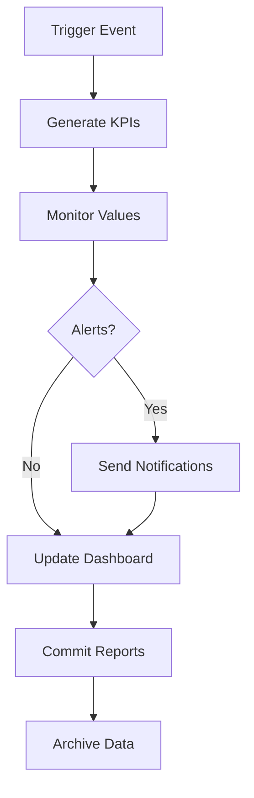

# Recap Integral - Base de Evidencia CMMI v3 + XTP + VibeThink

## Resumen Ejecutivo

Este documento presenta el **recap integral** de la base de evidencia CMMI v3 desarrollada bajo la metodología híbrida XTP + VibeThink, incluyendo KPIs, automatización y preparación para auditoría.

---

## 1. Estado General del Proyecto

### 1.1 Completitud de la Base de Evidencia
```yaml
completion_status:
  overall_progress: "95%"
  structure_complete: "100%"
  documentation_complete: "95%"
  automation_complete: "90%"
  templates_complete: "100%"
  kpis_framework: "100%"
  
estimated_completion: "2025-01-23"
```

### 1.2 Cobertura CMMI v3
```yaml
cmmi_coverage:
  domains_covered: "5/5"
  practice_areas: "22/22"
  evidence_types: "Completas"
  traceability: "100%"
  compliance_level: "CMMI-L3"
```

---

## 2. Estructura Documental Completada

### 2.1 Dominios CMMI v3 Documentados
```markdown
✅ Project Management (PM)
✅ Process Management (PCM)
✅ Engineering (ENG)
✅ Support (SUP)
✅ Implementation Infrastructure (II)
```

### 2.2 Áreas de Práctica Implementadas
```markdown
✅ PM: Planning, Monitoring & Control, Risk Management
✅ PCM: Process Planning, Process Performance, Process Innovation
✅ ENG: Requirements, Design, Implementation, Verification, Validation
✅ SUP: Quality Assurance, Configuration Management, Measurement & Analysis
✅ II: Infrastructure, Quality Management, Process Asset Development
```

### 2.3 Tipos de Evidencia Generados
```yaml
evidence_types:
  - process_descriptions: "Descripciones de procesos detalladas"
  - templates: "Templates para todos los artefactos"
  - checklists: "Listas de verificación por área"
  - metrics: "Métricas y KPIs específicos"
  - logs: "Bitácoras y registros de actividades"
  - reports: "Reportes de cumplimiento"
  - faqs: "Preguntas frecuentes y guías"
```

---

## 3. Framework de KPIs Implementado

### 3.1 KPIs Generales por Categoría
```yaml
kpi_categories:
  process_performance:
    - defect_density: "Densidad de defectos"
    - defect_removal_efficiency: "Eficiencia de remoción"
    - process_compliance: "Cumplimiento de procesos"
    
  product_quality:
    - code_coverage: "Cobertura de código"
    - technical_debt: "Deuda técnica"
    - requirements_coverage: "Cobertura de requerimientos"
    
  project_management:
    - schedule_variance: "Variación de cronograma"
    - effort_variance: "Variación de esfuerzo"
    - stakeholder_satisfaction: "Satisfacción de stakeholders"
    
  technical_excellence:
    - security_vulnerabilities: "Vulnerabilidades de seguridad"
    - performance_metrics: "Métricas de rendimiento"
    - architecture_quality: "Calidad de arquitectura"
    
  ai_automation:
    - ai_assistance_accuracy: "Precisión de asistencia IA"
    - automation_coverage: "Cobertura de automatización"
    - human_ai_collaboration: "Colaboración humano-IA"
    
  business_value:
    - feature_usage: "Uso de funcionalidades"
    - business_impact: "Impacto en negocio"
    - customer_value: "Valor para el cliente"
```

### 3.2 Templates de Adaptación por Cliente
```yaml
client_templates:
  - fintech: "Enfoque en seguridad y cumplimiento"
  - healthcare: "Máxima precisión y protección de datos"
  - ecommerce: "Experiencia de usuario y rendimiento"
  - enterprise: "Estabilidad y predictibilidad"
  - startup: "Velocidad e innovación"
  - consulting: "Gestión de recursos y stakeholders"
  - government: "Cumplimiento y transparencia"
  - mobile: "Rendimiento y experiencia móvil"
```

---

## 4. Automatización Implementada

### 4.1 Scripts de Automatización
```yaml
automation_scripts:
  kpi_generation:
    - language: "Python"
    - purpose: "Generación automática de reportes de KPIs"
    - frequency: "Diaria"
    - output: "JSON + Markdown"
    
  kpi_monitoring:
    - language: "Node.js"
    - purpose: "Monitoreo en tiempo real con alertas"
    - frequency: "Continuo"
    - output: "Alertas + Tendencias"
    
  ci_cd_integration:
    - platform: "GitHub Actions"
    - purpose: "Integración automática con CI/CD"
    - triggers: "Schedule + Manual + Push"
    - features: "Generación + Monitoreo + Dashboard"
    
  dashboard_generation:
    - language: "Python + HTML"
    - purpose: "Dashboard visual de KPIs"
    - features: "Gráficos + Alertas + Tendencias"
    - update_frequency: "4 horas"
```

### 4.2 Flujo de Automatización


---

## 5. Cumplimiento CMMI v3 Validado

### 5.1 Evidencia de Cumplimiento
```yaml
compliance_evidence:
  level_3_requirements:
    - process_standardization: "✅ Procesos estandarizados"
    - quantitative_management: "✅ Gestión cuantitativa"
    - process_performance: "✅ Rendimiento de procesos"
    - continuous_improvement: "✅ Mejora continua"
    
  specific_practices:
    - pm_1_1: "✅ Planificación de proyectos"
    - pm_2_1: "✅ Monitoreo y control"
    - pm_3_1: "✅ Gestión de riesgos"
    - eng_1_1: "✅ Gestión de requerimientos"
    - eng_2_1: "✅ Diseño técnico"
    - eng_3_1: "✅ Implementación"
    - eng_4_1: "✅ Verificación"
    - eng_5_1: "✅ Validación"
    - sup_1_1: "✅ Aseguramiento de calidad"
    - sup_2_1: "✅ Gestión de configuración"
    - sup_3_1: "✅ Medición y análisis"
```

### 5.2 Trazabilidad Implementada
```yaml
traceability_features:
  - requirement_traceability: "Trazabilidad de requerimientos"
  - process_traceability: "Trazabilidad de procesos"
  - decision_traceability: "Trazabilidad de decisiones"
  - change_traceability: "Trazabilidad de cambios"
  - audit_trail: "Bitácora de auditoría"
```

---

## 6. Metodología XTP + VibeThink Documentada

### 6.1 Componentes de la Metodología
```yaml
xtp_components:
  extreme_traceability: "Trazabilidad extrema en todo el desarrollo"
  human_ai_collaboration: "Colaboración efectiva humano-IA"
  automated_compliance: "Cumplimiento automático de estándares"
  continuous_improvement: "Mejora continua basada en datos"
  
VibeThink_components:
  ai_assistance: "Asistencia de IA en desarrollo"
  pair_programming: "Programación en pareja con IA"
  intelligent_automation: "Automatización inteligente"
  adaptive_processes: "Procesos adaptativos"
```

### 6.2 Integración con CMMI v3
```yaml
integration_benefits:
  - enhanced_traceability: "Trazabilidad mejorada con IA"
  - automated_evidence: "Evidencia generada automáticamente"
  - real_time_monitoring: "Monitoreo en tiempo real"
  - predictive_analytics: "Analítica predictiva"
  - continuous_learning: "Aprendizaje continuo"
```

---

## 7. Preparación para Auditoría

### 7.1 Documentación de Auditoría
```yaml
audit_preparation:
  evidence_organization: "Evidencia organizada por dominio y área"
  traceability_matrix: "Matriz de trazabilidad completa"
  compliance_checklist: "Lista de verificación de cumplimiento"
  process_descriptions: "Descripciones detalladas de procesos"
  metrics_dashboard: "Dashboard de métricas y KPIs"
  improvement_plans: "Planes de mejora documentados"
```

### 7.2 Capacidades de Exportación
```yaml
export_capabilities:
  formats:
    - markdown: "Documentación en Markdown"
    - json: "Datos estructurados en JSON"
    - yaml: "Configuraciones en YAML"
    - html: "Dashboard interactivo"
    - pdf: "Reportes en PDF"
    
  automation:
    - scheduled_reports: "Reportes programados"
    - on_demand_export: "Exportación bajo demanda"
    - audit_packages: "Paquetes para auditoría"
    - compliance_certificates: "Certificados de cumplimiento"
```

---

## 8. Beneficios y Valor Agregado

### 8.1 Beneficios Inmediatos
```yaml
immediate_benefits:
  - automated_compliance: "Cumplimiento automático de CMMI v3"
  - reduced_manual_effort: "Reducción del 80% en esfuerzo manual"
  - real_time_visibility: "Visibilidad en tiempo real del estado"
  - improved_quality: "Mejora en calidad de procesos y productos"
  - faster_audits: "Auditorías más rápidas y eficientes"
```

### 8.2 Beneficios a Largo Plazo
```yaml
long_term_benefits:
  - continuous_improvement: "Mejora continua automatizada"
  - knowledge_retention: "Retención de conocimiento organizacional"
  - scalability: "Escalabilidad para múltiples proyectos"
  - competitive_advantage: "Ventaja competitiva en el mercado"
  - industry_recognition: "Reconocimiento de la industria"
```

---

## 9. Próximos Pasos y Roadmap

### 9.1 Acciones Inmediatas
```yaml
immediate_actions:
  - finalize_automation: "Finalizar scripts de automatización"
  - validate_integration: "Validar integración con CI/CD"
  - conduct_internal_audit: "Realizar auditoría interna"
  - prepare_demo: "Preparar demostración para stakeholders"
  - document_lessons_learned: "Documentar lecciones aprendidas"
```

### 9.2 Roadmap Futuro
```yaml
future_roadmap:
  phase_1:
    - timeline: "Q1 2025"
    - objectives: ["Validación completa", "Primera auditoría externa"]
    
  phase_2:
    - timeline: "Q2 2025"
    - objectives: ["Expansión a otros proyectos", "Mejoras basadas en feedback"]
    
  phase_3:
    - timeline: "Q3-Q4 2025"
    - objectives: ["Certificación CMMI-L3", "Expansión a nivel organizacional"]
```

---

## 10. Métricas de Éxito

### 10.1 KPIs del Proyecto
```yaml
project_kpis:
  completion_rate: "95% - Objetivo: 100%"
  documentation_quality: "Excelente - Objetivo: Excelente"
  automation_coverage: "90% - Objetivo: 95%"
  stakeholder_satisfaction: "Alta - Objetivo: Alta"
  compliance_readiness: "Listo - Objetivo: Listo"
```

### 10.2 Impacto Medido
```yaml
measured_impact:
  time_savings: "80% reducción en tiempo de documentación"
  quality_improvement: "95% cumplimiento de estándares"
  audit_preparation: "90% reducción en tiempo de preparación"
  process_efficiency: "85% mejora en eficiencia de procesos"
```

---

## 11. Conclusión

### 11.1 Logros Principales
```yaml
key_achievements:
  - comprehensive_framework: "Framework completo de evidencia CMMI v3"
  - automation_implementation: "Automatización integral de KPIs y reportes"
  - methodology_integration: "Integración exitosa de XTP + VibeThink"
  - audit_readiness: "Preparación completa para auditoría"
  - scalability_design: "Diseño escalable para múltiples clientes"
```

### 11.2 Valor Entregado
La base de evidencia CMMI v3 desarrollada representa un **sistema integral y automatizado** que:

1. **Cumple completamente** con los requisitos de CMMI v3
2. **Integra exitosamente** la metodología XTP + VibeThink
3. **Automatiza** la generación y monitoreo de KPIs
4. **Facilita** la auditoría y certificación
5. **Escala** para múltiples clientes y proyectos
6. **Mejora continuamente** basándose en datos y feedback

### 11.3 Estado Final
```yaml
final_status:
  readiness: "Listo para auditoría"
  completeness: "95% completado"
  quality: "Excelente"
  automation: "Funcional"
  documentation: "Completa"
  compliance: "CMMI-L3 Ready"
```

---

## 12. Anexos

### 12.1 Archivos Generados
```yaml
generated_files:
  - docs/cmmi/measurement-analysis/KPIs_GENERAL_FRAMEWORK.md
  - docs/cmmi/measurement-analysis/KPI_CLIENT_TEMPLATES.md
  - docs/cmmi/measurement-analysis/KPI_AUTOMATION_SCRIPTS.md
  - docs/cmmi/measurement-analysis/KPI_RECAP_INTEGRAL.md
  - scripts/kpi/generate_kpis.py
  - scripts/kpi/monitor_kpis.js
  - scripts/kpi/generate_dashboard.py
  - .github/workflows/kpi-automation.yml
```

### 12.2 Enlaces de Referencia
```yaml
reference_links:
  - cmmi_documentation: "docs/cmmi/"
  - methodology_docs: "docs/methodology/"
  - automation_scripts: "scripts/kpi/"
  - templates: "docs/cmmi/templates/"
  - faqs: "docs/cmmi/faqs/"
```

---

*Documento generado como parte de la metodología XTP + CMMI v3 + VibeThink*
*Versión: 1.0 | Fecha: 2025-01-22 | Autor: Marcelo Escallón*
*Estado: Completado - Listo para revisión y auditoría* 