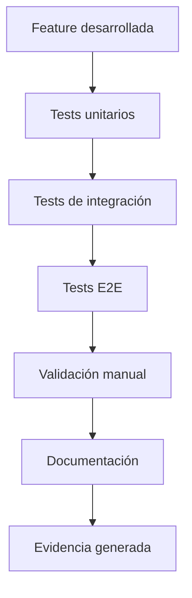

# 🧪 Procesos de QA y Soporte

---

## Flujo de Trabajo de QA

### 1. Testing de Nuevas Features


### 2. Checklist de Validación
- [ ] **Funcionalidad:** Feature funciona según especificaciones
- [ ] **Usabilidad:** UX es intuitiva y accesible
- [ ] **Performance:** Tiempos de respuesta aceptables
- [ ] **Seguridad:** No vulnerabilidades identificadas
- [ ] **Compatibilidad:** Funciona en navegadores objetivo
- [ ] **Documentación:** Actualizada y completa

### 3. Proceso de Bug Report
```typescript
interface BugReport {
  id: string;
  title: string;
  description: string;
  severity: 'low' | 'medium' | 'high' | 'critical';
  steps: string[];
  expected: string;
  actual: string;
  environment: string;
  reporter: string;
  date: Date;
}
```

---

## Procesos de Soporte

### 1. Niveles de Soporte
- **Nivel 1:** Soporte básico (FAQ, guías)
- **Nivel 2:** Soporte técnico (configuración, troubleshooting)
- **Nivel 3:** Soporte avanzado (desarrollo, integración)

### 2. SLA de Respuesta
| Severidad | Tiempo de Respuesta | Tiempo de Resolución |
|-----------|-------------------|---------------------|
| Crítica | 1 hora | 4 horas |
| Alta | 4 horas | 24 horas |
| Media | 24 horas | 72 horas |
| Baja | 72 horas | 1 semana |

### 3. Procedimiento de Escalación
1. **Identificación:** Issue identificado por soporte
2. **Análisis:** Análisis inicial y clasificación
3. **Escalación:** Si requiere nivel superior
4. **Resolución:** Implementación de solución
5. **Validación:** Confirmación de resolución
6. **Documentación:** Actualización de base de conocimiento

---

## Métricas de Calidad

### QA Metrics
- **Defectos por release:** <5 defectos críticos
- **Tiempo de validación:** <2 días por feature
- **Cobertura de tests:** >90%
- **Tasa de regresión:** <2%

### Soporte Metrics
- **Tiempo de respuesta promedio:** <4 horas
- **Tiempo de resolución promedio:** <24 horas
- **Satisfacción del cliente:** >4.5/5
- **Tasa de resolución en primer contacto:** >80%

---

## Herramientas y Automatización

### Testing Automatizado
- **Postman/Newman:** Tests de API
- **Playwright:** Tests E2E
- **Jest:** Tests unitarios
- **CI/CD:** Ejecución automática

### Monitoreo
- **Error tracking:** Sentry
- **Performance:** Lighthouse
- **Uptime:** Pingdom
- **Logs:** Centralizados

---

## Base de Conocimiento

### Artículos Técnicos
- [Guía de troubleshooting común](../../troubleshooting/common-issues.md)
- [Procedimientos de backup](../../operations/backup-procedures.md)
- [Guía de configuración](../../setup/configuration-guide.md)

### FAQs
- [Preguntas frecuentes de usuarios](../../user/faqs.md)
- [Preguntas frecuentes técnicas](../../development/technical-faqs.md) 