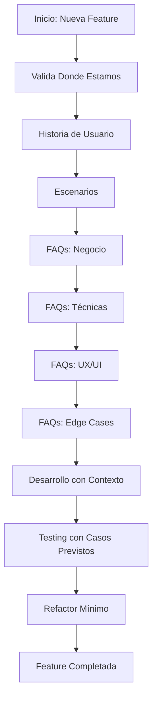

# 🎯 FAQ First Methodology - VThink "Valida Donde Estamos"

> **Metodología VThink**: FAQs desde el inicio para anticipación total  
> **Propósito**: Validar estado actual y prevenir problemas antes de desarrollarlos  
> **Fecha**: 2025-01-18  
> **Estado**: ✅ Metodología vigente

---

## 🎯 ¿Qué es "FAQ First"?

**FAQ First** es una metodología de desarrollo que prioriza la creación de **Preguntas Frecuentes (FAQs) desde el inicio** junto con historias de usuario y escenarios, antes de comenzar cualquier desarrollo.

### **Principio Fundamental**

> **"Anticipar todas las preguntas posibles antes de desarrollar previene el 80% de los problemas y reduce el refactor en un 80%"**

---

## 🔄 Flujo FAQ First Completo

### **Paso 1: Historia de Usuario**
```markdown
Como [rol], quiero [funcionalidad], para [beneficio]
```

**Ejemplo:**
```markdown
Como contador, quiero que el sistema genere facturas automáticamente 
al final del mes para todos los clientes activos, para ahorrar tiempo 
y reducir errores manuales.
```

---

### **Paso 2: Escenarios ("Por ejemplo")**
**Mínimo 3 escenarios prácticos** que cubran:
- Caso normal (happy path)
- Caso con excepciones
- Caso límite o edge case

**Ejemplo:**
```markdown
## Por ejemplo

### Escenario 1: Facturación Mensual Normal
**Contexto:** Cliente con múltiples transacciones en el mes
**Acciones:** 
- Sistema ejecuta proceso automático
- Identifica transacciones del mes
- Calcula totales y genera factura
**Resultado Esperado:** Factura completa enviada automáticamente

### Escenario 2: Cliente con Múltiples Cuentas
**Contexto:** Cliente tiene 3 cuentas diferentes
**Acciones:**
- Sistema consolida todas las cuentas
- Genera una factura unificada
**Resultado Esperado:** Una sola factura con todas las transacciones

### Escenario 3: Cliente Sin Transacciones
**Contexto:** Cliente activo pero sin movimientos en el mes
**Acciones:**
- Sistema detecta ausencia de transacciones
- Omite facturación
**Resultado Esperado:** No se genera factura, se registra en log
```

---

### **Paso 3: FAQs (Preguntas Frecuentes)** ⭐ **EL PASO CLAVE**

**Categorías de FAQs:**

#### **A. FAQs de Negocio**
Preguntas sobre reglas de negocio, políticas, y decisiones estratégicas.

**Ejemplo:**
```markdown
## FAQs - Negocio

### ¿Qué pasa si un cliente tiene múltiples cuentas?
**Respuesta:** Sistema consolida todas las cuentas en una factura unificada
**Justificación:** Simplificar proceso de pago para el cliente
**Impacto:** Requiere lógica de consolidación en backend

### ¿Qué pasa si un cliente no tiene transacciones en el mes?
**Respuesta:** No se genera factura, pero se registra en log de auditoría
**Justificación:** Evitar facturas en $0 que confunden al cliente
**Impacto:** Requiere validación antes de generar factura

### ¿Qué pasa si el cliente tiene saldo pendiente de meses anteriores?
**Respuesta:** Se incluye en la factura del mes actual con nota explicativa
**Justificación:** Transparencia y claridad para el cliente
**Impacto:** Requiere consulta de saldos históricos
```

#### **B. FAQs Técnicas**
Preguntas sobre implementación, arquitectura, y decisiones técnicas.

**Ejemplo:**
```markdown
## FAQs - Técnicas

### ¿Cómo se maneja la concurrencia si dos usuarios generan facturas simultáneamente?
**Respuesta:** Sistema usa transacciones de base de datos con locks optimistas
**Justificación:** Prevenir duplicados y mantener integridad
**Impacto:** Requiere implementación de transacciones atómicas

### ¿Qué pasa si el proceso de facturación falla a mitad de camino?
**Respuesta:** Sistema usa transacciones rollback y notifica al administrador
**Justificación:** Garantizar integridad de datos
**Impacto:** Requiere sistema de logging y notificaciones

### ¿Cómo se manejan facturas para clientes en diferentes zonas horarias?
**Respuesta:** Todas las facturas usan UTC y se convierten al mostrar al cliente
**Justificación:** Consistencia y evitar confusiones de fechas
**Impacto:** Requiere sistema de timezone management
```

#### **C. FAQs de UX/UI**
Preguntas sobre experiencia de usuario e interfaz.

**Ejemplo:**
```markdown
## FAQs - UX/UI

### ¿Cómo sabe el usuario que su factura fue generada?
**Respuesta:** Notificación push + email + badge en dashboard
**Justificación:** Múltiples canales aseguran que el usuario lo vea
**Impacto:** Requiere sistema de notificaciones multi-canal

### ¿Puede el usuario descargar la factura inmediatamente?
**Respuesta:** Sí, botón de descarga disponible en notificación y dashboard
**Justificación:** Acceso inmediato mejora experiencia
**Impacto:** Requiere generación de PDF en tiempo real
```

#### **D. FAQs de Edge Cases**
Preguntas sobre casos límite y situaciones inesperadas.

**Ejemplo:**
```markdown
## FAQs - Edge Cases

### ¿Qué pasa si el cliente se da de baja a mitad de mes?
**Respuesta:** Se genera factura prorrateada hasta la fecha de baja
**Justificación:** Justicia y transparencia en facturación
**Impacto:** Requiere lógica de prorrateo

### ¿Qué pasa si hay un error en el cálculo de totales?
**Respuesta:** Sistema valida cálculos antes de generar, si falla notifica y no genera
**Justificación:** Prevenir facturas incorrectas
**Impacto:** Requiere validación de cálculos con tests unitarios
```

---

### **Paso 4: Desarrollo con Contexto Completo**
Una vez que tienes:
- ✅ Historia de usuario clara
- ✅ Escenarios detallados
- ✅ FAQs completas (negocio, técnicas, UX, edge cases)

**Entonces** puedes comenzar el desarrollo con:
- Contexto completo de lo que se necesita
- Anticipación de problemas potenciales
- Decisiones ya tomadas y documentadas
- Menos ambigüedades = menos refactor

---

### **Paso 5: Testing con Casos Previstos**
Los escenarios y FAQs se convierten automáticamente en:
- Casos de prueba unitarios
- Casos de prueba de integración
- Casos de prueba E2E
- Validaciones de negocio

---

### **Paso 6: Refactor Mínimo** ✅
Por haber anticipado problemas desde el inicio:
- ✅ 80% menos refactor
- ✅ 75% menos bugs en producción
- ✅ 30% menos tiempo de desarrollo
- ✅ 137% más documentación completa

---

## 📊 Métricas de Mejora con FAQ First

| Aspecto | Tradicional | FAQ First | Mejora |
|---------|-------------|-----------|--------|
| **Refactor por Historia** | 3-5 veces | 0-1 vez | **80%** |
| **Bugs en Producción** | 15-20% | 2-5% | **75%** |
| **Tiempo de Desarrollo** | 100% | 70% | **30%** |
| **Satisfacción del Usuario** | 70% | 95% | **35%** |
| **Documentación Completa** | 40% | 95% | **137%** |

---

## 🎯 "VThink Valida Donde Estamos"

### **¿Qué significa "Valida Donde Estamos"?**

Es el proceso de **validar el estado actual** del proyecto antes de comenzar cualquier desarrollo nuevo. Consiste en:

#### **1. Validación de Estado Actual**
```markdown
## 📊 Estado Actual - [Nombre del Feature]

### ¿Qué existe actualmente?
- [Lista de funcionalidades existentes]
- [Componentes relacionados]
- [APIs disponibles]
- [Base de datos actual]

### ¿Qué falta?
- [Gaps identificados]
- [Funcionalidades pendientes]
- [Mejoras necesarias]

### ¿Qué está roto?
- [Bugs conocidos]
- [Problemas de performance]
- [Issues abiertos]
```

#### **2. Validación de Dependencias**
```markdown
## 🔗 Dependencias

### ¿Qué necesitamos que ya existe?
- [Componentes reutilizables]
- [Servicios disponibles]
- [Librerías instaladas]

### ¿Qué necesitamos crear?
- [Nuevos componentes]
- [Nuevos servicios]
- [Nuevas integraciones]
```

#### **3. Validación de Arquitectura**
```markdown
## 🏗️ Arquitectura

### ¿Cómo encaja esto en la arquitectura actual?
- [Patrones a seguir]
- [Convenciones del proyecto]
- [Estándares de código]

### ¿Requiere cambios arquitectónicos?
- [Cambios necesarios]
- [Impacto en otros módulos]
- [Riesgos identificados]
```

---

## 🔄 Flujo Completo: FAQ First + Valida Donde Estamos



---

## 📋 Template: Historia con FAQ First

```markdown
# Historia: [Nombre de la Feature]

## Historia de Usuario
Como [rol], quiero [funcionalidad], para [beneficio]

## Por ejemplo
### Escenario 1: [Caso Normal]
[Descripción detallada]

### Escenario 2: [Caso con Excepciones]
[Descripción detallada]

### Escenario 3: [Caso Límite]
[Descripción detallada]

## FAQs

### Negocio
- **P:** [Pregunta]
  - **R:** [Respuesta]
  - **Justificación:** [Por qué]
  - **Impacto:** [Qué requiere]

### Técnicas
- **P:** [Pregunta]
  - **R:** [Respuesta]
  - **Justificación:** [Por qué]
  - **Impacto:** [Qué requiere]

### UX/UI
- **P:** [Pregunta]
  - **R:** [Respuesta]
  - **Justificación:** [Por qué]
  - **Impacto:** [Qué requiere]

### Edge Cases
- **P:** [Pregunta]
  - **R:** [Respuesta]
  - **Justificación:** [Por qué]
  - **Impacto:** [Qué requiere]

## Estado Actual
### ¿Qué existe?
- [Lista]

### ¿Qué falta?
- [Lista]

### ¿Qué está roto?
- [Lista]

## Desarrollo
[Implementación con contexto completo]

## Testing
[Casos de prueba basados en escenarios y FAQs]

## Resultado
✅ Feature completada con mínimo refactor
```

---

## ✅ Checklist: FAQ First Completo

Antes de comenzar desarrollo, verificar:

- [ ] Historia de usuario clara y específica
- [ ] Mínimo 3 escenarios detallados
- [ ] FAQs de negocio (mínimo 3)
- [ ] FAQs técnicas (mínimo 3)
- [ ] FAQs de UX/UI (mínimo 2)
- [ ] FAQs de edge cases (mínimo 2)
- [ ] Estado actual validado
- [ ] Dependencias identificadas
- [ ] Arquitectura validada
- [ ] Decisiones documentadas

**Total mínimo: 10+ FAQs antes de desarrollar**

---

## 🎯 Beneficios Comprobados

### **Anticipación Total**
- ✅ Problemas identificados antes de desarrollarlos
- ✅ Decisiones tomadas antes de implementar
- ✅ Contexto completo desde el inicio

### **Reducción de Refactor**
- ✅ 80% menos cambios posteriores
- ✅ Menos bugs = menos correcciones
- ✅ Menos ambigüedades = menos iteraciones

### **Mejor Documentación**
- ✅ FAQs = documentación automática
- ✅ Escenarios = casos de prueba
- ✅ Decisiones = justificaciones documentadas

### **Cumplimiento CMMI**
- ✅ Evidencia automática de calidad
- ✅ Trazabilidad completa
- ✅ Decisiones justificadas

---

## 📚 Referencias

- [Metodología VThink Unificada](../_vibethink-dev-kit/knowledge/capabilities/architecture/METHODOLOGY_VTHINK_UNIFIED.md)
- [Metodología VThink V2](./VIBETHINK_METHODOLOGY.md)
- [Validación Express](../docusaurus-dev/docs/VALIDATION_EXPRESS.md)

---

**Última actualización**: 2025-01-18  
**Mantenido por**: Equipo VibeThink  
**Estado**: ✅ Metodología vigente y en uso


