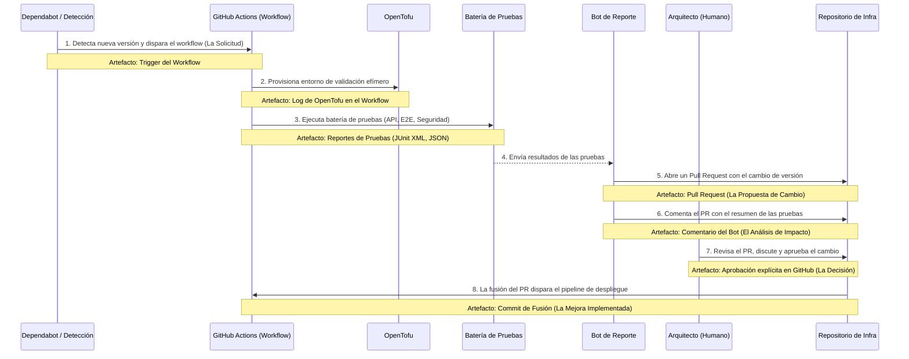

# Proceso Automatizado de Validación de Dependencias (El "Guardián")

**Fecha:** 2024-06-20

**Estado:** **APROBADO - Proceso Operativo**

**Propósito:** Este documento describe el proceso automatizado y auditable para la gestión de actualizaciones de componentes de software de código abierto. El objetivo es cumplir con los requisitos de madurez de procesos (como CMMI) generando evidencia como un subproducto natural del flujo de trabajo, sin crear una carga administrativa.

---

## 1. Filosofía: La Evidencia como Subproducto

El proceso está diseñado para que cada etapa genere un **artefacto digital inmutable y rastreable**. La auditoría no se basa en documentos manuales, sino en la revisión de la cadena de artefactos generados por la automatización y las decisiones humanas registradas en el sistema.

## 2. El Flujo de Gestión del Cambio y sus Artefactos Auditables

---

## 3. Desglose de Artefactos para Auditoría CMMI

Este es el núcleo de cómo respondemos a un auditor.

### Nivel de Madurez 2-3: Proceso Definido y Gestionado

**Auditor:** "Muéstrenme su proceso definido para gestionar una actualización de una dependencia crítica, como un parche de seguridad en su sistema de autenticación."

**Nuestra Respuesta:** "Nuestro proceso está definido en el documento `AUTOMATED_DEPENDENCY_VALIDATION_PROCESS.md`. Ahora, permítame mostrarle una ejecución real de ese proceso."

**Auditor:** "Ok, muéstrenme el registro para la actualización de `fusionauth` a la versión `1.50.1`."

**Nosotros mostramos (con enlaces directos):**

1.  **La Solicitud (El "Porqué"):**
    *   "Aquí está el Pull Request #123 que abrió Dependabot, indicando una vulnerabilidad de seguridad en la versión anterior. Esta es nuestra solicitud de cambio registrada."

2.  **La Ejecución del Proceso (La "Prueba de Trabajo"):**
    *   "Al abrirse ese PR, se disparó automáticamente nuestro workflow del 'Guardián'. Aquí está el enlace a la ejecución del workflow #456 en GitHub Actions, donde puede ver cada paso que se ejecutó, con sus logs y tiempos."

3.  **El Análisis de Impacto (La "Evaluación"):**
    *   "Como parte de la ejecución, se generaron estos artefactos: el reporte de vulnerabilidades de Trivy y los resultados de las pruebas de regresión. Están adjuntos a la ejecución del workflow. Además, nuestro bot resumió estos hallazgos en este comentario dentro del mismo Pull Request #123 para una fácil revisión."

4.  **La Aprobación (La "Decisión Documentada"):**
    *   "Como puede ver en la conversación del PR, el arquitecto líder revisó el informe del bot, confirmó que el parche no introducía regresiones y dio su aprobación formal haciendo clic en el botón 'Approve'. Esta es nuestra aprobación registrada e inmutable."

5.  **La Implementación de la Mejora (El "Cierre del Ciclo"):**
    *   "Una vez aprobado, el PR fue fusionado en este commit `[hash]`. Este commit es la prueba de que la mejora fue integrada en nuestra base de código."

6.  **La Verificación del Despliegue:**
    *   "Finalmente, ese commit de fusión disparó nuestro pipeline de despliegue principal (enlace al workflow #457), que llevó la nueva versión segura a producción. Como puede ver, todos los pasos posteriores de health-check fueron exitosos."

### Conclusión para el Auditor

Hemos demostrado un proceso **repetible, gestionado, medible y rastreable** de principio a fin, donde cada etapa clave está documentada con evidencia digital generada por el propio sistema. Cumplimos con los principios de CMMI sin haber rellenado un solo documento manualmente. Nuestra plataforma está diseñada para la **mejora continua**, y aquí tiene la prueba. 