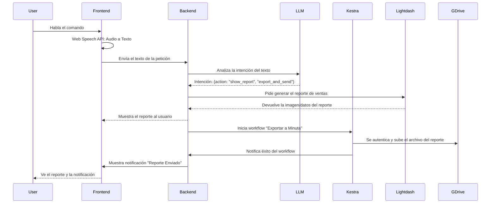

# Presentación de Arquitectura: AI Pair Orchestrator Pro

**Para:** Comité de Arquitectura, Equipo de Desarrollo y Líderes Técnicos  
**Fecha:** 2024-06-20  
**Estado:** **VISIÓN APROBADA**

---

## 1. Visión Estratégica: Más Allá de un SaaS

No estamos construyendo un conjunto de aplicaciones; estamos construyendo una **Plataforma de Orquestación de Negocios Inteligente y Unificada**. Nuestra misión es proporcionar a las empresas una única fuente de verdad y un motor de automatización que conecte todos sus departamentos (Ventas, Marketing, Soporte, etc.) en un ecosistema coherente.

El valor para el cliente no reside en una característica individual, sino en el **efecto de red** que se crea al unificar sus datos y flujos de trabajo.

---

## 2. Principios Fundamentales de la Arquitectura

Nuestras decisiones técnicas se rigen por tres principios inquebrantables:

1.  **Desacoplamiento Radical:** La agilidad del desarrollo es nuestra máxima prioridad. La complejidad del backend NUNCA debe ser un obstáculo para la velocidad del frontend. Los equipos deben poder trabajar en paralelo e de forma independiente.
2.  **Construir la Experiencia, Adoptar el Motor:** Construimos y poseemos la experiencia de usuario (la UI/UX que nos diferencia). Adoptamos y nos apoyamos en motores open source de clase mundial para las tareas pesadas (orquestación, BI, CDP), ahorrándonos años de desarrollo.
3.  **Infraestructura Evolutiva y Agnóstica:** La infraestructura debe adaptarse al estado del negocio, no al revés. Empezamos de forma simple y de bajo costo, con un camino claro hacia la escala masiva. Utilizamos herramientas estándar y agnósticas a la nube para evitar el "vendor lock-in".

---

## 3. El Ecosistema Tecnológico

Cada componente ha sido seleccionado para cumplir una función específica dentro de este ecosistema.

```mermaid
graph TD
    subgraph "Capa de Experiencia de Usuario (Lo que construimos)"
        A[React + TypeScript]
        B[shadcn/ui + Tailwind]
        C[React Flow (Diseñador de Flujos)]
    end

    subgraph "Capa de Aplicación y Lógica (Nuestro Backend)"
        D[Supabase (PostgreSQL, Auth, RLS)]
        E[Funciones Edge (Lógica de Negocio Ligera)]
        F[Conectores de IA Propios (OpenRouter)]
    end

    subgraph "Motores Open Source (Lo que adoptamos)"
        G[Tracardi (Customer Data Platform)]
        H[Kestra (Motor de Orquestación de Flujos)]
        I[Lightdash + dbt (Business Intelligence)]
        J[Postiz (Social Media Marketing)]
        K[Cal.com (Core de Agendamiento)]
    end

    subgraph "Capa de Infraestructura (Cómo lo desplegamos)"
        L[OpenTofu (Infraestructura como Código)]
        M[Docker (Contenedores)]
        N[GitHub Actions (CI/CD)]
    end

    A --> D;
    C --> H;
    F --> D;
    G --> D;
    H --> F;
    I --> D;
    J --> H;
    K --> H;
    L --> M;
    N --> L;
end
```

### Justificación de Componentes Clave:
*   **React Flow (UI) + Kestra (Motor):** Nos permite crear una experiencia de diseño de flujos a medida, inspirada en Attio, sin tener que construir el complejo motor de ejecución.
*   **Lightdash + dbt:** Es el estándar de oro del BI moderno. `dbt` asegura que nuestras métricas sean consistentes (una única fuente de verdad para "Ingresos"), y `Lightdash` permite a los usuarios explorar esos datos de forma segura.
*   **Tracardi:** Actúa como nuestro "cerebro" central, unificando los perfiles de cliente de todas las fuentes en una única vista de 360 grados.

---

## 4. Estrategia de Infraestructura: De 0 a 1 Millón de Usuarios

Nuestra estrategia de infraestructura es pragmática y está diseñada para crecer.

### **Decisión Clave: OpenTofu sobre Terraform**
Hemos elegido explícitamente **OpenTofu** como nuestra herramienta de Infraestructura como Código (IaC).
*   **Razón:** OpenTofu es un fork de Terraform gestionado por la Fundación Linux, con una licencia completamente open source (Apache 2.0). Esta decisión nos protege de futuros cambios de licencia restrictivos (como el que realizó HashiCorp con Terraform a BSL) y nos asegura que nuestra base de infraestructura permanecerá siempre abierta y libre de riesgos comerciales. Es una decisión estratégica para la sostenibilidad a largo plazo.

### Fases de Despliegue:
1.  **Fase 1 (Primeros 1-100 Clientes): Docker Compose + Portainer**
    *   **Objetivo:** Máxima velocidad de iteración, mínimo costo y complejidad.
    *   **Setup:** Un único servidor virtual (VPS) gestionado por Portainer, donde cada servicio (Kestra, Tracardi, etc.) corre como un contenedor Docker definido en un archivo `docker-compose.yml`.
    *   **Gestionado por:** OpenTofu se usa para provisionar el VPS y configurar la red inicial.

2.  **Fase 2 (Crecimiento y Escala): Kubernetes Administrado (EKS, GKE, AKS)**
    *   **Objetivo:** Alta disponibilidad, escalabilidad horizontal y despliegues sin tiempo de inactividad.
    *   **Migración:** Como todos nuestros servicios ya están contenedorizados (Docker), la migración a Kubernetes es un paso natural. OpenTofu se encargará de destruir la infraestructura de Fase 1 y levantar el clúster de Kubernetes, re-desplegando los mismos contenedores con manifiestos de Kubernetes.

---

## 5. La Experiencia del Desarrollador: Agilidad Desacoplada

**Este es el concepto más importante para el equipo de desarrollo.**

Un desarrollador del frontend NO necesita instalar Kubernetes, Kestra, Tracardi, dbt, Postiz y cinco bases de datos en su laptop para cambiar un color de botón.

### El Flujo de Desarrollo Local
```mermaid
graph TD
    subgraph "Laptop del Desarrollador (Entorno Ligero)"
        Dev[💻 Desarrollador]
        IDE[VS Code]
        NodeJS[Node.js]
        WebApp[⚛️ Aplicación React]
        MockServer[🤖 Servidor Mock (Express.js)]
        
        Dev --> IDE;
        IDE -- ejecuta --> WebApp;
        WebApp -- Petición API --> MockServer;
        MockServer -- Respuesta Falsa --> WebApp;
    end

    subgraph "Infraestructura de Producción (Invisible para el Dev)"
        APIGateway[🚪 API Gateway]
        KestraEngine[🌊 Motor Kestra]
        TracardiEngine[🧠 Motor Tracardi]
        LightdashEngine[📊 Motor BI]
        
        APIGateway --> KestraEngine
        APIGateway --> TracardiEngine
        APIGateway --> LightdashEngine
    end

    style MockServer fill:#f9f,stroke:#333,stroke-width:2px
```
*   **El Principio:** Durante el desarrollo, la aplicación React se configura para enviar todas sus peticiones de backend a un **servidor Mock local**.
*   **Ejemplo:** Un desarrollador trabaja en la UI del diseñador de flujos (`React Flow`). Hace clic en "Ejecutar Flujo".
    *   **En Local:** La app envía el JSON del flujo al `localhost:8080/api/v1/workflows`. El servidor Mock responde inmediatamente `{"status": "mock_success"}`. El desarrollador puede verificar que la UI funciona perfectamente.
    *   **En Producción:** El mismo botón envía la petición a `api.nuestra-app.com/v1/workflows`. El API Gateway redirige la petición al servicio real de Kestra, que ejecuta el flujo.

**Beneficios:**
*   **Velocidad Extrema:** El ciclo de desarrollo es instantáneo.
*   **Sin Dependencias Pesadas:** Un desarrollador solo necesita Node.js.
*   **Desarrollo en Paralelo:** El equipo de frontend puede construir toda la aplicación sin que el backend esté siquiera desplegado.

---

## 6. Caso de Uso Unificador: "Habla con tus Datos"

Este caso de uso demuestra cómo todos los componentes interactúan.

**Usuario dice:** "Ok, muéstrame el reporte de ventas del mes pasado y envíalo a la minuta de la reunión."



Este flujo, que parece mágico para el usuario, es simplemente la orquestación bien definida de los componentes especializados que hemos elegido. Es la esencia de nuestra visión arquitectónica. 