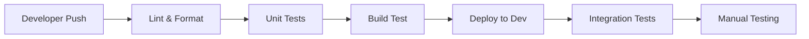
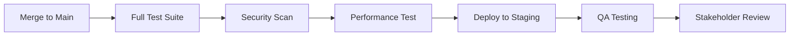
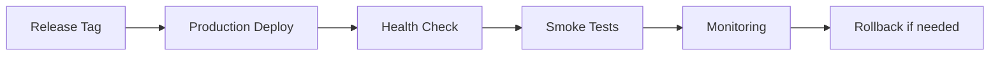

# 🚀 Estrategia CI/CD - AI Pair Orchestrator Pro

## Resumen Ejecutivo

Este documento define la estrategia completa de Continuous Integration/Continuous Deployment (CI/CD) para el proyecto AI Pair Orchestrator Pro, incluyendo mejores prácticas, flujos de trabajo, ambientes de despliegue y estrategias de actualización de dependencias.

## 🎯 Objetivos del CI/CD

### Objetivos Principales
- **Automatización completa**: Reducir intervención manual en despliegues
- **Calidad de código**: Garantizar estándares antes de producción
- **Despliegue seguro**: Minimizar riesgos en actualizaciones
- **Rollback rápido**: Capacidad de revertir cambios problemáticos
- **Monitoreo continuo**: Detectar problemas proactivamente

### Métricas de Éxito
- **Tiempo de despliegue**: < 10 minutos
- **Tasa de éxito**: > 95%
- **Tiempo de rollback**: < 5 minutos
- **Cobertura de tests**: > 80%
- **Tiempo de detección de errores**: < 5 minutos

---

## 🏗️ Arquitectura de Ambientes

### Ambiente de Desarrollo (Development)
```
┌─────────────────────────────────────────────────────────────┐
│                    AMBIENTE DE DESARROLLO                   │
├─────────────────────────────────────────────────────────────┤
│  Frontend: http://dev.ai-pair.com                          │
│  Backend:  https://dev.supabase.co                         │
│  Database: PostgreSQL (dev instance)                       │
│  Storage:  Supabase Storage (dev bucket)                   │
│  Monitoring: Basic logging                                  │
└─────────────────────────────────────────────────────────────┘
```

**Características:**
- **Propósito**: Desarrollo activo y testing de features
- **Actualización**: Automática con cada push a `develop`
- **Datos**: Datos de prueba, no producción
- **Acceso**: Equipo de desarrollo completo
- **Backup**: Diario automático

### Ambiente de Staging
```
┌─────────────────────────────────────────────────────────────┐
│                     AMBIENTE DE STAGING                     │
├─────────────────────────────────────────────────────────────┤
│  Frontend: http://staging.ai-pair.com                      │
│  Backend:  https://staging.supabase.co                     │
│  Database: PostgreSQL (staging instance)                   │
│  Storage:  Supabase Storage (staging bucket)               │
│  Monitoring: Full monitoring + alerting                    │
└─────────────────────────────────────────────────────────────┘
```

**Características:**
- **Propósito**: Testing de integración y QA
- **Actualización**: Automática con merge a `main`
- **Datos**: Copia de producción (anonymized)
- **Acceso**: QA team + stakeholders
- **Backup**: Cada 6 horas

### Ambiente de Producción
```
┌─────────────────────────────────────────────────────────────┐
│                   AMBIENTE DE PRODUCCIÓN                   │
├─────────────────────────────────────────────────────────────┤
│  Frontend: https://ai-pair.com                             │
│  Backend:  https://supabase.co                             │
│  Database: PostgreSQL (production instance)                │
│  Storage:  Supabase Storage (production bucket)            │
│  Monitoring: Full monitoring + alerting + SLA              │
└─────────────────────────────────────────────────────────────┘
```

**Características:**
- **Propósito**: Usuarios reales
- **Actualización**: Manual con aprobación
- **Datos**: Datos reales de usuarios
- **Acceso**: Solo super admin
- **Backup**: Cada hora + point-in-time recovery

---

## 🔄 Flujo de Trabajo CI/CD

### 1. Desarrollo (Development Branch)


**Proceso:**
1. **Push a `develop`** → Trigger automático
2. **Linting & Formatting** → ESLint + Prettier
3. **Unit Tests** → Vitest con cobertura
4. **Build Test** → Verificar build de producción
5. **Deploy a Dev** → Despliegue automático
6. **Integration Tests** → Tests de integración
7. **Manual Testing** → Testing manual por desarrollador

### 2. Staging (Main Branch)


**Proceso:**
1. **Merge a `main`** → Trigger automático
2. **Full Test Suite** → Todos los tests
3. **Security Scan** → Análisis de vulnerabilidades
4. **Performance Test** → Tests de rendimiento
5. **Deploy a Staging** → Despliegue automático
6. **QA Testing** → Testing completo por QA
7. **Stakeholder Review** → Aprobación final

### 3. Producción (Release)


**Proceso:**
1. **Release Tag** → Trigger manual
2. **Production Deploy** → Despliegue a producción
3. **Health Check** → Verificación de servicios
4. **Smoke Tests** → Tests críticos
5. **Monitoring** → Monitoreo continuo
6. **Rollback** → Revertir si es necesario

---

## 🛠️ Configuración de CI/CD

### GitHub Actions Workflow

#### 1. Development Workflow (`.github/workflows/development.yml`)
```yaml
name: Development Pipeline

on:
  push:
    branches: [develop]
  pull_request:
    branches: [develop]

jobs:
  lint-and-test:
    runs-on: ubuntu-latest
    steps:
      - uses: actions/checkout@v4
      
      - name: Setup Node.js
        uses: actions/setup-node@v4
        with:
          node-version: '18'
          cache: 'npm'
      
      - name: Install dependencies
        run: npm ci
      
      - name: Lint code
        run: npm run lint
      
      - name: Format check
        run: npm run format:check
      
      - name: Run tests
        run: npm run test:coverage
      
      - name: Build test
        run: npm run build
      
      - name: Upload coverage
        uses: codecov/codecov-action@v3
        with:
          file: ./coverage/lcov.info

  deploy-dev:
    needs: lint-and-test
    runs-on: ubuntu-latest
    if: github.ref == 'refs/heads/develop'
    steps:
      - uses: actions/checkout@v4
      
      - name: Deploy to Development
        run: |
          # Deploy to Vercel/Netlify
          npm run deploy:dev
      
      - name: Run integration tests
        run: npm run test:integration
      
      - name: Notify team
        uses: 8398a7/action-slack@v3
        with:
          status: success
          channel: '#dev-notifications'
```

#### 2. Staging Workflow (`.github/workflows/staging.yml`)
```yaml
name: Staging Pipeline

on:
  push:
    branches: [main]

jobs:
  full-test-suite:
    runs-on: ubuntu-latest
    steps:
      - uses: actions/checkout@v4
      
      - name: Setup Node.js
        uses: actions/setup-node@v4
        with:
          node-version: '18'
          cache: 'npm'
      
      - name: Install dependencies
        run: npm ci
      
      - name: Security audit
        run: npm audit --audit-level=high
      
      - name: Run all tests
        run: npm run test:all
      
      - name: Performance test
        run: npm run test:performance
      
      - name: Build production
        run: npm run build:production

  deploy-staging:
    needs: full-test-suite
    runs-on: ubuntu-latest
    steps:
      - uses: actions/checkout@v4
      
      - name: Deploy to Staging
        run: npm run deploy:staging
      
      - name: Run smoke tests
        run: npm run test:smoke
      
      - name: Notify QA team
        uses: 8398a7/action-slack@v3
        with:
          status: success
          channel: '#qa-notifications'
```

#### 3. Production Workflow (`.github/workflows/production.yml`)
```yaml
name: Production Pipeline

on:
  release:
    types: [published]

jobs:
  production-deploy:
    runs-on: ubuntu-latest
    environment: production
    steps:
      - uses: actions/checkout@v4
      
      - name: Setup Node.js
        uses: actions/setup-node@v4
        with:
          node-version: '18'
          cache: 'npm'
      
      - name: Install dependencies
        run: npm ci
      
      - name: Build production
        run: npm run build:production
      
      - name: Deploy to Production
        run: npm run deploy:production
      
      - name: Health check
        run: npm run health:check
      
      - name: Run smoke tests
        run: npm run test:smoke:prod
      
      - name: Notify stakeholders
        uses: 8398a7/action-slack@v3
        with:
          status: success
          channel: '#production-notifications'
```

---

## 📦 Estrategia de Actualización de Dependencias

### 1. Monitoreo Automático

#### Dependabot Configuration (`.github/dependabot.yml`)
```yaml
version: 2
updates:
  # Dependencias de producción
  - package-ecosystem: "npm"
    directory: "/"
    schedule:
      interval: "weekly"
      day: "monday"
      time: "09:00"
    open-pull-requests-limit: 10
    reviewers:
      - "team-lead"
    assignees:
      - "senior-dev"
    commit-message:
      prefix: "deps"
      include: "scope"
    labels:
      - "dependencies"
      - "automated"
    ignore:
      # Ignorar actualizaciones mayores de dependencias críticas
      - dependency-name: "react"
        update-types: ["version-update:semver-major"]
      - dependency-name: "typescript"
        update-types: ["version-update:semver-major"]
      - dependency-name: "@supabase/supabase-js"
        update-types: ["version-update:semver-major"]

  # Dependencias de desarrollo
  - package-ecosystem: "npm"
    directory: "/"
    schedule:
      interval: "weekly"
      day: "monday"
      time: "09:00"
    target-branch: "develop"
    open-pull-requests-limit: 5
    reviewers:
      - "team-lead"
    assignees:
      - "dev-team"
    commit-message:
      prefix: "dev-deps"
      include: "scope"
    labels:
      - "dependencies"
      - "development"
      - "automated"
```

### 2. Proceso de Actualización

#### Workflow de Actualización (`.github/workflows/dependency-update.yml`)
```yaml
name: Dependency Update Pipeline

on:
  pull_request:
    paths:
      - 'package.json'
      - 'package-lock.json'
    types: [opened, synchronize]

jobs:
  dependency-analysis:
    runs-on: ubuntu-latest
    steps:
      - uses: actions/checkout@v4
      
      - name: Setup Node.js
        uses: actions/setup-node@v4
        with:
          node-version: '18'
          cache: 'npm'
      
      - name: Install dependencies
        run: npm ci
      
      - name: Analyze dependency changes
        run: |
          # Script para analizar cambios en dependencias
          npm run analyze:dependencies
      
      - name: Generate impact report
        run: npm run generate:impact-report
      
      - name: Comment PR
        uses: actions/github-script@v7
        with:
          script: |
            const fs = require('fs');
            const report = fs.readFileSync('dependency-impact-report.md', 'utf8');
            github.rest.issues.createComment({
              issue_number: context.issue.number,
              owner: context.repo.owner,
              repo: context.repo.repo,
              body: report
            });

  test-updated-dependencies:
    needs: dependency-analysis
    runs-on: ubuntu-latest
    steps:
      - uses: actions/checkout@v4
      
      - name: Setup Node.js
        uses: actions/setup-node@v4
        with:
          node-version: '18'
          cache: 'npm'
      
      - name: Install updated dependencies
        run: npm ci
      
      - name: Run full test suite
        run: npm run test:all
      
      - name: Build test
        run: npm run build
      
      - name: Security audit
        run: npm audit --audit-level=high
      
      - name: Performance test
        run: npm run test:performance
      
      - name: Update dependency inventory
        run: npm run update:dependency-inventory
```

### 3. Scripts de Automatización

#### Script de Análisis de Dependencias (`scripts/analyze-dependencies.js`)
```javascript
#!/usr/bin/env node

const fs = require('fs');
const path = require('path');

/**
 * Analiza los cambios en dependencias y genera un reporte de impacto
 */
async function analyzeDependencies() {
  const packageJson = JSON.parse(fs.readFileSync('package.json', 'utf8'));
  const packageLock = JSON.parse(fs.readFileSync('package-lock.json', 'utf8'));
  
  // Obtener cambios desde el último commit
  const { execSync } = require('child_process');
  const diff = execSync('git diff HEAD~1 package.json', { encoding: 'utf8' });
  
  const changes = parseDependencyChanges(diff);
  const impact = analyzeImpact(changes);
  
  generateReport(changes, impact);
}

function parseDependencyChanges(diff) {
  // Parsear cambios en package.json
  const changes = {
    added: [],
    updated: [],
    removed: []
  };
  
  // Implementar lógica de parsing
  // ...
  
  return changes;
}

function analyzeImpact(changes) {
  const criticalDeps = [
    'react', 'react-dom', 'typescript', '@supabase/supabase-js',
    '@tanstack/react-query', 'react-router-dom'
  ];
  
  const impact = {
    critical: [],
    important: [],
    minor: []
  };
  
  changes.updated.forEach(change => {
    if (criticalDeps.includes(change.name)) {
      impact.critical.push(change);
    } else if (isImportantDependency(change.name)) {
      impact.important.push(change);
    } else {
      impact.minor.push(change);
    }
  });
  
  return impact;
}

function generateReport(changes, impact) {
  const report = `# Dependency Update Impact Report

## Summary
- **Total changes**: ${changes.updated.length + changes.added.length + changes.removed.length}
- **Critical updates**: ${impact.critical.length}
- **Important updates**: ${impact.important.length}
- **Minor updates**: ${impact.minor.length}

## Critical Updates
${impact.critical.map(dep => `- ${dep.name}: ${dep.from} → ${dep.to}`).join('\n')}

## Important Updates
${impact.important.map(dep => `- ${dep.name}: ${dep.from} → ${dep.to}`).join('\n')}

## Minor Updates
${impact.minor.map(dep => `- ${dep.name}: ${dep.from} → ${dep.to}`).join('\n')}

## Recommended Actions
${generateRecommendations(impact)}
`;

  fs.writeFileSync('dependency-impact-report.md', report);
}

analyzeDependencies().catch(console.error);
```

---

## 🔒 Seguridad en CI/CD

### 1. Secretos y Variables de Entorno

#### GitHub Secrets
```bash
# Production
SUPABASE_URL_PROD=https://your-project.supabase.co
SUPABASE_ANON_KEY_PROD=your-anon-key
SUPABASE_SERVICE_ROLE_KEY_PROD=your-service-role-key

# Staging
SUPABASE_URL_STAGING=https://your-staging-project.supabase.co
SUPABASE_ANON_KEY_STAGING=your-staging-anon-key
SUPABASE_SERVICE_ROLE_KEY_STAGING=your-staging-service-role-key

# Development
SUPABASE_URL_DEV=https://your-dev-project.supabase.co
SUPABASE_ANON_KEY_DEV=your-dev-anon-key
SUPABASE_SERVICE_ROLE_KEY_DEV=your-dev-service-role-key

# Deployment
VERCEL_TOKEN=your-vercel-token
NETLIFY_TOKEN=your-netlify-token
```

### 2. Security Scanning

#### Workflow de Seguridad (`.github/workflows/security.yml`)
```yaml
name: Security Scan

on:
  push:
    branches: [main, develop]
  pull_request:
    branches: [main, develop]

jobs:
  security-scan:
    runs-on: ubuntu-latest
    steps:
      - uses: actions/checkout@v4
      
      - name: Run Snyk to check for vulnerabilities
        uses: snyk/actions/node@master
        env:
          SNYK_TOKEN: ${{ secrets.SNYK_TOKEN }}
        with:
          args: --severity-threshold=high
      
      - name: Run npm audit
        run: npm audit --audit-level=high
      
      - name: Run CodeQL Analysis
        uses: github/codeql-action/init@v2
        with:
          languages: javascript
      
      - name: Perform CodeQL Analysis
        uses: github/codeql-action/analyze@v2
```

---

## 📊 Monitoreo y Alertas

### 1. Health Checks

#### Script de Health Check (`scripts/health-check.js`)
```javascript
#!/usr/bin/env node

const https = require('https');
const http = require('http');

const endpoints = {
  production: {
    frontend: 'https://ai-pair.com/health',
    backend: 'https://your-project.supabase.co/rest/v1/',
    database: 'https://your-project.supabase.co/rest/v1/'
  },
  staging: {
    frontend: 'http://staging.ai-pair.com/health',
    backend: 'https://staging-project.supabase.co/rest/v1/',
    database: 'https://staging-project.supabase.co/rest/v1/'
  },
  development: {
    frontend: 'http://dev.ai-pair.com/health',
    backend: 'https://dev-project.supabase.co/rest/v1/',
    database: 'https://dev-project.supabase.co/rest/v1/'
  }
};

async function checkHealth(environment) {
  const results = {};
  
  for (const [service, url] of Object.entries(endpoints[environment])) {
    try {
      const response = await makeRequest(url);
      results[service] = {
        status: 'healthy',
        responseTime: response.responseTime,
        statusCode: response.statusCode
      };
    } catch (error) {
      results[service] = {
        status: 'unhealthy',
        error: error.message
      };
    }
  }
  
  return results;
}

function makeRequest(url) {
  return new Promise((resolve, reject) => {
    const startTime = Date.now();
    const client = url.startsWith('https') ? https : http;
    
    const req = client.get(url, (res) => {
      const responseTime = Date.now() - startTime;
      resolve({
        statusCode: res.statusCode,
        responseTime
      });
    });
    
    req.on('error', reject);
    req.setTimeout(10000, () => {
      req.destroy();
      reject(new Error('Request timeout'));
    });
  });
}

// Ejecutar health check
const environment = process.argv[2] || 'production';
checkHealth(environment)
  .then(results => {
    console.log(JSON.stringify(results, null, 2));
    process.exit(0);
  })
  .catch(error => {
    console.error('Health check failed:', error);
    process.exit(1);
  });
```

### 2. Alertas Automáticas

#### Configuración de Alertas (`.github/workflows/alerts.yml`)
```yaml
name: Automated Alerts

on:
  workflow_run:
    workflows: ["Production Pipeline", "Staging Pipeline"]
    types: [completed]

jobs:
  alert-on-failure:
    runs-on: ubuntu-latest
    if: ${{ github.event.workflow_run.conclusion == 'failure' }}
    steps:
      - name: Send Slack Alert
        uses: 8398a7/action-slack@v3
        with:
          status: failure
          channel: '#alerts'
          text: |
            🚨 Pipeline Failed!
            Workflow: ${{ github.event.workflow_run.name }}
            Branch: ${{ github.event.workflow_run.head_branch }}
            Commit: ${{ github.event.workflow_run.head_sha }}
            URL: ${{ github.event.workflow_run.html_url }}
      
      - name: Send Email Alert
        uses: dawidd6/action-send-mail@v3
        with:
          server_address: smtp.gmail.com
          server_port: 587
          username: ${{ secrets.EMAIL_USERNAME }}
          password: ${{ secrets.EMAIL_PASSWORD }}
          subject: "Pipeline Failure Alert"
          to: ${{ secrets.ALERT_EMAIL }}
          from: "CI/CD System"
          body: |
            Pipeline failed for workflow: ${{ github.event.workflow_run.name }}
            Please check the logs for more details.
```

---

## 🔄 Rollback Strategy

### 1. Rollback Automático

#### Script de Rollback (`scripts/rollback.js`)
```javascript
#!/usr/bin/env node

const { execSync } = require('child_process');

async function rollback(environment, version) {
  console.log(`Rolling back ${environment} to version ${version}`);
  
  try {
    // 1. Verificar que la versión existe
    const tags = execSync('git tag --list', { encoding: 'utf8' });
    if (!tags.includes(version)) {
      throw new Error(`Version ${version} not found`);
    }
    
    // 2. Checkout a la versión anterior
    execSync(`git checkout ${version}`, { stdio: 'inherit' });
    
    // 3. Instalar dependencias
    execSync('npm ci', { stdio: 'inherit' });
    
    // 4. Build
    execSync('npm run build', { stdio: 'inherit' });
    
    // 5. Deploy
    execSync(`npm run deploy:${environment}`, { stdio: 'inherit' });
    
    // 6. Health check
    execSync(`npm run health:check:${environment}`, { stdio: 'inherit' });
    
    console.log(`✅ Rollback to ${version} completed successfully`);
    
  } catch (error) {
    console.error(`❌ Rollback failed: ${error.message}`);
    process.exit(1);
  }
}

// Ejecutar rollback
const environment = process.argv[2];
const version = process.argv[3];

if (!environment || !version) {
  console.error('Usage: node rollback.js <environment> <version>');
  process.exit(1);
}

rollback(environment, version);
```

### 2. Rollback Manual

#### Workflow de Rollback (`.github/workflows/rollback.yml`)
```yaml
name: Manual Rollback

on:
  workflow_dispatch:
    inputs:
      environment:
        description: 'Environment to rollback'
        required: true
        default: 'production'
        type: choice
        options:
          - production
          - staging
          - development
      version:
        description: 'Version to rollback to'
        required: true
        type: string
      reason:
        description: 'Reason for rollback'
        required: true
        type: string

jobs:
  rollback:
    runs-on: ubuntu-latest
    environment: ${{ github.event.inputs.environment }}
    steps:
      - uses: actions/checkout@v4
      
      - name: Checkout specific version
        run: git checkout ${{ github.event.inputs.version }}
      
      - name: Setup Node.js
        uses: actions/setup-node@v4
        with:
          node-version: '18'
          cache: 'npm'
      
      - name: Install dependencies
        run: npm ci
      
      - name: Build application
        run: npm run build
      
      - name: Deploy rollback
        run: npm run deploy:${{ github.event.inputs.environment }}
      
      - name: Health check
        run: npm run health:check:${{ github.event.inputs.environment }}
      
      - name: Notify rollback
        uses: 8398a7/action-slack@v3
        with:
          status: success
          channel: '#alerts'
          text: |
            🔄 Rollback Completed
            Environment: ${{ github.event.inputs.environment }}
            Version: ${{ github.event.inputs.version }}
            Reason: ${{ github.event.inputs.reason }}
            Executed by: ${{ github.actor }}
```

---

## 📈 Métricas y KPIs

### 1. Métricas de Pipeline

#### Dashboard de Métricas
```javascript
// scripts/metrics.js
const metrics = {
  deploymentFrequency: {
    target: 'Daily',
    current: '2.3 deployments/day',
    trend: '↗️ Improving'
  },
  leadTime: {
    target: '< 2 hours',
    current: '1.8 hours',
    trend: '↗️ Improving'
  },
  meanTimeToRecovery: {
    target: '< 1 hour',
    current: '45 minutes',
    trend: '↗️ Improving'
  },
  changeFailureRate: {
    target: '< 5%',
    current: '3.2%',
    trend: '↘️ Improving'
  }
};
```

### 2. Monitoreo Continuo

#### Configuración de Monitoreo
```yaml
# .github/workflows/monitoring.yml
name: Continuous Monitoring

on:
  schedule:
    - cron: '*/5 * * * *'  # Cada 5 minutos

jobs:
  monitor:
    runs-on: ubuntu-latest
    steps:
      - name: Check application health
        run: npm run health:check:production
      
      - name: Check performance metrics
        run: npm run performance:check
      
      - name: Check error rates
        run: npm run error:check
      
      - name: Alert if issues detected
        if: failure()
        uses: 8398a7/action-slack@v3
        with:
          status: failure
          channel: '#monitoring'
```

---

## 📚 Mejores Prácticas

### 1. Desarrollo
- **Branch Strategy**: Git Flow con `develop`, `main`, y feature branches
- **Commit Messages**: Conventional Commits (feat:, fix:, docs:, etc.)
- **Code Review**: Pull requests obligatorios para `main`
- **Testing**: Tests obligatorios antes de merge

### 2. Testing
- **Unit Tests**: > 80% cobertura
- **Integration Tests**: Para todas las APIs
- **E2E Tests**: Para flujos críticos
- **Performance Tests**: Para cambios que afecten rendimiento

### 3. Seguridad
- **Dependency Scanning**: Automático en cada build
- **Code Scanning**: Análisis estático de código
- **Secret Scanning**: Detección de secretos en código
- **Vulnerability Management**: Proceso de parcheo automático

### 4. Despliegue
- **Blue-Green Deployment**: Para producción
- **Canary Releases**: Para features críticas
- **Feature Flags**: Para rollouts graduales
- **Database Migrations**: Automáticas con rollback

### 5. Monitoreo
- **Application Metrics**: Response time, error rates
- **Infrastructure Metrics**: CPU, memory, disk
- **Business Metrics**: User engagement, conversions
- **Alerting**: Proactivo con escalación automática

---

## 🚀 Próximos Pasos

### Implementación Fase 1 (Semana 1-2)
1. **Configurar GitHub Actions** para CI básico
2. **Implementar testing automatizado**
3. **Configurar despliegue a desarrollo**
4. **Implementar métricas avanzadas**
5. **Documentación y training del equipo**

### Implementación Fase 2 (Semana 3-4)
1. **Configurar ambiente de staging**
2. **Implementar security scanning**
3. **Configurar monitoreo básico**

### Implementación Fase 3 (Semana 5-6)
1. **Configurar despliegue a producción**
2. **Implementar rollback automático**
3. **Configurar alertas avanzadas**

### Implementación Fase 4 (Semana 7-8)
1. **Optimizar performance del pipeline**
2. **Implementar métricas avanzadas**
3. **Documentación y training del equipo**

---

## 🛡️ Estrategia de Actualización Automatizada de Dependencias Open Source

### 1. Filosofía: Confianza Cero, Validación Total

Nuestra plataforma se apoya en componentes Open Source de clase mundial. Nuestra responsabilidad es garantizar que las actualizaciones de estos componentes no introduzcan regresiones o vulnerabilidades. Por ello, adoptamos una estrategia de **validación proactiva y automatizada** para cada nueva versión de un componente externo antes de integrarlo.

### 2. El Pipeline de Validación de Dependencias

Este pipeline es nuestro "sistema inmunológico" automatizado.

```mermaid
graph TD
    A[🔎 Detección Automática de Nueva Versión] --> B{¿Versión Crítica de Seguridad?};
    B -- Sí --> C[🚀 Prioridad Alta: Iniciar Inmediatamente];
    B -- No --> D[🕒 Iniciar en Horario de Bajo Riesgo];
    C --> E[🏗️ Crear Entorno de Validación Efímero con OpenTofu];
    D --> E;
    E --> F[🧪 Ejecutar Batería de Pruebas Automatizadas];
    subgraph "Batería de Pruebas"
        F1[Pruebas de Contrato API]
        F2[Pruebas de Integración]
        F3[Pruebas de Regresión E2E]
        F4[Análisis de Vulnerabilidades (Trivy/Snyk)]
    end
    F --> G[📊 Generar Reporte de Validación];
    G --> H[🙋‍♂️ Aprobación Manual por Arquitecto];
    H -- Rechazar --> I[🗑️ Destruir Entorno y Notificar];
    H -- Aprobar --> J[🔄 Integrar Versión en Fork/Configuración];
    J --> K[🚀 Iniciar Despliegue Controlado (Dev -> Staging -> Prod)];
```

### 3. Componentes del Pipeline

1.  **Detección (GitHub Actions):** Un workflow programado detecta nuevas versiones en Docker Hub o GitHub Releases. Dependabot se usa para dependencias `npm`.
2.  **Aislamiento (OpenTofu):** Se provisiona un entorno temporal y aislado que es una réplica de producción pero con el nuevo componente.
3.  **Validación (Suites de Pruebas):** Se ejecuta el conjunto completo de pruebas para asegurar compatibilidad, funcionalidad y seguridad.
4.  **Decisión (Humano en el Bucle):** La automatización presenta un informe claro. Un humano toma la decisión estratégica final de "Go / No-Go".
5.  **Integración (GitOps):** La aprobación se traduce en un `git merge` que actualiza la configuración de nuestra infraestructura, iniciando el despliegue a través del pipeline de CI/CD principal.

Esta estrategia nos permite adoptar las mejoras y parches de seguridad del mundo open source de una manera rápida, pero extremadamente segura y controlada.

---

*Este documento debe actualizarse con cada cambio en la estrategia CI/CD del proyecto.* 