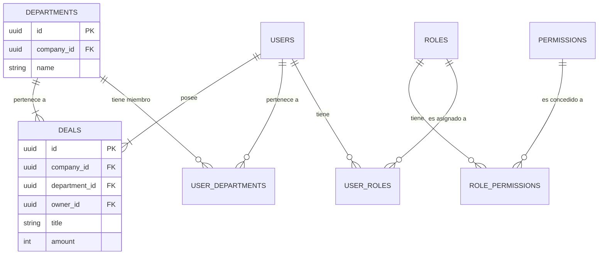

# Arquitectura de Permisos Granulares y Roles

**Fecha:** 2024-06-20

**Estado:** **APROBADO**

**Relacionado con**: `docs/MULTI_TENANCY_AND_DATA_ISOLATION_PRINCIPLES.md`

---

## 1. Visión: Más Allá del Rol, Hacia la Propiedad

Esta arquitectura define el sistema de permisos de la plataforma, que es un pilar fundamental de nuestra ventaja competitiva. El modelo trasciende el simple Control de Acceso Basado en Roles (RBAC) para incorporar la **propiedad del dato** y el **contexto departamental**.

El objetivo es ofrecer a nuestros clientes un control absoluto y granular sobre quién ve qué, permitiendo casos de uso empresariales complejos y seguros.

## 2. El Modelo de Permisos de Doble Capa

Nuestra estrategia se basa en la combinación de dos modelos de control de acceso:

1.  **Capa 1 - Control de Acceso Basado en Atributos (ABAC):** El acceso inicial se concede basado en los atributos del usuario, principalmente su pertenencia a uno o más **departamentos** (`Ventas`, `Finanzas`, etc.). Un usuario hereda los permisos para ver los recursos asignados a su departamento.
2.  **Capa 2 - Control de Acceso a Nivel de Registro (Propiedad):** Dentro de los datos a los que tiene acceso por departamento, se aplica una segunda capa de filtrado basada en la **propiedad**. Un usuario estándar solo verá los registros (ofertas, contactos, casos) que le han sido asignados directamente.

Esta combinación nos permite soportar escenarios como "Un vendedor solo puede ver sus propias ofertas, pero el gerente de ventas puede ver todas las ofertas del departamento de ventas".

---

## 3. Arquitectura de la Base de Datos (Supabase)

Modelamos esta lógica directamente en el esquema de nuestra base de datos.

### Diagrama de Entidad-Relación (ERD)



### Tablas Clave:
*   **`users`**: Identidades únicas en nuestra plataforma.
*   **`departments`**: Departamentos definidos por cada `company_id`.
*   **`roles`**: Definiciones de roles (`MANAGER`, `EMPLOYEE`).
*   **`user_departments`**: Tabla de unión que vincula a un usuario con un departamento.
*   **Tablas de Recursos (`deals`, `tickets`, etc.)**: Siempre deben contener columnas de `company_id`, `department_id`, y `owner_id` para permitir el filtrado.

---

## 4. Implementación Práctica con Seguridad a Nivel de Fila (RLS)

La magia ocurre a través de las políticas de RLS de Supabase.

### Caso de Uso: Vendedor vs. Gerente de Ventas

**Objetivo:** Un vendedor solo ve sus ofertas (`deals`), mientras que un gerente de ventas ve todas las ofertas de su departamento.

**Política RLS en la tabla `deals`:**

```sql
-- Nombre de la Política: "Permitir acceso a deals basado en departamento y propiedad/rol"
-- Acción: SELECT

(
  -- Condición 1: El usuario debe ser parte del mismo departamento que la oferta.
  EXISTS (
    SELECT 1 FROM user_departments
    WHERE user_departments.user_id = auth.uid()
      AND user_departments.department_id = deals.department_id
  )
  AND -- Y además, una de las siguientes condiciones debe ser verdadera:
  (
    -- Condición 2a: La oferta es propiedad directa del usuario (para el VENDEDOR).
    deals.owner_id = auth.uid()
    OR
    -- Condición 2b: El usuario tiene el rol de MANAGER en ese departamento (para el GERENTE).
    EXISTS (
      SELECT 1
      FROM user_roles
      JOIN roles ON user_roles.role_id = roles.id
      WHERE user_roles.user_id = auth.uid()
        AND roles.name = 'MANAGER'
    )
  )
)
```
Esta política única, ejecutada en la base de datos, resuelve de forma segura y eficiente este complejo requisito sin necesidad de lógica en el backend.

---

## 5. Estrategia para Múltiples Licencias (El "Usuario Único")

Reconocemos que los clientes pueden querer minimizar sus costos de licencias de Google Workspace / Microsoft 365. Nuestra arquitectura soporta esta flexibilidad desacoplando la **identidad en nuestra plataforma** de la **autenticación del servicio externo**.

**Objetivo:** Permitir que una empresa funcione con una sola licencia `master@empresa.com`, usando alias como `ventas@empresa.com`.

**Implementación:**
1.  **Modelo de Identidad Interno:** En nuestra tabla `users`, creamos dos usuarios distintos: `user_ventas` y `user_finanzas`. Cada uno tiene sus propios roles y departamentos asignados en nuestra base de datos.
2.  **Capa de Integración (Orquestador Kestra):** La conexión a la API de Google/Microsoft se realiza con las credenciales de la cuenta maestra.
3.  **Enrutamiento Inteligente:** Un flujo de trabajo en Kestra es responsable de procesar los datos entrantes.
    *   **Ejemplo:** Si un email llega al alias `ventas@empresa.com`, el flujo de Kestra identifica el destinatario.
    *   El flujo consulta una tabla de mapeo en nuestra base de datos que asocia `ventas@empresa.com` con el `department_id` de Ventas.
    *   El flujo procesa el email y lo asocia con los recursos del departamento de Ventas en nuestra plataforma.

**Conclusión:** Absorbemos la complejidad de la configuración de licencias del cliente en nuestra capa de automatización, manteniendo un modelo de permisos interno limpio, seguro y granular. El cliente obtiene máxima flexibilidad, y nosotros mantenemos máxima seguridad. 