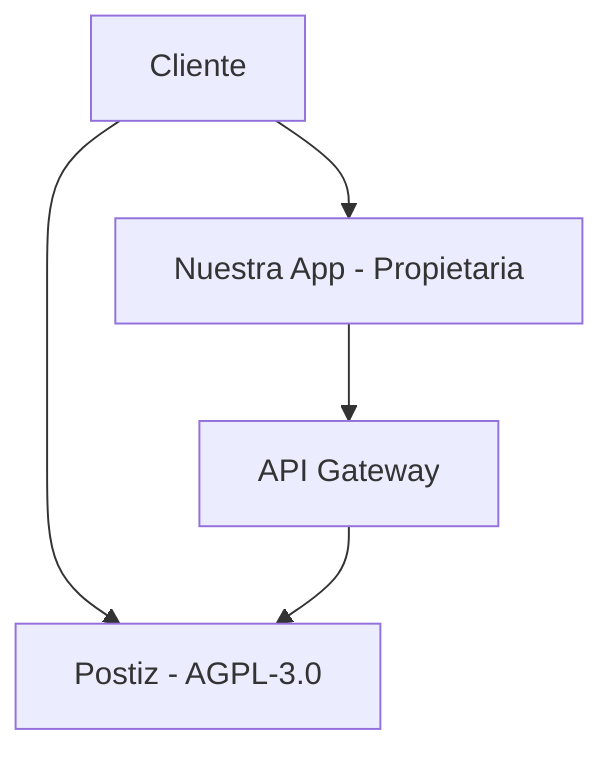
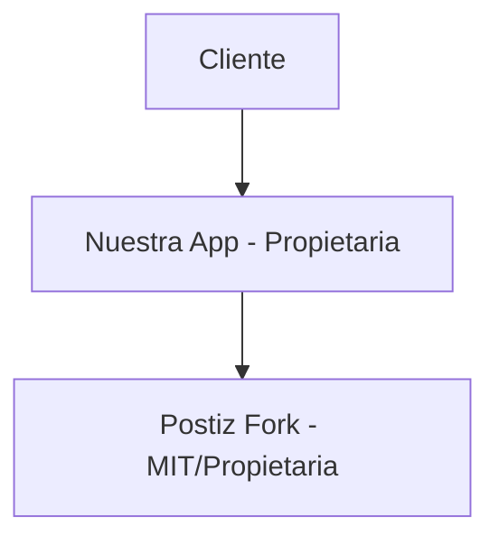
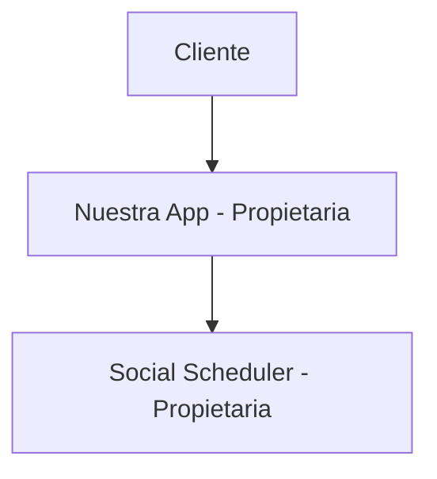

# Análisis Legal: Licencia AGPL-3.0 para Postiz

**Versión:** 1.0.0  
**Fecha:** 23 de Enero, 2025  
**Autor:** AI Pair Platform (asistente de Marcelo Escallón)  
**Estado:** Requiere Acción Legal Inmediata  
**Urgencia:** ALTA - Bloquea implementación de Postiz  

---

## 🚨 **Riesgo Crítico Identificado**

### **¿Qué es AGPL-3.0?**
La **GNU Affero General Public License v3.0** es una licencia copyleft que requiere que cualquier software que use código AGPL-3.0 también debe ser distribuido bajo AGPL-3.0, **incluyendo software que se ejecute en red**.

### **¿Por qué es problemático para SaaS?**
1. **"Network Use" Clause:** Si un usuario accede a nuestro software a través de la red, debemos proporcionar el código fuente completo
2. **"Derivative Works":** Cualquier modificación o integración puede requerir que todo nuestro stack sea AGPL-3.0
3. **"Linking":** Incluso usar Postiz como servicio separado puede afectar nuestro software principal

---

## 📋 **Acciones Legales Requeridas**

### **1. Consulta con Equipo Legal (URGENTE)**

**Preguntas específicas para el abogado:**

```markdown
1. ¿Podemos usar Postiz (AGPL-3.0) en nuestro modelo SaaS sin violar la licencia?

2. ¿Qué significa exactamente "network use" en nuestro contexto?
   - ¿Usar Postiz como servicio separado en la misma infraestructura?
   - ¿Integrar Postiz en nuestra aplicación principal?

3. ¿Qué modificaciones podemos hacer a Postiz sin violar AGPL-3.0?

4. ¿Podemos mantener nuestro software principal con licencia propietaria?

5. ¿Qué obligaciones tenemos con nuestros clientes respecto al código fuente?

6. ¿Hay precedentes legales de SaaS usando software AGPL-3.0?

7. ¿Cuáles son los riesgos legales específicos para nuestro modelo de negocio?
```

### **2. Análisis de Arquitectura**

**Opciones técnicas a evaluar:**

#### **Opción A: Servicio Separado**


**Preguntas:**
- ¿Esto evita el "linking" problemático?
- ¿Podemos mantener aislamiento legal?

#### **Opción B: Fork con Licencia Diferente**


**Preguntas:**
- ¿Podemos cambiar la licencia en nuestro fork?
- ¿Qué obligaciones tenemos con el proyecto original?

#### **Opción C: Desarrollo Propio**


**Preguntas:**
- ¿Cuál es el costo de desarrollo?
- ¿Podemos reutilizar ideas sin violar copyright?

---

## ⚖️ **Análisis de Riesgos Legales**

### **Riesgo ALTO: Violación de Licencia**
- **Probabilidad:** Media
- **Impacto:** Crítico
- **Consecuencias:**
  - Demanda legal del proyecto original
  - Obligación de abrir todo nuestro código
  - Daños a la reputación
  - Posibles multas

### **Riesgo MEDIO: Obligaciones de Distribución**
- **Probabilidad:** Alta
- **Impacto:** Alto
- **Consecuencias:**
  - Deber proporcionar código fuente a clientes
  - Pérdida de ventaja competitiva
  - Modelo de negocio comprometido

### **Riesgo BAJO: Compatibilidad con Clientes**
- **Probabilidad:** Baja
- **Impacto:** Medio
- **Consecuencias:**
  - Clientes pueden exigir código fuente
  - Problemas de compliance empresarial

---

## 🛡️ **Estrategias de Mitigación**

### **Estrategia 1: Validación Legal Completa**
```typescript
interface LegalValidation {
  // ✅ REQUIRED: Consulta con abogado especializado
  legalConsultation: {
    agplCompliance: boolean;
    saasModelCompatibility: boolean;
    riskAssessment: 'low' | 'medium' | 'high';
    recommendations: string[];
  };
  
  // ✅ REQUIRED: Análisis de arquitectura
  architectureAnalysis: {
    isolationPossible: boolean;
    networkUseImplications: string[];
    linkingRisks: string[];
  };
  
  // ✅ REQUIRED: Plan de contingencia
  contingencyPlan: {
    ifCompatible: 'proceed_with_postiz';
    ifNotCompatible: 'develop_own_solution';
    fallbackOptions: string[];
  };
}
```

### **Estrategia 2: Arquitectura Defensiva**
```typescript
interface DefensiveArchitecture {
  // ✅ REQUIRED: Aislamiento legal
  legalIsolation: {
    separateServices: boolean;
    clearBoundaries: boolean;
    independentDeployment: boolean;
  };
  
  // ✅ REQUIRED: Documentación legal
  legalDocumentation: {
    licenseCompliance: string;
    usageTerms: string;
    clientObligations: string;
  };
  
  // ✅ REQUIRED: Monitoreo continuo
  continuousMonitoring: {
    licenseChanges: boolean;
    complianceChecks: boolean;
    legalUpdates: boolean;
  };
}
```

### **Estrategia 3: Plan de Contingencia**
```typescript
interface ContingencyPlan {
  // ✅ REQUIRED: Desarrollo propio
  ownDevelopment: {
    timeline: '8-12 weeks';
    resources: '2-3 developers';
    cost: '$50,000-100,000';
    features: string[];
  };
  
  // ✅ REQUIRED: Alternativas propietarias
  proprietaryAlternatives: {
    buffer: { cost: '$15-99/mes', features: string[] };
    hootsuite: { cost: '$29-599/mes', features: string[] };
    later: { cost: '$18-40/mes', features: string[] };
  };
  
  // ✅ REQUIRED: Integración con APIs directas
  directAPIs: {
    platforms: string[];
    complexity: 'medium';
    maintenance: 'high';
    cost: 'low';
  };
}
```

---

## 📅 **Cronograma de Acciones**

### **Semana 1: Validación Legal (CRÍTICA)**
```bash
# Día 1-2: Preparar consulta legal
- Documentar preguntas específicas
- Preparar análisis técnico
- Identificar abogado especializado

# Día 3-5: Consulta legal
- Reunión con abogado
- Análisis de riesgos
- Recomendaciones específicas
```

### **Semana 2: Decisión y Planificación**
```bash
# Día 1-2: Evaluar recomendaciones legales
- Revisar análisis legal
- Evaluar opciones técnicas
- Tomar decisión final

# Día 3-5: Planificar implementación
- Si es compatible: Plan Postiz
- Si no es compatible: Plan desarrollo propio
- Documentar decisión en ADR
```

### **Semana 3-6: Implementación**
```bash
# Opción A: Postiz (si es legalmente compatible)
- Setup y configuración
- Integración con stack
- Testing y validación

# Opción B: Desarrollo propio (si no es compatible)
- Arquitectura y diseño
- Desarrollo de funcionalidades
- Testing y validación
```

---

## 💰 **Análisis de Costos**

### **Opción A: Postiz (si es legalmente compatible)**
- **Costo legal:** $2,000-5,000 (consulta)
- **Costo implementación:** $10,000-20,000
- **Tiempo:** 2-3 semanas
- **Riesgo:** Bajo (si es compatible)

### **Opción B: Desarrollo propio**
- **Costo legal:** $0 (no necesario)
- **Costo desarrollo:** $50,000-100,000
- **Tiempo:** 8-12 semanas
- **Riesgo:** Bajo (control total)

### **Opción C: Herramienta propietaria**
- **Costo legal:** $0 (no necesario)
- **Costo licencias:** $15-599/mes por cliente
- **Tiempo:** 1-2 semanas
- **Riesgo:** Medio (lock-in, costos)

---

## 🎯 **Recomendación Inmediata**

### **PASO 1: Consulta Legal URGENTE**
```typescript
const immediateAction = {
  priority: 'URGENT',
  action: 'LEGAL_CONSULTATION',
  timeline: 'THIS_WEEK',
  responsible: 'LEGAL_TEAM',
  questions: [
    'AGPL-3.0 compliance in SaaS model',
    'Network use implications',
    'Derivative works definition',
    'Risk assessment and mitigation'
  ]
};
```

### **PASO 2: Preparar Plan de Contingencia**
```typescript
const contingencyPreparation = {
  priority: 'HIGH',
  action: 'CONTINGENCY_PLANNING',
  timeline: 'NEXT_WEEK',
  responsible: 'ARCHITECTURE_TEAM',
  plans: [
    'Own development timeline',
    'Alternative tools evaluation',
    'Resource allocation',
    'Cost analysis'
  ]
};
```

### **PASO 3: Documentar Decisión**
```typescript
const decisionDocumentation = {
  priority: 'MEDIUM',
  action: 'ADR_CREATION',
  timeline: 'AFTER_LEGAL_REVIEW',
  responsible: 'ARCHITECTURE_TEAM',
  content: [
    'Legal analysis results',
    'Technical architecture',
    'Risk assessment',
    'Implementation plan'
  ]
};
```

---

## 📞 **Contactos Requeridos**

### **Equipo Legal**
- **Especialización:** Licencias de software, SaaS, AGPL-3.0
- **Experiencia:** Precedentes de SaaS usando AGPL-3.0
- **Timeline:** Consulta esta semana

### **Equipo de Arquitectura**
- **Responsabilidad:** Análisis técnico y planificación
- **Timeline:** Plan de contingencia la próxima semana

### **Equipo de Desarrollo**
- **Responsabilidad:** Implementación según decisión
- **Timeline:** Comenzar después de decisión legal

---

## 🚨 **Conclusión**

**La licencia AGPL-3.0 es un riesgo CRÍTICO** que requiere **consulta legal inmediata** antes de proceder con Postiz. No podemos implementar Postiz sin validación legal completa.

**Acción inmediata requerida:**
1. ✅ Consultar con abogado especializado en AGPL-3.0
2. ✅ Evaluar opciones técnicas de aislamiento
3. ✅ Preparar plan de contingencia
4. ✅ Documentar decisión final

**Mientras tanto:** Proceder con PostHog (analytics) que no tiene restricciones legales.

---

**Responsable:** Equipo Legal + Arquitectura  
**Fecha límite:** 30 de Enero, 2025  
**Estado:** Requiere acción legal inmediata  
**Próxima revisión:** Después de consulta legal 