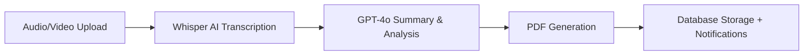
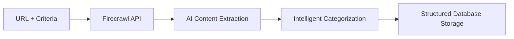
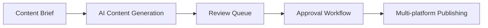

# PLAN MAESTRO - Sistema de Gestión Empresarial con IA y Workflows

## 🎯 VISIÓN GENERAL

Sistema de gestión empresarial moderno con capacidades avanzadas de:
- **Automatización inteligente** con IA (OpenAI)
- **Web scraping** profesional (Firecrawl)
- **Workflows visuales** para procesos empresariales
- **Gestión de reuniones** con transcripción automática
- **Integración multi-plataforma** (CMS, Social Media, Office)

### **Objetivo**: Reducir 80% del trabajo manual mediante automatización inteligente

## 🏗️ ARQUITECTURA FINAL ELEGIDA

### **Stack Tecnológico Core**
```
Frontend: React + TypeScript + Tailwind + shadcn/ui
Backend: Supabase (PostgreSQL + Edge Functions + Auth + Storage)
Real-time: Supabase Real-time subscriptions
Secrets: Supabase Vault (seguro)
```

### **Servicios Externos Integrados**
- **Firecrawl**: $20/mes - Web scraping inteligente (500 páginas)
- **OpenAI**: Pay-per-use - Whisper + GPT-4o-mini + GPT-4o
- **Resend**: $20/mes - Email transaccional profesional

### **Costo Total Mensual**: ~$65/mes vs $280-400/mes soluciones cloud (85% ahorro)

## 🎯 CASOS DE USO PRIORITARIOS

### 1. **MEETING PROCESSOR** (Prioridad 1)
**Objetivo**: Convertir reuniones en actas automáticas profesionales



**Implementación**: Edge Function `meeting-processor`
- Input: Archivo audio/video de reunión
- Proceso: Transcripción → Resumen inteligente → Documento PDF
- Output: Acta profesional + tareas asignadas + notificaciones

### 2. **RESOURCE SCRAPER** (Prioridad 2)
**Objetivo**: Investigación y scraping automatizado de recursos web



**Implementación**: Edge Function `resource-scraper`
- Input: URL + criterios de extracción
- Proceso: Scraping profesional → Análisis IA → Categorización
- Output: Datos estructurados + tags inteligentes + relaciones

### 3. **CONTENT PIPELINE** (Prioridad 3)
**Objetivo**: Creación y publicación automatizada de contenido



**Implementación**: Edge Function `content-pipeline`
- Input: Brief de contenido + preferencias de plataforma
- Proceso: Generación IA → Revisión → Aprobación → Publicación
- Output: Contenido publicado + analytics + feedback

## 🔧 WORKFLOWS ENGINE

### **Arquitectura de Workflows**
```typescript
interface Workflow {
  id: string;
  name: string;
  description: string;
  steps: WorkflowStep[];
  triggers: WorkflowTrigger[];
  status: 'active' | 'paused' | 'draft';
}

interface WorkflowStep {
  id: string;
  type: 'ai_process' | 'api_call' | 'condition' | 'notification';
  config: Record<string, any>;
  nextSteps: string[];
}
```

### **Fases de Implementación**

**FASE 1: Pre-built Workflows** (Actual - 2 semanas)
- Workflows hardcodeados para casos específicos
- Edge Functions especializadas
- Interface de monitoreo básica

**FASE 2: Configurable Workflows** (Mes 2)
- Parámetros configurables
- Templates personalizables
- Validación de flujos

**FASE 3: Visual Builder** (Mes 3-4)
- **React Flow** drag-and-drop editor
- Biblioteca de componentes
- Testing de workflows

**FASE 4: Marketplace** (Mes 5+)
- Workflows compartidos
- Community templates
- Analytics avanzados

## 🔌 INTEGRACIONES ESTRATÉGICAS

### **CMS Integration**
```
Strapi/PayloadCMS ↔ Sistema
- Sync bidireccional de contenido
- Workflow de aprobación
- Publicación automática
```

### **Social Media Automation**
```
LinkedIn + Twitter/X + Instagram
- Scheduling via Buffer/Postiz
- Content adaptation per platform
- Analytics consolidados
```

### **Office Suite Integration**
```
Google Workspace + Microsoft 365
- Calendar sync para reuniones
- Document generation
- Email integration
```

## 📊 ESCALABILIDAD Y GROWTH PATH

### **Supabase Scaling Path**
- **Pro ($25/mes)**: 8GB DB, 500K functions, actual
- **Team ($99/mes)**: 100GB DB, 2M functions, crecimiento
- **Enterprise**: Custom, cuando sea global

### **Arquitectura Escalable**
```
Frontend SPA
    ↓
API Gateway (Edge Function)
    ↓
Microservices (Edge Functions)
├─ Meeting Processor
├─ Resource Scraper  
├─ Content Pipeline
├─ CMS Connector
├─ Social Connector
└─ Office Connector
    ↓
External APIs + Supabase Infrastructure
```

### **Performance Targets**
- **Response Time**: < 2s para workflows simples
- **Uptime**: > 99.9%
- **Error Rate**: < 1%
- **Concurrent Users**: 100+ simultáneos

## 🚀 ROADMAP DE IMPLEMENTACIÓN

### **SPRINT 1: Foundation** (Semana 1-2) - EN PROGRESO
- [x] Arquitectura base con auth
- [x] Edge Functions structure
- [ ] **API Keys setup** (OpenAI, Firecrawl, Resend)
- [ ] **Database schema** para workflows
- [ ] **Meeting processor** funcional

### **SPRINT 2: Core Features** (Semana 3-4)
- [ ] **Resource scraper** completo
- [ ] **Document management** system
- [ ] **Real-time notifications**
- [ ] **User interface** para workflows

### **SPRINT 3: Workflow Engine** (Semana 5-6)
- [ ] **Workflow execution** engine
- [ ] **Pre-built templates**
- [ ] **Monitoring dashboard**
- [ ] **Error handling** robusto

### **SPRINT 4: Visual Builder** (Semana 7-8)
- [ ] **React Flow** integration
- [ ] **Drag-and-drop** builder
- [ ] **Workflow testing** interface
- [ ] **Template marketplace**

## 🔐 SEGURIDAD Y COMPLIANCE

### **Security Layers**
- **RLS**: Row Level Security en todas las tablas
- **API Keys**: Supabase Vault encryption
- **CORS**: Configuración correcta
- **Rate Limiting**: Por usuario y endpoint
- **JWT**: Authentication tokens seguros

### **Data Protection**
- **GDPR Compliance**: Data privacy by design
- **Backup Strategy**: Automated daily snapshots
- **Audit Trail**: Comprehensive logging
- **Access Control**: Granular permissions

## 💰 BUSINESS MODEL

### **Cost Structure**
```
Infrastructure: $65/mes
Development: One-time + maintenance
Revenue Model: SaaS subscription tiers
```

### **Pricing Strategy** (Futuro)
- **Starter**: $29/mes - Workflows básicos
- **Professional**: $99/mes - AI completo + integraciones
- **Enterprise**: Custom - White-label + soporte

## 📈 MÉTRICAS DE ÉXITO

### **Technical KPIs**
- **Automation Rate**: 80% reducción trabajo manual
- **Processing Speed**: Actas en < 5 minutos
- **Research Efficiency**: 10x más rápido vs manual
- **Uptime**: 99.9%+ disponibilidad

### **Business KPIs**
- **User Adoption**: Crecimiento mensual MAU
- **Feature Usage**: Workflows más usados
- **Customer Satisfaction**: NPS > 50
- **Revenue Growth**: MRR growth rate

## 🔮 VISIÓN A LARGO PLAZO

### **Year 1 Goals**
- 1000+ usuarios activos
- 50+ workflow templates
- 10+ integraciones principales
- $50K+ MRR

### **Year 2+ Vision**
- **Mobile App**: React Native
- **API Pública**: Ecosystem de integraciones
- **AI Custom Models**: Fine-tuning específico
- **Global Expansion**: Multi-región

---

**Estado Actual**: Foundation en desarrollo activo  
**Próxima Milestone**: API Keys + Database Schema  
**Timeline**: MVP en 8 semanas, producción en 6 meses  
**Responsable**: Product Owner + Lead Developer

