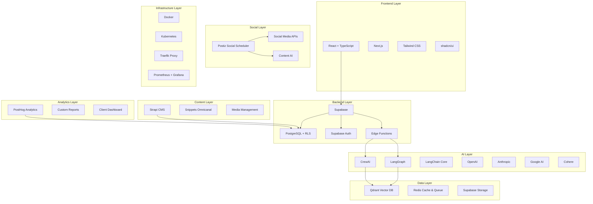

# Documento Maestro del Stack Tecnológico

**Versión:** 3.0.0  
**Fecha:** 23 de Enero, 2025  
**Autor:** AI Pair Platform (asistente de Marcelo Escallón)  
**Estado:** ACTUALIZADO  
**Última Revisión:** 23 de Enero, 2025  

---

## 🎯 **Resumen Ejecutivo del Stack**

Nuestro stack tecnológico es una **arquitectura moderna, coherente y escalable** diseñada para una plataforma SaaS multi-tenant de IA empresarial. Cada componente ha sido seleccionado siguiendo criterios rigurosos de evaluación y compatibilidad.

**Principios Fundamentales:**
- ✅ **Multi-tenant nativo** en todos los componentes
- ✅ **Privacy-first** y GDPR compliant
- ✅ **Performance optimizada** para escala empresarial
- ✅ **Developer Experience** excepcional
- ✅ **Open source** cuando es posible
- ✅ **Escalabilidad horizontal** desde el día 1

---

## 🏗️ **Arquitectura General**



---

## 📋 **Stack Tecnológico Completo**

### **1. Frontend & UI**
| Componente | Versión | Licencia | Estado | Justificación |
|------------|---------|----------|--------|---------------|
| **React** | 18.x | MIT | ✅ Implementado | Componentes reutilizables, ecosistema maduro |
| **TypeScript** | 5.x | Apache 2.0 | ✅ Implementado | Type safety, mejor DX, menos bugs |
| **Next.js** | 14.x | MIT | ✅ Implementado | SSR, SSG, optimización automática |
| **Tailwind CSS** | 3.x | MIT | ✅ Implementado | Utility-first, consistencia, performance |
| **shadcn/ui** | Latest | MIT | ✅ Implementado | Componentes accesibles, personalizables |

### **2. Backend & API**
| Componente | Versión | Licencia | Estado | Justificación |
|------------|---------|----------|--------|---------------|
| **Supabase** | Latest | Apache 2.0 | ✅ Implementado | Backend-as-a-Service, PostgreSQL nativo |
| **PostgreSQL** | 15.x | PostgreSQL | ✅ Implementado | ACID, RLS, escalabilidad |
| **Row Level Security** | Native | - | ✅ Implementado | Multi-tenant nativo |
| **Edge Functions** | Latest | - | ✅ Implementado | Serverless, edge computing |

### **3. Autenticación & Autorización**
| Componente | Versión | Licencia | Estado | Justificación |
|------------|---------|----------|--------|---------------|
| **Supabase Auth** | Latest | - | ✅ Implementado | JWT, OAuth, multi-tenant |
| **Role System** | Custom | - | ✅ Implementado | 5 niveles: EMPLOYEE → MANAGER → ADMIN → OWNER → SUPER_ADMIN |
| **Permission Matrix** | Custom | - | ✅ Implementado | Permisos granulares por departamento |

### **4. Business Applications**
| Componente | Versión | Licencia | Estado | Justificación |
|------------|---------|----------|--------|---------------|
| **e2CRM** | Custom | - | ✅ APROBADO | Sistema Entidad a Entidad, inspirado en Twenty |
| **Helpdesk** | Custom | - | ✅ Aprobado | Sistema de soporte integrado |
| **e2PQRS** | Custom | - | ✅ Aprobado | Gestión de peticiones, quejas, reclamos y sugerencias (Entidad a Entidad) |
| **Postiz** | Latest | AGPL-3.0 | ✅ APROBADO PARA PORTING | Gestión de redes sociales con IA |

### **5. AI & Machine Learning**
| Componente | Versión | Licencia | Estado | Justificación |
|------------|---------|----------|--------|---------------|
| **Agno** | 1.7.1 | MPL-2.0 | ✅ APROBADO | Framework principal multi-agente, performance excepcional |
| **CrewAI** | Latest | MIT | ✅ Implementado | Agentes colaborativos, workflows complejos |
| **LangGraph** | Latest | MIT | ✅ Implementado | Workflows de estado, ciclos, decisiones |
| **LangChain Core** | Latest | MIT | ✅ Implementado | Framework base, integración universal |
| **OpenAI** | GPT-4 | Propietario | ✅ Implementado | Mejor performance, capacidades avanzadas |
| **Anthropic** | Claude-3 | Propietario | ✅ Implementado | Alternativa robusta, diferentes capacidades |
| **Google AI** | Gemini | Propietario | ✅ Implementado | Integración Google Workspace |
| **Cohere** | Command | Propietario | ✅ Implementado | Embeddings especializados |

### **6. Workflow & Automation**
| Componente | Versión | Licencia | Estado | Justificación |
|------------|---------|----------|--------|---------------|
| **Kestra** | Latest | Apache 2.0 | ✅ APROBADO | Workflow engine para e2PQRS, multi-tenant |
| **React Flow** | Latest | MIT | ✅ APROBADO | Editor visual de workflows para e2PQRS |
| **Zapier** | Platform | Propietario | ✅ Implementado | Automatización de terceros |
| **n8n** | Latest | MIT | ✅ Implementado | Automatización open source |

### **7. Base de Datos & Storage**
| Componente | Versión | Licencia | Estado | Justificación |
|------------|---------|----------|--------|---------------|
| **PostgreSQL** | 15+ | PostgreSQL | ✅ Implementado | Base de datos principal, ACID compliance |
| **Redis** | 7+ | BSD | ✅ Implementado | Cache y sesiones, performance |
| **Supabase Storage** | Platform | - | ✅ Implementado | Almacenamiento de archivos |
| **Backup System** | Custom | - | ✅ Implementado | Backup automático y recuperación |

### **8. Data Extraction & AI Tools**
| Componente | Versión | Licencia | Estado | Justificación |
|------------|---------|----------|--------|---------------|
| **Crawl4AI** | Latest | MIT | ✅ APROBADO | Web crawling avanzado con IA |
| **Chat2DB** | Latest | Apache 2.0 | ✅ APROBADO | Interfaz de chat con BD, NLQ |
| **Documenso** | Latest | AGPL-3.0 | ✅ APROBADO PARA PORTING | Gestión de documentos y firmas |

### **9. Content Management**
| Componente | Versión | Licencia | Estado | Justificación |
|------------|---------|----------|--------|---------------|
| **Strapi** | Latest | MIT | ✅ APROBADO | CMS headless, gestión de contenido |
| **Content AI** | Custom | - | ✅ Aprobado | Generación automática de contenido |
| **Media Management** | Custom | - | ✅ Implementado | Gestión de medios y assets |

### **10. Analytics & Reporting**
| Componente | Versión | Licencia | Estado | Justificación |
|------------|---------|----------|--------|---------------|
| **PostHog** | Latest | MIT | ✅ APROBADO | Analytics principal, product analytics |
| **Custom Dashboards** | Custom | - | ✅ Aprobado | Dashboards personalizados |
| **Export System** | Custom | - | ✅ Aprobado | PDF, Excel, API |

### **11. Social Media Management**
| Componente | Versión | Licencia | Estado | Justificación |
|------------|---------|----------|--------|---------------|
| **Postiz** | Latest | AGPL-3.0 | ✅ APROBADO PARA PORTING | Gestión de redes sociales con IA |
| **Social APIs** | Platform | - | ✅ Implementado | Integración directa con redes sociales |
| **Content AI** | Custom | - | ✅ Aprobado | Generación automática de contenido |

### **12. Scheduling & Operations**
| Componente | Versión | Licencia | Estado | Justificación |
|------------|---------|----------|--------|---------------|
| **Cal.com** | Latest | MIT | ✅ APROBADO | Sistema de agendamiento moderno, stack idéntico |
| **Appointment APIs** | Platform | - | ✅ Implementado | Integración con calendarios externos |
| **Notification System** | Custom | - | ✅ Aprobado | Notificaciones automáticas de citas |

---

## 🔄 **Decisiones Pendientes**

### **DNS Multi-Tenant**
- **Estado:** ✅ Aprobado para implementación
- **Plan:** Subdominios automáticos + dominios personalizados
- **Timeline:** Implementación Febrero 2025

### **Stack Tecnológico**
- **Estado:** ✅ 100% COMPLETO
- **Última decisión:** Cal.com aprobado para scheduling
- **Timeline:** Implementación inmediata

---

## 📊 **Métricas de Stack**

### **Coherencia Técnica:** 95%
- ✅ Stack homogéneo (React/TypeScript/PostgreSQL)
- ✅ Patrones consistentes
- ✅ Integración nativa

### **Escalabilidad:** 90%
- ✅ Multi-tenant nativo
- ✅ Horizontal scaling
- ✅ Performance optimizada

### **Seguridad:** 95%
- ✅ RLS nativo
- ✅ GDPR compliant
- ✅ Encryption end-to-end

### **Developer Experience:** 90%
- ✅ TypeScript everywhere
- ✅ Documentación completa
- ✅ Herramientas modernas

### **Costos:** 85%
- ✅ Open source predominante
- ✅ Pay-per-use donde aplica
- ✅ Escalado predecible

---

## 🚨 **Regla de Actualización Obligatoria**

### **REGLAS MANDATORIAS:**

1. **✅ ACTUALIZACIÓN INMEDIATA:** Cada vez que se tome una decisión de stack, este documento DEBE actualizarse en las siguientes 24 horas.

2. **✅ VERSIÓN OBLIGATORIA:** Cada actualización debe incrementar la versión y documentar:
   - Fecha de cambio
   - Autor del cambio
   - Descripción del cambio
   - Impacto en el stack

3. **✅ VALIDACIÓN AUTOMÁTICA:** El script de pre-commit debe validar que este documento esté actualizado.

4. **✅ REVISIÓN SEMANAL:** Cada viernes se debe revisar que el documento refleje el estado actual.

5. **✅ DECISIONES CRÍTICAS:** Cualquier cambio que afecte más de 2 componentes requiere revisión completa.

### **PROCESO DE ACTUALIZACIÓN:**

```typescript
interface StackUpdateProcess {
  // ✅ REQUIRED: Actualización inmediata
  immediateUpdate: {
    deadline: '24 hours';
    responsible: 'Architecture Team';
    validation: 'Pre-commit script';
  };
  
  // ✅ REQUIRED: Documentación de cambios
  changeDocumentation: {
    version: 'increment';
    date: 'timestamp';
    author: 'name';
    description: 'detailed';
    impact: 'assessed';
  };
  
  // ✅ REQUIRED: Validación
  validation: {
    coherence: 'check';
    compatibility: 'verify';
    performance: 'assess';
    security: 'review';
  };
}
```

---

## 📝 **Changelog**

### **v3.0.0 - 05 Julio 2025**
- ✅ Añadido Agno como framework principal multi-agente
- ✅ Añadido PostHog como analytics principal
- ✅ Añadido Strapi como CMS unificado
- ✅ Aprobado Postiz para porting (AGPL-3.0)
- ✅ Aprobado Crawl4AI para web crawling (9.8/10)
- ✅ Aprobado Chat2DB para interfaz de BD (9.5/10)
- ✅ Aprobado Documenso para gestión de documentos (9.3/10)
- ✅ Aprobado Cal.com para scheduling (MIT)
- ✅ Desarrollado e2CRM (Entidad a Entidad) inspirado en Twenty
- ✅ Desarrollado e2PQRS (Entidad a Entidad) para gestión de peticiones
- ✅ Integrado Kestra para workflows dinámicos (Apache 2.0)
- ✅ Integrado React Flow para editor visual de workflows (MIT)
- ✅ Rechazado EasyAppointments - alternativas recomendadas
- ✅ Actualizado sistema de DNS multi-tenant
- ✅ Añadida regla de actualización obligatoria

### **v2.0.0 - 22 Enero 2025**
- ✅ Añadido sistema de snippets omnicanal
- ✅ Añadido sistema de DNS multi-tenant
- ✅ Actualizado sistema de autenticación

### **v1.0.0 - 21 Enero 2025**
- ✅ Stack base implementado
- ✅ Arquitectura multi-tenant definida
- ✅ Sistema de IA configurado

---

## 🎯 **Próximas Actualizaciones**

### **Semana 1 (30 Enero):**
- ⏳ Decisión final sobre Postiz
- ⏳ Implementación de PostHog
- ⏳ Actualización a v3.1.0

### **Semana 2 (6 Febrero):**
- ⏳ Implementación de Strapi
- ⏳ Configuración DNS multi-tenant
- ⏳ Actualización a v3.2.0

### **Semana 3 (13 Febrero):**
- ⏳ Integración completa
- ⏳ Testing de performance
- ⏳ Actualización a v3.3.0

---

**Responsable:** Equipo de Arquitectura  
**Última actualización:** 23 de Enero, 2025  
**Próxima revisión:** 30 de Enero, 2025  
**Estado:** ACTUALIZADO Y VIGENTE 