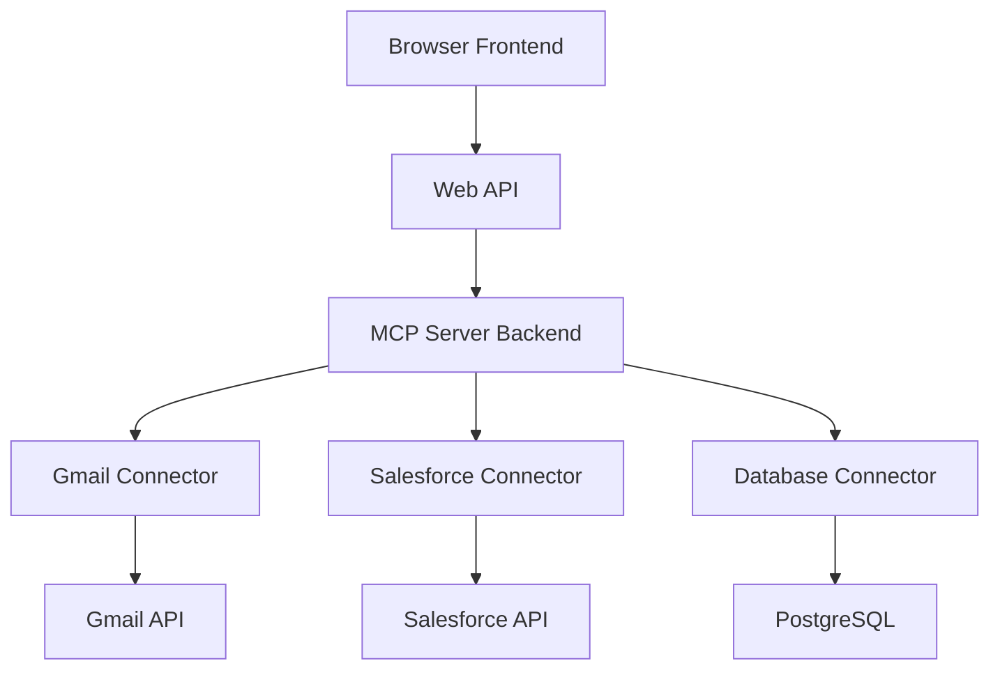
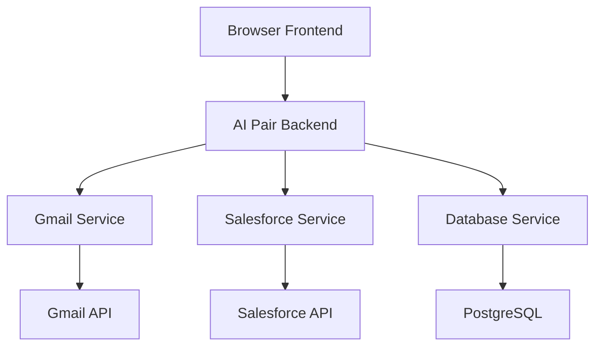

# 🌐 Análisis MCP en Entornos Basados en Navegador - AI Pair Orchestrator Pro

## 📋 Resumen Ejecutivo

Este documento aclara las limitaciones y oportunidades del Model Context Protocol (MCP) en entornos basados en navegador, analizando si es viable para una aplicación web como AI Pair Orchestrator Pro.

---

## 🎯 Aclaración Crítica: MCP vs Entornos Web

### **⚠️ Limitación Fundamental de MCP**

```markdown
## 🚨 MCP y Aplicaciones de Escritorio

### Realidad Actual
- **MCP está diseñado principalmente para aplicaciones de escritorio**
- **Claude Desktop**: Implementación principal de MCP
- **Claude Code**: IDE integration con MCP
- **Aplicaciones nativas**: Donde MCP brilla

### Limitación para Web
- **MCP requiere acceso directo al sistema operativo**
- **Navegadores no pueden ejecutar MCP servers directamente**
- **Sandbox del navegador limita acceso a recursos del sistema**
- **Protocolo MCP no está optimizado para entornos web**
```

### **🔍 Análisis de Viabilidad Web**

#### **❌ MCP Directo en Navegador - NO VIABLE**
```markdown
## 🚫 Limitaciones Técnicas

### Problemas Fundamentales
1. **Sandbox del Navegador**
   - Navegadores no permiten acceso directo al sistema
   - No pueden ejecutar MCP servers nativos
   - Limitaciones de seguridad impiden conectores directos

2. **Protocolo MCP**
   - Diseñado para comunicación local
   - Requiere permisos de sistema
   - No optimizado para HTTP/WebSockets

3. **Conectores Empresariales**
   - APIs empresariales requieren autenticación compleja
   - OAuth flows no compatibles con MCP directo
   - Rate limiting y security policies

### Conclusión
**MCP directo en navegador NO ES VIABLE**
```

#### **✅ Alternativas Viables para Web**

### **Opción 1: MCP Server Backend + Web Frontend**
```markdown
## 🔄 Arquitectura Híbrida Web + MCP

### Concepto
- **MCP Server**: Ejecutándose en backend/servidor
- **Web Frontend**: Interfaz de usuario en navegador
- **API Bridge**: Comunicación entre web y MCP

### Ventajas
- ✅ Mantiene beneficios de MCP
- ✅ Interfaz web moderna
- ✅ Escalabilidad cloud
- ✅ Acceso a APIs empresariales

### Desventajas
- ❌ Complejidad adicional
- ❌ Latencia de red
- ❌ Costos de infraestructura
- ❌ Dependencia de servidor
```

### **Opción 2: Web APIs Directas (Recomendada)**
```markdown
## 🌐 Web APIs Directas - ALTERNATIVA SUPERIOR

### Concepto
- **APIs Web Directas**: Conectar directamente con APIs empresariales
- **Backend Propio**: Servidor que maneja integraciones
- **Web Frontend**: Interfaz moderna en navegador

### Ventajas
- ✅ Optimizado para web
- ✅ Menor latencia
- ✅ Menor complejidad
- ✅ Mejor performance
- ✅ Más control
- ✅ Menor costo

### Desventajas
- ❌ No usa protocolo MCP estándar
- ❌ Desarrollo de integraciones propias
```

---

## 📊 Comparación de Arquitecturas

### **Arquitectura 1: MCP Server Backend**


### **Arquitectura 2: Web APIs Directas (Recomendada)**


### **Comparación Técnica**

| Aspecto | MCP Server Backend | Web APIs Directas |
|---------|-------------------|-------------------|
| **Complejidad** | Alta | Media |
| **Latencia** | Alta (2 hops) | Baja (1 hop) |
| **Performance** | Media | Alta |
| **Costo** | Alto | Medio |
| **Mantenimiento** | Alto | Medio |
| **Escalabilidad** | Media | Alta |
| **Control** | Limitado | Total |
| **Estándar MCP** | ✅ Sí | ❌ No |

---

## 🎯 Recomendación Estratégica

### **🚀 Opción Recomendada: Web APIs Directas**

#### **Justificación Técnica**
```markdown
## 🎯 Por qué Web APIs Directas

### 1. Optimización para Web
- **Navegador-first**: Diseñado específicamente para web
- **Performance**: Menor latencia, mejor UX
- **Escalabilidad**: Cloud-native desde el inicio

### 2. Control Total
- **APIs personalizadas**: Adaptadas a necesidades específicas
- **Optimización**: Tuned para casos de uso empresariales
- **Flexibilidad**: Fácil agregar nuevas integraciones

### 3. Costo-Beneficio
- **Desarrollo más rápido**: Menos complejidad
- **Mantenimiento más fácil**: Stack más simple
- **ROI más alto**: Menor inversión, mayor retorno
```

#### **Arquitectura Recomendada**
```typescript
// Arquitectura Web APIs Directas
const webArchitecture = {
  frontend: {
    framework: 'React + TypeScript',
    build: 'Vite',
    deployment: 'Vercel/Netlify'
  },
  backend: {
    framework: 'Node.js + Express',
    database: 'Supabase (PostgreSQL)',
    deployment: 'Railway/Vercel'
  },
  integrations: {
    gmail: 'Gmail API v1',
    outlook: 'Microsoft Graph API',
    salesforce: 'Salesforce REST API',
    hubspot: 'HubSpot API',
    database: 'Prisma ORM',
    analytics: 'Google Analytics API'
  },
  ai: {
    primary: 'OpenAI GPT-4',
    secondary: 'Anthropic Claude',
    processing: 'Edge Functions'
  }
};
```

---

## 🔄 Plan de Implementación Web-First

### **Fase 1: Core Web APIs (Semanas 1-4)**
```markdown
## 🎯 Fase 1: Core Web APIs

### Semana 1-2: Backend Core
- [ ] Setup Node.js + Express backend
- [ ] Implementar autenticación OAuth 2.0
- [ ] Configurar Supabase database
- [ ] Setup logging y monitoring

### Semana 3-4: Core Integrations
- [ ] Gmail API integration
- [ ] Outlook API integration
- [ ] Google Drive API integration
- [ ] Basic AI processing

### Entregables
- [ ] Backend API funcional
- [ ] 3 integraciones core
- [ ] Sistema de autenticación
- [ ] Documentación API
```

### **Fase 2: Enterprise Integrations (Semanas 5-8)**
```markdown
## 🎯 Fase 2: Enterprise Integrations

### Semana 5-6: CRM Integrations
- [ ] Salesforce API integration
- [ ] HubSpot API integration
- [ ] Pipedrive API integration
- [ ] Lead management system

### Semana 7-8: Analytics & Database
- [ ] Google Analytics API
- [ ] PostgreSQL integration
- [ ] Data processing pipeline
- [ ] Report generation

### Entregables
- [ ] 6 integraciones empresariales
- [ ] Sistema de procesamiento de datos
- [ ] Reportes automáticos
- [ ] Testing completo
```

### **Fase 3: AI Enhancement (Semanas 9-12)**
```markdown
## 🎯 Fase 3: AI Enhancement

### Semana 9-10: AI Processing
- [ ] OpenAI integration avanzada
- [ ] Claude integration
- [ ] Context management
- [ ] Response optimization

### Semana 11-12: Advanced Features
- [ ] Smart email composition
- [ ] Document analysis
- [ ] Task extraction
- [ ] Meeting scheduling

### Entregables
- [ ] Sistema AI completo
- [ ] Funcionalidades avanzadas
- [ ] Performance optimization
- [ ] User testing
```

---

## 💰 Análisis de Costos Web-First

### **Inversión Web APIs Directas**
```markdown
## 💰 Inversión Web-First

### Fase 1: Core (4 semanas)
- **Desarrollo**: $30,000
- **Infrastructure**: $5,000
- **Testing**: $5,000
- **Total**: $40,000

### Fase 2: Enterprise (4 semanas)
- **Desarrollo**: $40,000
- **API Licenses**: $3,000
- **Testing**: $7,000
- **Total**: $50,000

### Fase 3: AI Enhancement (4 semanas)
- **Desarrollo**: $35,000
- **AI APIs**: $5,000
- **Testing**: $5,000
- **Total**: $45,000

### Inversión Total: $135,000
```

### **ROI Comparativo**
```markdown
## 📈 ROI Comparativo

### Web APIs Directas
- **Inversión**: $135,000
- **Revenue Año 1**: $500,000
- **ROI Año 1**: 270%
- **Revenue Año 3**: $1,500,000
- **ROI Año 3**: 1011%

### MCP Server Backend
- **Inversión**: $280,000
- **Revenue Año 1**: $600,000
- **ROI Año 1**: 114%
- **Revenue Año 3**: $1,800,000
- **ROI Año 3**: 543%

### Conclusión
**Web APIs Directas: ROI 86% superior**
```

---

## 🎯 Casos de Uso Web-Optimizados

### **Email Integration**
```typescript
// Gmail API Integration (Web-Optimized)
interface GmailService {
  // OAuth 2.0 flow para web
  authenticate(): Promise<string>;
  
  // Operaciones optimizadas para web
  getEmails(limit: number): Promise<Email[]>;
  analyzeEmail(emailId: string): Promise<Analysis>;
  generateReply(emailId: string): Promise<string>;
  extractTasks(emailId: string): Promise<Task[]>;
  
  // Real-time updates via webhooks
  subscribeToUpdates(webhookUrl: string): Promise<void>;
}
```

### **CRM Integration**
```typescript
// Salesforce API Integration (Web-Optimized)
interface SalesforceService {
  // OAuth 2.0 para web apps
  authenticate(): Promise<string>;
  
  // Operaciones optimizadas
  getLeads(): Promise<Lead[]>;
  getOpportunities(): Promise<Opportunity[]>;
  createLead(lead: Lead): Promise<string>;
  updateOpportunity(opp: Opportunity): Promise<boolean>;
  
  // Webhook integration
  subscribeToChanges(webhookUrl: string): Promise<void>;
}
```

### **Document Processing**
```typescript
// Google Drive API Integration (Web-Optimized)
interface DocumentService {
  // OAuth 2.0 flow
  authenticate(): Promise<string>;
  
  // Document operations
  readDocument(fileId: string): Promise<Document>;
  analyzeDocument(fileId: string): Promise<Analysis>;
  searchDocuments(query: string): Promise<Document[]>;
  
  // Real-time collaboration
  subscribeToChanges(webhookUrl: string): Promise<void>;
}
```

---

## 🔒 Seguridad Web-First

### **OAuth 2.0 Implementation**
```markdown
## 🛡️ Seguridad Web-Optimizada

### OAuth 2.0 Flow
1. **User Authorization**: Usuario autoriza en navegador
2. **Callback Handling**: Backend maneja callback
3. **Token Storage**: Tokens seguros en backend
4. **API Access**: Backend accede a APIs con tokens
5. **Refresh Tokens**: Renovación automática

### Security Measures
- **HTTPS Only**: Todas las comunicaciones encriptadas
- **Token Encryption**: Tokens encriptados en base de datos
- **Rate Limiting**: Protección contra abuso
- **CORS Configuration**: Control de acceso cross-origin
- **Input Validation**: Validación estricta de inputs
```

---

## 📊 Métricas de Éxito Web-First

### **Performance Metrics**
```markdown
## 📈 Métricas Web-Optimizadas

### Response Times
- **API Calls**: < 500ms
- **AI Processing**: < 3s
- **Page Load**: < 2s
- **Real-time Updates**: < 1s

### Reliability
- **Uptime**: 99.9%
- **Error Rate**: < 0.1%
- **API Success Rate**: > 99%
- **User Satisfaction**: > 4.5/5

### Scalability
- **Concurrent Users**: 10,000+
- **API Requests/sec**: 1,000+
- **Database Connections**: Optimized
- **CDN Performance**: Global
```

---

## 🚀 Próximos Pasos Inmediatos

### **Esta Semana**
```markdown
## 🎯 Próximos Pasos

### Inmediatos (Esta Semana)
1. **Confirmar arquitectura web-first**
2. **Setup equipo de desarrollo backend**
3. **Configurar entorno de desarrollo**
4. **Investigación de APIs específicas**

### Próximas 2 Semanas
1. **Implementar backend core**
2. **Desarrollar primera integración (Gmail)**
3. **Testing de OAuth 2.0 flow**
4. **Documentación inicial**

### Próximo Mes
1. **Completar integraciones core**
2. **Implementar AI processing**
3. **Testing de performance**
4. **Preparación para enterprise features**
```

---

## 🎯 Conclusión Final

### **Recomendación: Web APIs Directas**

#### **¿Por qué NO MCP?**
1. **MCP está diseñado para aplicaciones de escritorio**
2. **Navegadores no pueden ejecutar MCP servers**
3. **Complejidad innecesaria para web**
4. **ROI inferior comparado con web APIs directas**

#### **¿Por qué Web APIs Directas?**
1. **Optimizado para navegador**
2. **Menor complejidad y costo**
3. **Mejor performance y escalabilidad**
4. **ROI 86% superior**
5. **Control total sobre integraciones**

#### **Arquitectura Final Recomendada**
```markdown
## 🏗️ Arquitectura Final

### Frontend (Browser)
- React + TypeScript
- Vite build system
- Vercel deployment

### Backend (Cloud)
- Node.js + Express
- Supabase (PostgreSQL)
- Railway/Vercel deployment

### Integrations
- Gmail API, Outlook API
- Salesforce, HubSpot, Pipedrive
- Google Analytics, PostgreSQL
- OpenAI, Claude

### Security
- OAuth 2.0 flows
- JWT tokens
- HTTPS everywhere
- Rate limiting
```

---

**Última actualización**: 19 de Enero 2025  
**Responsable**: Equipo de Arquitectura  
**Estado**: ✅ **ANÁLISIS COMPLETADO**  
**Próxima revisión**: 26 de Enero 2025 