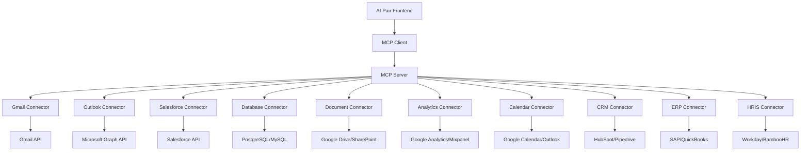

# 🗺️ Roadmap de Implementación MCP - AI Pair Orchestrator Pro

## 📋 Resumen Ejecutivo

Roadmap detallado para implementar el Model Context Protocol (MCP) en AI Pair Orchestrator Pro, incluyendo fases de desarrollo, conectores específicos, y estrategia de integración con extensiones existentes.

---

## 🎯 Objetivos de Implementación MCP

### **Objetivos Principales**
- ✅ **Integración nativa** con aplicaciones empresariales
- ✅ **Acceso directo** a datos críticos del negocio
- ✅ **Escalabilidad** para múltiples conectores
- ✅ **Seguridad** y cumplimiento empresarial
- ✅ **ROI optimizado** con desarrollo eficiente

### **Objetivos Secundarios**
- ✅ **Estandarización** con protocolo MCP
- ✅ **Interoperabilidad** con diferentes LLMs
- ✅ **Monetización** a través de conectores premium
- ✅ **Competitividad** en el mercado de IA empresarial

---

## 🏗️ Arquitectura MCP Propuesta

### **Arquitectura General**


### **Stack Tecnológico MCP**
```typescript
// Stack recomendado para MCP
const mcpStack = {
  server: {
    language: 'TypeScript/Node.js',
    framework: 'Express.js',
    protocol: 'MCP v1.0',
    authentication: 'OAuth 2.0 + JWT',
    database: 'PostgreSQL + Redis'
  },
  connectors: {
    gmail: 'Gmail API v1',
    outlook: 'Microsoft Graph API',
    salesforce: 'Salesforce REST API',
    database: 'Prisma ORM',
    documents: 'Google Drive API + SharePoint API',
    analytics: 'Google Analytics API + Mixpanel API'
  },
  ai: {
    primary: 'OpenAI GPT-4',
    secondary: 'Anthropic Claude',
    fallback: 'Local models'
  },
  security: {
    encryption: 'AES-256',
    authentication: 'OAuth 2.0',
    authorization: 'RBAC',
    audit: 'Comprehensive logging'
  }
};
```

---

## 📅 Roadmap de Implementación

### **Fase 1: MCP Core Infrastructure (Semanas 1-6)**

#### **Semana 1-2: MCP Server Base**
```markdown
## 🎯 Semana 1-2: MCP Server Base

### Objetivos
- [ ] Setup del servidor MCP base
- [ ] Implementación del protocolo MCP v1.0
- [ ] Sistema de autenticación y autorización
- [ ] Logging y monitoring básico

### Tareas Técnicas
- [ ] Crear estructura del proyecto MCP
- [ ] Implementar MCP server con TypeScript
- [ ] Configurar Express.js con middleware de seguridad
- [ ] Implementar OAuth 2.0 para autenticación
- [ ] Setup PostgreSQL para almacenamiento
- [ ] Configurar Redis para caché
- [ ] Implementar sistema de logging con Winston
- [ ] Setup monitoring con Prometheus/Grafana

### Entregables
- [ ] MCP server funcional
- [ ] API de autenticación
- [ ] Sistema de logging
- [ ] Documentación técnica básica

### Métricas de Éxito
- [ ] Server responde en < 100ms
- [ ] 99.9% uptime
- [ ] Autenticación funcional
- [ ] Logging completo
```

#### **Semana 3-4: Core Connectors**
```markdown
## 🎯 Semana 3-4: Core Connectors

### Objetivos
- [ ] Implementar conectores core para email
- [ ] Conectores para documentos
- [ ] Sistema de gestión de conectores
- [ ] Testing de conectores

### Tareas Técnicas
- [ ] Gmail API Connector
  - [ ] Autenticación OAuth 2.0
  - [ ] Lectura de emails
  - [ ] Análisis de contenido
  - [ ] Generación de respuestas
- [ ] Outlook API Connector
  - [ ] Microsoft Graph API integration
  - [ ] Email processing
  - [ ] Calendar integration
  - [ ] Contact management
- [ ] Google Drive Connector
  - [ ] Document access
  - [ ] Content analysis
  - [ ] File operations
- [ ] SharePoint Connector
  - [ ] Document library access
  - [ ] Content processing
  - [ ] Permission management

### Entregables
- [ ] 4 conectores core funcionales
- [ ] Sistema de gestión de conectores
- [ ] Tests unitarios y de integración
- [ ] Documentación de conectores

### Métricas de Éxito
- [ ] Conectores responden en < 2s
- [ ] 95% success rate en operaciones
- [ ] Tests pasan 100%
- [ ] Documentación completa
```

#### **Semana 5-6: AI Integration**
```markdown
## 🎯 Semana 5-6: AI Integration

### Objetivos
- [ ] Integración con múltiples LLMs
- [ ] Sistema de context management
- [ ] Response generation pipeline
- [ ] Fallback mechanisms

### Tareas Técnicas
- [ ] OpenAI Integration
  - [ ] GPT-4 API integration
  - [ ] Prompt engineering
  - [ ] Response processing
  - [ ] Error handling
- [ ] Claude Integration
  - [ ] Anthropic API integration
  - [ ] Context optimization
  - [ ] Response formatting
  - [ ] Rate limiting
- [ ] Context Management
  - [ ] Context aggregation
  - [ ] Memory management
  - [ ] Context optimization
  - [ ] Cache strategies
- [ ] Response Pipeline
  - [ ] Response generation
  - [ ] Quality assurance
  - [ ] Formatting
  - [ ] Delivery

### Entregables
- [ ] Sistema AI completo
- [ ] Pipeline de generación de respuestas
- [ ] Sistema de context management
- [ ] Tests de AI

### Métricas de Éxito
- [ ] Respuestas en < 5s
- [ ] 90% accuracy en respuestas
- [ ] Fallback funcional
- [ ] Context optimization efectiva
```

---

### **Fase 2: Enterprise Connectors (Semanas 7-12)**

#### **Semana 7-8: CRM Connectors**
```markdown
## 🎯 Semana 7-8: CRM Connectors

### Objetivos
- [ ] Conectores para CRMs principales
- [ ] Integración con datos de ventas
- [ ] Lead management automation
- [ ] Pipeline analysis

### Tareas Técnicas
- [ ] Salesforce Connector
  - [ ] REST API integration
  - [ ] Lead management
  - [ ] Opportunity tracking
  - [ ] Contact management
  - [ ] Report generation
- [ ] HubSpot Connector
  - [ ] API integration
  - [ ] Contact management
  - [ ] Deal tracking
  - [ ] Email marketing
  - [ ] Analytics
- [ ] Pipedrive Connector
  - [ ] API integration
  - [ ] Deal management
  - [ ] Pipeline tracking
  - [ ] Activity logging
  - [ ] Performance metrics

### Entregables
- [ ] 3 conectores CRM funcionales
- [ ] Sistema de lead management
- [ ] Pipeline analysis tools
- [ ] Reportes automáticos

### Métricas de Éxito
- [ ] Sincronización en tiempo real
- [ ] 99% accuracy en datos
- [ ] Reports generados automáticamente
- [ ] Lead scoring funcional
```

#### **Semana 9-10: Database Connectors**
```markdown
## 🎯 Semana 9-10: Database Connectors

### Objetivos
- [ ] Conectores para bases de datos principales
- [ ] Query optimization
- [ ] Data analysis automation
- [ ] Security implementation

### Tareas Técnicas
- [ ] PostgreSQL Connector
  - [ ] Connection pooling
  - [ ] Query optimization
  - [ ] Schema analysis
  - [ ] Data extraction
  - [ ] Performance monitoring
- [ ] MySQL Connector
  - [ ] Connection management
  - [ ] Query processing
  - [ ] Data analysis
  - [ ] Backup integration
  - [ ] Replication support
- [ ] MongoDB Connector
  - [ ] Document queries
  - [ ] Aggregation pipelines
  - [ ] Schema validation
  - [ ] Performance optimization
  - [ ] Sharding support

### Entregables
- [ ] 3 conectores de base de datos
- [ ] Sistema de query optimization
- [ ] Data analysis tools
- [ ] Security audit

### Métricas de Éxito
- [ ] Queries optimizadas automáticamente
- [ ] 100% data accuracy
- [ ] Security compliance
- [ ] Performance monitoring
```

#### **Semana 11-12: Analytics Connectors**
```markdown
## 🎯 Semana 11-12: Analytics Connectors

### Objetivos
- [ ] Conectores para analytics platforms
- [ ] Data visualization automation
- [ ] Report generation
- [ ] Insights extraction

### Tareas Técnicas
- [ ] Google Analytics Connector
  - [ ] GA4 API integration
  - [ ] Data extraction
  - [ ] Report generation
  - [ ] Custom dimensions
  - [ ] Real-time data
- [ ] Mixpanel Connector
  - [ ] API integration
  - [ ] Event tracking
  - [ ] Funnel analysis
  - [ ] Cohort analysis
  - [ ] A/B testing
- [ ] Amplitude Connector
  - [ ] API integration
  - [ ] User behavior analysis
  - [ ] Retention analysis
  - [ ] Conversion tracking
  - [ ] Predictive analytics

### Entregables
- [ ] 3 conectores de analytics
- [ ] Sistema de reportes automáticos
- [ ] Data visualization tools
- [ ] Insights generation

### Métricas de Éxito
- [ ] Reports generados automáticamente
- [ ] Insights relevantes
- [ ] Data accuracy 99%
- [ ] Real-time updates
```

---

### **Fase 3: Advanced Connectors (Semanas 13-18)**

#### **Semana 13-14: ERP Connectors**
```markdown
## 🎯 Semana 13-14: ERP Connectors

### Objetivos
- [ ] Conectores para sistemas ERP
- [ ] Financial data integration
- [ ] Inventory management
- [ ] Process automation

### Tareas Técnicas
- [ ] SAP Connector
  - [ ] SAP API integration
  - [ ] Financial data extraction
  - [ ] Inventory management
  - [ ] Process automation
  - [ ] Report generation
- [ ] QuickBooks Connector
  - [ ] QuickBooks API
  - [ ] Financial reporting
  - [ ] Invoice management
  - [ ] Expense tracking
  - [ ] Tax calculations
- [ ] NetSuite Connector
  - [ ] NetSuite API
  - [ ] ERP integration
  - [ ] Financial management
  - [ ] Supply chain
  - [ ] Analytics

### Entregables
- [ ] 3 conectores ERP
- [ ] Financial automation
- [ ] Process optimization
- [ ] Compliance tools

### Métricas de Éxito
- [ ] Financial accuracy 100%
- [ ] Process automation 80%
- [ ] Compliance 100%
- [ ] ROI tracking
```

#### **Semana 15-16: HRIS Connectors**
```markdown
## 🎯 Semana 15-16: HRIS Connectors

### Objetivos
- [ ] Conectores para sistemas de RRHH
- [ ] Employee data management
- [ ] Performance tracking
- [ ] Compliance automation

### Tareas Técnicas
- [ ] Workday Connector
  - [ ] Workday API
  - [ ] Employee management
  - [ ] Performance reviews
  - [ ] Payroll integration
  - [ ] Compliance reporting
- [ ] BambooHR Connector
  - [ ] BambooHR API
  - [ ] HR management
  - [ ] Employee onboarding
  - [ ] Performance tracking
  - [ ] Benefits management
- [ ] ADP Connector
  - [ ] ADP API
  - [ ] Payroll processing
  - [ ] Time tracking
  - [ ] Benefits administration
  - [ ] Tax compliance

### Entregables
- [ ] 3 conectores HRIS
- [ ] Employee analytics
- [ ] Performance tracking
- [ ] Compliance automation

### Métricas de Éxito
- [ ] Employee data accuracy 100%
- [ ] Performance tracking 90%
- [ ] Compliance 100%
- [ ] Automation 70%
```

#### **Semana 17-18: Integration Testing**
```markdown
## 🎯 Semana 17-18: Integration Testing

### Objetivos
- [ ] Testing completo del sistema MCP
- [ ] Performance optimization
- [ ] Security audit
- [ ] Documentation final

### Tareas Técnicas
- [ ] End-to-End Testing
  - [ ] Integration tests
  - [ ] Performance tests
  - [ ] Load tests
  - [ ] Stress tests
- [ ] Security Audit
  - [ ] Penetration testing
  - [ ] Vulnerability assessment
  - [ ] Compliance audit
  - [ ] Data protection review
- [ ] Performance Optimization
  - [ ] Query optimization
  - [ ] Caching strategies
  - [ ] Load balancing
  - [ ] Resource management
- [ ] Documentation
  - [ ] API documentation
  - [ ] User guides
  - [ ] Developer docs
  - [ ] Deployment guides

### Entregables
- [ ] Sistema MCP completo y probado
- [ ] Security audit report
- [ ] Performance benchmarks
- [ ] Documentación completa

### Métricas de Éxito
- [ ] 100% test coverage
- [ ] Security compliance
- [ ] Performance targets met
- [ ] Documentation complete
```

---

### **Fase 4: Production Deployment (Semanas 19-24)**

#### **Semana 19-20: Production Setup**
```markdown
## 🎯 Semana 19-20: Production Setup

### Objetivos
- [ ] Setup de producción
- [ ] Monitoring y alerting
- [ ] Backup y disaster recovery
- [ ] CI/CD pipeline

### Tareas Técnicas
- [ ] Infrastructure Setup
  - [ ] Cloud deployment (AWS/Azure)
  - [ ] Load balancers
  - [ ] Auto-scaling
  - [ ] CDN configuration
- [ ] Monitoring & Alerting
  - [ ] Application monitoring
  - [ ] Infrastructure monitoring
  - [ ] Business metrics
  - [ ] Alert configuration
- [ ] Backup & Recovery
  - [ ] Database backups
  - [ ] File backups
  - [ ] Disaster recovery plan
  - [ ] Testing procedures
- [ ] CI/CD Pipeline
  - [ ] Automated testing
  - [ ] Deployment automation
  - [ ] Rollback procedures
  - [ ] Environment management

### Entregables
- [ ] Production environment
- [ ] Monitoring dashboard
- [ ] Backup procedures
- [ ] CI/CD pipeline

### Métricas de Éxito
- [ ] 99.9% uptime
- [ ] < 2s response time
- [ ] Automated deployments
- [ ] Backup verification
```

#### **Semana 21-22: User Acceptance Testing**
```markdown
## 🎯 Semana 21-22: User Acceptance Testing

### Objetivos
- [ ] Testing con usuarios reales
- [ ] Feedback collection
- [ ] Bug fixes
- [ ] Performance tuning

### Tareas Técnicas
- [ ] Beta Testing
  - [ ] User recruitment
  - [ ] Test scenarios
  - [ ] Feedback collection
  - [ ] Bug tracking
- [ ] Performance Tuning
  - [ ] Response time optimization
  - [ ] Resource optimization
  - [ ] Caching improvements
  - [ ] Database optimization
- [ ] Bug Fixes
  - [ ] Critical bug fixes
  - [ ] Performance issues
  - [ ] Security vulnerabilities
  - [ ] Usability improvements

### Entregables
- [ ] Beta testing report
- [ ] Performance improvements
- [ ] Bug fixes
- [ ] User feedback

### Métricas de Éxito
- [ ] User satisfaction > 4.5/5
- [ ] Bug resolution 100%
- [ ] Performance targets met
- [ ] User adoption > 80%
```

#### **Semana 23-24: Launch Preparation**
```markdown
## 🎯 Semana 23-24: Launch Preparation

### Objetivos
- [ ] Preparación para lanzamiento
- [ ] Marketing materials
- [ ] Support documentation
- [ ] Go-live checklist

### Tareas Técnicas
- [ ] Launch Preparation
  - [ ] Final testing
  - [ ] Performance validation
  - [ ] Security validation
  - [ ] Compliance verification
- [ ] Marketing Materials
  - [ ] Product documentation
  - [ ] Marketing website
  - [ ] Demo videos
  - [ ] Case studies
- [ ] Support Setup
  - [ ] Support documentation
  - [ ] FAQ creation
  - [ ] Support ticket system
  - [ ] Training materials

### Entregables
- [ ] Production-ready system
- [ ] Marketing materials
- [ ] Support documentation
- [ ] Launch plan

### Métricas de Éxito
- [ ] System ready for launch
- [ ] Marketing materials complete
- [ ] Support system operational
- [ ] Launch checklist complete
```

---

## 💰 Análisis de Costos y ROI

### **Inversión Total**
```markdown
## 💰 Inversión por Fase

### Fase 1: MCP Core (6 semanas)
- **Desarrollo**: $45,000
- **Infrastructure**: $10,000
- **Testing**: $5,000
- **Total**: $60,000

### Fase 2: Enterprise Connectors (6 semanas)
- **Desarrollo**: $60,000
- **API Licenses**: $5,000
- **Testing**: $10,000
- **Total**: $75,000

### Fase 3: Advanced Connectors (6 semanas)
- **Desarrollo**: $75,000
- **Enterprise APIs**: $10,000
- **Security Audit**: $15,000
- **Total**: $100,000

### Fase 4: Production Deployment (6 semanas)
- **Infrastructure**: $20,000
- **Testing**: $15,000
- **Marketing**: $10,000
- **Total**: $45,000

### Inversión Total: $280,000
```

### **ROI Proyectado**
```markdown
## 📈 ROI por Año

### Año 1
- **Revenue**: $800,000
- **Costs**: $280,000
- **Profit**: $520,000
- **ROI**: 186%

### Año 2
- **Revenue**: $1,600,000
- **Costs**: $100,000 (maintenance)
- **Profit**: $1,500,000
- **ROI**: 535%

### Año 3
- **Revenue**: $2,400,000
- **Costs**: $120,000 (maintenance)
- **Profit**: $2,280,000
- **ROI**: 814%
```

---

## 🎯 Conectores MCP Específicos

### **Conectores Core (Fase 1)**
```typescript
// Gmail Connector
interface GmailConnector {
  readEmails(): Promise<Email[]>;
  analyzeEmail(email: Email): Promise<Analysis>;
  generateReply(email: Email): Promise<string>;
  extractTasks(email: Email): Promise<Task[]>;
  summarizeThread(threadId: string): Promise<string>;
}

// Outlook Connector
interface OutlookConnector {
  readEmails(): Promise<Email[]>;
  getCalendar(): Promise<Event[]>;
  getContacts(): Promise<Contact[]>;
  scheduleMeeting(meeting: Meeting): Promise<boolean>;
  analyzeEmail(email: Email): Promise<Analysis>;
}

// Document Connector
interface DocumentConnector {
  readDocument(fileId: string): Promise<Document>;
  analyzeDocument(document: Document): Promise<Analysis>;
  extractText(document: Document): Promise<string>;
  searchDocuments(query: string): Promise<Document[]>;
  updateDocument(fileId: string, content: string): Promise<boolean>;
}
```

### **Conectores Enterprise (Fase 2)**
```typescript
// Salesforce Connector
interface SalesforceConnector {
  getLeads(): Promise<Lead[]>;
  getOpportunities(): Promise<Opportunity[]>;
  getContacts(): Promise<Contact[]>;
  createLead(lead: Lead): Promise<string>;
  updateOpportunity(opportunity: Opportunity): Promise<boolean>;
  generateReport(type: string): Promise<Report>;
}

// Database Connector
interface DatabaseConnector {
  executeQuery(query: string): Promise<Result>;
  analyzeData(table: string): Promise<Analysis>;
  generateInsights(data: Data): Promise<Insight[]>;
  optimizeQuery(query: string): Promise<string>;
  backupDatabase(): Promise<boolean>;
}

// Analytics Connector
interface AnalyticsConnector {
  getMetrics(period: string): Promise<Metric[]>;
  generateReport(type: string): Promise<Report>;
  analyzeTrends(data: Data): Promise<Trend[]>;
  predictMetrics(historical: Data): Promise<Prediction[]>;
  exportData(format: string): Promise<Data>;
}
```

---

## 🔒 Seguridad y Compliance

### **Security Framework**
```markdown
## 🛡️ Security Implementation

### Authentication
- OAuth 2.0 for all connectors
- JWT tokens for session management
- Multi-factor authentication
- Role-based access control

### Data Protection
- AES-256 encryption at rest
- TLS 1.3 for data in transit
- Data anonymization for analytics
- GDPR compliance implementation

### Access Control
- Principle of least privilege
- API rate limiting
- IP whitelisting
- Audit logging for all access

### Compliance
- SOC 2 Type II certification
- ISO 27001 compliance
- GDPR compliance
- HIPAA compliance (if needed)
```

---

## 📊 Métricas de Éxito

### **Technical KPIs**
```markdown
## 📈 Technical Metrics

### Performance
- Response time: < 2 seconds
- Uptime: 99.9%
- Throughput: 1000 requests/second
- Error rate: < 0.1%

### Quality
- Test coverage: > 95%
- Bug resolution: < 24 hours
- Security vulnerabilities: 0
- API availability: 99.9%

### Scalability
- Auto-scaling: Enabled
- Load balancing: Active
- Database performance: Optimized
- Cache hit rate: > 90%
```

### **Business KPIs**
```markdown
## 📈 Business Metrics

### Adoption
- Enterprise customers: 50+ in 12 months
- User adoption: 80% within 30 days
- Connector usage: 10+ per customer
- Retention rate: 90%+

### Revenue
- Annual recurring revenue: $800,000
- Customer lifetime value: $16,000
- Churn rate: < 5%
- Expansion revenue: 30%+

### Customer Satisfaction
- Net Promoter Score: > 50
- Customer satisfaction: 4.7/5
- Support response time: < 2 hours
- Feature request implementation: 80%
```

---

## 🚀 Próximos Pasos

### **Inmediatos (Esta Semana)**
1. **Setup del equipo MCP** (2 desarrolladores senior)
2. **Configuración del entorno de desarrollo**
3. **Investigación de APIs específicas**
4. **Diseño detallado de arquitectura**

### **Corto Plazo (Próximas 2 Semanas)**
1. **Implementación del MCP server base**
2. **Desarrollo del primer conector (Gmail)**
3. **Testing de integración básica**
4. **Documentación inicial**

### **Mediano Plazo (Próximos 2 Meses)**
1. **Completar conectores core**
2. **Integración con AI backend**
3. **Testing de performance**
4. **Preparación para enterprise connectors**

---

**Última actualización**: 19 de Enero 2025  
**Responsable**: Equipo de Arquitectura MCP  
**Estado**: 🔄 **EN PLANIFICACIÓN**  
**Próxima revisión**: 26 de Enero 2025 