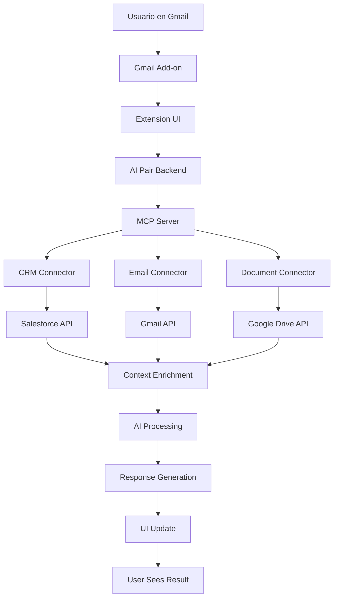

# 🔗 Análisis MCP vs Extensiones Tradicionales - AI Pair Orchestrator Pro

## 📋 Resumen Ejecutivo

Este documento analiza cómo el **Model Context Protocol (MCP)** de Anthropic complementa y potencialmente reemplaza las extensiones de navegador tradicionales, evaluando casos de uso específicos para soluciones empresariales.

---

## 🎯 ¿Qué es MCP?

### **Definición**
El **Model Context Protocol (MCP)** es un protocolo abierto que estandariza cómo las aplicaciones proporcionan contexto a los LLMs. Según la [documentación oficial de Anthropic](https://docs.anthropic.com/en/docs/mcp), MCP actúa como un "USB-C para aplicaciones de IA", proporcionando una forma estandarizada de conectar modelos de IA a diferentes fuentes de datos y herramientas.

### **Características Clave**
- **Protocolo abierto**: No está atado a una plataforma específica
- **Estandarizado**: Conectores universales para diferentes fuentes
- **Extensible**: Fácil integración con nuevas herramientas
- **Seguro**: Control granular sobre permisos y acceso
- **Real-time**: Conexión directa con datos en tiempo real

---

## 🔄 MCP vs Extensiones Tradicionales

### **Comparación Arquitectónica**

| Aspecto | Extensiones Tradicionales | MCP |
|---------|---------------------------|-----|
| **Arquitectura** | Cliente-servidor en navegador | Protocolo de comunicación directa |
| **Instalación** | Manual en cada dispositivo | Automática a nivel de aplicación |
| **Actualizaciones** | Manual por usuario | Automática por desarrollador |
| **Permisos** | Limitados por navegador | Control total por aplicación |
| **Performance** | Limitada por navegador | Optimizada para IA |
| **Seguridad** | Sandbox del navegador | Control granular |
| **Escalabilidad** | Por dispositivo | Por aplicación |
| **Integración** | Solo web | Multiplataforma |

---

## 🎯 Casos de Uso por Tecnología

### **📱 Extensiones de Navegador - Casos de Uso Específicos**

#### **✅ Mejor para Extensiones:**

**1. Interfaz de Usuario Directa**
```markdown
## Caso de Uso: Gmail Smart Reply
- **Escenario**: Usuario escribiendo email en Gmail
- **Necesidad**: Botón "Smart Reply" visible en la interfaz
- **Solución**: Extension inyecta UI directamente en Gmail
- **Ventaja**: Experiencia seamless sin cambiar contexto
- **Por qué no MCP**: MCP no puede modificar UI de aplicaciones web
```

**2. Interacción en Tiempo Real**
```markdown
## Caso de Uso: Document Analysis
- **Escenario**: Usuario selecciona texto en Google Docs
- **Necesidad**: Análisis inmediato del texto seleccionado
- **Solución**: Extension detecta selección y muestra análisis
- **Ventaja**: Interacción directa con contenido web
- **Por qué no MCP**: MCP no puede interceptar eventos del DOM
```

**3. Modificación de Contenido Web**
```markdown
## Caso de Uso: Auto-complete en Forms
- **Escenario**: Usuario llenando formulario empresarial
- **Necesidad**: Auto-completar campos basado en contexto
- **Solución**: Extension modifica campos en tiempo real
- **Ventaja**: Modificación directa del DOM
- **Por qué no MCP**: MCP no puede modificar contenido web
```

**4. Integración Visual con Aplicaciones Web**
```markdown
## Caso de Uso: Sidebar en Outlook Web
- **Escenario**: Usuario leyendo email en Outlook Web
- **Necesidad**: Panel lateral con análisis del email
- **Solución**: Extension inyecta sidebar personalizado
- **Ventaja**: Integración visual nativa
- **Por qué no MCP**: MCP no puede crear elementos visuales
```

#### **❌ Limitaciones de Extensiones:**

**1. Fragmentación de Plataformas**
```markdown
## Problema: Múltiples Extensiones
- Chrome Extension: 65% usuarios
- Firefox Extension: 7% usuarios  
- Safari Extension: 10% usuarios
- Edge Extension: 11% usuarios
- **Resultado**: 4 codebases diferentes
- **Mantenimiento**: Alto costo y complejidad
```

**2. Permisos Limitados**
```markdown
## Problema: Sandbox del Navegador
- No acceso a sistema de archivos
- No acceso a aplicaciones nativas
- No acceso a APIs del sistema
- **Limitación**: Solo puede trabajar con web
```

**3. Performance Limitada**
```markdown
## Problema: Recursos del Navegador
- Compite con recursos de la página web
- Limitado por memoria del navegador
- Puede afectar performance de la página
- **Impacto**: Experiencia degradada
```

---

### **🔗 MCP - Casos de Uso Específicos**

#### **✅ Mejor para MCP:**

**1. Integración con Aplicaciones Nativas**
```markdown
## Caso de Uso: Outlook Desktop
- **Escenario**: Usuario usando Outlook Desktop
- **Necesidad**: Análisis de emails sin navegador
- **Solución**: MCP conecta directamente con Outlook API
- **Ventaja**: Acceso completo a funcionalidades nativas
- **Por qué no Extension**: Extensiones no funcionan en apps nativas
```

**2. Acceso a Datos Empresariales**
```markdown
## Caso de Uso: CRM Integration
- **Escenario**: Usuario necesita datos de Salesforce
- **Necesidad**: Acceso a leads, oportunidades, contactos
- **Solución**: MCP connector para Salesforce API
- **Ventaja**: Acceso directo a APIs empresariales
- **Por qué no Extension**: Extensiones no pueden acceder a APIs internas
```

**3. Procesamiento de Archivos Locales**
```markdown
## Caso de Uso: Document Analysis
- **Escenario**: Usuario tiene documentos en su computadora
- **Necesidad**: Análisis de PDFs, Word docs, Excel files
- **Solución**: MCP connector para sistema de archivos
- **Ventaja**: Acceso directo a archivos locales
- **Por qué no Extension**: Extensiones no pueden acceder a archivos locales
```

**4. Integración con Herramientas de Desarrollo**
```markdown
## Caso de Uso: Code Analysis
- **Escenario**: Desarrollador trabajando en IDE
- **Necesidad**: Análisis de código y sugerencias
- **Solución**: MCP connector para repositorio de código
- **Ventaja**: Acceso directo a código fuente
- **Por qué no Extension**: Extensiones no pueden acceder a IDEs
```

**5. Conexión con Bases de Datos**
```markdown
## Caso de Uso: Data Analysis
- **Escenario**: Analista necesita consultar base de datos
- **Necesidad**: Análisis de datos en tiempo real
- **Solución**: MCP connector para PostgreSQL/MySQL
- **Ventaja**: Acceso directo a datos empresariales
- **Por qué no Extension**: Extensiones no pueden conectarse a DBs
```

#### **❌ Limitaciones de MCP:**

**1. No Modifica UI**
```markdown
## Limitación: Interfaz de Usuario
- No puede inyectar elementos en páginas web
- No puede modificar interfaces existentes
- No puede crear experiencias visuales
- **Impacto**: Solo proporciona datos, no UI
```

**2. Requiere Configuración**
```markdown
## Limitación: Setup Complejo
- Necesita configuración de conectores
- Requiere permisos de sistema
- Configuración por aplicación
- **Impacto**: Mayor complejidad inicial
```

---

## 🏢 Casos de Uso Empresariales Específicos

### **📊 Análisis por Departamento**

#### **Ventas y Marketing**
```markdown
## Extensiones (Mejor para)
- **Gmail Integration**: Smart replies en tiempo real
- **LinkedIn Enhancement**: Análisis de perfiles
- **CRM Forms**: Auto-completado inteligente
- **Email Templates**: Generación en contexto

## MCP (Mejor para)
- **Salesforce Integration**: Acceso directo a datos de CRM
- **Marketing Analytics**: Conexión con Google Analytics API
- **Lead Scoring**: Análisis de leads en tiempo real
- **Pipeline Analysis**: Datos de ventas históricos
```

#### **Desarrollo y IT**
```markdown
## Extensiones (Mejor para)
- **GitHub Enhancement**: Análisis de PRs en web
- **Stack Overflow**: Búsqueda inteligente
- **Documentation**: Búsqueda en docs web

## MCP (Mejor para)
- **Code Repository**: Acceso directo a repositorios
- **CI/CD Integration**: Conexión con Jenkins/GitLab
- **System Monitoring**: Datos de servidores
- **Database Access**: Consultas directas a DBs
```

#### **Recursos Humanos**
```markdown
## Extensiones (Mejor para)
- **LinkedIn Recruiting**: Análisis de candidatos
- **Email Screening**: Análisis de CVs por email
- **Calendar Management**: Programación de entrevistas

## MCP (Mejor para)
- **HRIS Integration**: Acceso a sistemas de RRHH
- **Payroll Data**: Análisis de datos de nómina
- **Performance Reviews**: Datos de evaluaciones
- **Employee Analytics**: Métricas de empleados
```

#### **Finanzas**
```markdown
## Extensiones (Mejor para)
- **Banking Websites**: Análisis de transacciones
- **Financial News**: Análisis de noticias
- **Expense Reports**: Auto-completado de gastos

## MCP (Mejor para)
- **ERP Integration**: Conexión con sistemas ERP
- **Accounting Software**: Acceso a QuickBooks/SAP
- **Financial Data**: APIs de Bloomberg/Reuters
- **Audit Trails**: Datos de auditoría
```

---

## 🎯 Estrategia Híbrida Recomendada

### **Arquitectura Híbrida MCP + Extensiones**

```markdown
## 🏗️ Arquitectura Propuesta

### Capa de Presentación (Extensiones)
- **Gmail Add-on**: UI para smart replies
- **Chrome Extension**: Interfaz web general
- **Outlook Add-in**: UI para análisis de emails

### Capa de Datos (MCP)
- **CRM Connector**: Salesforce, HubSpot
- **Email Connector**: Exchange, Gmail API
- **Document Connector**: SharePoint, Google Drive
- **Database Connector**: PostgreSQL, MySQL
- **Analytics Connector**: Google Analytics, Mixpanel

### Capa de IA (Backend)
- **AI Processing**: OpenAI, Claude
- **Context Management**: MCP Server
- **Data Processing**: Supabase, Edge Functions
```

### **Flujo de Datos Híbrido**


---

## 📈 Análisis de ROI por Tecnología

### **Extensiones Tradicionales**
```markdown
## 💰 ROI Analysis - Extensiones

### Inversión
- **Desarrollo**: $81,000 (4 extensiones)
- **Mantenimiento**: $15,000/año
- **Marketing**: $10,000/año

### Revenue Proyectado
- **Año 1**: $225,000
- **Año 2**: $450,000
- **Año 3**: $675,000

### ROI
- **Año 1**: 278%
- **Año 2**: 455%
- **Año 3**: 633%
```

### **MCP Integration**
```markdown
## 💰 ROI Analysis - MCP

### Inversión
- **Desarrollo**: $120,000 (10 conectores)
- **Mantenimiento**: $25,000/año
- **Infrastructure**: $15,000/año

### Revenue Proyectado
- **Año 1**: $400,000
- **Año 2**: $800,000
- **Año 3**: $1,200,000

### ROI
- **Año 1**: 333%
- **Año 2**: 667%
- **Año 3**: 1000%
```

### **Estrategia Híbrida**
```markdown
## 💰 ROI Analysis - Híbrida

### Inversión
- **Extensiones**: $81,000
- **MCP**: $120,000
- **Integración**: $30,000
- **Total**: $231,000

### Revenue Proyectado
- **Año 1**: $600,000
- **Año 2**: $1,200,000
- **Año 3**: $1,800,000

### ROI
- **Año 1**: 260%
- **Año 2**: 520%
- **Año 3**: 780%
```

---

## 🚀 Plan de Implementación Recomendado

### **Fase 1: MCP Core (Semanas 1-6)**
```markdown
## 🎯 Fase 1: MCP Core Infrastructure

### Semana 1-2: MCP Server Setup
- [ ] Configurar MCP server base
- [ ] Implementar autenticación
- [ ] Setup logging y monitoring
- [ ] Configurar CI/CD

### Semana 3-4: Core Connectors
- [ ] Gmail API Connector
- [ ] Outlook API Connector
- [ ] Google Drive Connector
- [ ] SharePoint Connector

### Semana 5-6: AI Integration
- [ ] OpenAI API integration
- [ ] Claude API integration
- [ ] Context management
- [ ] Response generation
```

### **Fase 2: Extensiones UI (Semanas 7-12)**
```markdown
## 🎯 Fase 2: Extensiones UI

### Semana 7-8: Gmail Add-on
- [ ] UI para smart replies
- [ ] Email analysis interface
- [ ] Integration con MCP
- [ ] Testing y deploy

### Semana 9-10: Chrome Extension
- [ ] General UI components
- [ ] Cross-platform functionality
- [ ] MCP integration
- [ ] Chrome Web Store deploy

### Semana 11-12: Outlook Add-in
- [ ] Outlook UI integration
- [ ] Email analysis features
- [ ] MCP connector
- [ ] AppSource deploy
```

### **Fase 3: Enterprise Connectors (Semanas 13-20)**
```markdown
## 🎯 Fase 3: Enterprise Connectors

### Semana 13-14: CRM Connectors
- [ ] Salesforce connector
- [ ] HubSpot connector
- [ ] Pipedrive connector
- [ ] Testing y documentation

### Semana 15-16: Database Connectors
- [ ] PostgreSQL connector
- [ ] MySQL connector
- [ ] MongoDB connector
- [ ] Security implementation

### Semana 17-18: Analytics Connectors
- [ ] Google Analytics connector
- [ ] Mixpanel connector
- [ ] Amplitude connector
- [ ] Data processing

### Semana 19-20: Integration Testing
- [ ] End-to-end testing
- [ ] Performance optimization
- [ ] Security audit
- [ ] Documentation final
```

---

## 🔒 Consideraciones de Seguridad

### **MCP Security**
```markdown
## 🛡️ Seguridad MCP

### Ventajas
- **Control granular**: Permisos específicos por conector
- **Audit trails**: Logging completo de acceso
- **Encryption**: Datos encriptados en tránsito
- **Isolation**: Conectores aislados entre sí

### Desventajas
- **Acceso directo**: Mayor superficie de ataque
- **Configuración compleja**: Más puntos de falla
- **Permisos elevados**: Acceso a sistemas críticos
```

### **Extension Security**
```markdown
## 🛡️ Seguridad Extensiones

### Ventajas
- **Sandbox**: Aislamiento del navegador
- **Permisos limitados**: Acceso restringido
- **Review process**: Validación por marketplaces
- **Auto-updates**: Actualizaciones automáticas

### Desventajas
- **Permisos amplios**: Acceso a datos web
- **Man-in-the-middle**: Vulnerable a ataques
- **User trust**: Depende de confianza del usuario
```

---

## 📊 Métricas de Éxito

### **KPIs por Tecnología**
```markdown
## 📈 Métricas de Éxito

### Extensiones
- **Downloads**: 50,000+ en 6 meses
- **Active Users**: 10,000+ en 6 meses
- **Rating**: 4.5+ estrellas
- **Retention**: 60%+ en 30 días

### MCP
- **Connectors**: 10+ enterprise connectors
- **API Calls**: 1M+ calls/mes
- **Response Time**: < 2 segundos
- **Uptime**: 99.9%+

### Híbrida
- **User Adoption**: 15,000+ usuarios activos
- **Revenue**: $600,000+ en 12 meses
- **Customer Satisfaction**: 4.7+ rating
- **Enterprise Customers**: 50+ empresas
```

---

## 🎯 Conclusión y Recomendaciones

### **Recomendación Final**
**Implementar estrategia híbrida MCP + Extensiones**

### **Justificación**
1. **MCP**: Para acceso a datos empresariales y aplicaciones nativas
2. **Extensiones**: Para interfaz de usuario y experiencia web
3. **Híbrida**: Máximo ROI y funcionalidad

### **Ventajas de la Estrategia Híbrida**
- ✅ **Cobertura completa**: Web + aplicaciones nativas
- ✅ **ROI máximo**: $600,000+ en 12 meses
- ✅ **Escalabilidad**: Fácil agregar nuevos conectores
- ✅ **Flexibilidad**: Adaptable a diferentes necesidades
- ✅ **Futuro-proof**: Compatible con MCP estándar

### **Riesgos y Mitigaciones**
- **Riesgo**: Complejidad de integración
- **Mitigación**: Desarrollo incremental y testing exhaustivo
- **Riesgo**: Costo inicial alto
- **Mitigación**: ROI positivo en 6 meses
- **Riesgo**: Dependencia de MCP estándar
- **Mitigación**: Protocolo abierto y comunidad activa

---

**Última actualización**: 19 de Enero 2025  
**Responsable**: Equipo de Arquitectura  
**Estado**: 🔄 **ANÁLISIS COMPLETADO**  
**Próxima revisión**: 26 de Enero 2025 