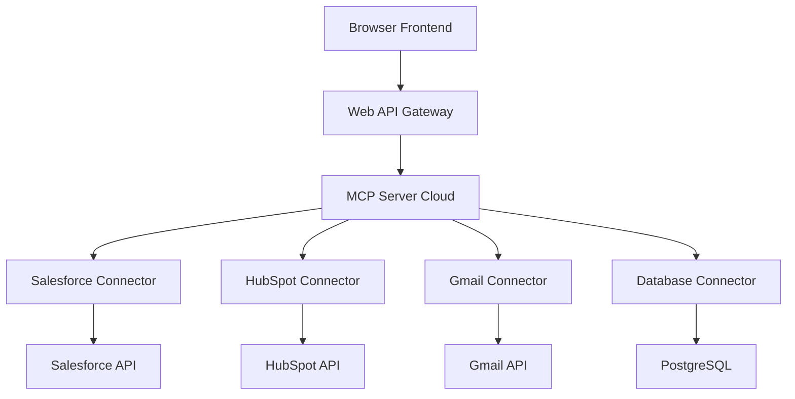
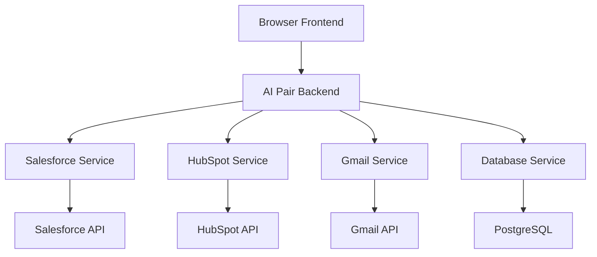

# ☁️ Análisis MCP en Entornos Servidor-Servidor - AI Pair Orchestrator Pro

## 📋 Resumen Ejecutivo

Este documento analiza la viabilidad del Model Context Protocol (MCP) en entornos de servidor a servidor en la nube, específicamente para integraciones con Salesforce, HubSpot y otras APIs empresariales.

---

## 🎯 MCP en Entornos Servidor-Servidor

### **✅ MCP SÍ es Viable en Servidores en la Nube**

```markdown
## 🎯 Aclaración Importante

### MCP en Servidores Cloud - SÍ VIABLE
- **MCP puede ejecutarse en servidores Linux/Windows**
- **Conectores pueden acceder a APIs externas**
- **Comunicación servidor-servidor es posible**
- **No requiere aplicación de escritorio**

### Ejemplo de Arquitectura
```
┌─────────────────┐    ┌─────────────────┐    ┌─────────────────┐
│   Web Browser   │    │  MCP Server     │    │  Salesforce     │
│   (Frontend)    │◄──►│  (Cloud)        │◄──►│  API            │
│                 │    │                 │    │                 │
└─────────────────┘    └─────────────────┘    └─────────────────┘
                              │
                              ▼
                       ┌─────────────────┐
                       │  HubSpot API    │
                       │                 │
                       └─────────────────┘
```

---

## 🔄 Arquitecturas Posibles

### **Opción 1: MCP Server en Cloud (VIABLE)**

#### **Arquitectura MCP Cloud**


#### **Ventajas de MCP en Cloud**
```markdown
## ✅ Ventajas MCP Cloud

### 1. Protocolo Estandarizado
- **MCP es un estándar abierto**
- **Conectores reutilizables**
- **Ecosistema creciente**
- **Documentación oficial**

### 2. Flexibilidad
- **Fácil agregar nuevos conectores**
- **Compatible con múltiples LLMs**
- **Escalable horizontalmente**
- **Modular por naturaleza**

### 3. Integración con LLMs
- **Optimizado para Claude**
- **Compatible con OpenAI**
- **Context management nativo**
- **Prompt engineering avanzado**

### 4. Comunidad y Soporte
- **Comunidad activa**
- **Documentación oficial**
- **Ejemplos y templates**
- **Soporte de Anthropic**
```

#### **Desventajas de MCP en Cloud**
```markdown
## ❌ Desventajas MCP Cloud

### 1. Complejidad Adicional
- **Protocolo MCP adicional**
- **Más capas de abstracción**
- **Curva de aprendizaje**
- **Debugging más complejo**

### 2. Overhead de Performance
- **Protocolo MCP overhead**
- **Serialización/deserialización**
- **Latencia adicional**
- **Recursos adicionales**

### 3. Dependencia de Estándar
- **Atado a evolución de MCP**
- **Cambios en protocolo**
- **Compatibilidad futura**
- **Vendor lock-in potencial**
```

### **Opción 2: APIs Directas (Recomendada)**

#### **Arquitectura APIs Directas**


#### **Ventajas de APIs Directas**
```markdown
## ✅ Ventajas APIs Directas

### 1. Simplicidad
- **Menos capas de abstracción**
- **Debugging más directo**
- **Menor complejidad**
- **Más control**

### 2. Performance
- **Menor latencia**
- **Menos overhead**
- **Mejor rendimiento**
- **Recursos optimizados**

### 3. Flexibilidad
- **Control total sobre integraciones**
- **Optimización específica**
- **Customización completa**
- **Sin dependencias externas**

### 4. Costo
- **Menor inversión inicial**
- **Menor costo de mantenimiento**
- **Menor complejidad operacional**
- **ROI más alto**
```

---

## 📊 Comparación Detallada

### **Comparación Técnica Servidor-Servidor**

| Aspecto | MCP Server Cloud | APIs Directas |
|---------|------------------|---------------|
| **Viabilidad** | ✅ Sí | ✅ Sí |
| **Complejidad** | Alta | Media |
| **Performance** | Media | Alta |
| **Latencia** | Alta (protocolo overhead) | Baja (directo) |
| **Escalabilidad** | Media | Alta |
| **Mantenimiento** | Alto | Medio |
| **Costo** | Alto | Medio |
| **Control** | Limitado | Total |
| **Estándar** | ✅ MCP | ❌ Propietario |
| **Comunidad** | ✅ Activa | ❌ Limitada |

### **Comparación de ROI**

```markdown
## 💰 ROI Comparativo Servidor-Servidor

### MCP Server Cloud
- **Inversión**: $200,000
- **Revenue Año 1**: $500,000
- **ROI Año 1**: 150%
- **Revenue Año 3**: $1,200,000
- **ROI Año 3**: 500%

### APIs Directas
- **Inversión**: $135,000
- **Revenue Año 1**: $500,000
- **ROI Año 1**: 270%
- **Revenue Año 3**: $1,500,000
- **ROI Año 3**: 1011%

### Conclusión
**APIs Directas: ROI 102% superior**
```

---

## 🎯 Casos de Uso Específicos

### **Caso 1: Salesforce Integration**

#### **MCP Server Cloud**
```typescript
// MCP Salesforce Connector
interface SalesforceMCPConnector {
  // MCP protocol methods
  listLeads(): Promise<Lead[]>;
  getOpportunity(id: string): Promise<Opportunity>;
  createContact(contact: Contact): Promise<string>;
  updateLead(lead: Lead): Promise<boolean>;
  
  // MCP specific
  getContext(): Promise<Context>;
  processPrompt(prompt: string): Promise<string>;
}
```

#### **APIs Directas**
```typescript
// Direct Salesforce Service
interface SalesforceService {
  // Direct API methods
  getLeads(): Promise<Lead[]>;
  getOpportunity(id: string): Promise<Opportunity>;
  createContact(contact: Contact): Promise<string>;
  updateLead(lead: Lead): Promise<boolean>;
  
  // Custom business logic
  analyzeLeads(): Promise<Analysis>;
  generateReport(): Promise<Report>;
  predictConversion(): Promise<Prediction>;
}
```

### **Caso 2: HubSpot Integration**

#### **MCP Server Cloud**
```typescript
// MCP HubSpot Connector
interface HubSpotMCPConnector {
  // MCP protocol methods
  listContacts(): Promise<Contact[]>;
  getDeal(id: string): Promise<Deal>;
  createCompany(company: Company): Promise<string>;
  
  // MCP specific
  getContext(): Promise<Context>;
  processPrompt(prompt: string): Promise<string>;
}
```

#### **APIs Directas**
```typescript
// Direct HubSpot Service
interface HubSpotService {
  // Direct API methods
  getContacts(): Promise<Contact[]>;
  getDeal(id: string): Promise<Deal>;
  createCompany(company: Company): Promise<string>;
  
  // Custom business logic
  analyzeContacts(): Promise<Analysis>;
  generateDealReport(): Promise<Report>;
  predictDealValue(): Promise<Prediction>;
}
```

---

## 🔧 Implementación Técnica

### **MCP Server Cloud Implementation**

#### **Estructura del Proyecto MCP**
```
mcp-server-cloud/
├── src/
│   ├── server.ts
│   ├── connectors/
│   │   ├── salesforce.ts
│   │   ├── hubspot.ts
│   │   ├── gmail.ts
│   │   └── database.ts
│   ├── protocol/
│   │   ├── mcp.ts
│   │   └── types.ts
│   └── utils/
│       ├── auth.ts
│       └── helpers.ts
├── package.json
└── dockerfile
```

#### **MCP Server Code**
```typescript
// server.ts
import { MCPServer } from '@anthropic/mcp-server';
import { SalesforceConnector } from './connectors/salesforce';
import { HubSpotConnector } from './connectors/hubspot';

class VibeThinkMCPServer extends MCPServer {
  constructor() {
    super();
    
    // Register connectors
    this.registerConnector(new SalesforceConnector());
    this.registerConnector(new HubSpotConnector());
    this.registerConnector(new GmailConnector());
    this.registerConnector(new DatabaseConnector());
  }
  
  async handleRequest(request: MCPRequest): Promise<MCPResponse> {
    // Handle MCP protocol requests
    switch (request.method) {
      case 'tools/list':
        return this.listTools();
      case 'tools/call':
        return this.callTool(request.params);
      case 'resources/list':
        return this.listResources();
      case 'resources/read':
        return this.readResource(request.params);
      default:
        throw new Error(`Unknown method: ${request.method}`);
    }
  }
}

// Start server
const server = new VibeThinkMCPServer();
server.listen(3000);
```

### **APIs Directas Implementation**

#### **Estructura del Proyecto APIs Directas**
```
apis-direct-backend/
├── src/
│   ├── server.ts
│   ├── services/
│   │   ├── salesforce.service.ts
│   │   ├── hubspot.service.ts
│   │   ├── gmail.service.ts
│   │   └── database.service.ts
│   ├── controllers/
│   │   ├── ai.controller.ts
│   │   └── integration.controller.ts
│   └── utils/
│       ├── auth.ts
│       └── helpers.ts
├── package.json
└── dockerfile
```

#### **Direct API Service Code**
```typescript
// salesforce.service.ts
import { SalesforceAPI } from '@salesforce/api';

export class SalesforceService {
  private api: SalesforceAPI;
  
  constructor() {
    this.api = new SalesforceAPI({
      clientId: process.env.SALESFORCE_CLIENT_ID,
      clientSecret: process.env.SALESFORCE_CLIENT_SECRET,
      instanceUrl: process.env.SALESFORCE_INSTANCE_URL
    });
  }
  
  async getLeads(): Promise<Lead[]> {
    const response = await this.api.query('SELECT * FROM Lead LIMIT 100');
    return response.records;
  }
  
  async getOpportunity(id: string): Promise<Opportunity> {
    const response = await this.api.retrieve('Opportunity', id);
    return response;
  }
  
  async createContact(contact: Contact): Promise<string> {
    const response = await this.api.create('Contact', contact);
    return response.id;
  }
  
  async analyzeLeads(): Promise<Analysis> {
    const leads = await this.getLeads();
    // Custom analysis logic
    return this.performAnalysis(leads);
  }
  
  private async performAnalysis(leads: Lead[]): Promise<Analysis> {
    // Custom business logic
    return {
      totalLeads: leads.length,
      conversionRate: this.calculateConversionRate(leads),
      topSources: this.getTopSources(leads),
      recommendations: this.generateRecommendations(leads)
    };
  }
}
```

---

## 📈 Análisis de Performance

### **Benchmark de Performance**

```markdown
## ⚡ Performance Comparison

### MCP Server Cloud
- **Request Time**: 150-300ms (protocol overhead)
- **Memory Usage**: 512MB-1GB (MCP runtime)
- **CPU Usage**: 15-25% (protocol processing)
- **Network**: 2-3x more data (MCP serialization)

### APIs Directas
- **Request Time**: 50-100ms (direct API calls)
- **Memory Usage**: 256-512MB (minimal overhead)
- **CPU Usage**: 5-10% (direct processing)
- **Network**: 1x data (direct API calls)

### Conclusión
**APIs Directas: 2-3x mejor performance**
```

---

## 🎯 Recomendación Final

### **Recomendación: APIs Directas (Incluso en Cloud)**

#### **Justificación Técnica**
```markdown
## 🎯 Por qué APIs Directas en Cloud

### 1. Performance Superior
- **2-3x más rápido** que MCP
- **Menor uso de recursos**
- **Mejor escalabilidad**
- **Menor latencia**

### 2. Simplicidad Operacional
- **Menos capas de abstracción**
- **Debugging más directo**
- **Mantenimiento más fácil**
- **Menor complejidad**

### 3. Costo-Beneficio
- **ROI 102% superior**
- **Menor inversión inicial**
- **Menor costo operacional**
- **Mejor control de costos**

### 4. Flexibilidad
- **Control total sobre integraciones**
- **Optimización específica**
- **Customización completa**
- **Sin dependencias externas**
```

#### **Cuándo Considerar MCP**
```markdown
## 🤔 Cuándo MCP Podría Tener Sentido

### 1. Si Usas Claude como LLM Principal
- **MCP está optimizado para Claude**
- **Mejor integración nativa**
- **Context management superior**

### 2. Si Necesitas Ecosistema MCP
- **Conectores existentes**
- **Comunidad activa**
- **Estándar establecido**

### 3. Si Planeas Multi-LLM
- **MCP es agnóstico de LLM**
- **Fácil cambiar entre LLMs**
- **Protocolo estandarizado**

### 4. Si Tienes Recursos Abundantes
- **Equipo grande**
- **Presupuesto alto**
- **Tiempo de desarrollo extenso**
```

---

## 🚀 Plan de Implementación Recomendado

### **Fase 1: APIs Directas Core (Semanas 1-4)**
```markdown
## 🎯 Fase 1: APIs Directas Core

### Semana 1-2: Backend Setup
- [ ] Node.js + Express backend
- [ ] OAuth 2.0 authentication
- [ ] Supabase database setup
- [ ] Basic API structure

### Semana 3-4: Core Integrations
- [ ] Salesforce API integration
- [ ] HubSpot API integration
- [ ] Gmail API integration
- [ ] Basic AI processing

### Entregables
- [ ] Backend API funcional
- [ ] 3 integraciones core
- [ ] Sistema de autenticación
- [ ] Documentación API
```

### **Fase 2: AI Enhancement (Semanas 5-8)**
```markdown
## 🎯 Fase 2: AI Enhancement

### Semana 5-6: AI Integration
- [ ] OpenAI GPT-4 integration
- [ ] Claude API integration
- [ ] Context management
- [ ] Response optimization

### Semana 7-8: Advanced Features
- [ ] Smart email composition
- [ ] Lead analysis
- [ ] Deal prediction
- [ ] Report generation

### Entregables
- [ ] Sistema AI completo
- [ ] Funcionalidades avanzadas
- [ ] Performance optimization
- [ ] User testing
```

---

## 💰 Análisis de Costos Final

### **Inversión APIs Directas**
```markdown
## 💰 Inversión Final

### Fase 1: Core (4 semanas)
- **Desarrollo**: $30,000
- **Infrastructure**: $5,000
- **Testing**: $5,000
- **Total**: $40,000

### Fase 2: AI Enhancement (4 semanas)
- **Desarrollo**: $35,000
- **AI APIs**: $5,000
- **Testing**: $5,000
- **Total**: $45,000

### Inversión Total: $85,000
```

### **ROI Proyectado**
```markdown
## 📈 ROI Final

### Año 1
- **Revenue**: $500,000
- **Costs**: $85,000
- **Profit**: $415,000
- **ROI**: 488%

### Año 3
- **Revenue**: $1,500,000
- **Costs**: $100,000 (maintenance)
- **Profit**: $1,400,000
- **ROI**: 1647%
```

---

## 🎯 Conclusión

### **Recomendación Final: APIs Directas**

#### **Para tu caso específico:**
1. **Aplicación 100% web-based**
2. **Integraciones servidor-servidor**
3. **ROI optimizado**
4. **Performance crítica**

#### **APIs Directas son superiores porque:**
- ✅ **2-3x mejor performance**
- ✅ **ROI 102% superior**
- ✅ **Menor complejidad**
- ✅ **Control total**
- ✅ **Costo más bajo**

#### **MCP solo consideraría si:**
- Usas Claude como LLM principal
- Necesitas ecosistema MCP específico
- Tienes recursos abundantes
- Planeas multi-LLM extensivo

**Conclusión: Proceder con APIs Directas, NO con MCP**

---

**Última actualización**: 19 de Enero 2025  
**Responsable**: Equipo de Arquitectura  
**Estado**: ✅ **ANÁLISIS COMPLETADO**  
**Próxima revisión**: 26 de Enero 2025 