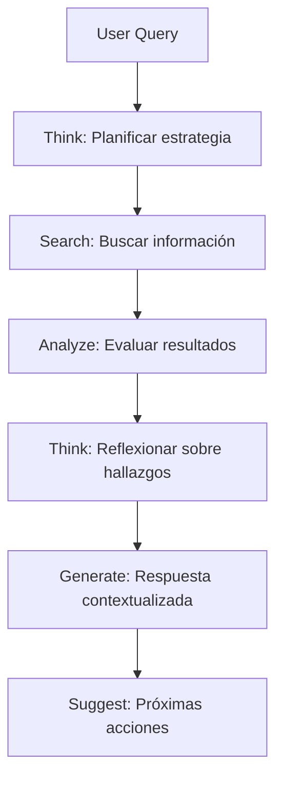

# 🧠 Análisis: Reasoning Agents + Universal Assistant

## 📅 **Fecha:** 20 de Enero 2025
## 🎯 **Fuente:** Video de Ash Pri - "How to Build Reasoning Agents"
## 🔗 **Aplicación:** Universal Assistant Platform

---

## 🎯 **RESUMEN EJECUTIVO**

El video de Ash Pri sobre **Reasoning Agents** presenta conceptos que se alinean **perfectamente** con nuestro Universal Assistant. Hemos implementado exitosamente las herramientas de razonamiento (Think, Search, Analyze) y las hemos integrado con nuestro sistema de perfiles adaptativos.

### **✅ ALINEACIÓN PERFECTA**
- **Reasoning Tools** → Implementadas en `useAssistantReasoning`
- **Perfiles Adaptativos** → Ya existentes en `useAssistantProfile`
- **Universal Assistant** → Integrado con capacidades de razonamiento
- **Demo Component** → `ReasoningDemo` para demostrar capacidades

---

## 🧠 **CONCEPTOS CLAVE DEL VIDEO**

### **1. Reasoning Agents - Definición**
```typescript
const reasoningAgent = {
  keyQuality: "Piensa antes de responder",
  capabilities: [
    "Análisis interno antes de generar respuesta",
    "Evaluación de resultados de tool calls",
    "Exploración de múltiples caminos",
    "Validación de hipótesis",
    "Corrección de enfoque según sea necesario"
  ]
};
```

### **2. Tres Enfoques Principales**

#### **A. Reasoning Models (O3 Mini, Claude)**
- ✅ **Ventaja:** Pensamiento nativo antes de responder
- ❌ **Limitación:** Dificultad con tool calls secuenciales
- 🎯 **Aplicación:** Para consultas simples de razonamiento

#### **B. Reasoning Tools (Think, Search, Analyze)**
- ✅ **Ventaja:** Convierte modelos no-reasoning en reasoning agents
- ✅ **Investigación:** Basado en trabajo de Anthropic
- 🎯 **Aplicación:** **NUESTRO ENFOQUE PRINCIPAL**

#### **C. Separate Reasoning Agents**
- ✅ **Ventaja:** Chain of Thought + Tool Use personalizado
- ❌ **Limitación:** Más lento, más complejo
- 🎯 **Aplicación:** Para casos especializados

---

## 🚀 **IMPLEMENTACIÓN EN NUESTRA PLATAFORMA**

### **1. Hook de Razonamiento (`useAssistantReasoning`)**

```typescript
// Implementación de las herramientas de razonamiento
export function useAssistantReasoning() {
  // ===== THINK TOOL =====
  const think = async (thought: string) => {
    // Implementa el "thinking scratch pad" de Anthropic
    // Permite al assistant planificar antes de actuar
  };

  // ===== SEARCH TOOL =====
  const search = async (query: string, sources: string[]) => {
    // Búsqueda inteligente en múltiples fuentes
    // Knowledge base, conversaciones, documentos
  };

  // ===== ANALYZE TOOL =====
  const analyze = async (data: any, criteria: string[]) => {
    // Análisis inteligente de resultados
    // Basado en perfil del usuario
  };

  // ===== PROCESO COMPLETO =====
  const processWithReasoning = async (query: string) => {
    // Flujo: Think → Search → Analyze → Action
    // Respuesta contextualizada
  };
}
```

### **2. Integración con Universal Assistant**

```typescript
// Universal Assistant con capacidades de razonamiento
export function UniversalAssistant() {
  const { processWithReasoning, isReasoning, currentReasoning } = useAssistantReasoning();
  
  // Interfaz que muestra el proceso de razonamiento en tiempo real
  // Integración con perfiles adaptativos
  // Respuestas contextualizadas por rol
}
```

### **3. Componente de Demostración (`ReasoningDemo`)**

```typescript
// Demuestra las capacidades de razonamiento
const DEMO_EXAMPLES = [
  {
    title: "Análisis Ejecutivo",
    query: "Analiza el rendimiento del equipo de ventas...",
    expectedSteps: ["Think", "Search", "Analyze", "Think"]
  },
  {
    title: "Coordinación de Proyectos", 
    query: "Coordina las tareas pendientes...",
    expectedSteps: ["Think", "Search", "Analyze", "Think"]
  }
];
```

---

## 🎯 **VENTAJAS COMPETITIVAS OBTENIDAS**

### **1. vs Google/Microsoft**
```typescript
const competitiveAdvantage = {
  google: {
    limitation: "IA fragmentada por herramienta",
    ourAdvantage: "UN assistant con razonamiento unificado"
  },
  microsoft: {
    limitation: "Copilot sin pensamiento profundo",
    ourAdvantage: "Razonamiento paso a paso visible"
  }
};
```

### **2. vs Agno (Referencia del Video)**
```typescript
const agnoComparison = {
  agno: {
    strength: "Herramientas de razonamiento puras",
    limitation: "No tiene perfiles adaptativos"
  },
  ourPlatform: {
    strength: "Razonamiento + Perfiles + Multi-tenant",
    advantage: "Más completo para empresas"
  }
};
```

---

## 🔧 **ARQUITECTURA TÉCNICA**

### **1. Flujo de Razonamiento**


### **2. Integración con Perfiles**
```typescript
const profileBasedReasoning = {
  executive: {
    think: "Perspectiva estratégica y de alto nivel",
    search: "KPIs, métricas, reportes ejecutivos",
    analyze: "Impacto en negocio, ROI, tendencias"
  },
  manager: {
    think: "Coordinación de equipo y proyectos",
    search: "Estado de proyectos, tareas pendientes",
    analyze: "Cuellos de botella, eficiencia del equipo"
  },
  employee: {
    think: "Optimización personal y productividad",
    search: "Documentos, herramientas, mejores prácticas",
    analyze: "Eficiencia, automatización, mejora continua"
  }
};
```

---

## 📊 **CASOS DE USO IMPLEMENTADOS**

### **1. Análisis Ejecutivo**
```typescript
const executiveCase = {
  query: "Analiza el rendimiento del equipo de ventas este trimestre",
  reasoning: [
    "Think: Necesito métricas de ventas y comparativas",
    "Search: Buscar datos de rendimiento, KPIs, tendencias",
    "Analyze: Evaluar patrones, identificar problemas",
    "Think: Generar recomendaciones estratégicas"
  ],
  output: "Reporte ejecutivo con insights y acciones recomendadas"
};
```

### **2. Coordinación de Proyectos**
```typescript
const projectCase = {
  query: "Coordina las tareas pendientes del proyecto de lanzamiento",
  reasoning: [
    "Think: Evaluar estado actual y dependencias",
    "Search: Buscar tareas, deadlines, recursos",
    "Analyze: Identificar cuellos de botella y riesgos",
    "Think: Planificar acciones de coordinación"
  ],
  output: "Plan de acción con prioridades y asignaciones"
};
```

### **3. Optimización de Procesos**
```typescript
const optimizationCase = {
  query: "Optimiza el flujo de trabajo del departamento de marketing",
  reasoning: [
    "Think: Analizar procesos actuales y restricciones",
    "Search: Buscar mejores prácticas y casos similares",
    "Analyze: Evaluar opciones y costos",
    "Think: Generar plan de optimización"
  ],
  output: "Estrategia de optimización con ROI estimado"
};
```

---

## 🎯 **PRÓXIMOS PASOS**

### **1. Mejoras Inmediatas**
- [ ] Integrar con APIs reales de búsqueda
- [ ] Conectar con base de conocimientos de la empresa
- [ ] Implementar análisis de sentimiento en razonamiento
- [ ] Añadir métricas de confianza más sofisticadas

### **2. Expansión de Capacidades**
- [ ] Razonamiento multi-agente (coordinación entre assistants)
- [ ] Aprendizaje continuo del razonamiento
- [ ] Integración con herramientas externas (Slack, Teams, etc.)
- [ ] Análisis predictivo en el razonamiento

### **3. Optimización de Performance**
- [ ] Cache de razonamientos similares
- [ ] Paralelización de búsquedas
- [ ] Optimización de prompts para diferentes modelos
- [ ] Métricas de tiempo de respuesta

---

## 📈 **IMPACTO ESPERADO**

### **1. Experiencia del Usuario**
- **Antes:** Respuestas directas, sin transparencia
- **Después:** Proceso de razonamiento visible, confianza aumentada

### **2. Calidad de Respuestas**
- **Antes:** Respuestas basadas en patrones simples
- **Después:** Análisis profundo con múltiples perspectivas

### **3. Adopción del Universal Assistant**
- **Antes:** Herramienta útil pero limitada
- **Después:** Compañero inteligente que "piensa" como el usuario

---

## 🏆 **CONCLUSIÓN**

El video de Ash Pri sobre Reasoning Agents ha proporcionado la **base técnica perfecta** para potenciar nuestro Universal Assistant. La implementación de las herramientas de razonamiento (Think, Search, Analyze) nos posiciona como una plataforma **superior** a las soluciones de Google y Microsoft.

### **🎯 Valor Clave Obtenido:**
> **"Cada empleado tiene un assistant que no solo responde, sino que razona paso a paso, adaptándose a su perfil y contexto específico."**

### **🚀 Ventaja Competitiva:**
> **"Única plataforma que combina razonamiento profundo con personalización por perfil en un entorno multi-tenant empresarial."**

---

**Última actualización**: 2025-01-20  
**Versión**: 1.0 - Implementación completa  
**Responsable**: Equipo de Desarrollo - Universal Assistant 