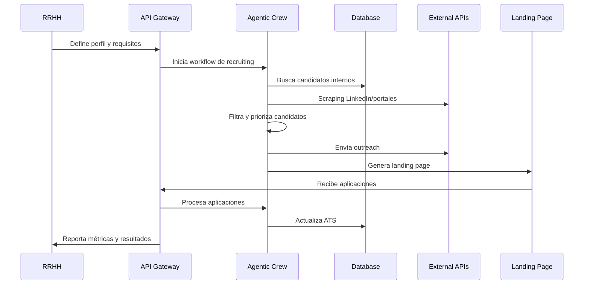

# Arquitectura del Módulo Agentic de Recruiting

## Visión General

El módulo de Recruiting Agentic es un sistema autónomo que automatiza el proceso de búsqueda, contacto y gestión de candidatos utilizando agentes inteligentes que colaboran para optimizar cada etapa del proceso de hiring.

## Componentes Principales

### 1. Orquestador Agentic (CrewAI + LangGraph)
- **CrewAI**: Coordina agentes especializados en tareas específicas
- **LangGraph**: Maneja flujos complejos con estados y transiciones
- **Estado Centralizado**: WorkflowState con Pydantic para validación

### 2. Agentes Especializados

#### Market Research Agent
- Analiza tendencias del mercado laboral
- Identifica competidores y sus estrategias
- Define keywords optimizados para búsqueda

#### Database Search Agent
- Consulta bases de datos internas (ATS, CRM)
- Busca en bases externas (Indeed, Glassdoor)
- Filtra candidatos según criterios

#### LinkedIn Scraping Agent
- Realiza búsquedas avanzadas en LinkedIn
- Extrae perfiles y información detallada
- Analiza experiencia y skills

#### Outreach Agent
- Envía invitaciones personalizadas
- Gestiona secuencias de email
- Trackea respuestas y engagement

#### Landing Page Agent
- Genera páginas optimizadas para conversión
- Implementa formularios de aplicación
- Configura analytics y tracking

#### Application Manager Agent
- Evalúa aplicaciones recibidas
- Programa entrevistas iniciales
- Actualiza ATS con nuevos candidatos

### 3. Infraestructura de Datos

#### Base de Datos Vectorial (Qdrant)
- Almacena embeddings de perfiles para búsqueda semántica
- Permite búsquedas por similitud de skills y experiencia
- Soporte multi-tenant con isolation por company_id

#### Redis
- Cola de tareas asíncronas (Celery)
- Cache de resultados de scraping
- Sesiones de usuario y tokens

#### PostgreSQL
- Datos estructurados de candidatos
- Estados de workflows
- Métricas y auditoría

### 4. APIs y Integraciones

#### APIs Internas
- FastAPI para endpoints REST
- GraphQL para consultas complejas
- WebSocket para actualizaciones en tiempo real

#### Integraciones Externas
- LinkedIn API (oficial cuando sea posible)
- APIs de portales de empleo
- Servicios de email (SendGrid, AWS SES)
- ATS internos de la empresa

## Flujo de Datos



## Configuración Multi-Tenant

```python
class CompanyConfig(BaseModel):
    """Configuración específica por empresa"""
    company_id: str
    ats_integration: Optional[ATSConfig] = None
    email_provider: EmailProviderConfig
    linkedin_credentials: Optional[LinkedInConfig] = None
    outreach_templates: List[EmailTemplate]
    landing_page_template: str
    approval_workflow: ApprovalWorkflow
    compliance_settings: ComplianceConfig
```

## Escalabilidad y Performance

### Horizontal Scaling
- Microservicios independientes
- Load balancing con nginx
- Auto-scaling basado en métricas

### Caching Strategy
- Redis para resultados de scraping
- CDN para landing pages
- Cache de embeddings en Qdrant

### Rate Limiting
- Protección contra rate limits de APIs externas
- Queue management para tareas pesadas
- Circuit breakers para servicios externos

## Monitoreo y Observabilidad

### Logging
- Structured logging con JSON
- Correlation IDs para tracing
- Log levels configurables

### Métricas
- Prometheus para métricas de sistema
- Grafana para dashboards
- Alertas automáticas

### Health Checks
- Endpoints de health para cada servicio
- Dependency checks
- Performance monitoring 