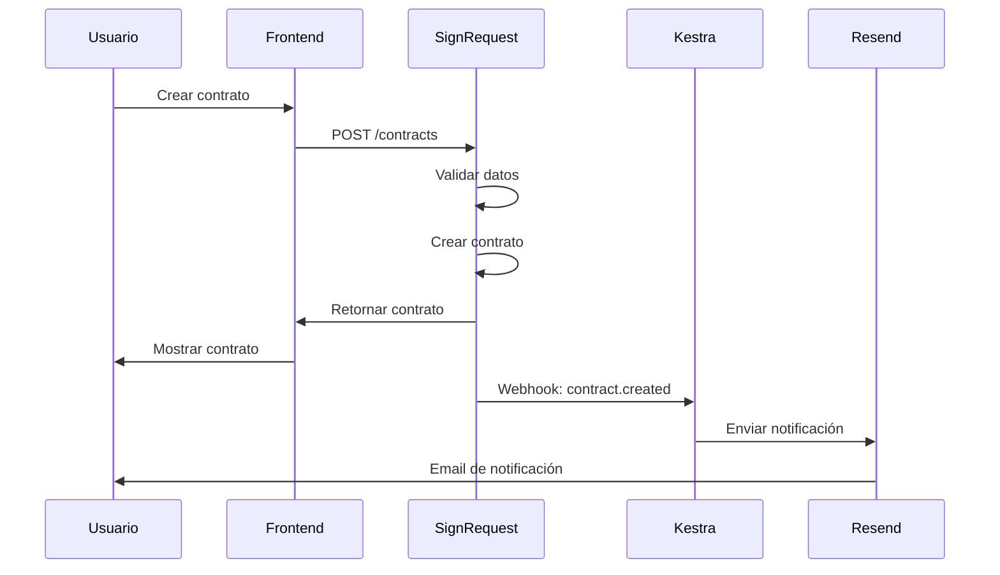
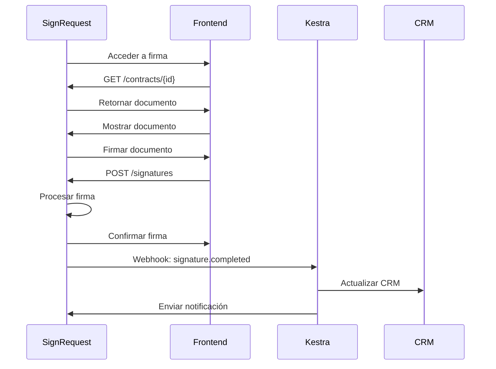

# SignRequest Integration Architecture

**Versión:** 1.0  
**Fecha:** 2024-06-20  
**Estado:** Documentación Activa

## Tabla de Contenidos

1. [Visión General](#visión-general)
2. [Arquitectura de Alto Nivel](#arquitectura-de-alto-nivel)
3. [Componentes del Sistema](#componentes-del-sistema)
4. [Flujos de Datos](#flujos-de-datos)
5. [Seguridad y Permisos](#seguridad-y-permisos)
6. [Escalabilidad](#escalabilidad)
7. [Evaluación Comparativa: OpenSign vs SignRequest vs Documenso](#evaluación-comparativa-opensign-vs-signrequest-vs-documenso)

---

## Visión General

SignRequest se integra como un **servicio de firma electrónica nativo** en nuestro ecosistema, proporcionando capacidades de firma digital para todos nuestros módulos (CRM, Help Desk, Operaciones, Agendamiento).

### Objetivos de la Integración

- **Firma electrónica nativa** para contratos, NDAs, SLAs
- **Multi-tenant** con aislamiento por empresa
- **Integración seamless** con FusionAuth e Infisical
- **Workflows automatizados** con Kestra
- **UI consistente** con shadcn/ui

### Beneficios Esperados

✅ **Reducción de tiempo** de cierre de contratos en 70%  
✅ **Cumplimiento legal** automático  
✅ **Auditoría completa** de firmas  
✅ **Integración nativa** con flujos de trabajo  
✅ **Experiencia unificada** para usuarios  

---

## Arquitectura de Alto Nivel

### Diagrama de Arquitectura

```
┌─────────────────┐    ┌─────────────────┐    ┌─────────────────┐
│   Frontend      │    │   SignRequest   │    │   Backend       │
│   (React)       │    │   Service       │    │   Services      │
└─────────────────┘    └─────────────────┘    └─────────────────┘
         │                       │                       │
         │ 1. UI Components      │                       │
         │──────────────────────▶│                       │
         │                       │ 2. API Calls          │
         │                       │◀──────────────────────│
         │                       │ 3. Webhooks           │
         │                       │──────────────────────▶│
```

### Integración con Ecosistema

```
┌─────────────────┐    ┌─────────────────┐    ┌─────────────────┐
│   FusionAuth    │    │   SignRequest   │    │   Infisical     │
│   (IAM)         │    │   (Firma)       │    │   (Secretos)    │
└─────────────────┘    └─────────────────┘    └─────────────────┘
         │                       │                       │
         │ OAuth2/OpenID         │                       │
         │──────────────────────▶│                       │
         │                       │ API Keys              │
         │                       │◀──────────────────────│
         │                       │                       │
         │                       │                       │
┌─────────────────┐    ┌─────────────────┐    ┌─────────────────┐
│   Kestra        │    │   Supabase      │    │   Resend        │
│   (Workflows)   │    │   (Database)    │    │   (Email)       │
└─────────────────┘    └─────────────────┘    └─────────────────┘
         │                       │                       │
         │ Webhooks              │                       │
         │◀──────────────────────│                       │
         │                       │ Notifications         │
         │                       │──────────────────────▶│
```

---

## Componentes del Sistema

### 1. SignRequest Core Service

```typescript
// services/signRequestService.ts
interface SignRequestService {
  // Gestión de contratos
  contracts: {
    create: (data: ContractData) => Promise<Contract>;
    get: (id: string) => Promise<Contract>;
    update: (id: string, data: Partial<ContractData>) => Promise<Contract>;
    delete: (id: string) => Promise<void>;
    list: (filters: ContractFilters) => Promise<Contract[]>;
  };
  
  // Gestión de firmas
  signatures: {
    send: (contractId: string, signers: Signer[]) => Promise<SignatureRequest>;
    status: (requestId: string) => Promise<SignatureStatus>;
    cancel: (requestId: string) => Promise<void>;
    resend: (requestId: string) => Promise<void>;
  };
  
  // Gestión de plantillas
  templates: {
    create: (data: TemplateData) => Promise<Template>;
    get: (id: string) => Promise<Template>;
    update: (id: string, data: Partial<TemplateData>) => Promise<Template>;
    delete: (id: string) => Promise<void>;
    list: (filters: TemplateFilters) => Promise<Template[]>;
  };
  
  // Gestión de documentos
  documents: {
    upload: (file: File) => Promise<Document>;
    download: (documentId: string, format: 'pdf' | 'docx') => Promise<Blob>;
    preview: (documentId: string) => Promise<string>;
  };
}
```

### 2. Multi-tenant Integration

```typescript
// middleware/tenantIsolation.ts
interface TenantIsolation {
  // Aislamiento por empresa
  company_id: string;
  
  // Permisos por rol
  permissions: {
    'signrequest:read': boolean;
    'signrequest:write': boolean;
    'signrequest:admin': boolean;
  };
  
  // Filtros automáticos
  filters: {
    contracts: `WHERE company_id = '${company_id}'`;
    templates: `WHERE company_id = '${company_id}'`;
    signatures: `WHERE company_id = '${company_id}'`;
  };
}
```

### 3. Authentication Integration

```typescript
// auth/signRequestAuth.ts
interface SignRequestAuth {
  // OAuth2 con FusionAuth
  oauth2: {
    client_id: string;
    client_secret: string;
    redirect_uri: string;
    scopes: ['read', 'write', 'admin'];
  };
  
  // Sincronización de usuarios
  user_sync: {
    auto_create: boolean;
    sync_roles: boolean;
    sync_groups: boolean;
  };
  
  // Mapeo de permisos
  permission_mapping: {
    'USER': ['signrequest:read'];
    'MANAGER': ['signrequest:read', 'signrequest:write'];
    'ADMIN': ['signrequest:read', 'signrequest:write', 'signrequest:admin'];
    'SUPER_ADMIN': ['signrequest:*'];
  };
}
```

---

## Flujos de Datos

### 1. Creación de Contrato



### 2. Proceso de Firma



---

## Seguridad y Permisos

### 1. Modelo de Permisos

```typescript
// types/permissions.ts
interface SignRequestPermissions {
  // Permisos por nivel
  levels: {
    'USER': {
      can_view_own_contracts: boolean;
      can_sign_contracts: boolean;
      can_view_templates: boolean;
    };
    'MANAGER': {
      can_create_contracts: boolean;
      can_edit_contracts: boolean;
      can_view_team_contracts: boolean;
      can_manage_templates: boolean;
    };
    'ADMIN': {
      can_manage_all_contracts: boolean;
      can_manage_templates: boolean;
      can_view_analytics: boolean;
      can_manage_users: boolean;
    };
    'SUPER_ADMIN': {
      can_manage_system: boolean;
      can_view_all_data: boolean;
      can_configure_integrations: boolean;
    };
  };
  
  // Permisos por departamento
  departments: {
    'SALES': ['contracts:create', 'contracts:view', 'templates:sales'];
    'LEGAL': ['contracts:review', 'templates:manage', 'analytics:view'];
    'FINANCE': ['contracts:approve', 'analytics:financial'];
    'SUPPORT': ['contracts:view', 'templates:support'];
  };
}
```

### 2. Seguridad de Datos

```typescript
// security/dataProtection.ts
interface DataProtection {
  // Cifrado de documentos
  encryption: {
    algorithm: 'AES-256-GCM';
    key_rotation: '90_days';
    storage: 'encrypted_at_rest';
  };
  
  // Auditoría
  audit: {
    log_all_actions: boolean;
    retention_period: '7_years';
    export_format: 'JSON';
  };
  
  // Cumplimiento
  compliance: {
    gdpr: boolean;
    eidas: boolean;
    soc2: boolean;
  };
}
```

---

## Escalabilidad

### 1. Arquitectura Escalable

```typescript
// infrastructure/scalability.ts
interface Scalability {
  // Escalabilidad horizontal
  horizontal: {
    load_balancer: 'nginx';
    auto_scaling: boolean;
    min_instances: 2;
    max_instances: 10;
  };
  
  // Base de datos
  database: {
    primary: 'PostgreSQL';
    read_replicas: 3;
    connection_pooling: boolean;
    sharding: 'by_company';
  };
  
  // Cache
  caching: {
    redis: boolean;
    cache_contracts: boolean;
    cache_templates: boolean;
    ttl: '1_hour';
  };
}
```

### 2. Performance

```typescript
// performance/optimization.ts
interface Performance {
  // Métricas objetivo
  targets: {
    contract_creation: '< 2 seconds';
    signature_processing: '< 1 second';
    document_preview: '< 3 seconds';
    api_response_time: '< 500ms';
  };
  
  // Optimizaciones
  optimizations: {
    document_compression: boolean;
    image_optimization: boolean;
    lazy_loading: boolean;
    cdn_integration: boolean;
  };
}
```

---

## Evaluación Comparativa: OpenSign vs SignRequest vs Documenso

### OpenSign (https://github.com/opensignlabs/opensign)

**Resumen:** OpenSign es una alternativa open source a DocuSign, con una comunidad activa y despliegue sencillo, pero presenta limitaciones importantes para nuestro caso de uso empresarial.

**Características principales:**
- Licencia AGPL-3.0 (restrictiva para SaaS propietario)
- Stack: Node.js, React, MongoDB, JavaScript (TypeScript casi nulo)
- Despliegue: Docker, DigitalOcean
- API REST, webhooks, integraciones con Zapier y CRMs
- UI moderna, certificados de finalización, logs de auditoría

**Ventajas:**
- Fácil de desplegar
- UI amigable y moderna
- Integraciones con Zapier y CRMs
- Comunidad activa

**Desventajas y riesgos:**
- Licencia AGPL-3.0: incompatible con SaaS propietario, obliga a liberar todo el código
- Stack no alineado: JavaScript puro y MongoDB, no TypeScript ni PostgreSQL
- No multi-tenant nativo: requiere desarrollo adicional
- Menos maduro para integraciones empresariales (IAM, workflows, cumplimiento legal)
- Riesgo de lock-in tecnológico

### Comparativa rápida

| Solución      | Licencia   | Stack         | Multi-tenant | Integración | Comunidad | Fit con nuestro stack |
|---------------|------------|--------------|--------------|-------------|-----------|----------------------|
| **SignRequest** | MIT        | TS/Postgres  | ✅ Nativo     | 🟢 Fácil    | 🟡 Media  | 🟢 Excelente         |
| **Documenso**   | AGPL-3.0   | TS/Postgres  | ❌ Dev        | 🟡 Media    | 🟢 Alta   | 🟢 Excelente         |
| **OpenSign**    | AGPL-3.0   | JS/MongoDB   | ❌ Dev        | 🟡 Media    | 🟡 Media  | 🟡 Regular           |

### Conclusión

OpenSign, aunque es una opción open source válida y con buena comunidad, **no es la mejor opción para nuestro stack** debido a:
- Licencia restrictiva (AGPL-3.0)
- Falta de multi-tenant nativo
- Stack tecnológico menos alineado (JavaScript/MongoDB)
- Mayor esfuerzo de integración con nuestros componentes clave (FusionAuth, Infisical, Kestra, Supabase)

Esto refuerza la elección de **SignRequest** como la mejor alternativa open source para nuestro ecosistema, por su licencia MIT, multi-tenant nativo y compatibilidad total con nuestro stack y visión de desarrollo desacoplado.

---

## Conclusión

Esta arquitectura proporciona una base sólida para la integración de SignRequest en nuestro ecosistema, asegurando:

- **Seguridad** a través de aislamiento multi-tenant y cifrado
- **Escalabilidad** mediante arquitectura distribuida
- **Integración** seamless con componentes existentes
- **Cumplimiento** con regulaciones y estándares

**Próximos pasos:**
1. Implementar la infraestructura base
2. Desarrollar los componentes de integración
3. Configurar workflows de Kestra
4. Realizar testing exhaustivo
5. Desplegar en producción

---

**Documentación Relacionada:**
- [Plan de Implementación](./SIGNREQUEST_IMPLEMENTATION_PLAN.md)
- [Casos de Uso](./SIGNREQUEST_USE_CASES.md)
- [Guías de Desarrollo](./SIGNREQUEST_DEVELOPMENT_GUIDES.md) 