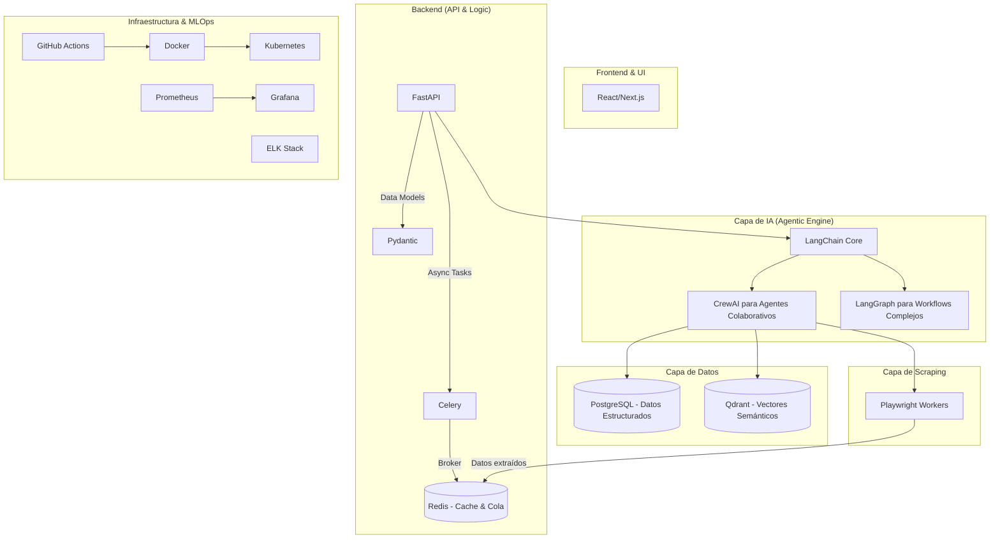

# Revisión de Coherencia del Stack Tecnológico

> **ESTADO:** Validado

---

## 1. Veredicto General

El stack tecnológico seleccionado para la plataforma SaaS es **altamente coherente, moderno y robusto**. Las tecnologías no solo son compatibles, sino que se complementan entre sí, creando una arquitectura bien definida donde cada componente cumple un propósito específico.

**Conclusión clave:** No existen conflictos mayores. Las decisiones de diseño son sólidas y están alineadas con las mejores prácticas para construir una plataforma de IA de nivel empresarial.

---

## 2. Diagrama de Interacción de Tecnologías

---

## 3. Análisis por Capa

### **Capa de Backend (Python)**
- **Tecnologías:** `FastAPI`, `Pydantic`, `Celery`.
- **Análisis:** Perfectamente coherente. FastAPI utiliza Pydantic de forma nativa para la validación de datos, y Celery es el estándar de la industria para gestionar tareas asíncronas (como el envío de correos o el procesamiento de IA) en un ecosistema Python.
- **Veredicto:** ✅ **Sin conflictos.**

### **Capa de IA (Agentic Engine)**
- **Tecnologías:** `LangChain`, `CrewAI`, `LangGraph`.
- **Análisis:** Ambas, `CrewAI` y `LangGraph`, están construidas sobre `LangChain`, lo que garantiza compatibilidad. Su uso no es redundante, sino complementario:
    - **CrewAI:** Ideal para el módulo de recruiting, donde múltiples agentes ("especialistas") colaboran en un proceso secuencial.
    - **LangGraph:** Perfecto para flujos de trabajo más complejos y no lineales, como un proceso de aprobación de documentos que puede requerir ciclos y volver a estados anteriores.
- **Veredicto:** ✅ **Coherencia total.** Proporciona flexibilidad para elegir el framework adecuado para cada tarea.

### **Capa de Datos**
- **Tecnologías:** `PostgreSQL`, `Qdrant`, `Redis`.
- **Análisis:** Arquitectura de datos excelente y especializada.
    - `PostgreSQL`: Almacena los datos transaccionales y estructurados (usuarios, workflows, facturas).
    - `Qdrant`: Dedicado exclusivamente a la búsqueda vectorial de alta velocidad, crucial para la búsqueda semántica de perfiles de candidatos.
    - `Redis`: Cumple un doble propósito como caché rápido y como message broker para Celery.
- **Veredicto:** ✅ **Arquitectura robusta.** Cada base de datos es la mejor en su clase para la tarea asignada.

### **Capa de Scraping**
- **Tecnologías:** `Playwright` (sobre `Puppeteer`).
- **Análisis:** La documentación mencionaba ambas. La decisión correcta es estandarizar en **`Playwright`**.
- **Justificación:** Siendo nuestro backend principal Python, usar la librería de Playwright para Python simplifica el stack, reduce las dependencias (no se necesita un entorno Node.js separado para el scraping) y facilita la comunicación directa entre los agentes y los workers de scraping.
- **Veredicto:** ✅ **Coherente con recomendación.**

### **Infraestructura y MLOps**
- **Tecnologías:** `Docker`, `Kubernetes`, `GitHub Actions`, `Prometheus`, `Grafana`, `ELK Stack`.
- **Análisis:** Stack estándar de oro para aplicaciones cloud-native.
    - `Docker` y `Kubernetes` garantizan escalabilidad y portabilidad.
    - `GitHub Actions` automatiza el ciclo de vida de CI/CD.
    - El stack de monitoreo (`Prometheus` para métricas y `ELK` para logs) es extremadamente potente, aunque complejo. Es adecuado para una plataforma de nivel empresarial donde la trazabilidad y la observabilidad son críticas.
- **Veredicto:** ✅ **Coherencia total.** El stack de monitoreo es avanzado, pero justificado por la complejidad del sistema.

---

## 4. Recomendaciones Finales para Consolidar

1.  **Confirmar `Playwright`:** Actualizar toda la documentación para reflejar que `Playwright` es la herramienta de scraping estándar, eliminando las referencias a `Puppeteer` para evitar confusiones.
2.  **Documentar Casos de Uso de Agentes:** Añadir una sección en `RECRUITING_AGENTIC_ARCHITECTURE.md` que especifique: "Usar `CrewAI` para flujos de colaboración de agentes y `LangGraph` para flujos de estado complejos".
3.  **Plan de Monitoreo Escalonado:** En la guía de despliegue, proponer un enfoque escalonado para el monitoreo:
    - **MVP:** Logging estructurado a la consola (gestionado por Docker/K8s).
    - **Producción Inicial:** Integración con un servicio gestionado (Ej: Datadog, Sentry) para logs y métricas.
    - **Producción a Escala:** Despliegue completo de `Prometheus` + `Grafana` + `ELK` para un control total.

---

El stack está listo para ser presentado. Es una arquitectura sólida que no solo funcionará, sino que también atraerá talento técnico de alto nivel.

Procedemos ahora a preparar el **Resumen Ejecutivo** para los stakeholders. ¿Te parece bien? 