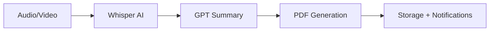
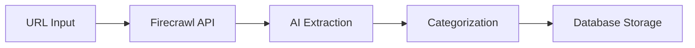
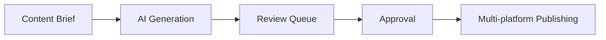

# Workflows del Sistema

## 🎯 Workflows Prioritarios

### 1. Meeting Processor
**Objetivo**: Convertir reuniones en actas automáticas



**Implementación**:
- **Edge Function**: `meeting-processor`
- **Input**: File upload (audio/video)
- **Process**: Transcription → Summarization → Document
- **Output**: PDF + Database record + Real-time notification

### 2. Resource Scraper
**Objetivo**: Extraer y organizar información web



**Implementación**:
- **Edge Function**: `resource-scraper`
- **Input**: URL + extraction criteria
- **Process**: Scraping → AI analysis → Categorization
- **Output**: Structured data + Tags + Related resources

### 3. Content Pipeline
**Objetivo**: Crear y publicar contenido automatizado



**Implementación**:
- **Edge Function**: `content-pipeline`
- **Input**: Topic + Platform preferences
- **Process**: Generation → Review → Approval → Publishing
- **Output**: Published content + Analytics

## 🔧 Workflow Engine Architecture

### Core Components
```typescript
interface Workflow {
  id: string;
  name: string;
  description: string;
  steps: WorkflowStep[];
  triggers: WorkflowTrigger[];
  status: 'active' | 'paused' | 'draft';
}

interface WorkflowStep {
  id: string;
  type: 'ai_process' | 'api_call' | 'condition' | 'notification';
  config: Record<string, any>;
  nextSteps: string[];
}
```

### Execution Engine
- **Queue System**: Background job processing
- **Error Handling**: Retry logic + dead letter queue
- **Monitoring**: Real-time execution tracking
- **Logging**: Structured logs for debugging

## 📱 User Interface

### Workflow Builder (Phase 2)
- **React Flow**: Visual drag-and-drop editor
- **Component Library**: Pre-built workflow nodes
- **Template System**: Ready-to-use workflows
- **Testing Mode**: Dry-run capabilities

### Monitoring Dashboard
- **Execution History**: All workflow runs
- **Performance Metrics**: Success rate, duration
- **Error Tracking**: Failed runs with details
- **Usage Analytics**: Most used workflows

## 🚀 Implementation Phases

### Phase 1: Pre-built Workflows (Current)
Focus on the 3 core workflows with hardcoded logic

### Phase 2: Configurable Workflows 
Add parameters and configuration options

### Phase 3: Visual Builder
Full drag-and-drop workflow creation

### Phase 4: Marketplace
Share and discover community workflows
