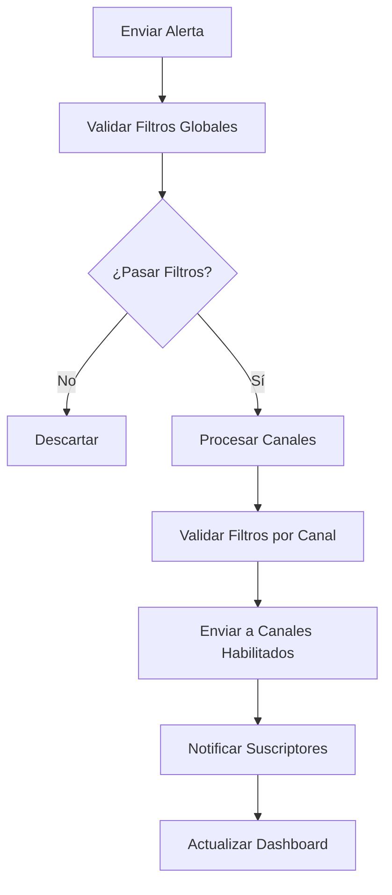
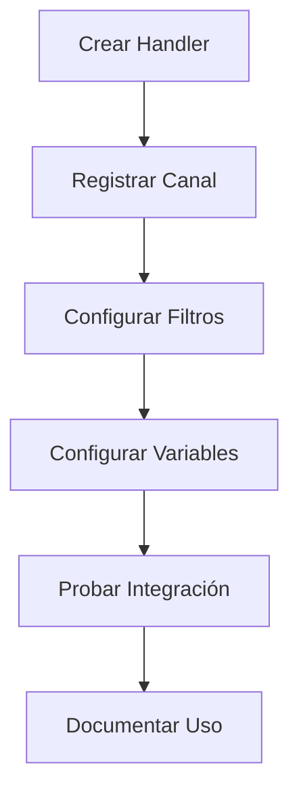

# Sistema Centralizado de Alertas - VThink 1.0

## 📅 Fecha de Documentación: 05/07/2025

### 🎯 Objetivo
Implementar un sistema centralizado de alertas que permita agregar nuevos canales de notificación fácilmente, manteniendo un solo punto de desarrollo para todas las alertas del sistema.

## 🏗️ Arquitectura del Sistema

### **1. Servicio Centralizado**
```typescript
// src/shared/services/alertService.ts
export class AlertService {
  // Gestión centralizada de alertas
  // Registro dinámico de canales
  // Filtros y configuración global
}
```

### **2. Componente de Gestión**
```typescript
// src/shared/components/AlertManager.tsx
// Dashboard unificado para todas las alertas
// Filtros y configuración visual
// Estadísticas en tiempo real
```

### **3. Manejadores de Canales**
```typescript
// src/shared/services/channelHandlers.ts
// Handlers específicos para cada canal
// Fácil integración con servicios externos
```

## 🔌 Canales Disponibles

### **Canales Principales**
| Canal | Descripción | Configuración |
|-------|-------------|---------------|
| `DEV_PORTAL` | Dashboard interno | Automático |
| `SLACK` | Notificaciones de equipo | Webhook URL |
| `EMAIL` | Alertas por correo | SMTP config |
| `SMS` | Alertas críticas | API SMS |
| `WEBHOOK` | Integración externa | URLs múltiples |
| `DASHBOARD` | Dashboard en tiempo real | WebSocket |
| `LOG` | Sistema de logs | Automático |

### **Canales Adicionales**
| Canal | Descripción | Configuración |
|-------|-------------|---------------|
| `DISCORD` | Servidor Discord | Webhook URL |
| `TEAMS` | Microsoft Teams | Webhook URL |
| `TELEGRAM` | Bot de Telegram | Bot Token |
| `PAGERDUTY` | Gestión de incidentes | API Key |

## 🚀 Cómo Agregar un Nuevo Canal

### **Paso 1: Crear el Manejador**
```typescript
// src/shared/services/channelHandlers.ts
export const telegramHandler = async (alert: Alert): Promise<void> => {
  try {
    const botToken = process.env.TELEGRAM_BOT_TOKEN;
    const chatId = process.env.TELEGRAM_CHAT_ID;
    
    const message = `🚨 *${alert.title}*\n\n${alert.message}`;
    
    const response = await fetch(
      `https://api.telegram.org/bot${botToken}/sendMessage`,
      {
        method: 'POST',
        headers: { 'Content-Type': 'application/json' },
        body: JSON.stringify({
          chat_id: chatId,
          text: message,
          parse_mode: 'Markdown'
        })
      }
    );

    if (!response.ok) {
      throw new Error(`Telegram error: ${response.statusText}`);
    }

    console.log('✅ Alert sent to Telegram:', alert.title);
  } catch (error) {
    console.error('❌ Error sending to Telegram:', error);
  }
};
```

### **Paso 2: Registrar el Canal**
```typescript
// En tu aplicación
import { alertService } from '@/shared/services/alertService';
import { telegramHandler } from '@/shared/services/channelHandlers';

// Registrar el nuevo canal
alertService.registerChannel(
  AlertChannel.TELEGRAM,
  telegramHandler,
  {
    enabled: true,
    config: {
      botToken: process.env.TELEGRAM_BOT_TOKEN,
      chatId: process.env.TELEGRAM_CHAT_ID
    },
    filters: {
      minPriority: AlertPriority.HIGH,
      types: [AlertType.SECURITY_SCAN, AlertType.VULNERABILITY_DETECTED]
    }
  }
);
```

### **Paso 3: Configurar Variables de Entorno**
```bash
# .env
TELEGRAM_BOT_TOKEN=your_bot_token_here
TELEGRAM_CHAT_ID=your_chat_id_here
```

### **Paso 4: Usar el Canal**
```typescript
// Enviar alerta al nuevo canal
await alertService.sendAlert({
  type: AlertType.SECURITY_SCAN,
  priority: AlertPriority.HIGH,
  title: 'Vulnerabilidad Detectada',
  message: 'Se encontró una vulnerabilidad crítica en el sistema',
  channels: [AlertChannel.TELEGRAM, AlertChannel.SLACK],
  metadata: {
    vulnerability: 'CVE-2024-XXXX',
    severity: 'critical'
  }
});
```

## 📊 Tipos de Alertas del Sistema

### **Alertas de Desarrollo**
```typescript
enum AlertType {
  // Monitoreo de upgrades
  UPGRADE_MONITOR = 'upgrade_monitor',
  
  // Seguridad
  SECURITY_SCAN = 'security_scan',
  VULNERABILITY_DETECTED = 'vulnerability_detected',
  
  // Rendimiento
  PERFORMANCE_MONITOR = 'performance_monitor',
  
  // Errores
  ERROR_TRACKING = 'error_tracking',
  TEST_FAILURE = 'test_failure',
  BUILD_FAILURE = 'build_failure',
  
  // Despliegue
  DEPLOYMENT_STATUS = 'deployment_status'
}
```

### **Alertas de Negocio**
```typescript
enum AlertType {
  // Usuarios
  USER_ACTIVITY = 'user_activity',
  
  // Sistema
  SYSTEM_HEALTH = 'system_health',
  
  // Base de datos
  DATABASE_MONITOR = 'database_monitor',
  
  // APIs
  API_MONITOR = 'api_monitor'
}
```

### **Alertas de Infraestructura**
```typescript
enum AlertType {
  // Recursos
  RESOURCE_USAGE = 'resource_usage',
  DISK_SPACE = 'disk_space',
  MEMORY_USAGE = 'memory_usage',
  CPU_USAGE = 'cpu_usage'
}
```

## ⚙️ Configuración del Sistema

### **Configuración Global**
```typescript
const alertConfig: AlertSystemConfig = {
  channels: {
    [AlertChannel.DEV_PORTAL]: { enabled: true, config: {} },
    [AlertChannel.SLACK]: { 
      enabled: true, 
      config: { webhookUrl: process.env.SLACK_WEBHOOK_URL },
      filters: { minPriority: AlertPriority.MEDIUM }
    },
    [AlertChannel.EMAIL]: { 
      enabled: true, 
      config: { smtpConfig: process.env.SMTP_CONFIG },
      filters: { minPriority: AlertPriority.HIGH }
    }
  },
  globalFilters: {
    minPriority: AlertPriority.LOW,
    types: [/* tipos específicos */]
  },
  retentionDays: 30,
  maxAlertsPerChannel: 100
};
```

### **Configuración por Entorno**
```typescript
// development.ts
const devConfig = {
  channels: {
    [AlertChannel.DEV_PORTAL]: { enabled: true },
    [AlertChannel.LOG]: { enabled: true }
  }
};

// production.ts
const prodConfig = {
  channels: {
    [AlertChannel.SLACK]: { enabled: true },
    [AlertChannel.EMAIL]: { enabled: true },
    [AlertChannel.SMS]: { enabled: true }
  }
};
```

## 🔄 Flujo de Trabajo

### **1. Envío de Alerta**


### **2. Registro de Nuevo Canal**


## 📈 Métricas y Monitoreo

### **Métricas del Sistema**
```typescript
interface AlertMetrics {
  totalAlerts: number;
  alertsByPriority: Record<AlertPriority, number>;
  alertsByType: Record<AlertType, number>;
  alertsByChannel: Record<AlertChannel, number>;
  successRate: number;
  averageResponseTime: number;
}
```

### **Dashboard de Métricas**
- **Total de alertas** por período
- **Tasa de éxito** por canal
- **Tiempo de respuesta** promedio
- **Alertas por prioridad** y tipo
- **Estado de canales** (habilitado/deshabilitado)

## 🛡️ Seguridad y Configuración

### **Variables de Entorno Requeridas**
```bash
# Slack
SLACK_WEBHOOK_URL=https://hooks.slack.com/services/...

# Email
SMTP_HOST=smtp.gmail.com
SMTP_PORT=587
SMTP_USER=your-email@gmail.com
SMTP_PASS=your-app-password
ALERT_EMAIL_RECIPIENTS=admin@company.com,dev@company.com

# SMS
SMS_API_KEY=your-sms-api-key
ALERT_SMS_NUMBERS=+1234567890,+0987654321

# Discord
DISCORD_WEBHOOK_URL=https://discord.com/api/webhooks/...

# Teams
TEAMS_WEBHOOK_URL=https://company.webhook.office.com/...

# Telegram
TELEGRAM_BOT_TOKEN=your-bot-token
TELEGRAM_CHAT_ID=your-chat-id
```

### **Configuración de Seguridad**
```typescript
const securityConfig = {
  // Validación de webhooks
  validateWebhooks: true,
  
  // Rate limiting
  rateLimit: {
    maxAlertsPerMinute: 60,
    maxAlertsPerHour: 1000
  },
  
  // Filtros de contenido
  contentFilters: {
    blockSensitiveData: true,
    sanitizeMessages: true
  }
};
```

## 📋 Checklist de Implementación

### **✅ Configuración Básica**
- [x] Servicio centralizado implementado
- [x] Componente de gestión creado
- [x] Manejadores de canales básicos
- [x] Sistema de filtros configurado

### **🔄 Canales Adicionales**
- [ ] Configurar Slack
- [ ] Configurar Email
- [ ] Configurar SMS
- [ ] Configurar Discord
- [ ] Configurar Teams
- [ ] Configurar Telegram

### **📊 Monitoreo y Métricas**
- [ ] Dashboard de métricas
- [ ] Alertas de sistema
- [ ] Reportes automáticos
- [ ] Análisis de rendimiento

## 🚀 Próximos Pasos

### **1. Integración con Servicios Externos**
- [ ] Configurar webhooks para Slack/Discord
- [ ] Integrar con servicios de email
- [ ] Configurar SMS para alertas críticas
- [ ] Integrar con sistemas de tickets

### **2. Automatización Avanzada**
- [ ] Alertas automáticas basadas en métricas
- [ ] Escalación automática de alertas
- [ ] Integración con CI/CD
- [ ] Alertas predictivas

### **3. Mejoras de UX**
- [ ] Dashboard interactivo
- [ ] Notificaciones en tiempo real
- [ ] Configuración visual de canales
- [ ] Historial de alertas

---

**Documentado por**: Marcelo Escallón  
**Fecha**: 05/07/2025  
**Versión**: VThink 1.0  
**Estado**: En implementación 