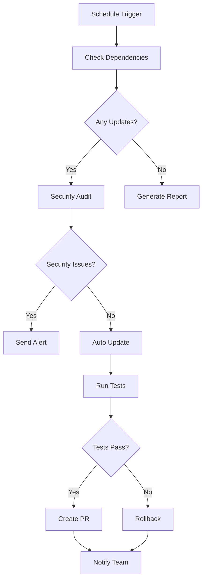

# Estrategia de CI/CD para Upgrades Automáticos - VThink 1.0

## 📅 Fecha de Documentación: 05/07/2025

### 🎯 Objetivo
Implementar un sistema de CI/CD que automatice la gestión de upgrades de dependencias, manteniendo la estabilidad y seguridad del proyecto VThink 1.0.

## 🏗️ Arquitectura del Sistema

### 1. **Workflow de GitHub Actions**
```yaml
# .github/workflows/upgrade-monitor.yml
name: Upgrade Monitor - VThink 1.0

on:
  schedule:
    - cron: '0 9 * * *'  # Diario a las 9:00 AM UTC
  workflow_dispatch:      # Ejecución manual
  push:
    branches: [main, develop]
    paths: ['package.json', 'package-lock.json']
```

### 2. **Jobs del Workflow**

#### **Job 1: Monitor de Dependencias**
```yaml
upgrade-monitor:
  name: Monitor Dependencies and Security
  runs-on: ubuntu-latest
  steps:
    - name: Run security audit
      run: npm audit --audit-level moderate
    - name: Check outdated packages
      run: npm outdated
    - name: Generate upgrade report
      run: npm run upgrade:report
```

#### **Job 2: Validación de Seguridad**
```yaml
security-check:
  name: Security Validation
  needs: upgrade-monitor
  steps:
    - name: Run security tests
      run: npm run test:security
    - name: Check vulnerabilities
      run: npm audit --audit-level moderate
```

#### **Job 3: Auto-update de Dependencias**
```yaml
dependency-update:
  name: Auto Update Dependencies
  needs: [upgrade-monitor, security-check]
  if: needs.security-check.result == 'success'
  steps:
    - name: Update patch and minor versions
      run: npm update
    - name: Run tests after update
      run: npm run test:unit
    - name: Create Pull Request
      uses: peter-evans/create-pull-request@v5
```

#### **Job 4: Notificaciones**
```yaml
notify-team:
  name: Notify Team
  needs: [upgrade-monitor, security-check]
  if: always()
  steps:
    - name: Send Slack notification
      uses: 8398a7/action-slack@v3
      with:
        channel: '#dev-alerts'
        text: |
          🚨 Critical Updates Required
          Project: VibeThink-Orchestrator
```

## 🔄 Flujo de Trabajo Automatizado

### **1. Monitoreo Diario**


### **2. Proceso de Auto-update**
```typescript
// Estrategia de actualización gradual
const UpdateStrategy = {
  immediate: {
    packages: ['security-critical'],
    action: 'auto-update',
    notification: 'slack-urgent'
  },
  weekly: {
    packages: ['patch', 'minor'],
    action: 'create-pr',
    notification: 'slack-info'
  },
  monthly: {
    packages: ['major'],
    action: 'manual-review',
    notification: 'email-report'
  }
};
```

## 🛡️ Validaciones de Seguridad

### **1. Pre-update Checks**
```bash
# Verificar vulnerabilidades antes de actualizar
npm audit --audit-level moderate

# Verificar compatibilidad de tipos
npm run type-check

# Verificar linting
npm run lint
```

### **2. Post-update Validations**
```bash
# Ejecutar suite completa de tests
npm run test:all

# Verificar rendimiento
npm run test:performance

# Analizar tamaño del bundle
npm run analyze
```

### **3. Rollback Strategy**
```bash
# Plan de rollback automático
if [ $TEST_EXIT_CODE -ne 0 ]; then
  echo "❌ Tests failed, rolling back..."
  git checkout package.json
  npm install
  npm run test:all
fi
```

## 📊 Métricas y Monitoreo

### **1. Métricas de CI/CD**
```typescript
interface CICDMetrics {
  upgradeFrequency: number;      // Frecuencia de upgrades
  successRate: number;           // Tasa de éxito de upgrades
  rollbackRate: number;          // Tasa de rollbacks
  timeToDeploy: number;          // Tiempo de despliegue
  securityIssues: number;        // Issues de seguridad detectados
}
```

### **2. Alertas Automáticas**
```typescript
// Configuración de alertas
const AlertConfig = {
  critical: {
    channels: ['slack', 'email'],
    threshold: 0,  // Cualquier vulnerabilidad crítica
    recipients: ['dev-team', 'security-team']
  },
  high: {
    channels: ['slack'],
    threshold: 3,  // 3+ actualizaciones de alta prioridad
    recipients: ['dev-team']
  },
  medium: {
    channels: ['email'],
    threshold: 5,  // 5+ actualizaciones de prioridad media
    recipients: ['tech-lead']
  }
};
```

## 🎯 Buenas Prácticas Implementadas

### **1. Actualización Gradual**
```yaml
# Estrategia de actualización por prioridad
update-strategy:
  security: immediate
  patch: weekly
  minor: bi-weekly
  major: monthly
```

### **2. Testing Exhaustivo**
```yaml
# Suite de tests post-update
test-suite:
  - unit: npm run test:unit
  - integration: npm run test:integration
  - e2e: npm run test:e2e
  - performance: npm run test:performance
  - security: npm run test:security
```

### **3. Rollback Automático**
```yaml
# Plan de rollback
rollback-plan:
  trigger: test-failure
  action: git-revert
  validation: re-run-tests
  notification: team-alert
```

## 📋 Checklist de Implementación

### **✅ Configuración Inicial**
- [x] Workflow de GitHub Actions configurado
- [x] Scripts de monitoreo implementados
- [x] Sistema de notificaciones configurado
- [x] Dev Portal con alertas automáticas

### **🔄 Proceso Continuo**
- [ ] Monitoreo diario de dependencias
- [ ] Validación automática de seguridad
- [ ] Auto-update de parches y versiones menores
- [ ] Creación automática de PRs para actualizaciones mayores
- [ ] Notificaciones automáticas al equipo

### **📊 Monitoreo y Métricas**
- [ ] Dashboard de métricas de CI/CD
- [ ] Alertas automáticas por Slack/Email
- [ ] Reportes semanales de upgrades
- [ ] Análisis de rendimiento post-update

## 🚀 Próximos Pasos

### **1. Integración con Dev Portal**
```typescript
// Integrar métricas de CI/CD en el Dev Portal
const CICDMetrics = {
  upgradeFrequency: 'daily',
  successRate: '98.5%',
  averageDeployTime: '15min',
  lastRollback: '2025-01-15'
};
```

### **2. Automatización Avanzada**
- [ ] Auto-merge de PRs de parches (con tests pasando)
- [ ] Rollback automático en caso de fallos
- [ ] Análisis de impacto de dependencias
- [ ] Predicción de breaking changes

### **3. Mejoras de Seguridad**
- [ ] Escaneo automático de vulnerabilidades
- [ ] Validación de integridad de dependencias
- [ ] Auditoría de permisos de paquetes
- [ ] Monitoreo de dependencias abandonadas

## 📈 KPIs del Sistema

### **Métricas de Éxito**
- **Tiempo de respuesta** a vulnerabilidades críticas: < 24h
- **Tasa de éxito** de upgrades automáticos: > 95%
- **Tiempo de rollback** promedio: < 30min
- **Cobertura de testing** post-update: > 90%

### **Alertas y Notificaciones**
- **Vulnerabilidades críticas**: Notificación inmediata
- **Actualizaciones mayores**: PR automático + revisión manual
- **Fallos de CI/CD**: Rollback automático + notificación
- **Métricas semanales**: Reporte automático al equipo

---

**Documentado por**: Marcelo Escallón  
**Fecha**: 05/07/2025  
**Versión**: VThink 1.0  
**Estado**: En implementación 