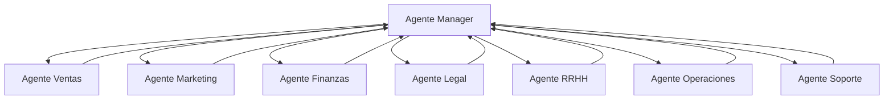

# FAQ: 003-Organización de Departamentos en Empresa Cliente

## 🎯 **PREGUNTA PRINCIPAL**
**P:** ¿Cómo se agrupan los departamentos dentro de una empresa cliente en AI Pair Orchestrator Pro?

**A:** Los departamentos en una empresa cliente se organizan de manera flexible y escalable, permitiendo que cada empresa defina su propia estructura organizacional mientras mantiene la funcionalidad de agentes IA especializados por departamento.

## 📋 **ESTRUCTURA DE DEPARTAMENTOS**

### **🏢 DEPARTAMENTOS ESTÁNDAR**

#### **1. Soporte al Cliente** 📞
- **Correo**: `soporte@empresa.com`
- **Agente IA**: 🤖 **Agente Soporte**
- **Responsabilidades**:
  - Atención al cliente
  - Resolución de consultas
  - Gestión de tickets
  - Seguimiento de casos
- **Funcionalidades**:
  - Respuestas automáticas
  - Escalamiento inteligente
  - Base de conocimiento
  - Métricas de satisfacción

#### **2. Ventas** 💼
- **Correo**: `ventas@empresa.com`
- **Agente IA**: 🤖 **Agente Ventas**
- **Responsabilidades**:
  - Gestión de leads
  - Seguimiento de oportunidades
  - Generación de propuestas
  - Cierre de ventas
- **Funcionalidades**:
  - Calificación automática de leads
  - Generación de propuestas
  - Seguimiento de pipeline
  - Análisis de conversión

#### **3. Marketing** 📢
- **Correo**: `marketing@empresa.com`
- **Agente IA**: 🤖 **Agente Marketing**
- **Responsabilidades**:
  - Campañas de marketing
  - Gestión de contenido
  - Análisis de mercado
  - Generación de leads
- **Funcionalidades**:
  - Creación de contenido
  - Análisis de campañas
  - Segmentación de audiencia
  - ROI tracking

#### **4. Finanzas** 💰
- **Correo**: `finanzas@empresa.com`
- **Agente IA**: 🤖 **Agente Finanzas**
- **Responsabilidades**:
  - Gestión contable
  - Facturación
  - Reportes financieros
  - Control de gastos
- **Funcionalidades**:
  - Procesamiento de facturas
  - Conciliación automática
  - Reportes financieros
  - Análisis de costos

#### **5. Legal** ⚖️
- **Correo**: `legal@empresa.com`
- **Agente IA**: 🤖 **Agente Legal**
- **Responsabilidades**:
  - Revisión de contratos
  - Compliance legal
  - Gestión de riesgos
  - Asesoría legal
- **Funcionalidades**:
  - Revisión de documentos
  - Alertas de compliance
  - Gestión de contratos
  - Análisis de riesgos

#### **6. Recursos Humanos** 👥
- **Correo**: `hr@empresa.com`
- **Agente IA**: 🤖 **Agente RRHH**
- **Responsabilidades**:
  - Reclutamiento
  - Gestión de empleados
  - Nómina
  - Desarrollo organizacional
- **Funcionalidades**:
  - Screening de candidatos
  - Gestión de vacaciones
  - Reportes de personal
  - Evaluaciones de desempeño

#### **7. Operaciones** ⚙️
- **Correo**: `operaciones@empresa.com`
- **Agente IA**: 🤖 **Agente Operaciones**
- **Responsabilidades**:
  - Gestión de procesos
  - Optimización operacional
  - Control de calidad
  - Logística
- **Funcionalidades**:
  - Análisis de procesos
  - Optimización automática
  - Control de calidad
  - Gestión de inventarios

#### **8. Manager/Coordinación** 🎯
- **Correo**: `manager@empresa.com`
- **Agente IA**: 🤖 **Agente Manager**
- **Responsabilidades**:
  - Coordinación entre departamentos
  - Consolidación de información
  - Toma de decisiones estratégicas
  - Reportes ejecutivos
- **Funcionalidades**:
  - Dashboard ejecutivo
  - Consolidación de datos
  - Alertas estratégicas
  - Análisis de rendimiento

## 🏗️ **ARQUITECTURA DE DEPARTAMENTOS**

### **Estructura Base**
```typescript
interface Department {
  id: string;
  company_id: string;
  name: string;
  code: DepartmentCode;
  email: string;
  agent_ia: AgentIA;
  manager_id?: string;
  is_active: boolean;
  created_at: Date;
  updated_at: Date;
}

type DepartmentCode = 
  | 'SUPPORT'      // Soporte al Cliente
  | 'SALES'        // Ventas
  | 'MARKETING'    // Marketing
  | 'FINANCE'      // Finanzas
  | 'LEGAL'        // Legal
  | 'HR'           // Recursos Humanos
  | 'OPERATIONS'   // Operaciones
  | 'MANAGEMENT'   // Gestión/Coordinación
  | 'CUSTOM';      // Departamento personalizado
```

### **Jerarquía de Departamentos**
```
🏢 EMPRESA CLIENTE
├── 📧 manager@empresa.com → 🤖 Agente Manager (Coordinación)
├── 📧 soporte@empresa.com → 🤖 Agente Soporte
├── 📧 ventas@empresa.com → 🤖 Agente Ventas
├── 📧 marketing@empresa.com → 🤖 Agente Marketing
├── 📧 finanzas@empresa.com → 🤖 Agente Finanzas
├── 📧 legal@empresa.com → 🤖 Agente Legal
├── 📧 hr@empresa.com → 🤖 Agente RRHH
└── 📧 operaciones@empresa.com → 🤖 Agente Operaciones
```

## 🔄 **COORDINACIÓN ENTRE DEPARTAMENTOS**

### **Flujo de Información**


### **Casos de Coordinación**
1. **Lead Generado** (Marketing → Ventas)
2. **Venta Cerrada** (Ventas → Finanzas)
3. **Contrato Requerido** (Ventas → Legal)
4. **Nuevo Empleado** (RRHH → Operaciones)
5. **Soporte Técnico** (Soporte → Operaciones)

## 🎨 **PERSONALIZACIÓN POR EMPRESA**

### **Departamentos Personalizados**
- **Restaurantes**: Cocina, Servicio, Reservas
- **Consultorías**: Consultoría, Investigación, Desarrollo
- **Manufactura**: Producción, Calidad, Mantenimiento
- **Educación**: Académico, Administrativo, Tecnología

### **Configuración Flexible**
```typescript
// Ejemplo: Restaurante
const restaurantDepartments = {
  'COCINA': {
    email: 'cocina@restaurante.com',
    agent: 'AgenteCocina',
    responsibilities: ['Menú', 'Inventario', 'Calidad']
  },
  'SERVICIO': {
    email: 'servicio@restaurante.com',
    agent: 'AgenteServicio',
    responsibilities: ['Atención', 'Reservas', 'Experiencia']
  },
  'RESERVAS': {
    email: 'reservas@restaurante.com',
    agent: 'AgenteReservas',
    responsibilities: ['Reservas', 'Calendario', 'Confirmaciones']
  }
};
```

## 👥 **GESTIÓN DE USUARIOS POR DEPARTAMENTO**

### **Membresías de Usuario**
```typescript
interface UserDepartmentMembership {
  id: string;
  user_id: string;
  company_id: string;
  department_code: DepartmentCode;
  role_in_department: 'MEMBER' | 'LEAD' | 'MANAGER' | 'ADMIN';
  primary_department: boolean;
  permissions_override?: DepartmentalPermission[];
  joined_at: Date;
  is_active: boolean;
}
```

### **Roles en Departamento**
- **MEMBER**: Miembro básico del departamento
- **LEAD**: Líder de proyecto o iniciativa
- **MANAGER**: Gerente del departamento
- **ADMIN**: Administrador del departamento

### **Permisos Departamentales**
```typescript
type DepartmentalPermission = 
  | 'VIEW_DEPARTMENT_DATA'
  | 'EDIT_DEPARTMENT_DATA'
  | 'MANAGE_DEPARTMENT_USERS'
  | 'ACCESS_DEPARTMENT_AGENT'
  | 'GENERATE_DEPARTMENT_REPORTS'
  | 'CONFIGURE_DEPARTMENT_WORKFLOWS';
```

## 📊 **MÉTRICAS Y REPORTES**

### **Métricas por Departamento**
- **Productividad**: Tareas completadas por día
- **Eficiencia**: Tiempo promedio por tarea
- **Satisfacción**: Rating de satisfacción del cliente
- **ROI**: Retorno de inversión por departamento

### **Reportes Consolidados**
- **Dashboard Ejecutivo**: Vista general de todos los departamentos
- **Reporte de Coordinación**: Interacciones entre departamentos
- **Análisis de Flujos**: Eficiencia de procesos cross-departamentales
- **Métricas de Agente IA**: Rendimiento de cada agente especializado

## 🔒 **SEGURIDAD Y AISLAMIENTO**

### **Aislamiento por Departamento**
- Cada departamento ve solo sus datos
- Los usuarios solo acceden a departamentos asignados
- El Agente Manager puede consolidar información
- Auditoría completa de accesos

### **Políticas de Acceso**
```sql
-- Ejemplo: Usuario solo ve su departamento
CREATE POLICY "Users see only their departments" ON departments
  FOR SELECT USING (
    id IN (
      SELECT department_id FROM user_department_memberships 
      WHERE user_id = auth.uid() AND is_active = true
    )
  );
```

## 🚀 **IMPLEMENTACIÓN**

### **Configuración Inicial**
1. **Definir estructura** de departamentos
2. **Configurar correos** corporativos
3. **Asignar agentes IA** especializados
4. **Configurar permisos** y roles
5. **Migrar usuarios** existentes

### **Migración Gradual**
- **Fase 1**: Departamentos críticos (Soporte, Ventas)
- **Fase 2**: Departamentos operativos (Finanzas, RRHH)
- **Fase 3**: Departamentos estratégicos (Legal, Operaciones)
- **Fase 4**: Optimización y personalización

## 🔗 **RELACIONADAS**
- [FAQ: 002-Roles y Permisos](002-roles-and-permissions.md)
- [FAQ: 004-Agentes IA por Departamento](004-ai-agents-departments.md)
- [Documento: Arquitectura de Agentes Departamentales](../DEPARTMENTAL_AGENTS_ARCHITECTURE.md)

## 📊 **MÉTRICAS**
- **Departamentos estándar**: 8 departamentos base
- **Flexibilidad**: 100% personalizable
- **Agentes IA**: 1 agente especializado por departamento
- **Coordinación**: Automática entre departamentos
- **Escalabilidad**: Sin límites de departamentos 