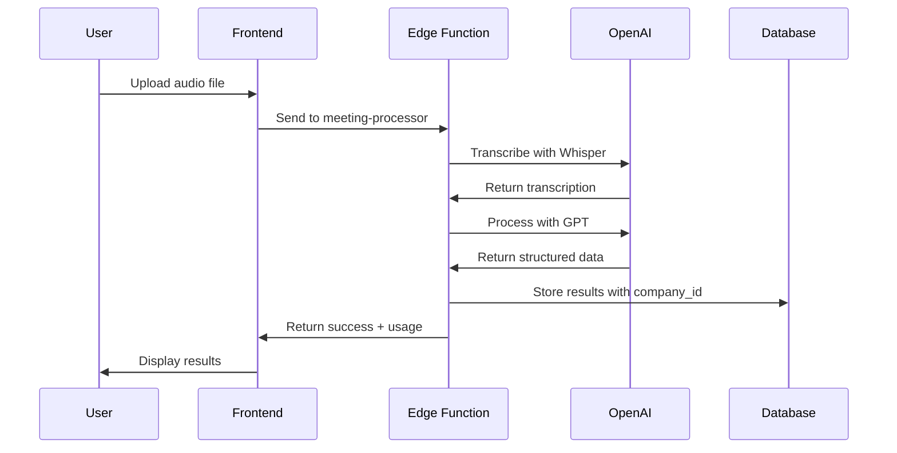
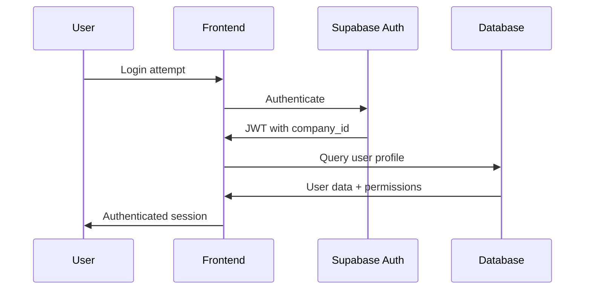

# System Architecture Overview - VibeThink Orchestrator

## 🏗️ High-Level Architecture

```mermaid
graph TB
    subgraph "Frontend Layer"
        React[React 18 + TypeScript]
        UI[shadcn/ui Components]
        State[React Query + Hooks]
    end
    
    subgraph "Backend Layer"
        Supabase[Supabase Cloud]
        Auth[Supabase Auth]
        DB[(PostgreSQL + RLS)]
        EdgeFn[Edge Functions]
    end
    
    subgraph "AI Layer"
        OpenAI[OpenAI API]
        Whisper[Whisper (Audio)]
        GPT[GPT (Text Processing)]
        Firecrawl[Firecrawl (Web)]
    end
    
    subgraph "External"
        Google[Google Workspace]
        Microsoft[Microsoft 365]
        Storage[File Storage]
    end
    
    React --> Supabase
    EdgeFn --> OpenAI
    EdgeFn --> Firecrawl
    React --> Google
    React --> Microsoft
    DB --> Storage
```

## 🔐 Multi-Tenant Security Architecture

### Row Level Security (RLS) Foundation
```sql
-- Every table follows this pattern
CREATE POLICY "Company isolation" ON table_name
  FOR ALL USING (company_id = (auth.jwt() ->> 'company_id')::uuid);
```

### Security Layers
1. **Database Level**: RLS policies prevent cross-company access
2. **Application Level**: TypeScript interfaces enforce company_id
3. **API Level**: Edge Functions validate company association
4. **UI Level**: Components filter by user's company context

### Role-Based Access Control
```typescript
type UserRole = 'SUPER_ADMIN' | 'SUPPORT' | 'OWNER' | 'ADMIN' | 'MANAGER' | 'EMPLOYEE';

interface User {
  id: string;
  email: string;
  role: UserRole;
  company_id: string; // Critical for multi-tenancy
}
```

## 🎯 Core Data Flow Patterns

### 1. Multi-Tenant Query Pattern
```typescript
// ✅ Always include company_id filter
const { data } = await supabase
  .from('documents')
  .select('*')
  .eq('company_id', user.company_id);

// ❌ Never query without company_id
const { data } = await supabase.from('documents').select('*');
```

### 2. AI Processing Flow


### 3. Authentication Flow


## 📊 Component Architecture

### UI Component Hierarchy
```
App
├── Layout Components
│   ├── Header (navigation, user menu)
│   ├── Sidebar (role-based navigation)
│   └── Footer (status, theme)
├── Page Components
│   ├── Dashboard (role-specific content)
│   ├── AI Processing (meeting processor)
│   └── Admin (management features)
└── Feature Components
    ├── Auth (login, signup)
    ├── User Management (invite, roles)
    └── Company Settings (plans, limits)
```

### State Management Strategy
```typescript
// Server State: React Query
const { data: companies } = useQuery({
  queryKey: ['companies', user?.company_id],
  queryFn: () => fetchCompanies(user?.company_id),
  enabled: !!user?.company_id,
});

// Local State: React Hooks
const [selectedFile, setSelectedFile] = useState<File | null>(null);

// Global State: Context when needed
const { user, hasPermission } = useAuth();
```

## 🗄️ Database Schema Patterns

### Core Tables
```sql
-- Companies (tenant isolation root)
companies (
  id uuid PRIMARY KEY,
  name text NOT NULL,
  subscription_plan subscription_plan_type,
  created_at timestamptz DEFAULT now()
);

-- Users (with company association)
users (
  id uuid PRIMARY KEY REFERENCES auth.users,
  company_id uuid REFERENCES companies(id),
  role user_role_type,
  email text UNIQUE NOT NULL
);

-- Company-scoped data
documents (
  id uuid PRIMARY KEY,
  company_id uuid REFERENCES companies(id), -- Required for RLS
  title text NOT NULL,
  content text,
  created_by uuid REFERENCES users(id)
);
```

### Index Strategy
```sql
-- Performance indexes for multi-tenant queries
CREATE INDEX idx_documents_company_id ON documents(company_id);
CREATE INDEX idx_users_company_role ON users(company_id, role);
CREATE INDEX idx_ai_usage_company_date ON ai_usage_logs(company_id, created_at);
```

## 🤖 AI Integration Architecture

### Edge Functions Pattern
```typescript
// Edge Function structure
export default async (req: Request) => {
  // 1. Validate authentication
  const user = await validateUser(req);
  
  // 2. Check company limits
  const canProcess = await checkCompanyLimits(user.company_id);
  
  // 3. Process with AI
  const result = await processWithOpenAI(data);
  
  // 4. Log usage for billing
  await logAIUsage(user.company_id, result.usage);
  
  // 5. Return with company association
  return { ...result, company_id: user.company_id };
};
```

### Rate Limiting Strategy
```typescript
interface CompanyLimits {
  max_monthly_ai_requests: number;
  current_usage: {
    ai_requests: number;
    storage_mb: number;
    users: number;
  };
}

// Check before processing
const usage = await getCompanyUsage(company_id);
if (usage.ai_requests >= limits.max_monthly_ai_requests) {
  throw new Error('Monthly AI limit exceeded');
}
```

## 🔄 Real-time Architecture

### Supabase Realtime Integration
```typescript
// Subscribe to company-scoped changes
const subscription = supabase
  .channel(`company:${user.company_id}`)
  .on(
    'postgres_changes',
    {
      event: '*',
      schema: 'public',
      table: 'documents',
      filter: `company_id=eq.${user.company_id}`,
    },
    (payload) => {
      // Handle real-time updates
      updateLocalState(payload);
    }
  )
  .subscribe();
```

## 📈 Scaling Considerations

### Performance Optimizations
- **Code Splitting**: Route-based lazy loading
- **Caching**: React Query with appropriate stale times
- **Database**: Proper indexing on company_id + query fields
- **CDN**: Static assets served from CDN

### Security Scaling
- **RLS Performance**: Indexes on company_id for all tables
- **API Rate Limiting**: Per-company and per-user limits
- **Audit Logging**: Comprehensive logging for compliance
- **Data Isolation**: Zero cross-company data leakage

### Operational Scaling
- **Monitoring**: Company-specific metrics and alerts
- **Backup**: Per-company backup and restore capabilities
- **Support**: SUPPORT role with limited cross-company access
- **Compliance**: GDPR, SOC2 ready architecture

## 🛠️ Development Patterns

### Component Development
```typescript
// Standard component pattern
interface ComponentProps {
  data: DataType[];
  onAction: (item: DataType) => void;
  title?: string;
  isLoading?: boolean;
  className?: string;
}

export function Component({ data, onAction, title, isLoading, className }: ComponentProps) {
  const { user } = useAuth();
  
  // Always ensure company context
  if (!user?.company_id) return <Unauthorized />;
  
  return (
    <div className={cn("default-classes", className)}>
      {/* Component implementation */}
    </div>
  );
}
```

### Custom Hooks Pattern
```typescript
// Data fetching with company isolation
export function useCompanyData<T>(
  endpoint: string,
  select?: string
): UseQueryResult<T[], Error> {
  const { user } = useAuth();
  
  return useQuery({
    queryKey: [endpoint, user?.company_id],
    queryFn: async () => {
      const { data, error } = await supabase
        .from(endpoint)
        .select(select || '*')
        .eq('company_id', user?.company_id);
      
      if (error) throw error;
      return data;
    },
    enabled: !!user?.company_id,
  });
}
```

## 🔍 Testing Architecture

### Multi-tenant Testing
```typescript
// Test with company isolation
describe('Multi-tenant features', () => {
  test('should only return company data', async () => {
    const company1 = await createTestCompany('Company 1');
    const company2 = await createTestCompany('Company 2');
    
    const user1 = await createTestUser(company1.id);
    const doc1 = await createDocument(company1.id);
    const doc2 = await createDocument(company2.id);
    
    // User should only see their company's data
    const result = await fetchDocuments(user1);
    expect(result).toContain(doc1);
    expect(result).not.toContain(doc2);
  });
});
```

---

**🎯 Key Takeaway**: Every component, query, and function must respect the multi-tenant architecture with company_id isolation as the foundation.

**📋 For Implementation**: Always start with company context, validate permissions, and ensure data isolation. 