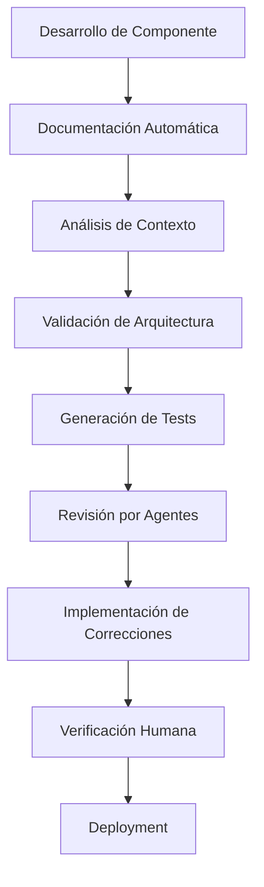

# Sistema de CI/CD Autónomo con Agentes IA

## Visión General

Sistema de desarrollo continuo donde cada componente/funcionalidad se documenta de forma estructurada, permitiendo que agentes IA especializados revisen, sugieran soluciones, implementen correcciones y soliciten verificación humana antes del deployment.

## Arquitectura del Sistema

### 1. Pipeline de Documentación Automática



### 2. Agentes Especializados

#### Agent-Reviewer (Revisor de Código)
- **Responsabilidades**: Análisis de calidad, patrones, seguridad
- **Herramientas**: ESLint, SonarQube, análisis estático
- **Output**: Reporte de calidad con sugerencias

#### Agent-Architect (Arquitecto)
- **Responsabilidades**: Validación de arquitectura, patrones, escalabilidad
- **Herramientas**: Análisis de dependencias, métricas de complejidad
- **Output**: Validación arquitectónica

#### Agent-Tester (Tester)
- **Responsabilidades**: Generación y ejecución de tests
- **Herramientas**: Jest, Playwright, Cypress
- **Output**: Reporte de cobertura y tests

#### Agent-Security (Seguridad)
- **Responsabilidades**: Análisis de vulnerabilidades, compliance
- **Herramientas**: OWASP ZAP, análisis de dependencias
- **Output**: Reporte de seguridad

#### Agent-Performance (Rendimiento)
- **Responsabilidades**: Análisis de performance, optimización
- **Herramientas**: Lighthouse, bundle analyzer
- **Output**: Métricas de performance

## Implementación Técnica

### 1. Estructura de Documentación

```typescript
interface ComponentDocumentation {
  id: string;
  name: string;
  description: string;
  architecture: {
    patterns: string[];
    dependencies: string[];
    complexity: 'LOW' | 'MEDIUM' | 'HIGH';
  };
  requirements: {
    functional: string[];
    nonFunctional: string[];
    compliance: string[];
  };
  implementation: {
    files: string[];
    components: string[];
    hooks: string[];
  };
  testing: {
    unit: string[];
    integration: string[];
    e2e: string[];
  };
  deployment: {
    environment: string;
    dependencies: string[];
    configuration: Record<string, any>;
  };
}
```

### 2. Pipeline de CI/CD

```yaml
# .github/workflows/autonomous-ci-cd.yml
name: Autonomous CI/CD Pipeline

on:
  pull_request:
    branches: [main, develop]
  push:
    branches: [main, develop]

jobs:
  documentation-analysis:
    runs-on: ubuntu-latest
    steps:
      - uses: actions/checkout@v3
      - name: Analyze Documentation
        run: |
          npm run analyze-docs
          npm run validate-architecture
      
  agent-review:
    needs: documentation-analysis
    runs-on: ubuntu-latest
    steps:
      - name: Agent Code Review
        run: npm run agent-review
      - name: Agent Security Scan
        run: npm run agent-security
      - name: Agent Performance Analysis
        run: npm run agent-performance
      
  autonomous-fixes:
    needs: agent-review
    runs-on: ubuntu-latest
    if: contains(github.event.head_commit.message, '[AUTO-FIX]')
    steps:
      - name: Apply Autonomous Fixes
        run: npm run apply-autonomous-fixes
      - name: Create Fix PR
        run: npm run create-fix-pr
        
  human-verification:
    needs: autonomous-fixes
    runs-on: ubuntu-latest
    steps:
      - name: Request Human Review
        run: npm run request-human-review
```

### 3. Agentes IA Especializados

```typescript
// services/agents/AgentReviewer.ts
export class AgentReviewer {
  async analyzeComponent(docs: ComponentDocumentation): Promise<ReviewReport> {
    const analysis = await this.performAnalysis(docs);
    const suggestions = await this.generateSuggestions(analysis);
    const fixes = await this.generateFixes(suggestions);
    
    return {
      score: analysis.score,
      issues: analysis.issues,
      suggestions,
      autoFixes: fixes,
      requiresHumanReview: analysis.score < 0.8
    };
  }
  
  private async performAnalysis(docs: ComponentDocumentation) {
    // Análisis de código, arquitectura, patrones
  }
  
  private async generateSuggestions(analysis: AnalysisResult) {
    // Generación de sugerencias basadas en mejores prácticas
  }
  
  private async generateFixes(suggestions: Suggestion[]) {
    // Generación automática de correcciones
  }
}
```

## Flujo de Trabajo Autónomo

### Fase 1: Documentación Automática
1. **Trigger**: Nuevo componente/funcionalidad
2. **Proceso**: Documentación automática con contexto
3. **Output**: Estructura de documentación completa

### Fase 2: Análisis Multi-Agente
1. **Agent-Reviewer**: Análisis de código y calidad
2. **Agent-Architect**: Validación arquitectónica
3. **Agent-Security**: Análisis de seguridad
4. **Agent-Performance**: Análisis de rendimiento
5. **Agent-Tester**: Generación de tests

### Fase 3: Correcciones Autónomas
1. **Análisis de Sugerencias**: Priorización automática
2. **Aplicación de Fixes**: Correcciones automáticas
3. **Validación**: Re-ejecución de tests
4. **Documentación**: Actualización automática

### Fase 4: Verificación Humana
1. **Notificación**: Alertas a desarrolladores
2. **Dashboard**: Vista consolidada de cambios
3. **Aprobación**: Proceso de review humano
4. **Deployment**: Implementación automática

## Herramientas y Tecnologías

### Core Technologies
- **GitHub Actions**: Pipeline automation
- **OpenAI API**: Análisis y generación de código
- **SonarQube**: Análisis de calidad
- **Jest/Playwright**: Testing automation
- **Supabase**: Base de datos para tracking

### Monitoring y Analytics
- **Grafana**: Dashboards de métricas
- **Prometheus**: Métricas de performance
- **Slack/Discord**: Notificaciones automáticas

## Métricas y KPIs

### Calidad de Código
- **Code Coverage**: >90%
- **SonarQube Score**: >A
- **Security Vulnerabilities**: 0 críticas
- **Performance Score**: >90

### Eficiencia del Pipeline
- **Time to Review**: <5 minutos
- **Auto-Fix Rate**: >70%
- **Human Review Time**: <30 minutos
- **Deployment Success Rate**: >95%

### ROI y Beneficios
- **Reducción de Bugs**: 60%
- **Tiempo de Desarrollo**: -40%
- **Costo de QA**: -50%
- **Time to Market**: -30%

## Implementación Gradual

### Fase 1: Fundación (Mes 1-2)
- Setup de pipeline básico
- Documentación automática
- Agent-Reviewer básico

### Fase 2: Expansión (Mes 3-4)
- Agentes adicionales
- Correcciones autónomas
- Dashboard de métricas

### Fase 3: Optimización (Mes 5-6)
- Machine Learning para mejoras
- Análisis predictivo
- Optimización continua

## Consideraciones de Seguridad

### Control de Acceso
- **Role-based Access**: Diferentes niveles de permisos
- **Audit Logs**: Tracking completo de cambios
- **Approval Workflows**: Múltiples niveles de aprobación

### Validación de Cambios
- **Code Signing**: Verificación de integridad
- **Dependency Scanning**: Análisis de vulnerabilidades
- **Compliance Checks**: Validación normativa

## Costos y ROI

### Inversión Inicial
- **Setup de Infraestructura**: $5,000-10,000
- **Desarrollo de Agentes**: $15,000-25,000
- **Integración y Testing**: $10,000-15,000

### Beneficios Anuales
- **Reducción de Costos de Desarrollo**: $50,000-100,000
- **Mejora de Calidad**: $20,000-40,000
- **Aceleración de Time to Market**: $30,000-60,000

### ROI Estimado: 200-300% en el primer año

## Próximos Pasos

1. **Validación de Arquitectura**: Revisar con equipo técnico
2. **Proof of Concept**: Implementar Agent-Reviewer básico
3. **Pilot Project**: Probar con módulo PQRS
4. **Escalación Gradual**: Expandir a toda la plataforma

---

**Nota**: Este sistema transforma el desarrollo de "manual" a "autónomo", manteniendo el control humano en puntos críticos mientras maximiza la eficiencia y calidad del código. 