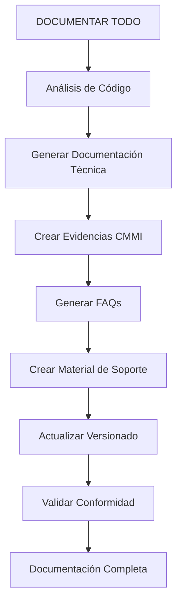
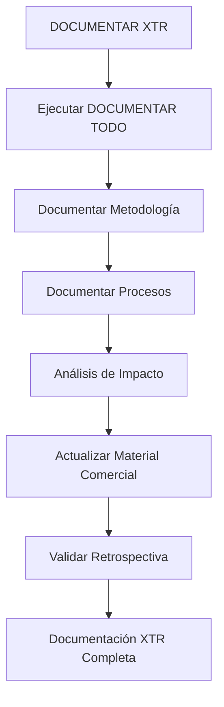
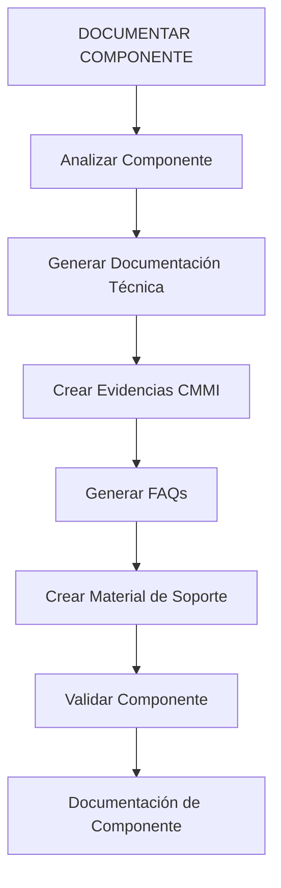
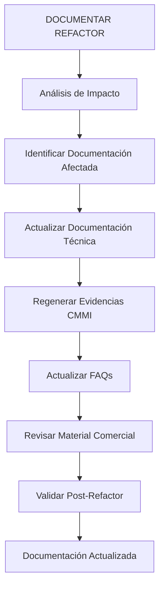

# Framework de Automatización de Documentación

## 🎯 **Propósito**
Este framework define los procesos, herramientas y automatizaciones para ejecutar la documentación completa de forma automática y reproducible.

## 🔧 **Herramientas de Automatización**

### **Scripts de Documentación**
```bash
# Comandos principales
npm run document:all          # DOCUMENTAR TODO
npm run document:xtr          # DOCUMENTAR XTR
npm run document:component    # DOCUMENTAR COMPONENTE
npm run document:module       # DOCUMENTAR MÓDULO
npm run document:refactor     # DOCUMENTAR REFACTOR
npm run document:validate     # Validar documentación
npm run document:update       # Actualizar documentación
```

### **Generadores Automáticos**
```typescript
// Generadores de documentación
- ComponentDocumentationGenerator
- ModuleDocumentationGenerator
- FAQGenerator
- CMMIEvidenceGenerator
- UserManualGenerator
- CommercialMaterialGenerator
```

## 📋 **Procesos Automatizados**

### **1. Proceso de Documentación Completa**

#### **Entrada:** Solicitud de "DOCUMENTAR TODO"
#### **Salida:** Documentación completa generada



#### **Pasos Automáticos:**
1. **Análisis de Código**
   - Escanear componentes y módulos
   - Identificar APIs y servicios
   - Analizar dependencias
   - Detectar casos de uso

2. **Generar Documentación Técnica**
   - Crear documentación de componentes
   - Generar guías de implementación
   - Documentar APIs y servicios
   - Crear diagramas de arquitectura

3. **Crear Evidencias CMMI**
   - Generar evidencias por feature
   - Documentar procesos de desarrollo
   - Crear trazabilidad de requerimientos
   - Validar conformidad con estándares

4. **Generar FAQs**
   - Crear FAQs por módulo
   - Generar FAQs técnicas
   - Crear FAQs de usuario
   - Generar FAQs de implementación

5. **Crear Material de Soporte**
   - Generar manuales de usuario
   - Crear ayudas de pantalla
   - Generar guías de implementación
   - Crear material comercial

6. **Actualizar Versionado**
   - Etiquetar versiones
   - Actualizar changelog
   - Mantener historial
   - Documentar decisiones

7. **Validar Conformidad**
   - Verificar casos de uso
   - Validar documentación
   - Revisar conformidad
   - Identificar gaps

### **2. Proceso de Documentación XTR**

#### **Entrada:** Solicitud de "DOCUMENTAR XTR"
#### **Salida:** Documentación completa + metodología



#### **Pasos Adicionales:**
1. **Documentar Metodología**
   - Procesos de desarrollo
   - Estándares de código
   - Flujos de trabajo
   - Decisiones de arquitectura

2. **Documentar Procesos**
   - Guías de onboarding
   - Procedimientos operativos
   - Checklists de calidad
   - Procesos de revisión

3. **Análisis de Impacto**
   - Identificar entregables afectados
   - Actualizar material comercial
   - Revisar conformidad
   - Identificar oportunidades

4. **Validar Retrospectiva**
   - Revisar casos de uso
   - Identificar gaps
   - Actualizar procesos
   - Mejorar metodología

### **3. Proceso de Documentación de Componente**

#### **Entrada:** Solicitud de "DOCUMENTAR COMPONENTE [nombre]"
#### **Salida:** Documentación específica del componente



#### **Pasos Específicos:**
1. **Analizar Componente**
   - Extraer props e interfaces
   - Identificar casos de uso
   - Analizar dependencias
   - Detectar consideraciones

2. **Generar Documentación Técnica**
   - Documentar props
   - Crear ejemplos de uso
   - Documentar casos de uso
   - Generar consideraciones

3. **Crear Evidencias CMMI**
   - Trazabilidad de requerimientos
   - Validación de conformidad
   - Documentación de pruebas
   - Registro de decisiones

4. **Generar FAQs**
   - Preguntas de uso
   - Solución de problemas
   - Mejores prácticas
   - Casos avanzados

### **4. Proceso de Documentación de Refactor**

#### **Entrada:** Solicitud de "DOCUMENTAR REFACTOR"
#### **Salida:** Documentación actualizada



#### **Pasos de Actualización:**
1. **Análisis de Impacto**
   - Identificar cambios realizados
   - Detectar documentación afectada
   - Analizar impacto en casos de uso
   - Identificar material a actualizar

2. **Actualizar Documentación**
   - Actualizar documentación técnica
   - Regenerar evidencias CMMI
   - Actualizar FAQs
   - Revisar material comercial

3. **Validar Post-Refactor**
   - Verificar conformidad
   - Actualizar casos de uso
   - Revisar ayudas de pantalla
   - Validar manuales

## 🔄 **Automatizaciones y Triggers**

### **Triggers Automáticos**
```yaml
# GitHub Actions
on:
  push:
    branches: [main]
  pull_request:
    branches: [main]
  release:
    types: [published]

jobs:
  document:
    runs-on: ubuntu-latest
    steps:
      - name: Checkout
        uses: actions/checkout@v2
      
      - name: Setup Node.js
        uses: actions/setup-node@v2
        with:
          node-version: '18'
      
      - name: Install dependencies
        run: npm install
      
      - name: Generate documentation
        run: npm run document:all
      
      - name: Validate documentation
        run: npm run document:validate
      
      - name: Commit documentation
        run: |
          git config --local user.email "action@github.com"
          git config --local user.name "GitHub Action"
          git add docs/
          git commit -m "docs: auto-generate documentation" || exit 0
          git push
```

### **Scripts de Automatización**
```javascript
// scripts/documentation.js
const { execSync } = require('child_process');
const fs = require('fs');
const path = require('path');

class DocumentationAutomation {
  constructor() {
    this.config = this.loadConfig();
  }

  async documentAll() {
    console.log('🚀 Iniciando documentación completa...');
    
    // 1. Análisis de código
    await this.analyzeCode();
    
    // 2. Generar documentación técnica
    await this.generateTechnicalDocs();
    
    // 3. Crear evidencias CMMI
    await this.generateCMMIEvidence();
    
    // 4. Generar FAQs
    await this.generateFAQs();
    
    // 5. Crear material de soporte
    await this.generateSupportMaterial();
    
    // 6. Actualizar versionado
    await this.updateVersioning();
    
    // 7. Validar conformidad
    await this.validateCompliance();
    
    console.log('✅ Documentación completa generada');
  }

  async documentXTR() {
    console.log('🚀 Iniciando documentación XTR...');
    
    // Ejecutar documentación completa
    await this.documentAll();
    
    // Documentar metodología
    await this.documentMethodology();
    
    // Documentar procesos
    await this.documentProcesses();
    
    // Análisis de impacto
    await this.analyzeImpact();
    
    // Validar retrospectiva
    await this.validateRetrospective();
    
    console.log('✅ Documentación XTR completada');
  }

  async documentComponent(componentName) {
    console.log(`🚀 Documentando componente: ${componentName}`);
    
    // Analizar componente
    const component = await this.analyzeComponent(componentName);
    
    // Generar documentación
    await this.generateComponentDocs(component);
    
    // Crear evidencias
    await this.generateComponentEvidence(component);
    
    // Generar FAQs
    await this.generateComponentFAQs(component);
    
    console.log(`✅ Componente ${componentName} documentado`);
  }

  async documentRefactor() {
    console.log('🚀 Documentando refactor...');
    
    // Análisis de impacto
    const impact = await this.analyzeRefactorImpact();
    
    // Actualizar documentación
    await this.updateDocumentation(impact);
    
    // Regenerar evidencias
    await this.regenerateEvidence(impact);
    
    // Validar post-refactor
    await this.validatePostRefactor();
    
    console.log('✅ Refactor documentado');
  }

  // Métodos auxiliares...
  async analyzeCode() {
    // Implementar análisis de código
  }

  async generateTechnicalDocs() {
    // Implementar generación de documentación técnica
  }

  async generateCMMIEvidence() {
    // Implementar generación de evidencias CMMI
  }

  async generateFAQs() {
    // Implementar generación de FAQs
  }

  async generateSupportMaterial() {
    // Implementar generación de material de soporte
  }

  async updateVersioning() {
    // Implementar actualización de versionado
  }

  async validateCompliance() {
    // Implementar validación de conformidad
  }
}

module.exports = DocumentationAutomation;
```

## 📊 **Métricas y Validación**

### **Métricas de Cobertura**
```typescript
interface DocumentationMetrics {
  componentsCovered: number;
  modulesCovered: number;
  apisDocumented: number;
  useCasesCovered: number;
  faqsGenerated: number;
  evidenceCreated: number;
  complianceScore: number;
}
```

### **Validación Automática**
```typescript
interface ValidationResult {
  isValid: boolean;
  coverage: number;
  gaps: string[];
  recommendations: string[];
  complianceScore: number;
}
```

## 🎯 **Resultado Esperado**

Cuando se ejecute cualquier comando de documentación:

1. ✅ **Se ejecute automáticamente** todo el proceso definido
2. ✅ **Se genere** toda la documentación necesaria
3. ✅ **Se actualicen** todos los entregables
4. ✅ **Se valide** la conformidad y calidad
5. ✅ **Se mantenga** trazabilidad completa
6. ✅ **Se impacten** todos los procesos relacionados

## 📋 **Checklist de Implementación**

- [ ] Configurar scripts de automatización
- [ ] Implementar generadores de documentación
- [ ] Configurar triggers automáticos
- [ ] Crear plantillas de documentación
- [ ] Implementar validación automática
- [ ] Configurar métricas de cobertura
- [ ] Documentar procesos de automatización
- [ ] Validar funcionamiento completo

---

**Nota:** Este framework debe ser actualizado cada vez que se agreguen nuevos tipos de documentación o se modifiquen los procesos existentes. 