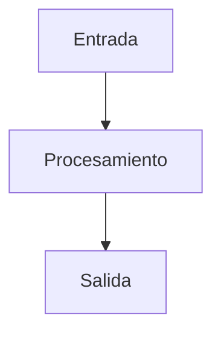

# Estándares de Documentación Automática

## 🎯 **Propósito**
Este documento define los estándares exactos para la documentación automática de todos los elementos del proyecto. Cuando se ejecute cualquier comando de documentación, se seguirán estos estándares de forma consistente.

## 📚 Convención de Nombres para Archivos de Referencia Global

- Los siguientes archivos deben estar siempre en mayúsculas y ubicados en la raíz del proyecto o en subcarpetas relevantes:
  - `README.md`
  - `LICENSE`
  - `CONTRIBUTING.md`
  - `CODE_OF_CONDUCT.md`
- Esto asegura máxima visibilidad y compatibilidad con herramientas y plataformas de la industria (GitHub, GitLab, Bitbucket, etc.).
- No deben renombrarse a minúsculas ni a snake_case.
- Todas las demás documentaciones técnicas deben seguir la convención en inglés, minúsculas y snake_case o kebab-case, sin acentos.

*Referencia: [GitHub Docs - About READMEs](https://docs.github.com/en/repositories/working-with-files/managing-files/adding-a-readme-to-your-repository)*

---

## 🏷️ Naming Convention for Scripts and Code Files

- Use English, lowercase, and snake_case for all scripts and code files (e.g., `check_docs_naming.py`, `generate_report.js`).
- Use kebab-case for shell scripts and configuration files (e.g., `deploy-prod.sh`, `ci-cd-check.yml`).
- No spaces, accents, or special characters.
- The name must clearly describe the script's purpose.
- Use suffixes like `.test`, `.spec`, `.helper` to indicate file type or role (e.g., `user_auth_helper.ts`, `data_cleaner.test.py`).
- Example:
  - `check_docs_naming.py`
  - `deploy-prod.sh`
  - `user_auth_helper.ts`
- Do not use generic names like `script.py` or `program.js`.
- Do not mix languages or formats (avoid `ValidarDatos.py` or `deployApp.sh`).

*This convention applies to all scripts in the `scripts/`, `src/`, and related folders.*

---

## 📋 **Estándares por Tipo de Elemento**

### **1. Componentes Base**

#### **Estructura de Documentación:**
```markdown
# [Nombre del Componente]

## Descripción
Descripción clara y concisa del propósito del componente.

## Props
| Prop | Tipo | Requerido | Default | Descripción |
|------|------|-----------|---------|-------------|
| prop | type | boolean | value | descripción |

## Ejemplos de Uso
```tsx
// Ejemplo básico
<ComponentName prop="value" />

// Ejemplo avanzado
<ComponentName 
  prop="value"
  variant="primary"
  size="lg"
/>
```

## Casos de Uso
- **Caso 1:** Descripción del caso de uso
- **Caso 2:** Descripción del caso de uso

## Consideraciones
- Consideración de rendimiento
- Consideración de accesibilidad
- Consideración de diseño

## FAQs
### ¿Cómo usar el componente?
Respuesta detallada...

### ¿Cómo personalizar el componente?
Respuesta detallada...

## Evidencias CMMI
- **Proceso:** Desarrollo de componentes
- **Nivel:** 3
- **Evidencia:** Componente implementado según estándares
- **Validación:** Cumple con criterios de calidad
```

#### **Archivos Generados:**
- `docs/components/[nombre].md` - Documentación principal
- `docs/components/[nombre]-examples.md` - Ejemplos detallados
- `docs/components/[nombre]-faqs.md` - FAQs específicas
- `docs/cmmi/evidence/components/[nombre].json` - Evidencias CMMI

### **2. Utilidades**

#### **Estructura de Documentación:**
```markdown
# [Nombre de la Utilidad]

## Descripción
Descripción del propósito y funcionalidad de la utilidad.

## API
### Función Principal
```typescript
function utilityName(param: Type): ReturnType
```

### Parámetros
- `param` (Type): Descripción del parámetro

### Retorno
- `ReturnType`: Descripción del valor retornado

## Ejemplos de Uso
```typescript
// Ejemplo básico
const result = utilityName(value);

// Ejemplo avanzado
const result = utilityName({
  param1: value1,
  param2: value2
});
```

## Casos de Uso
- **Caso 1:** Descripción del caso de uso
- **Caso 2:** Descripción del caso de uso

## Consideraciones
- Consideración de rendimiento
- Consideración de seguridad
- Consideración de compatibilidad

## FAQs
### ¿Cuándo usar esta utilidad?
Respuesta detallada...

### ¿Cómo optimizar el uso?
Respuesta detallada...

## Evidencias CMMI
- **Proceso:** Desarrollo de utilidades
- **Nivel:** 3
- **Evidencia:** Utilidad implementada según estándares
- **Validación:** Cumple con criterios de calidad
```

#### **Archivos Generados:**
- `docs/utils/[nombre].md` - Documentación principal
- `docs/utils/[nombre]-examples.md` - Ejemplos detallados
- `docs/utils/[nombre]-faqs.md` - FAQs específicas
- `docs/cmmi/evidence/utils/[nombre].json` - Evidencias CMMI

### **3. Módulos del Sistema**

#### **Estructura de Documentación:**
```markdown
# [Nombre del Módulo]

## Descripción
Descripción completa del módulo y su propósito en el sistema.

## Arquitectura
### Componentes Principales
- **Componente 1:** Descripción y responsabilidad
- **Componente 2:** Descripción y responsabilidad

### Flujo de Datos


### APIs y Servicios
- **API 1:** Descripción y endpoints
- **API 2:** Descripción y endpoints

## Funcionalidades
### Funcionalidad 1
Descripción detallada de la funcionalidad.

### Funcionalidad 2
Descripción detallada de la funcionalidad.

## Integraciones
- **Integración 1:** Descripción de la integración
- **Integración 2:** Descripción de la integración

## Casos de Uso
- **Caso 1:** Descripción del caso de uso
- **Caso 2:** Descripción del caso de uso

## FAQs
### ¿Cómo configurar el módulo?
Respuesta detallada...

### ¿Cómo usar las funcionalidades?
Respuesta detallada...

## Material Comercial
### Beneficios
- Beneficio 1
- Beneficio 2

### ROI
Descripción del retorno de inversión.

### Casos de Éxito
Descripción de casos de éxito.

## Evidencias CMMI
- **Proceso:** Desarrollo de módulos
- **Nivel:** 3
- **Evidencia:** Módulo implementado según estándares
- **Validación:** Cumple con criterios de calidad
```

#### **Archivos Generados:**
- `docs/modules/[nombre].md` - Documentación principal
- `docs/modules/[nombre]-architecture.md` - Arquitectura detallada
- `docs/modules/[nombre]-apis.md` - Documentación de APIs
- `docs/modules/[nombre]-faqs.md` - FAQs específicas
- `docs/modules/[nombre]-commercial.md` - Material comercial
- `docs/cmmi/evidence/modules/[nombre].json` - Evidencias CMMI

### **4. APIs y Servicios**

#### **Estructura de Documentación:**
```markdown
# [Nombre de la API]

## Descripción
Descripción del propósito y funcionalidad de la API.

## Endpoints

### GET /endpoint
#### Descripción
Descripción del endpoint.

#### Parámetros
| Parámetro | Tipo | Requerido | Descripción |
|-----------|------|-----------|-------------|
| param | type | boolean | descripción |

#### Respuesta
```json
{
  "field": "type",
  "description": "descripción"
}
```

#### Ejemplo de Uso
```bash
curl -X GET "https://api.example.com/endpoint?param=value"
```

#### Códigos de Respuesta
- `200`: Éxito
- `400`: Error de validación
- `500`: Error interno

## Autenticación
Descripción del método de autenticación.

## Rate Limiting
Descripción de las limitaciones de tasa.

## Casos de Uso
- **Caso 1:** Descripción del caso de uso
- **Caso 2:** Descripción del caso de uso

## FAQs
### ¿Cómo autenticarse?
Respuesta detallada...

### ¿Cómo manejar errores?
Respuesta detallada...

## Evidencias CMMI
- **Proceso:** Desarrollo de APIs
- **Nivel:** 3
- **Evidencia:** API implementada según estándares
- **Validación:** Cumple con criterios de calidad
```

#### **Archivos Generados:**
- `docs/apis/[nombre].md` - Documentación principal
- `docs/apis/[nombre]-examples.md` - Ejemplos detallados
- `docs/apis/[nombre]-faqs.md` - FAQs específicas
- `docs/cmmi/evidence/apis/[nombre].json` - Evidencias CMMI

## 📊 **Estándares de Calidad**

### **Criterios de Validación:**
1. **Completitud:** Documentación debe cubrir todos los aspectos
2. **Claridad:** Lenguaje claro y comprensible
3. **Ejemplos:** Incluir ejemplos prácticos
4. **Casos de Uso:** Documentar casos de uso reales
5. **FAQs:** Responder preguntas frecuentes
6. **Evidencias:** Generar evidencias CMMI válidas

### **Métricas de Calidad:**
- **Cobertura:** 100% de elementos documentados
- **Actualización:** Documentación actualizada con cada cambio
- **Validación:** Documentación validada automáticamente
- **Conformidad:** Cumplimiento con estándares CMMI

## 🔄 **Proceso de Actualización**

### **Para Cada Cambio:**
1. **Identificar** elementos afectados
2. **Actualizar** documentación técnica
3. **Regenerar** evidencias CMMI
4. **Actualizar** FAQs relacionadas
5. **Revisar** material comercial
6. **Validar** conformidad

### **Para Cada Refactor:**
1. **Analizar** impacto en documentación
2. **Actualizar** todos los archivos afectados
3. **Regenerar** evidencias CMMI
4. **Validar** casos de uso
5. **Actualizar** versionado

## 📝 **Plantillas Automáticas**

### **Plantilla de Componente:**
```typescript
interface ComponentTemplate {
  name: string;
  description: string;
  props: PropDefinition[];
  examples: Example[];
  useCases: UseCase[];
  considerations: string[];
  faqs: FAQ[];
  cmmiEvidence: CMMIEvidence;
}
```

### **Plantilla de Módulo:**
```typescript
interface ModuleTemplate {
  name: string;
  description: string;
  architecture: Architecture;
  apis: APIDefinition[];
  integrations: Integration[];
  useCases: UseCase[];
  faqs: FAQ[];
  commercialMaterial: CommercialMaterial;
  cmmiEvidence: CMMIEvidence;
}
```

### **Plantilla de API:**
```typescript
interface APITemplate {
  name: string;
  description: string;
  endpoints: Endpoint[];
  authentication: Authentication;
  rateLimiting: RateLimiting;
  useCases: UseCase[];
  faqs: FAQ[];
  cmmiEvidence: CMMIEvidence;
}
```

## 🎯 **Resultado Esperado**

Cuando se ejecute cualquier comando de documentación:

1. ✅ **Se genere** documentación completa según estándares
2. ✅ **Se creen** todos los archivos necesarios
3. ✅ **Se generen** evidencias CMMI válidas
4. ✅ **Se actualicen** FAQs y material de soporte
5. ✅ **Se valide** la calidad y conformidad
6. ✅ **Se mantenga** trazabilidad completa

## 📋 **Checklist de Validación**

### **Para Cada Documentación:**
- [ ] Documentación completa según estándares
- [ ] Ejemplos prácticos incluidos
- [ ] Casos de uso documentados
- [ ] FAQs generadas
- [ ] Evidencias CMMI creadas
- [ ] Material de soporte actualizado
- [ ] Conformidad validada
- [ ] Trazabilidad mantenida

---

**Nota:** Estos estándares deben ser actualizados cada vez que se agreguen nuevos tipos de documentación o se modifiquen los procesos existentes.

# Estándar de Documentación y Plantillas

## Encabezado Consolidado para Documentos Clave

Todos los documentos importantes (ADRs, reportes, protocolos, guías, etc.) deben iniciar con el siguiente encabezado:

```markdown
# [CATEGORÍA] [TÍTULO DEL DOCUMENTO]

**Módulo:** [Nombre del módulo o sistema]
**Tema:** [Tema principal o subtema]
**Tipo de documento:** [ADR / Protocolo / Guía / Reporte / etc.]
**Autor:** [Nombre(s) o equipo]
**Fecha:** [AAAA-MM-DD]
**Versión:** [v1.0 / fecha de última actualización]
**Estado:** [Borrador / Aprobado / En revisión]

---

## Resumen
Breve descripción del propósito del documento, contexto y objetivo.

---

## Historial de cambios
| Fecha       | Autor         | Cambio realizado                  |
|-------------|--------------|-----------------------------------|
| 2024-06-26  | Marcelo/AI   | Creación inicial                  |
| 2024-06-27  | AI            | Revisión y recomendaciones        |

---

## Recomendaciones AI Pair
- [Aquí irán recomendaciones personalizadas para cada documento, alineadas a mejores prácticas, estándares y contexto del proyecto.]

---
```

## Reglas de uso
- El encabezado es **obligatorio** en todos los ADRs y documentos estratégicos.
- Mantener actualizado el historial de cambios y las recomendaciones AI.
- Documentar siempre el autor, fecha, versión y estado.
- Usar la plantilla ADR para toda decisión de arquitectura o técnica relevante.

## Beneficios para CMMI

| Práctica CMMI                        | Elemento en la plantilla ADR                |
|--------------------------------------|---------------------------------------------|
| Trazabilidad de decisiones           | Contexto, Justificación, Estado, Historial  |
| Control de cambios                   | Historial de cambios, Versión, Estado       |
| Gestión de riesgos                   | Análisis de riesgos                         |
| Roles y responsabilidades            | Autor, Decisor                              |
| Validación y evidencia               | Búsqueda exhaustiva, Validación, Métricas   |
| Mejora continua                      | Recomendaciones AI Pair, Historial          |
| Estandarización                      | Plantilla única y estructurada              |

## Ejemplo de ADR con encabezado

```markdown
# ARQUITECTURA ADR-010: SELECCIÓN DE BASE DE DATOS VECTORIAL

**Módulo:** Motor de IA
**Tema:** Persistencia de embeddings
**Tipo de documento:** ADR (Architecture Decision Record)
**Autor:** Marcelo/AI
**Fecha:** 2024-06-26
**Versión:** v1.0
**Estado:** Accepted

---

## Resumen
Decisión sobre la base de datos vectorial para el motor de IA, considerando rendimiento, escalabilidad y compatibilidad con el stack actual.

---

## Historial de cambios
| Fecha       | Autor         | Cambio realizado                  |
|-------------|--------------|-----------------------------------|
| 2024-06-26  | Marcelo/AI   | Creación inicial                  |
| 2024-06-27  | AI            | Revisión y recomendaciones        |

---

## Recomendaciones AI Pair
- Priorizar soluciones open source con comunidad activa.
- Validar benchmarks con datos reales del proyecto.
- Documentar riesgos de lock-in y migración futura.

---
```

## Mejores prácticas
- Centralizar todos los ADRs en `docs/architecture/`.
- Mantener un índice actualizado de decisiones.
- Relacionar ADRs con otros artefactos CMMI (planes, políticas, evidencias).
- Capacitar al equipo en el uso de la plantilla.
- Revisar y mejorar la plantilla periódicamente.

---

## Reglas de trabajo AI Pair: Gestión de Pendientes

- Siempre que se solicite "chequear" o "verificar pendientes", se deben consultar los siguientes archivos en este orden:
  1. `docs/CHECKLIST_PENDIENTES.md`
  2. `docs/STRATEGIC_PENDING_TASKS.md`
  3. `docs/MY_PENDING_TASKS_SUMMARY.md`
- Si es relevante, también se pueden revisar:
  - `docs/project/ANALYSIS_BACKLOG.md`
  - `docs/project/OPEN_QUESTIONS.md`
- El campo y los títulos relacionados con pendientes deben estar en español, usando la palabra **PENDIENTES** para máxima claridad y consistencia.
- El resumen de pendientes debe ser consolidado y priorizado para facilitar la toma de decisiones.

---

## Excepción XTR: Idioma en Comentarios y Explicaciones

- Todos los nombres de archivos, campos y títulos estructurales deben estar en inglés (ejemplo: `PENDING_TASKS_CHECKLIST.md`, `PENDING`, `TASKS`).
- El contenido explicativo, comentarios, descripciones y notas pueden estar en español o inglés, según la lengua nativa del desarrollador o lo que facilite mejor la comprensión y colaboración.
- Esta flexibilidad es parte de la filosofía XTR: priorizar la claridad, la colaboración y la expresión natural del conocimiento, sin sacrificar la estandarización estructural.
- Si se encuentra contenido estructural en español, debe sugerirse el cambio a inglés (excepto en comentarios o explicaciones).

--- 