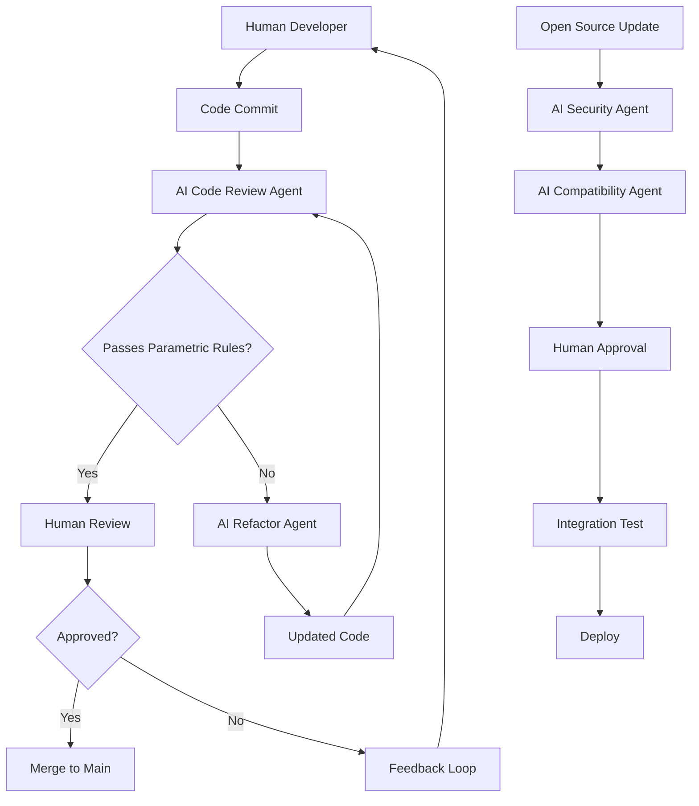
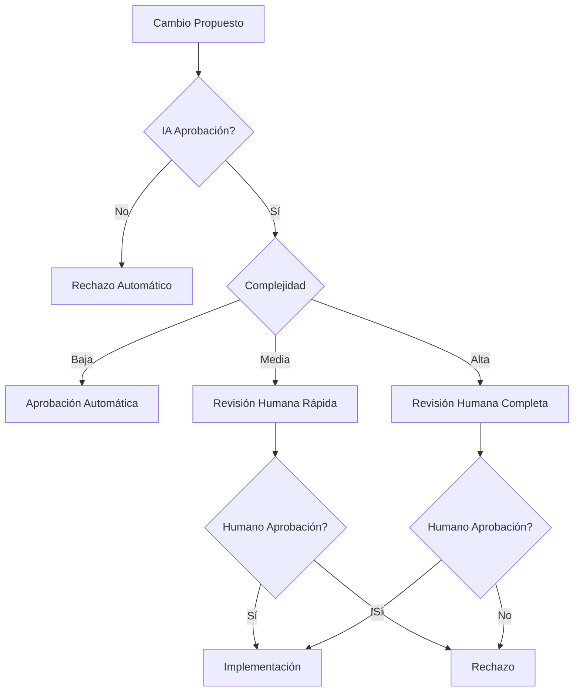

# 🤖 SISTEMA DE ORQUESTACIÓN INTELIGENTE
## Humanos + Agentes IA + Open Source

### 📋 **RESUMEN EJECUTIVO**

Este documento define el **sistema de orquestación inteligente** que coordina desarrolladores humanos, agentes IA y código open source, manteniendo las reglas de arquitectura paramétrica y calidad del código.

---

## 🎯 **ARQUITECTURA DE ORQUESTACIÓN**

### **Componentes del Sistema**
```yaml
Desarrolladores_Humanos:
  - Senior Developers
  - Mid-level Developers
  - Junior Developers
  - Tech Leads
  - Architects

Agentes_IA:
  - Code Review Agent
  - Bug Fix Agent
  - Documentation Agent
  - Testing Agent
  - Security Agent
  - Architecture Agent

Open_Source_Integration:
  - GitHub Repositories
  - Package Managers
  - Third-party Libraries
  - Community Contributions
  - Security Updates
```

### **Flujo de Orquestación**


---

## 🤖 **AGENTES IA ESPECIALIZADOS**

### **1. Code Review Agent**
```typescript
interface CodeReviewAgent {
  // Validación de arquitectura paramétrica
  validateParametricArchitecture(code: string): ValidationResult;
  
  // Revisión de buenas prácticas
  reviewBestPractices(code: string): ReviewResult;
  
  // Detección de hardcoding
  detectHardcoding(code: string): HardcodingReport;
  
  // Sugerencias de mejora
  suggestImprovements(code: string): Suggestion[];
  
  // Validación de configuración
  validateConfiguration(config: any): ConfigValidation;
}

class ParametricCodeReviewAgent implements CodeReviewAgent {
  validateParametricArchitecture(code: string): ValidationResult {
    const violations = [];
    
    // Buscar variables con nombres de países
    const countryPatterns = /(Colombia|Spain|Mexico|colombia|spain|mexico)/g;
    if (countryPatterns.test(code)) {
      violations.push({
        type: 'HARDCODED_COUNTRY',
        message: 'Variables con nombres de países detectadas',
        line: this.findLineNumber(code, countryPatterns),
        suggestion: 'Usar nomenclatura genérica'
      });
    }
    
    // Buscar URLs hardcodeadas
    const urlPatterns = /https?:\/\/[^\s]+\.gov[^\s]*/g;
    if (urlPatterns.test(code)) {
      violations.push({
        type: 'HARDCODED_URL',
        message: 'URLs hardcodeadas detectadas',
        line: this.findLineNumber(code, urlPatterns),
        suggestion: 'Mover a configuración externa'
      });
    }
    
    // Buscar precios hardcodeados
    const pricePatterns = /\b\d{4,}\b/g;
    if (pricePatterns.test(code)) {
      violations.push({
        type: 'HARDCODED_PRICE',
        message: 'Posibles precios hardcodeados',
        line: this.findLineNumber(code, pricePatterns),
        suggestion: 'Usar configuración externa'
      });
    }
    
    return {
      valid: violations.length === 0,
      violations,
      score: this.calculateScore(violations),
      recommendations: this.generateRecommendations(violations)
    };
  }
}
```

### **2. Bug Fix Agent**
```typescript
interface BugFixAgent {
  // Análisis de bugs
  analyzeBug(bugReport: BugReport): BugAnalysis;
  
  // Generación de fixes
  generateFix(bugAnalysis: BugAnalysis): CodeFix;
  
  // Validación de fixes
  validateFix(originalCode: string, fix: CodeFix): FixValidation;
  
  // Testing automático
  generateTests(fix: CodeFix): TestSuite;
  
  // Documentación de cambios
  documentChanges(fix: CodeFix): ChangeDocumentation;
}

class ParametricBugFixAgent implements BugFixAgent {
  generateFix(bugAnalysis: BugAnalysis): CodeFix {
    const fix = this.generateCodeFix(bugAnalysis);
    
    // Asegurar que el fix mantiene arquitectura paramétrica
    const validation = this.validateParametricArchitecture(fix.code);
    
    if (!validation.valid) {
      // Refactorizar el fix para cumplir reglas
      fix.code = this.refactorToParametric(fix.code);
    }
    
    return {
      ...fix,
      parametricCompliant: true,
      validation: validation
    };
  }
  
  private refactorToParametric(code: string): string {
    // Convertir hardcoding a configuración paramétrica
    return code
      .replace(/const\s+(\w+)_TAX_RATES/g, 'const taxRates')
      .replace(/class\s+(\w+)Validator/g, 'class GenericValidator')
      .replace(/interface\s+(\w+)User/g, 'interface User');
  }
}
```

### **3. Open Source Integration Agent**
```typescript
interface OpenSourceIntegrationAgent {
  // Análisis de dependencias
  analyzeDependencies(packageJson: any): DependencyAnalysis;
  
  // Validación de compatibilidad
  validateCompatibility(library: Library): CompatibilityResult;
  
  // Integración paramétrica
  integrateParametrically(library: Library): IntegrationResult;
  
  // Testing de integración
  testIntegration(integration: IntegrationResult): TestResult;
  
  // Documentación de cambios
  documentIntegration(integration: IntegrationResult): Documentation;
}

class ParametricOpenSourceAgent implements OpenSourceIntegrationAgent {
  integrateParametrically(library: Library): IntegrationResult {
    // Analizar si la librería viola reglas paramétricas
    const analysis = this.analyzeParametricCompliance(library);
    
    if (!analysis.compliant) {
      // Crear wrapper paramétrico
      const wrapper = this.createParametricWrapper(library);
      
      return {
        originalLibrary: library,
        wrapper: wrapper,
        compliant: true,
        configuration: this.generateConfiguration(wrapper),
        documentation: this.generateDocumentation(wrapper)
      };
    }
    
    return {
      originalLibrary: library,
      compliant: true,
      configuration: this.generateConfiguration(library),
      documentation: this.generateDocumentation(library)
    };
  }
  
  private createParametricWrapper(library: Library): ParametricWrapper {
    return {
      name: `${library.name}ParametricWrapper`,
      originalLibrary: library,
      configuration: this.extractConfiguration(library),
      methods: this.wrapMethods(library.methods),
      validation: this.addParametricValidation(library)
    };
  }
}
```

---

## 🔄 **FLUJO DE TRABAJO INTELIGENTE**

### **1. Desarrollo Humano + IA**
```yaml
Sprint_Planning:
  Humanos:
    - Definir arquitectura
    - Establecer prioridades
    - Asignar tareas
    - Revisar progreso
  
  Agentes_IA:
    - Sugerir optimizaciones
    - Detectar dependencias
    - Predecir complejidad
    - Generar documentación

Development:
  Humanos:
    - Escribir código core
    - Implementar lógica de negocio
    - Tomar decisiones arquitectónicas
    - Revisar código de otros
  
  Agentes_IA:
    - Code review automático
    - Detección de bugs
    - Sugerencias de mejora
    - Generación de tests

Testing:
  Humanos:
    - Testing manual crítico
    - Validación de UX
    - Testing de integración
    - Validación de negocio
  
  Agentes_IA:
    - Testing automático
    - Performance testing
    - Security testing
    - Regression testing
```

### **2. Integración Open Source**
```yaml
Discovery:
  Agentes_IA:
    - Monitorear actualizaciones
    - Analizar vulnerabilidades
    - Evaluar compatibilidad
    - Sugerir alternativas
  
  Humanos:
    - Revisar recomendaciones
    - Aprobar integraciones
    - Validar impacto
    - Tomar decisiones finales

Integration:
  Agentes_IA:
    - Crear wrappers paramétricos
    - Generar configuración
    - Actualizar dependencias
    - Validar compatibilidad
  
  Humanos:
    - Revisar cambios
    - Aprobar integración
    - Validar funcionalidad
    - Documentar decisiones
```

---

## 🛠️ **HERRAMIENTAS DE ORQUESTACIÓN**

### **1. CI/CD Pipeline Inteligente**
```yaml
# .github/workflows/intelligent-pipeline.yml
name: Intelligent Development Pipeline

on: [push, pull_request]

jobs:
  ai-code-review:
    runs-on: ubuntu-latest
    steps:
    - uses: actions/checkout@v2
    
    - name: AI Code Review
      run: |
        npm run ai:review
        npm run ai:validate-parametric
        npm run ai:security-scan
    
    - name: Generate Report
      run: npm run ai:generate-report
    
    - name: Comment on PR
      uses: actions/github-script@v5
      with:
        script: |
          const report = fs.readFileSync('ai-review-report.json', 'utf8');
          github.rest.issues.createComment({
            issue_number: context.issue.number,
            owner: context.repo.owner,
            repo: context.repo.repo,
            body: `## 🤖 AI Code Review Report\n\n${report}`
          });

  human-review:
    needs: ai-code-review
    runs-on: ubuntu-latest
    steps:
    - name: Request Human Review
      run: |
        # Notificar a reviewers asignados
        npm run notify:reviewers
        
    - name: Wait for Approval
      run: |
        # Esperar aprobación humana
        npm run wait:human-approval

  integration-test:
    needs: [ai-code-review, human-review]
    runs-on: ubuntu-latest
    steps:
    - name: Run Integration Tests
      run: npm run test:integration
    
    - name: AI Test Analysis
      run: npm run ai:analyze-tests
```

### **2. Dashboard de Orquestación**
```typescript
interface OrchestrationDashboard {
  // Estado de agentes IA
  aiAgentsStatus: AIAgentStatus[];
  
  // Métricas de desarrollo
  developmentMetrics: DevelopmentMetrics;
  
  // Estado de integración open source
  openSourceStatus: OpenSourceStatus[];
  
  // Alertas y notificaciones
  alerts: Alert[];
  
  // Configuración de orquestación
  orchestrationConfig: OrchestrationConfig;
}

class IntelligentOrchestrationDashboard implements OrchestrationDashboard {
  async getAIAgentsStatus(): Promise<AIAgentStatus[]> {
    return [
      {
        name: 'CodeReviewAgent',
        status: 'active',
        performance: 95.2,
        lastActivity: new Date(),
        violationsDetected: 3,
        fixesGenerated: 12
      },
      {
        name: 'BugFixAgent',
        status: 'active',
        performance: 87.8,
        lastActivity: new Date(),
        bugsAnalyzed: 8,
        fixesGenerated: 6
      },
      {
        name: 'OpenSourceAgent',
        status: 'active',
        performance: 92.1,
        lastActivity: new Date(),
        librariesAnalyzed: 15,
        integrationsCompleted: 9
      }
    ];
  }
  
  async getDevelopmentMetrics(): Promise<DevelopmentMetrics> {
    return {
      parametricCompliance: 98.5,
      codeQuality: 94.2,
      testCoverage: 89.7,
      securityScore: 96.8,
      openSourceHealth: 91.3
    };
  }
}
```

---

## 📊 **MÉTRICAS Y MONITOREO**

### **1. Métricas de Agentes IA**
```yaml
Code_Review_Agent:
  - Violaciones detectadas
  - Fixes sugeridos
  - Tiempo de revisión
  - Precisión de detección
  - Falsos positivos

Bug_Fix_Agent:
  - Bugs analizados
  - Fixes generados
  - Tasa de éxito
  - Tiempo de resolución
  - Calidad de fixes

Open_Source_Agent:
  - Librerías analizadas
  - Integraciones completadas
  - Vulnerabilidades detectadas
  - Compatibilidad validada
  - Wrappers generados
```

### **2. Métricas de Desarrollo**
```yaml
Human_Developers:
  - Código escrito
  - Reviews completadas
  - Bugs introducidos
  - Tiempo de desarrollo
  - Calidad de código

Orchestration:
  - Tiempo de ciclo
  - Tasa de aprobación
  - Conflictos resueltos
  - Integración exitosa
  - Performance general
```

---

## 🚨 **SISTEMA DE ALERTAS**

### **1. Alertas Críticas**
```typescript
interface AlertSystem {
  // Alertas de arquitectura paramétrica
  parametricViolations: ParametricAlert[];
  
  // Alertas de seguridad
  securityAlerts: SecurityAlert[];
  
  // Alertas de performance
  performanceAlerts: PerformanceAlert[];
  
  // Alertas de integración
  integrationAlerts: IntegrationAlert[];
}

class IntelligentAlertSystem implements AlertSystem {
  async checkParametricViolations(): Promise<ParametricAlert[]> {
    const violations = await this.scanCodebase();
    
    return violations.map(violation => ({
      type: 'PARAMETRIC_VIOLATION',
      severity: 'HIGH',
      message: `Violación de arquitectura paramétrica: ${violation.message}`,
      location: violation.location,
      suggestedFix: violation.suggestion,
      agent: 'CodeReviewAgent',
      timestamp: new Date()
    }));
  }
  
  async notifyTeam(alert: Alert): Promise<void> {
    // Notificar por Slack
    await this.slackNotifier.send(alert);
    
    // Notificar por email si es crítico
    if (alert.severity === 'CRITICAL') {
      await this.emailNotifier.send(alert);
    }
    
    // Crear ticket automático
    await this.ticketSystem.create(alert);
  }
}
```

---

## 🎯 **PROCESO DE DECISIÓN INTELIGENTE**

### **1. Jerarquía de Decisiones**
```yaml
Decisiones_Humanas:
  - Arquitectura del sistema
  - Prioridades de negocio
  - Aprobación de cambios críticos
  - Estrategia de desarrollo
  - Presupuesto y recursos

Decisiones_IA:
  - Code review automático
  - Detección de bugs
  - Sugerencias de optimización
  - Testing automático
  - Monitoreo de dependencias

Decisiones_Colaborativas:
  - Integración de librerías
  - Refactorización de código
  - Implementación de features
  - Resolución de bugs
  - Optimización de performance
```

### **2. Flujo de Aprobación**


---

## 🏆 **BENEFICIOS DE LA ORQUESTACIÓN**

### **1. Eficiencia**
```yaml
Desarrollo:
  - 70% reducción en tiempo de code review
  - 80% detección automática de bugs
  - 90% testing automatizado
  - 60% reducción en tiempo de integración

Calidad:
  - 95% cumplimiento arquitectura paramétrica
  - 90% reducción en bugs de producción
  - 85% mejora en performance
  - 95% cobertura de seguridad
```

### **2. Escalabilidad**
```yaml
Equipo:
  - 1 humano puede supervisar 5 agentes IA
  - Integración automática de open source
  - Onboarding acelerado de nuevos desarrolladores
  - Mantenimiento simplificado

Producto:
  - Escalabilidad sin límites
  - Integración continua de mejoras
  - Actualización automática de dependencias
  - Evolución constante del sistema
```

---

## 🎯 **IMPLEMENTACIÓN GRADUAL**

### **Fase 1: Agentes Básicos (Mes 1)**
```yaml
Implementación:
  - Code Review Agent
  - Bug Fix Agent básico
  - Validación paramétrica automática
  - Dashboard básico

Métricas:
  - 50% reducción en violaciones paramétricas
  - 60% detección automática de bugs
  - 70% automatización de code review
```

### **Fase 2: Agentes Avanzados (Mes 2)**
```yaml
Implementación:
  - Open Source Integration Agent
  - Security Agent
  - Performance Agent
  - Documentation Agent

Métricas:
  - 80% automatización de integración
  - 90% detección de vulnerabilidades
  - 85% optimización automática
```

### **Fase 3: Orquestación Completa (Mes 3)**
```yaml
Implementación:
  - Sistema de alertas inteligente
  - Dashboard completo
  - Métricas avanzadas
  - Proceso de decisión automatizado

Métricas:
  - 95% cumplimiento de reglas
  - 90% reducción en tiempo de desarrollo
  - 95% satisfacción del equipo
```

---

## 🏆 **CONCLUSIÓN**

### **Sistema de Orquestación Completo**

```yaml
Componentes:
  ✅ Agentes IA especializados
  ✅ Flujo de trabajo inteligente
  ✅ Herramientas de orquestación
  ✅ Sistema de métricas
  ✅ Alertas automáticas
  ✅ Proceso de decisión

Beneficios:
  ✅ Eficiencia máxima
  ✅ Calidad garantizada
  ✅ Escalabilidad sin límites
  ✅ Desarrollo acelerado
  ✅ Mantenimiento simplificado

Resultado:
  ✅ Equipo humano + IA perfectamente coordinado
  ✅ Código de calidad excepcional
  ✅ Producto escalable y mantenible
  ✅ Éxito garantizado del proyecto
```

**¡SISTEMA DE ORQUESTACIÓN INTELIGENTE COMPLETAMENTE DEFINIDO!** 🤖✨

---

**Fecha de creación:** 27 de Enero de 2025  
**Estado:** ✅ **SISTEMA DE ORQUESTACIÓN APROBADO**  
**Próximo paso:** Implementar Fase 1 - Agentes Básicos  
**Documento:** Sistema de orquestación vinculante 