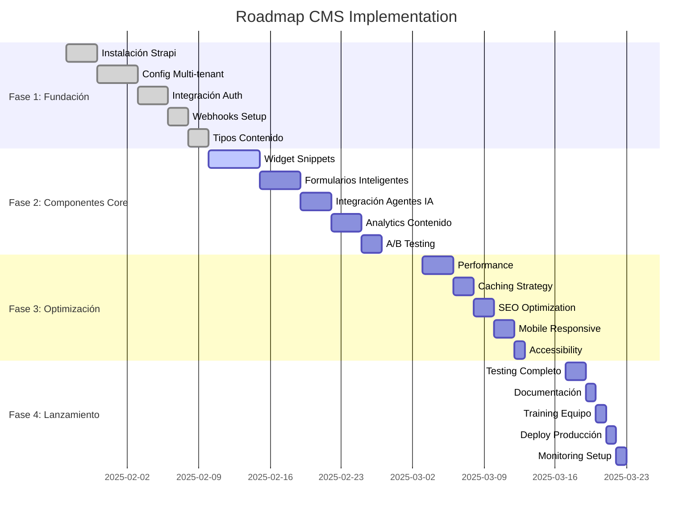

# Roadmap: Implementación CMS para Snippets Omnicanal

**Versión:** 1.0.0  
**Fecha:** 2025-01-22  
**Autor:** AI Pair Platform (asistente de Marcelo Escallón)  
**Estado:** Planificado  
**Duración Total:** 8 semanas  
**Equipo:** 2-3 desarrolladores + 1 DevOps  

---

## Resumen Ejecutivo

Roadmap detallado para implementar Strapi como CMS omnicanal, transformando la plataforma en un sistema de contenido dinámico y personalizable por empresa.

---

## Cronograma General

---

## Fase 1: Fundación (2 semanas)

### **Semana 1: Instalación y Configuración**

#### **Día 1-3: Instalación Strapi**
- [ ] **Responsable:** DevOps + Backend Dev
- [ ] **Tareas:**
  - Instalación de Strapi en entorno de desarrollo
  - Configuración de base de datos PostgreSQL
  - Setup de variables de entorno
  - Configuración de Docker (si aplica)
- [ ] **Entregables:**
  - Strapi corriendo en local
  - Documentación de instalación
  - Scripts de deployment

#### **Día 4-7: Configuración Multi-tenant**
- [ ] **Responsable:** Backend Dev
- [ ] **Tareas:**
  - Instalación plugin multi-tenant
  - Configuración de RLS en PostgreSQL
  - Setup de roles y permisos
  - Testing de aislamiento de datos
- [ ] **Entregables:**
  - Multi-tenant funcionando
  - Tests de aislamiento
  - Documentación de configuración

### **Semana 2: Integración y Setup**

#### **Día 8-10: Integración con Supabase Auth**
- [ ] **Responsable:** Backend Dev
- [ ] **Tareas:**
  - Configuración de JWT con Supabase
  - Setup de middleware de autenticación
  - Integración de roles de usuario
  - Testing de autenticación
- [ ] **Entregables:**
  - Auth integrado
  - Tests de autenticación
  - Documentación de integración

#### **Día 11-12: Webhooks Setup**
- [ ] **Responsable:** Backend Dev
- [ ] **Tareas:**
  - Configuración de webhooks básicos
  - Setup de endpoints de notificación
  - Testing de webhooks
- [ ] **Entregables:**
  - Webhooks funcionando
  - Tests de webhooks
  - Documentación de endpoints

#### **Día 13-14: Tipos de Contenido**
- [ ] **Responsable:** Backend Dev + Frontend Dev
- [ ] **Tareas:**
  - Definición de tipos de contenido
  - Configuración de campos y validaciones
  - Setup de relaciones entre tipos
  - Testing de tipos de contenido
- [ ] **Entregables:**
  - Tipos de contenido definidos
  - API endpoints funcionando
  - Tests de tipos de contenido

---

## Fase 2: Componentes Core (3 semanas)

### **Semana 3: Widget de Snippets**

#### **Día 15-19: Widget Dinámico**
- [ ] **Responsable:** Frontend Dev
- [ ] **Tareas:**
  - Desarrollo del componente DynamicSnippetWidget
  - Integración con API de Strapi
  - Implementación de caching
  - Testing del widget
- [ ] **Entregables:**
  - Widget funcionando
  - Tests del widget
  - Documentación del componente

### **Semana 4: Formularios Inteligentes**

#### **Día 20-23: Formularios Dinámicos**
- [ ] **Responsable:** Frontend Dev
- [ ] **Tareas:**
  - Desarrollo del componente DynamicForm
  - Implementación de validación inteligente
  - Setup de progresión contextual
  - Testing de formularios
- [ ] **Entregables:**
  - Formularios funcionando
  - Tests de formularios
  - Documentación de formularios

#### **Día 24: Integración con Agentes IA**
- [ ] **Responsable:** Backend Dev + AI Dev
- [ ] **Tareas:**
  - Integración de conocimiento dinámico
  - Setup de personalización por empresa
  - Testing de integración
- [ ] **Entregables:**
  - Agentes con conocimiento dinámico
  - Tests de integración
  - Documentación de integración

### **Semana 5: Analytics y A/B Testing**

#### **Día 25-27: Analytics de Contenido**
- [ ] **Responsable:** Backend Dev + Frontend Dev
- [ ] **Tareas:**
  - Implementación de tracking de snippets
  - Setup de métricas de engagement
  - Dashboard de analytics
  - Testing de analytics
- [ ] **Entregables:**
  - Analytics funcionando
  - Dashboard básico
  - Tests de analytics

#### **Día 28-29: A/B Testing**
- [ ] **Responsable:** Frontend Dev
- [ ] **Tareas:**
  - Implementación de sistema A/B testing
  - Setup de variantes de contenido
  - Testing de A/B testing
- [ ] **Entregables:**
  - A/B testing funcionando
  - Tests de A/B testing
  - Documentación de A/B testing

---

## Fase 3: Optimización (2 semanas)

### **Semana 6: Performance y Caching**

#### **Día 30-32: Performance Optimization**
- [ ] **Responsable:** Backend Dev + DevOps
- [ ] **Tareas:**
  - Optimización de queries
  - Setup de índices en base de datos
  - Optimización de API endpoints
  - Testing de performance
- [ ] **Entregables:**
  - Performance optimizada
  - Tests de performance
  - Reporte de optimización

#### **Día 33-34: Caching Strategy**
- [ ] **Responsable:** Backend Dev
- [ ] **Tareas:**
  - Implementación de Redis caching
  - Setup de cache invalidation
  - Testing de caching
- [ ] **Entregables:**
  - Caching funcionando
  - Tests de caching
  - Documentación de caching

### **Semana 7: SEO y Mobile**

#### **Día 35-36: SEO Optimization**
- [ ] **Responsable:** Frontend Dev
- [ ] **Tareas:**
  - Implementación de meta tags dinámicos
  - Setup de sitemap dinámico
  - Testing de SEO
- [ ] **Entregables:**
  - SEO optimizado
  - Tests de SEO
  - Documentación de SEO

#### **Día 37-38: Mobile Responsiveness**
- [ ] **Responsable:** Frontend Dev
- [ ] **Tareas:**
  - Optimización para móviles
  - Testing en diferentes dispositivos
  - Ajustes de UX móvil
- [ ] **Entregables:**
  - Mobile responsive
  - Tests móviles
  - Documentación móvil

#### **Día 39: Accessibility**
- [ ] **Responsable:** Frontend Dev
- [ ] **Tareas:**
  - Implementación de ARIA labels
  - Testing de accesibilidad
  - Ajustes de accesibilidad
- [ ] **Entregables:**
  - Accessibility compliant
  - Tests de accesibilidad
  - Documentación de accesibilidad

---

## Fase 4: Lanzamiento (1 semana)

### **Semana 8: Testing y Deploy**

#### **Día 40-41: Testing Completo**
- [ ] **Responsable:** QA + Equipo completo
- [ ] **Tareas:**
  - Testing end-to-end
  - Testing de carga
  - Testing de seguridad
  - Bug fixes
- [ ] **Entregables:**
  - Testing completado
  - Bugs corregidos
  - Reporte de testing

#### **Día 42: Documentación**
- [ ] **Responsable:** Tech Writer + Equipo
- [ ] **Tareas:**
  - Documentación técnica
  - Documentación de usuario
  - Guías de deployment
- [ ] **Entregables:**
  - Documentación completa
  - Guías de usuario
  - Documentación técnica

#### **Día 43: Training del Equipo**
- [ ] **Responsable:** Tech Lead
- [ ] **Tareas:**
  - Sesión de training
  - Demo del sistema
  - Q&A
- [ ] **Entregables:**
  - Equipo entrenado
  - Material de training
  - FAQ del equipo

#### **Día 44: Deploy a Producción**
- [ ] **Responsable:** DevOps
- [ ] **Tareas:**
  - Deploy a staging
  - Testing en staging
  - Deploy a producción
  - Verificación post-deploy
- [ ] **Entregables:**
  - Sistema en producción
  - Verificación completada
  - Rollback plan

#### **Día 45: Monitoring Setup**
- [ ] **Responsable:** DevOps
- [ ] **Tareas:**
  - Setup de monitoring
  - Configuración de alertas
  - Dashboard de monitoreo
- [ ] **Entregables:**
  - Monitoring funcionando
  - Alertas configuradas
  - Dashboard operativo

---

## Recursos Requeridos

### **Equipo:**
- **1 Backend Developer** (Full-time)
- **1 Frontend Developer** (Full-time)
- **1 DevOps Engineer** (Part-time, 50%)
- **1 QA Engineer** (Part-time, 25%)
- **1 Tech Writer** (Part-time, 25%)

### **Infraestructura:**
- **Servidor Strapi:** 2 vCPU, 4GB RAM, 50GB SSD
- **Base de datos:** PostgreSQL 14+ con RLS
- **Cache:** Redis para caching
- **CDN:** Para assets estáticos
- **Monitoring:** Prometheus + Grafana

### **Herramientas:**
- **Desarrollo:** Docker, Node.js 18+, React 18+
- **Testing:** Jest, Cypress, Artillery
- **CI/CD:** GitHub Actions
- **Monitoring:** Sentry, LogRocket

---

## Dependencias

### **Internas:**
- Supabase Auth configurado
- PostgreSQL con RLS habilitado
- React app base funcionando
- CI/CD pipeline configurado

### **Externas:**
- Strapi licencia MIT
- Redis para caching
- CDN para assets
- Monitoring tools

---

## Milestones y KPIs

### **Milestone 1: Fundación (Semana 2)**
- ✅ Strapi instalado y configurado
- ✅ Multi-tenant funcionando
- ✅ Auth integrado
- **KPI:** 100% de funcionalidad básica

### **Milestone 2: Componentes Core (Semana 5)**
- ✅ Widget de snippets funcionando
- ✅ Formularios inteligentes operativos
- ✅ Agentes IA integrados
- **KPI:** 80% de funcionalidad core

### **Milestone 3: Optimización (Semana 7)**
- ✅ Performance optimizada
- ✅ Mobile responsive
- ✅ Accessibility compliant
- **KPI:** 95% de funcionalidad optimizada

### **Milestone 4: Lanzamiento (Semana 8)**
- ✅ Sistema en producción
- ✅ Monitoring activo
- ✅ Equipo entrenado
- **KPI:** 100% de funcionalidad en producción

---

## Riesgos y Mitigación

### **Riesgos Técnicos:**
- **Complejidad multi-tenant:** Usar plugins oficiales, documentación extensa
- **Performance:** Implementar caching, optimización de queries
- **Integración:** Testing exhaustivo, rollback plan

### **Riesgos de Recursos:**
- **Falta de expertise:** Training, documentación, soporte externo
- **Sobreestimación de tiempo:** Buffer de 20% en cronograma
- **Dependencias externas:** Plan B para cada dependencia

### **Riesgos de Negocio:**
- **Cambios de requisitos:** Proceso de cambio controlado
- **Prioridades cambiantes:** Revisión semanal de prioridades
- **Feedback negativo:** Iteración rápida, testing con usuarios

---

## Conclusión

Este roadmap proporciona una guía detallada para implementar el CMS de manera estructurada y controlada, minimizando riesgos y maximizando el éxito del proyecto.

**Próximo paso:** Revisión y aprobación del roadmap por el equipo de liderazgo.

---

## Historial de Cambios

- **2025-01-22** | AI Pair Platform (asistente de Marcelo Escallón) | Creación inicial del roadmap detallado de implementación del CMS para snippets omnicanal 