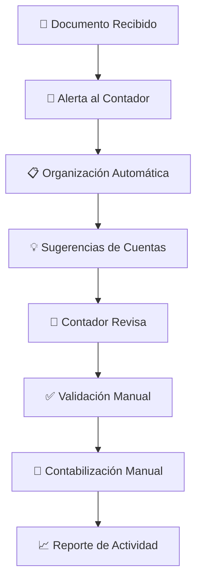

# Asistente Inteligente de Contabilidad

## 📋 **VISIÓN CORREGIDA: ASISTENTE vs REEMPLAZO**

### **🎯 Objetivo Principal**
El **Asistente Inteligente de Contabilidad** es un **compañero digital** que **asiste** a los contadores y auxiliares contables, **NO** los reemplaza. Su función es optimizar el flujo de trabajo, reducir tareas repetitivas y asegurar que nada se pase por alto.

### **🤝 Filosofía: "Asistir, No Reemplazar"**
- **El contador toma las decisiones** finales
- **El asistente facilita** el proceso
- **La IA sugiere**, el humano valida
- **Automatización selectiva**, control total

---

## 🏗️ **ARQUITECTURA ASISTENCIAL**

### **Componentes del Asistente**

```
┌─────────────────────────────────────────────────────────────┐
│                ASISTENTE INTELIGENTE DE CONTABILIDAD        │
├─────────────────────────────────────────────────────────────┤
│  🔔 Alertas     │  📋 Organización  │  💡 Sugerencias      │
│  ⏰ Recordatorios│  📊 Dashboard     │  🔍 Búsqueda         │
│  📧 Notificaciones│  📁 Drive Helper │  📈 Reportes         │
└─────────────────────────────────────────────────────────────┘
```

### **Flujo de Trabajo Asistido**



---

## 🎯 **FUNCIONALIDADES ASISTENCIALES**

### **1. 🔔 Sistema de Alertas Inteligentes**

#### **Alertas de Documentos**
- **"Tienes 5 facturas pendientes de revisión"**
- **"Factura #123 vence en 2 días"**
- **"Documento de Siigo requiere validación"**
- **"Nuevo proveedor detectado: requiere configuración"**

#### **Alertas de Cumplimiento**
- **"Retención de IVA vence en 5 días"**
- **"Declaración de renta próxima"**
- **"Conciliación bancaria pendiente"**
- **"Documentos faltantes para auditoría"**

#### **Alertas de Calidad**
- **"Documento con baja confianza de extracción"**
- **"Datos faltantes en factura #456"**
- **"Inconsistencia en montos detectada"**
- **"Proveedor sin NIT registrado"**

### **2. 📋 Organización Asistida**

#### **Clasificación Automática**
- **Sugiere** tipo de documento (factura, recibo, contrato)
- **Propone** categorización por proveedor
- **Recomienda** estructura de carpetas
- **Permite** corrección manual fácil

#### **Organización en Drive**
- **Crea** estructura de carpetas sugerida
- **Mueve** documentos automáticamente
- **Mantiene** trazabilidad de cambios
- **Permite** reorganización manual

### **3. 💡 Sugerencias Inteligentes**

#### **Sugerencias de Cuentas**
- **"Basado en proveedor 'Siigo', sugiere cuenta 2205"**
- **"Para servicios de internet, considera cuenta 6-1"**
- **"Documento similar anterior usó cuenta 2368"**
- **"Sugerencia: verificar cuenta 2365 para IVA"**

#### **Sugerencias de Validación**
- **"Verificar NIT del proveedor en DIAN"**
- **"Comparar monto con facturas anteriores"**
- **"Revisar fecha de vencimiento"**
- **"Confirmar centro de costo asignado"**

### **4. ⏰ Recordatorios Personalizados**

#### **Recordatorios de Tareas**
- **"Revisar facturas pendientes (5 documentos)"**
- **"Validar datos extraídos de Helisa"**
- **"Completar conciliación bancaria"**
- **"Preparar reporte mensual"**

#### **Recordatorios de Cumplimiento**
- **"Declaración de IVA vence en 3 días"**
- **"Retención en la fuente próxima"**
- **"Auditoría externa programada"**
- **"Renovación de certificados DIAN"**

---

## 🔧 **INTEGRACIÓN COMPLEMENTARIA**

### **Niveles de Asistencia por Software**

#### **Software con API (Siigo, Alegra)**
- **Sugiere** datos para formularios
- **Valida** información antes de enviar
- **Notifica** sobre sincronización
- **Reporta** errores de integración

#### **Software sin API (Helisa, ContaPyme)**
- **Prepara** archivos de importación
- **Valida** formato antes de exportar
- **Sugiere** mapeo de campos
- **Guía** proceso de importación

#### **Software Web (Cualquier sistema)**
- **Autocompleta** formularios (con confirmación)
- **Sugiere** valores basados en historial
- **Valida** datos en tiempo real
- **Notifica** sobre campos requeridos

### **Fuentes de Datos Complementarias**

#### **Sistemas Externos**
- **CRM**: Datos de clientes y proveedores
- **Bancos**: Conciliación automática
- **DIAN**: Validación de NITs
- **Cámaras de Comercio**: Datos empresariales

#### **Archivos y Documentos**
- **Excel**: Importación de listas maestras
- **PDF**: Extracción de datos estructurados
- **Email**: Procesamiento de adjuntos
- **Drive**: Organización de documentos

---

## 📊 **DASHBOARD ASISTENCIAL**

### **Panel de Alertas Prioritarias**
```
🔴 URGENTE (3)
├── Factura #123 vence hoy
├── Retención IVA en 2 días
└── Error en sincronización Siigo

🟡 PENDIENTE (8)
├── 5 documentos por revisar
├── 2 proveedores sin configurar
└── 1 conciliación bancaria

🟢 COMPLETADO (45)
└── Este mes: 45 documentos procesados
```

### **Métricas de Productividad**
- **Documentos procesados** vs objetivo
- **Tiempo promedio** de revisión
- **Tasa de precisión** de sugerencias
- **Tareas completadas** por día

### **Reportes de Asistencia**
- **Actividad diaria** del contador
- **Alertas generadas** y atendidas
- **Sugerencias aceptadas** vs rechazadas
- **Tiempo ahorrado** en tareas repetitivas

---

## 🤖 **ASISTENTE IA CONVERSACIONAL**

### **Comandos de Asistencia**
```
🔔 "Muéstrame alertas urgentes"
📋 "Organiza documentos de hoy"
💡 "Sugiere cuentas para factura #123"
⏰ "¿Qué tengo pendiente para mañana?"
📊 "Genera reporte de actividad"
🔍 "Busca facturas de Siigo"
✅ "Marca documento como revisado"
```

### **Respuestas Inteligentes**
```
🤖 "Tienes 3 alertas urgentes:
    1. Factura #123 vence hoy
    2. Error en sincronización con Siigo
    3. Retención IVA en 2 días

    ¿Quieres que te ayude con alguna?"
```

### **Aprendizaje Continuo**
- **Aprende** de las decisiones del contador
- **Mejora** sugerencias basado en historial
- **Adapta** alertas según preferencias
- **Optimiza** flujo de trabajo personal

---

## 💰 **MODELO DE FACTURACIÓN ASISTENCIAL**

### **Planes por Nivel de Asistencia**

#### **Plan Básico: $19 USD/mes**
- **Alertas básicas** (documentos pendientes)
- **Organización simple** en Drive
- **Sugerencias limitadas** (10/mes)
- **Email** de soporte

#### **Plan Profesional: $49 USD/mes**
- **Alertas avanzadas** (cumplimiento, vencimientos)
- **Organización inteligente** con IA
- **Sugerencias ilimitadas**
- **Dashboard completo**
- **Chat** de soporte

#### **Plan Enterprise: $99 USD/mes**
- **Alertas personalizadas** por empresa
- **Integración** con software contable
- **Asistente IA** conversacional
- **Reportes avanzados**
- **Soporte prioritario**

### **Cargos Adicionales**
- **Integración API**: $10 USD/mes
- **Extensión navegador**: $5 USD/mes
- **Soporte premium**: $20 USD/mes
- **Personalización**: $50 USD/implementación

---

## 🚀 **IMPLEMENTACIÓN ASISTENCIAL**

### **Fase 1: Configuración Básica (1 semana)**
1. **Configuración de alertas** básicas
2. **Integración con email** y Drive
3. **Configuración de notificaciones**
4. **Entrenamiento inicial** del usuario

### **Fase 2: Personalización (1 semana)**
1. **Configuración de preferencias** de alertas
2. **Integración con software** contable
3. **Configuración de recordatorios**
4. **Pruebas de flujo** de trabajo

### **Fase 3: Optimización (1 semana)**
1. **Ajuste de alertas** según uso
2. **Configuración de reportes** personalizados
3. **Entrenamiento avanzado** del asistente IA
4. **Go-live** y monitoreo

---

## 🎯 **CASOS DE USO ASISTENCIALES**

### **Caso 1: Contador Independiente**
- **Problema**: Muchos clientes, fácil perder documentos
- **Solución**: Alertas automáticas por cliente
- **Resultado**: 0 documentos perdidos, mejor organización

### **Caso 2: Auxiliar Contable**
- **Problema**: Tareas repetitivas, poco tiempo para análisis
- **Solución**: Automatización de organización y sugerencias
- **Resultado**: 50% más tiempo para análisis crítico

### **Caso 3: Departamento Contable**
- **Problema**: Falta coordinación, vencimientos perdidos
- **Solución**: Alertas centralizadas y reportes de equipo
- **Resultado**: 100% cumplimiento de vencimientos

---

## ✅ **BENEFICIOS CLAVE**

### **Para el Contador**
- **Menos estrés** por tareas repetitivas
- **Mejor organización** de documentos
- **Alertas oportunas** de vencimientos
- **Más tiempo** para análisis crítico

### **Para la Empresa**
- **Cumplimiento mejorado** de obligaciones
- **Reducción de errores** por olvido
- **Mejor trazabilidad** de procesos
- **ROI medible** en productividad

### **Para el Cliente**
- **Servicio más eficiente** del contador
- **Menos errores** en reportes
- **Cumplimiento oportuno** de obligaciones
- **Mejor comunicación** de alertas

---

## 🔮 **ROADMAP ASISTENCIAL**

### **Corto Plazo (3-6 meses)**
- **Alertas predictivas** basadas en patrones
- **Integración con calendario** personal
- **Notificaciones push** móviles
- **Reportes de productividad** personal

### **Mediano Plazo (6-12 meses)**
- **Asistente IA** más conversacional
- **Integración con múltiples** software contables
- **Alertas colaborativas** para equipos
- **Análisis predictivo** de carga de trabajo

### **Largo Plazo (1-2 años)**
- **Asistente multimodal** (voz, texto, imagen)
- **Integración con ERPs** empresariales
- **Automatización inteligente** de flujos
- **Plataforma de marketplace** de asistentes

---

## 📞 **SOPORTE Y CONTACTO**

### **Canales de Soporte**
- **Chat en vivo**: Disponible 24/7 en la plataforma
- **Email**: soporte@universalassistant.com
- **Teléfono**: +57 1 234 5678
- **Documentación**: docs.universalassistant.com

### **Recursos Adicionales**
- **Videos tutoriales**: YouTube/UniversalAssistant
- **Webinars semanales**: Registro en la plataforma
- **Comunidad**: forum.universalassistant.com
- **API Documentation**: api.universalassistant.com

---

## ✅ **CONCLUSIÓN**

El **Asistente Inteligente de Contabilidad** representa el futuro de la colaboración humano-IA en el ámbito contable. No busca reemplazar al profesional, sino potenciar sus capacidades, reducir la carga administrativa y asegurar que nada importante se pase por alto.

**La clave del éxito está en el equilibrio**: automatizar lo repetitivo para que el contador pueda enfocarse en lo que realmente importa: el análisis, la toma de decisiones y el valor agregado para sus clientes.

---

*Documento generado automáticamente por el Sistema de Conocimiento de Producto*
*Fecha: 20 de Diciembre de 2025*
*Versión: 2.0 - Revisión Asistencial* 