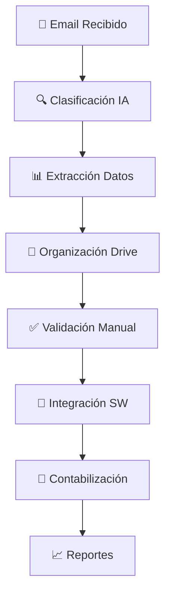

# Sistema de Contabilidad Inteligente

## 📋 **RESUMEN EJECUTIVO**

El **Sistema de Contabilidad Inteligente** es una solución integral que automatiza el procesamiento, clasificación y contabilización de documentos contables para empresas colombianas. Integra IA avanzada con software contable existente, proporcionando una experiencia fluida y eficiente para auxiliares contables.

### **🎯 Objetivos Principales**

- **Universalidad**: Compatible con TODOS los software contables colombianos
- **Automatización**: Procesamiento automático de documentos recibidos por email
- **Inteligencia**: IA especializada para clasificación y extracción de datos
- **Integración**: Múltiples niveles de integración según capacidades del software
- **Trazabilidad**: Control total del proceso con validación manual

---

## 🏗️ **ARQUITECTURA DEL SISTEMA**

### **Componentes Principales**

```
┌─────────────────────────────────────────────────────────────┐
│                    SISTEMA DE CONTABILIDAD INTELIGENTE      │
├─────────────────────────────────────────────────────────────┤
│  📧 Recepción Email  │  🤖 IA Asistente  │  📊 Dashboard   │
│  📁 Drive Organizer  │  🔧 Config SW     │  📈 Reportes    │
│  🔍 Clasificación    │  🌐 Extensión     │  💰 Facturación │
└─────────────────────────────────────────────────────────────┘
```

### **Flujo de Procesamiento**



---

## 🎯 **FUNCIONALIDADES PRINCIPALES**

### **1. 📧 Recepción y Clasificación Automática**

#### **Procesamiento de Emails**
- **Recepción automática** de facturas y documentos por email
- **Clasificación inteligente** por tipo de documento (factura, recibo, contrato)
- **Identificación de remitentes** y extracción de información de contacto
- **Validación de formato** y contenido de documentos

#### **Organización en Drive**
- **Estructura automática** de carpetas según reglas de naming
- **Clasificación por proveedor**, fecha y tipo de documento
- **Backup automático** de documentos originales
- **Control de versiones** y trazabilidad

### **2. 🤖 Asistente IA Especializado**

#### **Capacidades del Asistente**
- **Chat inteligente** para consultas contables específicas
- **Análisis de documentos** en tiempo real
- **Sugerencias de cuentas** contables automáticas
- **Validación de datos** extraídos
- **Generación de reportes** personalizados

#### **Comandos del Asistente**
```
📋 "Analiza documento" - Revisa documento seleccionado
💡 "Sugiere cuentas" - Propone contabilización
✅ "Valida datos" - Verifica información extraída
📊 "Genera reporte" - Crea reporte personalizado
🔍 "Busca facturas de [proveedor]" - Filtra por proveedor
```

### **3. 🔧 Integración Universal con Software Contable**

#### **Catálogo Completo de Software Colombiano**

| Software | Tipo | API | Import/Export | Extensión | Certificación DIAN |
|----------|------|-----|---------------|-----------|-------------------|
| **Siigo** | Cloud | ✅ | ✅ | ✅ | ✅ |
| **Alegra** | Cloud | ✅ | ✅ | ✅ | ✅ |
| **Helisa** | On-Premise | ❌ | ✅ | ✅ | ✅ |
| **SAP B1** | Enterprise | ✅ | ✅ | ✅ | ✅ |
| **ContaPyme** | On-Premise | ❌ | ✅ | ✅ | ✅ |
| **Tally ERP** | On-Premise | ❌ | ✅ | ✅ | ❌ |

#### **Niveles de Integración**

1. **🔌 API Directa** (Siigo, Alegra, SAP)
   - Integración en tiempo real
   - Sincronización automática
   - Máxima automatización

2. **📁 Importación/Exportación** (Helisa, ContaPyme)
   - Archivos CSV/Excel
   - Procesamiento por lotes
   - Validación previa

3. **🌐 Extensión Navegador** (Todos)
   - Autocompletado de formularios
   - Inyección de datos
   - Validación en tiempo real

4. **📋 Manual Asistido** (Fallback)
   - Interfaz de asistencia
   - Guías paso a paso
   - Validación manual

### **4. 🌐 Extensión de Navegador Inteligente**

#### **Características**
- **Autocompletado automático** de formularios web
- **Plantillas predefinidas** para software popular
- **Mapeo de campos** personalizable
- **Transformaciones automáticas** (mayúsculas, formato moneda, fechas)
- **Validación en tiempo real**

#### **Software Soportado**
- **Siigo Web**: Formularios de facturación y contabilidad
- **Alegra**: Interfaces de proveedores y documentos
- **Helisa Web**: Formularios de contabilización
- **Otros**: Configuración personalizada

---

## 💰 **MODELO DE FACTURACIÓN**

### **Estructura de Cobro**

#### **Planes por Empresa**
- **Plan Básico**: 100 documentos/mes incluidos
- **Plan Profesional**: 500 documentos/mes incluidos
- **Plan Enterprise**: Documentos ilimitados

#### **Cargos Adicionales**
- **Por documento excedente**: $0.50 USD
- **Integración API**: $10 USD/mes
- **Extensión navegador**: $5 USD/mes
- **Soporte premium**: $20 USD/mes

#### **Facturación por Jurisdicción**
- **Colombia**: Facturación electrónica DIAN
- **México**: CFDI y complementos
- **Argentina**: Facturación electrónica AFIP
- **Chile**: DTE (Documentos Tributarios Electrónicos)

---

## 🔐 **SEGURIDAD Y COMPLIANCE**

### **Protección de Datos**
- **Encriptación end-to-end** de documentos
- **Aislamiento multi-tenant** por empresa
- **Backup automático** con redundancia
- **Auditoría completa** de accesos y cambios

### **Cumplimiento Normativo**
- **GDPR**: Protección de datos personales
- **ISO 27001**: Seguridad de la información
- **SOC 2**: Controles de seguridad
- **Certificación DIAN**: Facturación electrónica colombiana

---

## 📊 **MÉTRICAS Y REPORTES**

### **Dashboard Principal**
- **Documentos procesados** por período
- **Tasa de precisión** de la IA
- **Tiempo promedio** de procesamiento
- **Errores y excepciones** detectadas

### **Reportes Avanzados**
- **Análisis por proveedor** y categoría
- **Tendencias de gastos** y costos
- **Eficiencia de la IA** por tipo de documento
- **ROI de automatización** por empresa

---

## 🚀 **IMPLEMENTACIÓN**

### **Fase 1: Configuración Básica (1-2 semanas)**
1. **Configuración de email** y recepción de documentos
2. **Integración con Drive** y organización de carpetas
3. **Configuración del asistente IA** básico
4. **Pruebas con documentos de ejemplo**

### **Fase 2: Integración Software (2-3 semanas)**
1. **Selección y configuración** del software contable
2. **Implementación de integración** (API/Import/Extensión)
3. **Configuración de mapeo** de campos
4. **Pruebas de integración** end-to-end

### **Fase 3: Optimización (1-2 semanas)**
1. **Ajuste de precisión** de la IA
2. **Configuración de reglas** de negocio
3. **Entrenamiento del equipo** de usuarios
4. **Go-live** y monitoreo

---

## 🎯 **CASOS DE USO**

### **Caso 1: Pequeña Empresa (Siigo)**
- **Problema**: 50-100 facturas/mes, proceso manual lento
- **Solución**: Integración API directa con Siigo
- **Resultado**: 90% reducción en tiempo de procesamiento

### **Caso 2: Mediana Empresa (Helisa)**
- **Problema**: Software on-premise sin API, 200-500 facturas/mes
- **Solución**: Extensión navegador + importación CSV
- **Resultado**: 70% automatización del proceso

### **Caso 3: Empresa Grande (SAP)**
- **Problema**: Múltiples sistemas, 1000+ documentos/mes
- **Solución**: Integración API + asistente IA avanzado
- **Resultado**: 95% automatización, control total

---

## 🔮 **ROADMAP FUTURO**

### **Corto Plazo (3-6 meses)**
- **OCR avanzado** para documentos escaneados
- **Machine Learning** para mejora continua
- **Integración con banca** empresarial
- **App móvil** para validación rápida

### **Mediano Plazo (6-12 meses)**
- **Expansión a otros países** latinoamericanos
- **Integración con ERPs** empresariales
- **Análisis predictivo** de gastos
- **Automatización de conciliación** bancaria

### **Largo Plazo (1-2 años)**
- **IA conversacional** avanzada
- **Blockchain** para trazabilidad
- **Integración con IoT** para facturación automática
- **Plataforma de marketplace** de servicios contables

---

## 📞 **SOPORTE Y CONTACTO**

### **Canales de Soporte**
- **Chat en vivo**: Disponible 24/7 en la plataforma
- **Email**: soporte@universalassistant.com
- **Teléfono**: +57 1 234 5678
- **Documentación**: docs.universalassistant.com

### **Recursos Adicionales**
- **Videos tutoriales**: YouTube/UniversalAssistant
- **Webinars semanales**: Registro en la plataforma
- **Comunidad**: forum.universalassistant.com
- **API Documentation**: api.universalassistant.com

---

## ✅ **CONCLUSIÓN**

El **Sistema de Contabilidad Inteligente** representa una revolución en la gestión contable empresarial, combinando la potencia de la IA con la flexibilidad de integración universal. Su arquitectura modular permite adaptarse a cualquier software contable colombiano, mientras que su modelo de facturación escalable asegura la viabilidad económica para empresas de todos los tamaños.

**La clave del éxito está en la universalidad**: no importa qué software contable use la empresa, nuestro sistema puede integrarse y automatizar el proceso, proporcionando un ROI inmediato y medible.

---

*Documento generado automáticamente por el Sistema de Conocimiento de Producto*
*Fecha: 20 de Diciembre de 2025*
*Versión: 1.0* 