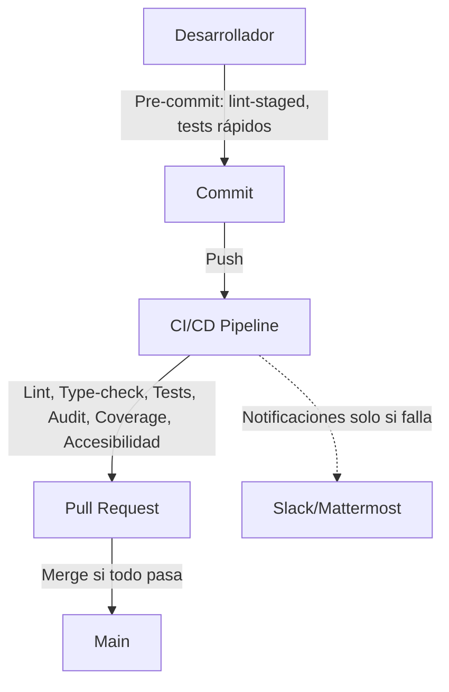

# 🏗️ Calidad vs. Productividad: Buenas Prácticas DevOps

## 🎯 Objetivo

Garantizar la máxima calidad y seguridad del código sin afectar el desempeño de la aplicación ni la productividad del equipo (humano o AI).

---

## 1. Linting y Reglas Estrictas
- **Linting (ESLint) y reglas de estilo** solo se ejecutan en desarrollo y CI, nunca en producción.
- **Advertencias (`warn`)** para estilo y mantenibilidad, **errores (`error`)** solo para problemas críticos (seguridad, tipado, multi-tenant).
- **Uso de `lint-staged`**: solo analiza archivos modificados en cada commit, evitando demoras.

---

## 2. Cobertura de Tests
- **Cobertura mínima exigida** (ej: 80%) solo se valida en CI/CD, no bloquea commits locales.
- **Permitir commits con baja cobertura**, pero bloquear merges a main si no se cumple el mínimo en CI.

---

## 3. Auditoría de Seguridad y Dependencias
- Herramientas como `npm audit`, Snyk y Dependabot solo corren en validaciones automáticas, no en runtime.
- **Secret scanning** y validación de hardcoding son automáticas y no afectan el flujo diario.

---

## 4. Performance y Accesibilidad
- Herramientas como Lighthouse CI, pa11y o axe-core se ejecutan en CI/CD, no en desarrollo local.
- No afectan la performance de la app ni la velocidad de desarrollo.

---

## 5. Automatización y DevOps
- **Pipelines CI/CD** pueden correr en paralelo y solo en ramas críticas.
- **Pre-commit hooks** validad solo archivos modificados.
- **Reglas estrictas** solo en ramas protegidas (main, release), más flexibles en features.

---

## 6. ¿Cómo evitar trabas en el desarrollo?
- Usa `lint-staged` para validar solo lo necesario.
- Permite advertencias en desarrollo, exige errores solo en CI/CD.
- Documenta excepciones y justificaciones.
- Automatiza todo lo posible.

---

## 7. Visualización del Flujo

---

## 8. Resumen de Recomendaciones
| Práctica                        | Herramienta/Regla         | Beneficio                        |
|----------------------------------|---------------------------|----------------------------------|
| Modularizar código               | SRP, ESLint, TypeScript   | Mantenibilidad, testabilidad     |
| Limitar líneas por archivo       | ESLint: max-lines         | Legibilidad, revisión más fácil  |
| Limitar líneas por función       | ESLint: max-lines-per-function | Código más claro y reusable     |
| Fail-fast en validaciones        | Husky, CI/CD, exit 1      | Prevención de errores en producción |
| Notificación de fallos           | Slack, Mattermost, Email  | Respuesta rápida a incidentes    |
| Refactorización continua         | Code review, SonarQube    | Calidad y salud del código       |

---

> **Este enfoque permite mantener la calidad y seguridad sin sacrificar la velocidad de desarrollo ni la experiencia del equipo.** 