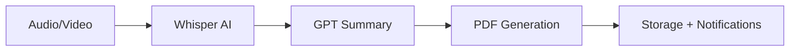
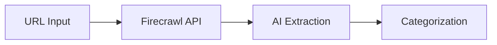

# Integraciones con VibeThink-Orchestrator

> **Información valiosa de VibeThink-Orchestrator para herramientas de desarrollo**

## 🎯 **Propósito**

Este documento contiene información valiosa de `docs/projects/VibeThink-Orchestrator/` que es relevante para las herramientas de desarrollo del dev-portal, **sin eliminar nada del original**.

## 📋 **CI/CD y Gestión de Upgrades**

### **Estrategia de CI/CD para Upgrades Automáticos**

**Fuente:** `ci-cd-upgrade-strategy.md`

#### **Workflow de GitHub Actions**
```yaml
# .github/workflows/upgrade-monitor.yml
name: Upgrade Monitor - VThink 1.0

on:
  schedule:
    - cron: '0 9 * * *'  # Diario a las 9:00 AM UTC
  workflow_dispatch:      # Ejecución manual
  push:
    branches: [main, develop]
    paths: ['package.json', 'package-lock.json']
```

#### **Jobs del Workflow**
```yaml
upgrade-monitor:
  name: Monitor Dependencies and Security
  runs-on: ubuntu-latest
  steps:
    - name: Run security audit
      run: npm audit --audit-level moderate
    - name: Check outdated packages
      run: npm outdated
    - name: Generate upgrade report
      run: npm run upgrade:report
```

#### **Estrategia de Actualización Gradual**
```typescript
const UpdateStrategy = {
  immediate: {
    packages: ['security-critical'],
    action: 'auto-update',
    notification: 'slack-urgent'
  },
  weekly: {
    packages: ['patch', 'minor'],
    action: 'create-pr',
    notification: 'slack-info'
  },
  monthly: {
    packages: ['major'],
    action: 'manual-review',
    notification: 'email-report'
  }
};
```

### **Sistema de Gestión de Upgrades**

**Fuente:** `upgrade-management.md`

#### **Dashboard de Upgrades**
```typescript
// Estructura del Dev Portal para upgrades
src/apps/dev-portal/
├── components/
│   ├── UpgradeDashboard.tsx
│   ├── DependencyMonitor.tsx
│   ├── SecurityAlerts.tsx
│   └── UpgradeScheduler.tsx
├── services/
│   ├── upgradeService.ts
│   ├── securityService.ts
│   └── notificationService.ts
└── pages/
    ├── Dashboard.tsx
    ├── Dependencies.tsx
    └── Security.tsx
```

#### **Tipos de Alertas**
```typescript
enum AlertType {
  SECURITY_CRITICAL = 'security_critical',
  MAJOR_UPDATE = 'major_update',
  MINOR_UPDATE = 'minor_update',
  PATCH_UPDATE = 'patch_update',
  DEPRECATION_WARNING = 'deprecation_warning',
  COMPATIBILITY_ISSUE = 'compatibility_issue'
}

enum UpgradePriority {
  IMMEDIATE = 'immediate',    // Security fixes
  HIGH = 'high',             // Major updates
  MEDIUM = 'medium',         // Minor updates
  LOW = 'low',               // Patch updates
  MONITOR = 'monitor'        // Watch for changes
}
```

#### **Validación Pre-upgrade**
```typescript
const UpgradeValidation = {
  security: [
    'Vulnerability scan',
    'Security audit',
    'Compliance check'
  ],
  compatibility: [
    'React version compatibility',
    'Shadcn/UI compatibility',
    'React Flow compatibility',
    'Supabase compatibility'
  ],
  testing: [
    'Unit tests pass',
    'Integration tests pass',
    'E2E tests pass',
    'Performance tests'
  ],
  documentation: [
    'Changelog updated',
    'Migration guide',
    'Rollback plan'
  ]
};
```

## 🛠️ **Operaciones y Monitoreo**

### **Operations Runbook**

**Fuente:** `OPERATIONS_RUNBOOK.md`

#### **Escalation Matrix**
| Severidad | Tiempo Respuesta | Contacto |
|-----------|------------------|----------|
| **P0 - Critical** | 15 minutos | On-call engineer + Tech Lead |
| **P1 - High** | 1 hora | On-call engineer |
| **P2 - Medium** | 4 horas | Support team |
| **P3 - Low** | 24 horas | Support team |

#### **Key Personnel**
- **Tech Lead**: AI Pair Platform Team
- **DevOps Lead**: Infrastructure Team
- **Security Officer**: Security Team
- **Product Owner**: Business Team

### **Sistema de Testing Implementado**

**Fuente:** `TESTING_SYSTEM_IMPLEMENTATION.md`

#### **Objetivos Cumplidos**
- ✅ **Protección de Páginas de Producción**: Home siempre funcional
- ✅ **Dashboard protegido**: Funciona independientemente del estado de testing
- ✅ **Páginas de admin seguras**: Super admin, admin y otras páginas intactas
- ✅ **Aislamiento completo**: Testing en rutas separadas

#### **Control de Acceso**
- ✅ **Solo desarrolladores y super admin**: Acceso restringido por roles
- ✅ **Verificación automática**: Sistema de permisos integrado
- ✅ **Páginas de acceso denegado**: UI informativa para usuarios no autorizados

## 🔧 **Desarrollo y Workflows**

### **Guía de Desarrollo de Extensiones**

**Fuente:** `EXTENSION_DEVELOPMENT_GUIDE.md`

#### **Stack Tecnológico Recomendado**
```typescript
// Stack recomendado para extensiones
const extensionStack = {
  framework: 'React 18 + TypeScript',
  buildTool: 'Webpack 5 + Manifest V3',
  styling: 'Tailwind CSS + CSS Modules',
  stateManagement: 'Zustand (lightweight)',
  testing: 'Jest + React Testing Library',
  linting: 'ESLint + Prettier',
  bundling: 'Rollup para múltiples navegadores'
};

// Stack para integraciones nativas
const integrationStack = {
  googleWorkspace: {
    language: 'TypeScript/JavaScript',
    // Configuraciones específicas
  }
};
```

### **Workflows del Sistema**

**Fuente:** `WORKFLOWS.md`

#### **Meeting Processor**


**Implementación:**
- **Edge Function**: `meeting-processor`
- **Input**: File upload (audio/video)
- **Process**: Transcription → Summarization → Document
- **Output**: PDF + Database record + Real-time notification

#### **Resource Scraper**


## 📊 **Métricas y Monitoreo**

### **Métricas de CI/CD**
```typescript
interface CICDMetrics {
  upgradeFrequency: number;      // Frecuencia de upgrades
  successRate: number;           // Tasa de éxito de upgrades
  rollbackRate: number;          // Tasa de rollbacks
  timeToDeploy: number;          // Tiempo de despliegue
  securityIssues: number;        // Issues de seguridad detectados
}
```

### **Alertas Automáticas**
```typescript
const AlertConfig = {
  critical: {
    channels: ['slack', 'email'],
    threshold: 0,  // Cualquier vulnerabilidad crítica
    recipients: ['dev-team', 'security-team']
  },
  high: {
    channels: ['slack'],
    threshold: 3,  // 3+ actualizaciones de alta prioridad
    recipients: ['dev-team']
  },
  medium: {
    channels: ['email'],
    threshold: 5,  // 5+ actualizaciones de prioridad media
    recipients: ['tech-lead']
  }
};
```

## 🔄 **Estrategia de Rollback**

### **Rollback Automático**
```bash
# Plan de rollback automático
if [ $TEST_EXIT_CODE -ne 0 ]; then
  echo "❌ Tests failed, rolling back..."
  git checkout package.json
  npm install
  npm run test:all
fi
```

### **Estrategia de Rollback**
```typescript
const RollbackStrategy = {
  automatic: {
    triggers: ['test failure', 'performance degradation', 'security issue'],
    action: 'immediate rollback to previous stable version'
  },
  manual: {
    triggers: ['breaking changes', 'compatibility issues'],
    action: 'manual review and decision'
  }
};
```

## 🎯 **Implementación en Dev-Portal**

### **Herramientas a Desarrollar**

#### **Para `dev-portal/dev-tools/automation/`:**
- Scripts de CI/CD basados en las estrategias de VibeThink
- Herramientas de monitoreo de upgrades
- Automatización de testing
- Scripts de rollback

#### **Para `dev-portal/dev-tools/scripts/`:**
- Scripts de deployment
- Herramientas de validación de dependencias
- Scripts de backup y recuperación
- Herramientas de monitoreo de performance

#### **Para `dev-portal/docs.html`:**
- Guías de desarrollo de extensiones
- Procedimientos operacionales
- Estrategias de CI/CD
- Workflows del sistema

## 📚 **Referencias Originales**

**Documentos originales en VibeThink-Orchestrator:**
- `ci-cd-upgrade-strategy.md` - Estrategias de CI/CD
- `upgrade-management.md` - Sistema de gestión de upgrades
- `OPERATIONS_RUNBOOK.md` - Procedimientos operacionales
- `TESTING_SYSTEM_IMPLEMENTATION.md` - Sistema de testing
- `EXTENSION_DEVELOPMENT_GUIDE.md` - Guías de desarrollo
- `WORKFLOWS.md` - Workflows del sistema

---

**Nota:** Esta información se mantiene como referencia para el desarrollo de herramientas en dev-portal, sin afectar la documentación original de VibeThink-Orchestrator. 