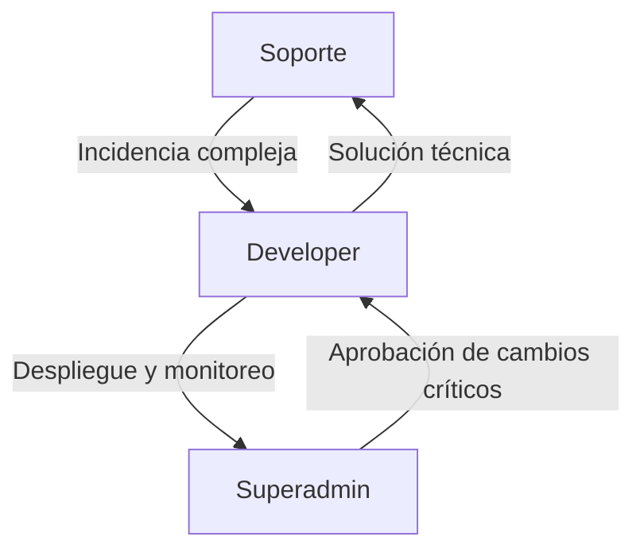

# Seguridad, Compliance y Roles Técnicos - Módulo Agentic de Recruiting

> **ESTADO:** _Para revisión_

---

## 1. Política de Privacidad y Consentimiento (Landing Page)

```markdown
## Política de Privacidad y Consentimiento

Al enviar tu información y tu hoja de vida a través de este formulario, aceptas que [NOMBRE DE LA EMPRESA] trate tus datos personales con la finalidad de gestionar tu participación en procesos de selección actuales y futuros, conforme a la [Política de Privacidad](https://empresa.com/privacy).

- Tus datos serán almacenados de forma segura y no serán compartidos con terceros sin tu consentimiento.
- Puedes ejercer tus derechos de acceso, rectificación, cancelación y oposición (ARCO) enviando un correo a: privacidad@empresa.com.
- Tus datos serán eliminados automáticamente tras [12 meses] salvo que solicites lo contrario.
- Cumplimos con la normativa GDPR, LOPD y demás regulaciones aplicables.

☑ **Consiento el tratamiento de mis datos personales para procesos de selección.**
```

---

## 2. Ejemplo de Configuración RLS y Auditoría en PostgreSQL

### Row Level Security (RLS)

```sql
ALTER TABLE recruiting_candidates ENABLE ROW LEVEL SECURITY;
CREATE POLICY company_isolation_policy ON recruiting_candidates
USING (company_id = current_setting('app.current_company_id')::uuid);
-- Antes de cada consulta:
SET app.current_company_id = 'uuid-de-la-empresa';
```

### Auditoría de Cambios

```sql
CREATE TABLE recruiting_audit_log (
    id UUID PRIMARY KEY DEFAULT gen_random_uuid(),
    event_type VARCHAR(100),
    entity_type VARCHAR(100),
    entity_id VARCHAR(100),
    user_id UUID,
    company_id UUID,
    event_data JSONB,
    created_at TIMESTAMP WITH TIME ZONE DEFAULT NOW()
);

CREATE OR REPLACE FUNCTION log_candidate_update()
RETURNS TRIGGER AS $$
BEGIN
    INSERT INTO recruiting_audit_log (
        event_type, entity_type, entity_id, user_id, company_id, event_data
    ) VALUES (
        'update', 'candidate', NEW.candidate_id, NEW.updated_by, NEW.company_id, row_to_json(NEW)
    );
    RETURN NEW;
END;
$$ LANGUAGE plpgsql;

CREATE TRIGGER trg_candidate_update
AFTER UPDATE ON recruiting_candidates
FOR EACH ROW EXECUTE FUNCTION log_candidate_update();
```

---

## 3. Rol Developer de VibeThink

### Descripción General
El rol Developer de VibeThink es responsable de la integración, personalización y mantenimiento técnico del módulo agentic de recruiting, colaborando con Superadmin y Soporte para garantizar calidad, seguridad y evolución continua.

### Permisos y Responsabilidades
- Acceso a ambientes de desarrollo, staging y producción (según políticas).
- Despliegue de nuevas versiones y hotfixes.
- Acceso a logs, métricas y herramientas de monitoreo.
- Ejecución de pruebas automatizadas y manuales.
- Gestión de integraciones con APIs externas (LinkedIn, SendGrid, ATS).
- Participación en revisiones de seguridad y compliance.
- Soporte de segundo nivel para incidencias técnicas complejas.

### Colaboración con Superadmin
- Implementa y mantiene funcionalidades requeridas por Superadmin.
- Superadmin aprueba despliegues críticos, cambios globales y acceso cross-company (solo para auditoría o soporte avanzado).
- Developer nunca accede a datos de otras empresas salvo autorización explícita y justificada.

### Colaboración con Soporte
- Escalamiento de segundo/tercer nivel para incidencias complejas.
- Provee herramientas y scripts para diagnóstico y resolución.
- Documenta soluciones y mejores prácticas para Soporte.

### Flujos de Trabajo


### Onboarding del Developer
- Acceso temporal y justificado a sistemas (MFA obligatorio).
- Capacitación en políticas de seguridad y compliance.
- Revisión de logs y auditoría de acciones iniciales.
- Firma de NDA y aceptación de políticas internas.

### Offboarding del Developer
- Revocación inmediata de accesos y credenciales.
- Revisión de logs de actividad durante el periodo de baja.
- Transferencia de conocimiento/documentación a equipo.
- Confirmación de cierre de sesiones y tokens.

---

## 4. Matriz de Permisos (General)

| Rol         | Acceso a Datos | Despliegue | Configuración | Auditoría | Soporte | Acceso Cross-Company |
|-------------|:--------------:|:----------:|:-------------:|:---------:|:-------:|:-------------------:|
| Superadmin  |     Total      |    Sí      |     Sí        |    Sí     |   Sí    |        Sí           |
| Developer   |  Limitado*     |    Sí      |     Parcial   |    Sí     |   Sí    |  Solo con aprobación|
| Soporte     |  Parcial       |    No      |     No        |    Sí     |   Sí    |        No           |
| RRHH        |  Solo empresa  |    No      |     No        |    No     |   No    |        No           |
| Candidato   |  Solo propio   |    No      |     No        |    No     |   No    |        No           |

*Limitado: Solo datos de la empresa asignada, salvo soporte/auditoría con aprobación.

---

## 5. Checklist de Seguridad y Compliance

- [x] RLS habilitado y probado en todas las tablas sensibles
- [x] Auditoría de cambios y accesos críticos
- [x] Consentimiento explícito en landing pages
- [x] Encriptación en tránsito y en reposo
- [x] MFA para roles técnicos
- [x] Pruebas de aislamiento multi-tenant
- [x] Escaneo de vulnerabilidades y dependencias
- [x] Política de retención y eliminación de datos
- [x] Documentación de onboarding/offboarding
- [x] Matriz de permisos revisada y aprobada

---

> **Revisión pendiente:** Validar con los equipos de Seguridad, Legal y Operaciones antes de despliegue en producción. 