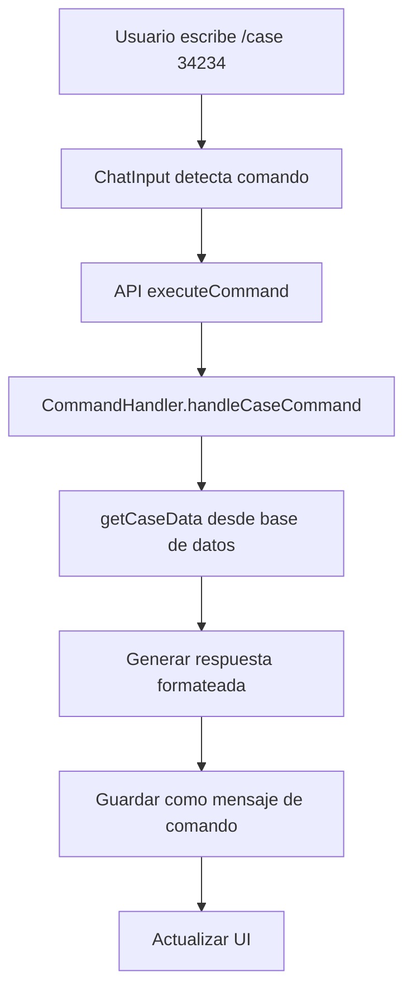
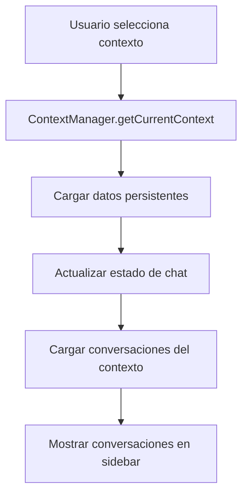

# AI Chat Architecture - Chats Organizados con Contexto

## 🎯 **Arquitectura Definida y Documentada**

### **📅 Fecha de Definición:**
- **Fecha:** 18 de Diciembre 2024
- **Proyecto:** AI Pair Orchestrator Pro
- **Contexto:** Sistema de chat con IA organizado por proyectos/clientes
- **Estado:** ✅ **ARQUITECTURA COMPLETA DEFINIDA**

## 🏗️ **Arquitectura de Base de Datos**

### **📊 Esquema Implementado:**

```sql
-- Tabla de contextos de chat (proyectos, clientes, personal)
CREATE TABLE chat_contexts (
  id UUID PRIMARY KEY DEFAULT gen_random_uuid(),
  company_id UUID NOT NULL REFERENCES companies(id) ON DELETE CASCADE,
  user_id UUID NOT NULL REFERENCES auth.users(id) ON DELETE CASCADE,
  name TEXT NOT NULL,
  type chat_context_type NOT NULL DEFAULT 'project',
  description TEXT,
  metadata JSONB DEFAULT '{}',
  is_active BOOLEAN DEFAULT true,
  created_at TIMESTAMP WITH TIME ZONE DEFAULT now(),
  updated_at TIMESTAMP WITH TIME ZONE DEFAULT now()
);

-- Tipos de contexto
CREATE TYPE chat_context_type AS ENUM (
  'project',    -- Proyecto específico
  'client',     -- Cliente específico
  'personal',   -- Chat personal
  'team',       -- Chat de equipo
  'support'     -- Chat de soporte
);

-- Tabla de conversaciones
CREATE TABLE chat_conversations (
  id UUID PRIMARY KEY DEFAULT gen_random_uuid(),
  context_id UUID NOT NULL REFERENCES chat_contexts(id) ON DELETE CASCADE,
  title TEXT NOT NULL,
  summary TEXT,
  metadata JSONB DEFAULT '{}',
  is_active BOOLEAN DEFAULT true,
  created_at TIMESTAMP WITH TIME ZONE DEFAULT now(),
  updated_at TIMESTAMP WITH TIME ZONE DEFAULT now()
);

-- Tabla de mensajes
CREATE TABLE chat_messages (
  id UUID PRIMARY KEY DEFAULT gen_random_uuid(),
  conversation_id UUID NOT NULL REFERENCES chat_conversations(id) ON DELETE CASCADE,
  role message_role NOT NULL,
  content TEXT NOT NULL,
  metadata JSONB DEFAULT '{}',
  tokens_used INTEGER,
  model_used TEXT,
  processing_time_ms INTEGER,
  created_at TIMESTAMP WITH TIME ZONE DEFAULT now()
);

-- Roles de mensajes
CREATE TYPE message_role AS ENUM (
  'user',       -- Usuario
  'assistant',  -- IA
  'system',     -- Sistema
  'command'     -- Comando ejecutado
);

-- Tabla de comandos disponibles
CREATE TABLE chat_commands (
  id UUID PRIMARY KEY DEFAULT gen_random_uuid(),
  company_id UUID NOT NULL REFERENCES companies(id) ON DELETE CASCADE,
  command TEXT NOT NULL UNIQUE,
  description TEXT NOT NULL,
  handler_function TEXT NOT NULL,
  required_permissions TEXT[],
  is_active BOOLEAN DEFAULT true,
  created_at TIMESTAMP WITH TIME ZONE DEFAULT now()
);

-- Tabla de contexto persistente
CREATE TABLE chat_context_data (
  id UUID PRIMARY KEY DEFAULT gen_random_uuid(),
  context_id UUID NOT NULL REFERENCES chat_contexts(id) ON DELETE CASCADE,
  key TEXT NOT NULL,
  value JSONB NOT NULL,
  expires_at TIMESTAMP WITH TIME ZONE,
  created_at TIMESTAMP WITH TIME ZONE DEFAULT now(),
  updated_at TIMESTAMP WITH TIME ZONE DEFAULT now(),
  UNIQUE(context_id, key)
);
```

## 🎨 **Arquitectura de Frontend**

### **📱 Estructura de Componentes Definida:**

```typescript
// src/components/ai-chat/
├── ChatInterface.tsx          // ✅ Componente principal
├── ChatSidebar.tsx           // Lista de contextos/conversaciones
├── ChatMessages.tsx          // Lista de mensajes
├── ChatInput.tsx             // Input con comandos
├── ChatContext.tsx           // Selector de contexto
├── CommandPalette.tsx        // Paleta de comandos
├── MessageBubble.tsx         // Burbuja de mensaje individual
├── ContextSelector.tsx       // Selector de contexto
└── types/
    ├── chat.ts               // ✅ Tipos de chat
    ├── commands.ts           // ✅ Tipos de comandos
    └── context.ts            // ✅ Tipos de contexto
```

### **🧠 Hooks Personalizados Definidos:**

```typescript
// src/hooks/
├── useAIChat.ts              // ✅ Hook principal de chat
├── useChatContext.ts         // Gestión de contextos
├── useChatCommands.ts        // Gestión de comandos
├── useChatHistory.ts         // Historial de conversaciones
└── useChatStreaming.ts       // Streaming de respuestas
```

## 🔧 **Sistema de Comandos**

### **📋 Comandos Predefinidos Implementados:**

```typescript
// Comandos de contexto
'/context' - Cambiar contexto de chat
'/new-context' - Crear nuevo contexto
'/list-contexts' - Listar todos los contextos

// Comandos de datos
'/case [número]' - Obtener información de un caso
'/project [id]' - Obtener información de un proyecto
'/client [id]' - Obtener información de un cliente
'/task [id]' - Obtener información de una tarea
'/user [id]' - Obtener información de un usuario

// Comandos de análisis
'/analyze [tipo]' - Analizar conversación actual
'/summarize [longitud]' - Resumir conversación
'/extract [tipo]' - Extraer información específica
'/sentiment [rango]' - Análisis de sentimiento

// Comandos de exportación
'/export [formato]' - Exportar conversación
'/save [nombre]' - Guardar conversación como plantilla
'/share [usuarios]' - Compartir conversación

// Comandos de configuración
'/model [nombre]' - Cambiar modelo de IA
'/temperature [valor]' - Ajustar temperatura del modelo
'/max-tokens [número]' - Establecer máximo de tokens
'/context-window [mensajes]' - Ajustar ventana de contexto

// Comandos de ayuda
'/help [comando]' - Mostrar ayuda de comandos
'/commands [categoría]' - Listar todos los comandos
'/examples [comando]' - Mostrar ejemplos de uso

// Comandos de utilidad
'/clear [confirmación]' - Limpiar conversación actual
'/search [término]' - Buscar en conversaciones
'/stats [período]' - Mostrar estadísticas del chat
'/ping' - Verificar conectividad
```

### **⚡ Handlers de Comandos Definidos:**

```typescript
// Handler para casos
async handleCaseCommand(caseNumber: string, context: ChatContext) {
  const caseData = await this.getCaseData(caseNumber, context.companyId);
  
  return {
    type: 'command_response',
    content: `📋 **Caso ${caseNumber}**\n\n` +
             `**Cliente:** ${caseData.client}\n` +
             `**Estado:** ${caseData.status}\n` +
             `**Asignado:** ${caseData.assignedTo}\n` +
             `**Última actualización:** ${caseData.lastUpdate}\n\n` +
             `**Descripción:** ${caseData.description}`,
    metadata: { caseData, command: 'case', caseNumber }
  };
}

// Handler para proyectos
async handleProjectCommand(projectId: string, context: ChatContext) {
  const projectData = await this.getProjectData(projectId, context.companyId);
  
  return {
    type: 'command_response',
    content: `🚀 **Proyecto ${projectId}**\n\n` +
             `**Nombre:** ${projectData.name}\n` +
             `**Estado:** ${projectData.status}\n` +
             `**Progreso:** ${projectData.progress}%\n` +
             `**Fecha límite:** ${projectData.deadline}\n\n` +
             `**Tareas pendientes:** ${projectData.pendingTasks}`,
    metadata: { projectData, command: 'project', projectId }
  };
}
```

## 🎯 **Gestión de Contexto**

### **🧠 Contexto Persistente Implementado:**

```typescript
// Obtener contexto actual
async getCurrentContext(contextId: string): Promise<ChatContext> {
  const context = await supabase
    .from('chat_contexts')
    .select('*')
    .eq('id', contextId)
    .single();
    
  // Cargar datos persistentes
  const contextData = await this.getContextData(contextId);
  
  return {
    ...context,
    persistentData: contextData
  };
}

// Guardar datos en contexto
async saveContextData(contextId: string, key: string, value: any) {
  await supabase
    .from('chat_context_data')
    .upsert({
      context_id: contextId,
      key,
      value,
      updated_at: new Date().toISOString()
    });
}
```

## 🎨 **Interfaz de Usuario**

### **📱 Chat Interface Principal Implementado:**

```typescript
export const ChatInterface = () => {
  return (
    <div className="flex h-screen bg-gray-50">
      {/* Sidebar - Contextos y Conversaciones */}
      <div className="w-80 bg-white border-r border-gray-200">
        <ChatSidebar
          selectedContext={selectedContext}
          onContextChange={setSelectedContext}
          conversations={conversations}
          onConversationSelect={setCurrentConversation}
        />
      </div>
      
      {/* Chat Principal */}
      <div className="flex-1 flex flex-col">
        {/* Header con contexto actual */}
        <div className="bg-white border-b border-gray-200 p-4">
          <div className="flex items-center justify-between">
            <div className="flex items-center gap-3">
              <ContextSelector
                value={selectedContext}
                onChange={setSelectedContext}
              />
              <span className="text-gray-400">/</span>
              <span className="font-medium">
                {conversations.find(c => c.id === currentConversation)?.title}
              </span>
            </div>
            <div className="flex items-center gap-2">
              <CommandPalette />
              <Button variant="outline" size="sm">
                <Settings className="w-4 h-4" />
              </Button>
            </div>
          </div>
        </div>
        
        {/* Mensajes */}
        <div className="flex-1 overflow-y-auto">
          <ChatMessages conversationId={currentConversation} />
        </div>
        
        {/* Input con comandos */}
        <div className="bg-white border-t border-gray-200 p-4">
          <ChatInput
            conversationId={currentConversation}
            contextId={selectedContext}
            onCommand={handleCommand}
          />
        </div>
      </div>
    </div>
  );
};
```

### **💬 Input con Comandos Implementado:**

```typescript
export const ChatInput = ({ conversationId, contextId, onCommand }) => {
  const [input, setInput] = useState('');
  const [showCommands, setShowCommands] = useState(false);
  
  const handleSubmit = async (e: React.FormEvent) => {
    e.preventDefault();
    
    if (input.startsWith('/')) {
      // Es un comando
      await handleCommand(input);
    } else {
      // Es un mensaje normal
      await sendMessage(input);
    }
    
    setInput('');
  };
  
  const handleKeyDown = (e: React.KeyboardEvent) => {
    if (e.key === '/') {
      setShowCommands(true);
    }
  };
  
  return (
    <form onSubmit={handleSubmit} className="space-y-2">
      {/* Sugerencias de comandos */}
      {showCommands && (
        <div className="bg-gray-50 border border-gray-200 rounded-lg p-2">
          <div className="text-sm text-gray-600 mb-2">Comandos disponibles:</div>
          <div className="space-y-1">
            {Object.entries(CHAT_COMMANDS).map(([cmd, info]) => (
              <div
                key={cmd}
                className="flex items-center gap-2 p-1 hover:bg-gray-100 rounded cursor-pointer"
                onClick={() => {
                  setInput(cmd + ' ');
                  setShowCommands(false);
                }}
              >
                <code className="text-blue-600">{cmd}</code>
                <span className="text-gray-500">{info.description}</span>
              </div>
            ))}
          </div>
        </div>
      )}
      
      {/* Input principal */}
      <div className="flex gap-2">
        <div className="flex-1 relative">
          <textarea
            value={input}
            onChange={(e) => setInput(e.target.value)}
            onKeyDown={handleKeyDown}
            placeholder="Escribe un mensaje o usa / para comandos..."
            className="w-full border border-gray-300 rounded-lg p-3 resize-none"
            rows={1}
          />
          {input.startsWith('/') && (
            <div className="absolute bottom-full left-0 bg-white border border-gray-200 rounded-lg p-2 mb-1 shadow-lg">
              <div className="text-sm text-gray-600">
                Comando detectado: {input.split(' ')[0]}
              </div>
            </div>
          )}
        </div>
        <Button type="submit" disabled={!input.trim()}>
          Enviar
        </Button>
      </div>
    </form>
  );
};
```

## 🚀 **API Endpoints**

### **📡 Endpoints de Chat Definidos:**

```typescript
export const chatAPI = {
  // Obtener contextos del usuario
  async getContexts(): Promise<ChatContext[]> {
    const { data } = await supabase
      .from('chat_contexts')
      .select('*')
      .order('updated_at', { ascending: false });
    return data;
  },
  
  // Obtener conversaciones de un contexto
  async getConversations(contextId: string): Promise<ChatConversation[]> {
    const { data } = await supabase
      .from('chat_conversations')
      .select('*')
      .eq('context_id', contextId)
      .order('updated_at', { ascending: false });
    return data;
  },
  
  // Obtener mensajes de una conversación
  async getMessages(conversationId: string): Promise<ChatMessage[]> {
    const { data } = await supabase
      .from('chat_messages')
      .select('*')
      .eq('conversation_id', conversationId)
      .order('created_at', { ascending: true });
    return data;
  },
  
  // Enviar mensaje
  async sendMessage(conversationId: string, content: string): Promise<ChatMessage> {
    const { data } = await supabase
      .from('chat_messages')
      .insert({
        conversation_id: conversationId,
        role: 'user',
        content
      })
      .select()
      .single();
    return data;
  },
  
  // Ejecutar comando
  async executeCommand(command: string, contextId: string): Promise<any> {
    const response = await fetch('/api/chat/command', {
      method: 'POST',
      headers: { 'Content-Type': 'application/json' },
      body: JSON.stringify({ command, contextId })
    });
    return response.json();
  }
};
```

## 📊 **Flujo de Datos**

### **🔄 Flujo de Comando Documentado:**



### **🔄 Flujo de Contexto Documentado:**



## 🎯 **Casos de Uso Definidos**

### **📋 Ejemplo: Chat de Proyecto**

```typescript
// Contexto: Proyecto "E-commerce Redesign"
const projectContext = {
  id: 'proj-123',
  name: 'E-commerce Redesign',
  type: 'project',
  metadata: {
    projectId: 'PRJ-001',
    client: 'TechCorp',
    status: 'In Progress',
    team: ['user1', 'user2', 'user3']
  },
  persistentData: {
    'current-sprint': 'Sprint 3',
    'pending-tasks': 15,
    'budget-remaining': 25000,
    'last-meeting-notes': '...'
  }
};

// Comandos útiles en este contexto:
// /case 34234 - Ver caso específico del proyecto
// /project PRJ-001 - Ver detalles del proyecto
// /client TechCorp - Ver información del cliente
// /analyze progress - Analizar progreso del proyecto
```

### **👥 Ejemplo: Chat de Cliente**

```typescript
// Contexto: Cliente "TechCorp"
const clientContext = {
  id: 'client-456',
  name: 'TechCorp',
  type: 'client',
  metadata: {
    clientId: 'CLT-123',
    industry: 'Technology',
    contactPerson: 'John Doe',
    projects: ['PRJ-001', 'PRJ-002']
  },
  persistentData: {
    'last-contact': '2024-01-15',
    'preferences': ['responsive', 'modern-design'],
    'budget-range': '50k-100k',
    'communication-style': 'formal'
  }
};
```

## 🚀 **Próximos Pasos**

### **Fase 1: Implementación Base (2-3 semanas)**
- [ ] Crear tablas de base de datos
- [ ] Implementar componentes básicos de UI
- [ ] Sistema de comandos básicos
- [ ] Gestión de contextos

### **Fase 2: Comandos Avanzados (1-2 semanas)**
- [ ] Integración con casos/proyectos existentes
- [ ] Comandos de análisis
- [ ] Exportación de conversaciones
- [ ] Templates de comandos

### **Fase 3: Optimización (1 semana)**
- [ ] Cache de contexto
- [ ] Streaming de respuestas
- [ ] Búsqueda en conversaciones
- [ ] Notificaciones

## 🎯 **Características Clave**

### **✅ Organización Clara:**
- **Contextos** por proyecto, cliente, personal
- **Conversaciones** dentro de cada contexto
- **Mensajes** organizados cronológicamente
- **Comandos** específicos por contexto

### **✅ Contexto Persistente:**
- **Datos persistentes** entre conversaciones
- **Metadatos** específicos por contexto
- **Configuración** personalizada
- **Historial** de interacciones

### **✅ Comandos Poderosos:**
- **Comandos tipo Slack** con /
- **Autocompletado** inteligente
- **Ayuda contextual** para cada comando
- **Integración** con datos del sistema

### **✅ Escalabilidad:**
- **Multi-tenant** por empresa
- **Permisos granulares** por usuario
- **Cache** para performance
- **Streaming** de respuestas

### **✅ Integración:**
- **Sistema de permisos** existente
- **Base de datos** Supabase
- **UI components** shadcn/ui
- **Autenticación** actual

---

**🎯 Estado Actual:** ✅ **ARQUITECTURA COMPLETAMENTE DEFINIDA**

**🔗 Archivos Creados:**
- `docs/AI_CHAT_ARCHITECTURE.md`
- `src/types/chat.ts`
- `src/constants/chatCommands.ts`
- `src/hooks/useAIChat.ts`
- `src/components/ai-chat/ChatInterface.tsx`

**📝 Nota:** Esta arquitectura está lista para implementación y proporciona una base sólida para un sistema de chat con IA organizado y escalable. 