# Universal Migration Platform - VThink 1.0

## 🚀 **Plataforma Universal de Migración de Propósito General**

Esta plataforma permite migrar contenido entre **cualquier sistema compatible**, proporcionando una interfaz unificada para migraciones complejas con soporte multi-tenant y compliance CMMI-ML3.

## 📋 **Características Principales**

### **Sistemas Soportados**

#### **Sistemas Fuente:**
- **CMS**: Kentico (v9-12), Kentico Xperience (v13+), WordPress, Drupal, Joomla
- **E-commerce**: Shopify, Magento, PrestaShop
- **Website Builders**: Squarespace, Wix
- **Custom**: Sistemas personalizados

#### **Sistemas Destino:**
- **CMS**: Strapi, Payload CMS, WordPress, Drupal
- **Database**: Supabase
- **Custom**: Sistemas personalizados

### **Funcionalidades Avanzadas**

- ✅ **Migración Universal**: Cualquier sistema a cualquier sistema
- ✅ **Migración Incremental**: Solo contenido modificado
- ✅ **Migración Programada**: Automatización completa
- ✅ **Rollback Automático**: Recuperación ante fallos
- ✅ **Validación Completa**: Verificación de integridad
- ✅ **Plantillas Predefinidas**: Configuraciones optimizadas
- ✅ **Analytics Avanzados**: Métricas y tendencias
- ✅ **Multi-tenant**: Aislamiento por empresa
- ✅ **Compliance CMMI-ML3**: Estándares de calidad

## 🎯 **Mejoras Automáticas con IA**

### **1. SEO Enhancement Automático**

```typescript
// Mejoras de SEO durante la migración
const seoEnhancement = {
  autoGenerate: {
    metaTitles: 'AI-generated optimized titles',
    metaDescriptions: 'AI-generated descriptions',
    keywords: 'AI-extracted relevant keywords',
    schemaMarkup: 'Structured data generation',
    canonicalUrls: 'Automatic canonical URL generation',
    ogTags: 'Social media optimization',
    twitterCards: 'Twitter card optimization'
  },
  optimization: {
    contentAnalysis: 'AI content quality analysis',
    keywordDensity: 'Optimal keyword distribution',
    readabilityScore: 'Flesch-Kincaid readability',
    seoScore: 'Overall SEO score calculation'
  }
};
```

### **2. Traducción Automática con IA**

```typescript
// Traducción automática durante migración
const aiTranslation = {
  languages: ['es', 'en', 'fr', 'de', 'it', 'pt', 'ru', 'zh', 'ja', 'ko'],
  providers: {
    openai: 'GPT-4 for high-quality translation',
    google: 'Google Translate API',
    deepl: 'DeepL for European languages'
  },
  features: {
    contextAware: 'Maintains context and tone',
    industrySpecific: 'Domain-specific terminology',
    culturalAdaptation: 'Cultural context adaptation',
    qualityCheck: 'AI-powered quality validation'
  }
};
```

### **3. Schema Markup Automático**

```typescript
// Generación automática de schema markup
const schemaGeneration = {
  types: {
    article: 'Article schema for blog posts',
    product: 'Product schema for e-commerce',
    organization: 'Organization schema',
    person: 'Person schema for authors',
    event: 'Event schema for events',
    faq: 'FAQ schema for Q&A content'
  },
  automation: {
    contentAnalysis: 'AI analyzes content type',
    schemaSelection: 'Automatic schema type selection',
    dataExtraction: 'Extract relevant data for schema',
    validation: 'Schema.org validation'
  }
};
```

## 🏗️ **Arquitectura**

### **Estructura de Módulos**

```
src/modules/migration-engine/
├── types/
│   └── universal-migration.ts          # Tipos universales
├── services/
│   ├── UniversalMigrationService.ts    # Servicio principal
│   ├── SEOEnhancementService.ts        # Mejoras de SEO
│   ├── AITranslationService.ts         # Traducción con IA
│   └── SchemaGenerationService.ts      # Generación de schema
├── hooks/
│   └── useUniversalMigration.ts        # Hook React
├── components/
│   ├── MigrationDashboard.tsx          # Dashboard específico
│   ├── UniversalMigrationDashboard.tsx # Dashboard universal
│   └── SEOEnhancementPanel.tsx         # Panel de mejoras SEO
├── extractors/                         # Extractores por sistema
├── transformers/                       # Transformadores
├── loaders/                           # Cargadores por sistema
├── validators/                        # Validadores
├── enhancers/                         # Mejoradores con IA
│   ├── SEOEnhancer.ts                 # Mejoras de SEO
│   ├── TranslationEnhancer.ts         # Traducción automática
│   └── SchemaEnhancer.ts              # Schema markup
└── templates/                         # Plantillas predefinidas
```

### **Flujo de Migración con Mejoras**

```mermaid
graph TD
    A[Configuración] --> B[Validación]
    B --> C[Extracción]
    C --> D[Transformación Base]
    D --> E[Mejoras con IA]
    E --> F[SEO Enhancement]
    F --> G[AI Translation]
    G --> H[Schema Generation]
    H --> I[Validación Mejorada]
    I --> J[Carga]
    J --> K[Verificación]
    K --> L[Completado]
    
    E --> M[Error]
    F --> M
    G --> M
    H --> M
    I --> M
    J --> M
    K --> M
    
    M --> N[Rollback]
    N --> O[Notificación]
```



## 🔧 **Implementación**

### **1. Configuración de Migración con Mejoras**

```typescript
const migrationConfigWithEnhancements: UniversalMigrationConfig = {
  id: 'migration_123',
  name: 'Kentico v12 to Strapi with AI Enhancements',
  description: 'Migrate content with automatic SEO and translation improvements',
  source: {
    type: 'kentico',
    version: 'v12',
    config: {
      url: 'https://kentico-site.com',
      credentials: {
        type: 'basic',
        username: 'admin',
        password: 'password'
      }
    },
    contentTypes: ['pages', 'articles', 'blogs', 'products'],
    filters: {
      dateRange: {
        start: new Date('2023-01-01'),
        end: new Date('2024-01-01')
      }
    }
  },
  target: {
    type: 'strapi',
    version: 'v4',
    config: {
      url: 'https://strapi-site.com',
      credentials: {
        type: 'token',
        token: 'strapi-token'
      }
    }
  },
  options: {
    incremental: true,
    preserveIds: true,
    includeMedia: true,
    includeSEO: true,
    includeRelationships: true,
    batchSize: 100,
    concurrency: 3,
    retryOnFailure: true,
    maxRetries: 3,
    rollbackOnFailure: true,
    // Nuevas opciones de mejora
    enableSEOEnhancement: true,
    enableAITranslation: true,
    enableSchemaGeneration: true,
    targetLanguages: ['es', 'en', 'fr'],
    seoOptimizationLevel: 'high', // 'low', 'medium', 'high'
    translationQuality: 'premium', // 'standard', 'premium'
    schemaTypes: ['article', 'product', 'organization']
  },
  companyId: 'company_123',
  createdBy: 'user_456',
  createdAt: new Date(),
  updatedAt: new Date()
};
```

### **2. Servicio de Mejoras SEO**

```typescript
import { SEOEnhancementService } from './services/SEOEnhancementService';

export class SEOEnhancementService {
  
  /**
   * Mejorar SEO del contenido migrado
   */
  async enhanceSEO(content: UniversalContent): Promise<EnhancedContent> {
    const enhancedContent = { ...content };
    
    // 1. Generar meta título optimizado
    if (!content.seo.title || content.seo.title.length < 30) {
      enhancedContent.seo.title = await this.generateOptimizedTitle(content);
    }
    
    // 2. Generar meta descripción
    if (!content.seo.description || content.seo.description.length < 120) {
      enhancedContent.seo.description = await this.generateMetaDescription(content);
    }
    
    // 3. Extraer keywords relevantes
    enhancedContent.seo.keywords = await this.extractKeywords(content);
    
    // 4. Generar schema markup
    enhancedContent.schema = await this.generateSchemaMarkup(content);
    
    // 5. Optimizar URLs canónicas
    enhancedContent.seo.canonicalUrl = this.optimizeCanonicalUrl(content);
    
    // 6. Generar Open Graph tags
    enhancedContent.seo.ogTitle = enhancedContent.seo.title;
    enhancedContent.seo.ogDescription = enhancedContent.seo.description;
    enhancedContent.seo.ogImage = await this.generateOGImage(content);
    
    // 7. Generar Twitter Cards
    enhancedContent.seo.twitterCard = 'summary_large_image';
    
    return enhancedContent;
  }
  
  /**
   * Generar título optimizado con IA
   */
  private async generateOptimizedTitle(content: UniversalContent): Promise<string> {
    const prompt = `
      Generate an SEO-optimized title for this content:
      Title: ${content.title}
      Content: ${content.content.substring(0, 500)}
      Requirements:
      - 50-60 characters
      - Include primary keyword
      - Engaging and clickable
      - Maintain original meaning
    `;
    
    return await this.callAI(prompt);
  }
  
  /**
   * Generar meta descripción con IA
   */
  private async generateMetaDescription(content: UniversalContent): Promise<string> {
    const prompt = `
      Generate an SEO-optimized meta description for this content:
      Title: ${content.title}
      Content: ${content.content.substring(0, 300)}
      Requirements:
      - 150-160 characters
      - Include primary keyword
      - Compelling call-to-action
      - Accurate content summary
    `;
    
    return await this.callAI(prompt);
  }
  
  /**
   * Extraer keywords relevantes
   */
  private async extractKeywords(content: UniversalContent): Promise<string[]> {
    const prompt = `
      Extract 5-7 relevant SEO keywords from this content:
      Title: ${content.title}
      Content: ${content.content.substring(0, 500)}
      Requirements:
      - Primary and secondary keywords
      - Long-tail keywords
      - Search intent aligned
      - Return as JSON array
    `;
    
    const response = await this.callAI(prompt);
    return JSON.parse(response);
  }
  
  /**
   * Generar schema markup
   */
  private async generateSchemaMarkup(content: UniversalContent): Promise<any> {
    const schemaType = this.determineSchemaType(content.type);
    
    const prompt = `
      Generate JSON-LD schema markup for this ${schemaType}:
      Title: ${content.title}
      Content: ${content.content.substring(0, 300)}
      Type: ${content.type}
      Published: ${content.publishedAt}
      Author: ${content.createdBy}
      
      Return valid JSON-LD schema for ${schemaType}
    `;
    
    const response = await this.callAI(prompt);
    return JSON.parse(response);
  }
  
  /**
   * Determinar tipo de schema
   */
  private determineSchemaType(contentType: string): string {
    const schemaMapping: Record<string, string> = {
      'article': 'Article',
      'blog': 'BlogPosting',
      'product': 'Product',
      'service': 'Service',
      'event': 'Event',
      'page': 'WebPage',
      'person': 'Person',
      'organization': 'Organization'
    };
    
    return schemaMapping[contentType] || 'WebPage';
  }
  
  /**
   * Llamar a IA
   */
  private async callAI(prompt: string): Promise<string> {
    // Implementar llamada a OpenAI, Google AI, etc.
    const response = await fetch('/api/ai/generate', {
      method: 'POST',
      headers: { 'Content-Type': 'application/json' },
      body: JSON.stringify({ prompt, model: 'gpt-4' })
    });
    
    const data = await response.json();
    return data.text;
  }
}
```

### **3. Servicio de Traducción con IA**

```typescript
import { AITranslationService } from './services/AITranslationService';

export class AITranslationService {
  
  /**
   * Traducir contenido con IA
   */
  async translateContent(
    content: UniversalContent, 
    targetLanguages: string[]
  ): Promise<TranslatedContent[]> {
    
    const translations: TranslatedContent[] = [];
    
    for (const language of targetLanguages) {
      const translatedContent = await this.translateToLanguage(content, language);
      translations.push(translatedContent);
    }
    
    return translations;
  }
  
  /**
   * Traducir a idioma específico
   */
  private async translateToLanguage(
    content: UniversalContent, 
    targetLanguage: string
  ): Promise<TranslatedContent> {
    
    // Traducir título
    const translatedTitle = await this.translateText(
      content.title, 
      'auto', 
      targetLanguage
    );
    
    // Traducir contenido
    const translatedContent = await this.translateText(
      content.content, 
      'auto', 
      targetLanguage
    );
    
    // Traducir SEO
    const translatedSEO = await this.translateSEO(content.seo, targetLanguage);
    
    // Traducir schema markup
    const translatedSchema = await this.translateSchema(content.schema, targetLanguage);
    
    return {
      id: `${content.id}_${targetLanguage}`,
      originalId: content.id,
      language: targetLanguage,
      type: content.type,
      title: translatedTitle,
      content: translatedContent,
      slug: this.generateTranslatedSlug(translatedTitle, targetLanguage),
      status: content.status,
      publishedAt: content.publishedAt,
      createdAt: new Date(),
      updatedAt: new Date(),
      createdBy: content.createdBy,
      updatedBy: content.updatedBy,
      metadata: {
        ...content.metadata,
        originalLanguage: 'auto',
        translationProvider: 'ai',
        translationQuality: 'premium'
      },
      seo: translatedSEO,
      schema: translatedSchema,
      media: content.media, // Media no se traduce
      relationships: content.relationships,
      customFields: await this.translateCustomFields(content.customFields, targetLanguage)
    };
  }
  
  /**
   * Traducir texto con IA
   */
  private async translateText(
    text: string, 
    sourceLanguage: string, 
    targetLanguage: string
  ): Promise<string> {
    
    const prompt = `
      Translate this text from ${sourceLanguage} to ${targetLanguage}:
      "${text}"
      
      Requirements:
      - Maintain original meaning and tone
      - Preserve technical terms appropriately
      - Ensure natural flow in target language
      - Keep formatting and structure
    `;
    
    return await this.callAI(prompt);
  }
  
  /**
   * Traducir SEO metadata
   */
  private async translateSEO(seo: any, targetLanguage: string): Promise<any> {
    return {
      title: await this.translateText(seo.title, 'auto', targetLanguage),
      description: await this.translateText(seo.description, 'auto', targetLanguage),
      keywords: await Promise.all(
        seo.keywords.map((keyword: string) => 
          this.translateText(keyword, 'auto', targetLanguage)
        )
      ),
      canonicalUrl: seo.canonicalUrl, // URLs no se traducen
      ogTitle: await this.translateText(seo.ogTitle, 'auto', targetLanguage),
      ogDescription: await this.translateText(seo.ogDescription, 'auto', targetLanguage),
      ogImage: seo.ogImage, // Imágenes no se traducen
      twitterCard: seo.twitterCard,
      metaRobots: seo.metaRobots
    };
  }
  
  /**
   * Traducir schema markup
   */
  private async translateSchema(schema: any, targetLanguage: string): Promise<any> {
    if (!schema) return null;
    
    const translatedSchema = { ...schema };
    
    // Traducir campos de texto en schema
    if (schema.name) {
      translatedSchema.name = await this.translateText(schema.name, 'auto', targetLanguage);
    }
    
    if (schema.description) {
      translatedSchema.description = await this.translateText(schema.description, 'auto', targetLanguage);
    }
    
    if (schema.headline) {
      translatedSchema.headline = await this.translateText(schema.headline, 'auto', targetLanguage);
    }
    
    return translatedSchema;
  }
  
  /**
   * Traducir campos personalizados
   */
  private async translateCustomFields(
    customFields: Record<string, any>, 
    targetLanguage: string
  ): Promise<Record<string, any>> {
    
    const translatedFields: Record<string, any> = {};
    
    for (const [key, value] of Object.entries(customFields)) {
      if (typeof value === 'string') {
        translatedFields[key] = await this.translateText(value, 'auto', targetLanguage);
      } else if (Array.isArray(value)) {
        translatedFields[key] = await Promise.all(
          value.map((item: any) => 
            typeof item === 'string' 
              ? this.translateText(item, 'auto', targetLanguage)
              : item
          )
        );
      } else {
        translatedFields[key] = value; // No traducir objetos complejos
      }
    }
    
    return translatedFields;
  }
  
  /**
   * Generar slug traducido
   */
  private generateTranslatedSlug(title: string, language: string): string {
    return title
      .toLowerCase()
      .replace(/[^a-z0-9-]/g, '-')
      .replace(/-+/g, '-')
      .replace(/^-|-$/g, '')
      + `-${language}`;
  }
  
  /**
   * Llamar a IA
   */
  private async callAI(prompt: string): Promise<string> {
    // Implementar llamada a OpenAI, Google AI, etc.
    const response = await fetch('/api/ai/translate', {
      method: 'POST',
      headers: { 'Content-Type': 'application/json' },
      body: JSON.stringify({ prompt, model: 'gpt-4' })
    });
    
    const data = await response.json();
    return data.text;
  }
}
```

### **4. Servicio de Generación de Schema**

```typescript
import { SchemaGenerationService } from './services/SchemaGenerationService';

export class SchemaGenerationService {
  
  /**
   * Generar schema markup automático
   */
  async generateSchemaMarkup(content: UniversalContent): Promise<any> {
    const schemaType = this.determineSchemaType(content.type);
    
    switch (schemaType) {
      case 'Article':
        return this.generateArticleSchema(content);
      case 'Product':
        return this.generateProductSchema(content);
      case 'Event':
        return this.generateEventSchema(content);
      case 'Organization':
        return this.generateOrganizationSchema(content);
      case 'Person':
        return this.generatePersonSchema(content);
      default:
        return this.generateWebPageSchema(content);
    }
  }
  
  /**
   * Generar schema de artículo
   */
  private generateArticleSchema(content: UniversalContent): any {
    return {
      "@context": "https://schema.org",
      "@type": "Article",
      "headline": content.title,
      "description": content.seo.description,
      "image": content.media[0]?.url || content.seo.ogImage,
      "author": {
        "@type": "Person",
        "name": content.createdBy
      },
      "publisher": {
        "@type": "Organization",
        "name": "Your Organization",
        "logo": {
          "@type": "ImageObject",
          "url": "https://your-site.com/logo.png"
        }
      },
      "datePublished": content.publishedAt,
      "dateModified": content.updatedAt,
      "mainEntityOfPage": {
        "@type": "WebPage",
        "@id": content.seo.canonicalUrl
      }
    };
  }
  
  /**
   * Generar schema de producto
   */
  private generateProductSchema(content: UniversalContent): any {
    return {
      "@context": "https://schema.org",
      "@type": "Product",
      "name": content.title,
      "description": content.content,
      "image": content.media[0]?.url || content.seo.ogImage,
      "brand": {
        "@type": "Brand",
        "name": content.metadata.brand || "Your Brand"
      },
      "offers": {
        "@type": "Offer",
        "price": content.metadata.price || "0",
        "priceCurrency": content.metadata.currency || "USD",
        "availability": "https://schema.org/InStock"
      }
    };
  }
  
  /**
   * Generar schema de evento
   */
  private generateEventSchema(content: UniversalContent): any {
    return {
      "@context": "https://schema.org",
      "@type": "Event",
      "name": content.title,
      "description": content.content,
      "startDate": content.metadata.startDate,
      "endDate": content.metadata.endDate,
      "location": {
        "@type": "Place",
        "name": content.metadata.location,
        "address": {
          "@type": "PostalAddress",
          "streetAddress": content.metadata.streetAddress,
          "addressLocality": content.metadata.city,
          "addressRegion": content.metadata.state,
          "postalCode": content.metadata.postalCode,
          "addressCountry": content.metadata.country
        }
      },
      "organizer": {
        "@type": "Organization",
        "name": content.metadata.organizer
      }
    };
  }
  
  /**
   * Determinar tipo de schema
   */
  private determineSchemaType(contentType: string): string {
    const schemaMapping: Record<string, string> = {
      'article': 'Article',
      'blog': 'Article',
      'product': 'Product',
      'service': 'Service',
      'event': 'Event',
      'page': 'WebPage',
      'person': 'Person',
      'organization': 'Organization'
    };
    
    return schemaMapping[contentType] || 'WebPage';
  }
}
```

## 📊 **Analytics y Métricas**

### **Métricas de Mejoras**

```typescript
const enhancementMetrics = {
  seoImprovements: {
    titlesOptimized: 150,
    descriptionsGenerated: 150,
    keywordsExtracted: 750,
    schemaGenerated: 150,
    averageSEOScore: 85
  },
  translationMetrics: {
    languagesTranslated: 3,
    contentTranslated: 450,
    translationQuality: 92,
    averageTranslationTime: 2.5
  },
  performanceMetrics: {
    totalEnhancementTime: 180,
    aiCallsMade: 1200,
    enhancementSuccessRate: 98.5
  }
};
```

## 🚀 **Roadmap de Desarrollo**

### **Fase 1: Core Platform (Completado)**
- ✅ Tipos universales
- ✅ Servicio de migración
- ✅ Hook React
- ✅ Dashboard básico

### **Fase 2: Mejoras con IA (En Desarrollo)**
- 🔄 SEO Enhancement automático
- 🔄 AI Translation automático
- 🔄 Schema Generation automático
- 🔄 Content Quality Analysis

### **Fase 3: Automatización Avanzada**
- 🔄 Kestra integration
- 🔄 Scheduled migrations
- 🔄 Notifications
- 🔄 Rollback automation

### **Fase 4: Enterprise Features**
- 🔄 Multi-tenant isolation
- 🔄 Advanced security
- 🔄 Compliance reporting
- 🔄 SLA monitoring

## 📚 **Documentación Adicional**

### **Guías de Usuario**
- [Configuración de Migración](./user-guides/migration-setup.md)
- [Mejoras de SEO](./user-guides/seo-enhancement.md)
- [Traducción Automática](./user-guides/ai-translation.md)
- [Schema Generation](./user-guides/schema-generation.md)
- [Troubleshooting](./user-guides/troubleshooting.md)

### **Documentación Técnica**
- [API Reference](./api-reference.md)
- [Architecture Guide](./architecture.md)
- [Security Guide](./security.md)
- [AI Integration Guide](./ai-integration.md)

### **Ejemplos y Tutoriales**
- [Kentico v12 to Strapi](./examples/kentico-strapi.md)
- [SEO Enhancement](./examples/seo-enhancement.md)
- [AI Translation](./examples/ai-translation.md)
- [Schema Generation](./examples/schema-generation.md)

---

**Esta plataforma universal de migración proporciona una solución completa y escalable para migrar contenido entre cualquier sistema compatible, con mejoras automáticas de SEO, traducción con IA y generación de schema markup, con soporte multi-tenant y compliance CMMI-ML3.** 